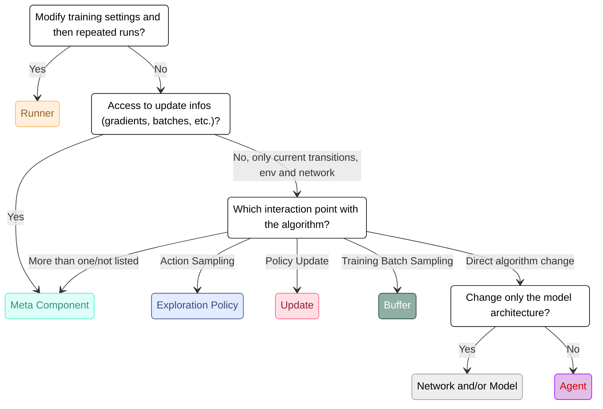

<p align="center">
    <a href="./docs/img/logo.png">
        
    </a>
</p>

<div align="center">
    
[](https://pypi.org/project/Mighty-RL/)


[](https://github.com/automl/Mighty/actions/workflows/test.yaml)
[](https://github.com/automl/Mighty/actions/workflows/docs_test.yaml)
    
</div>

<div align="center">
    <h3>
      <a href="#installation">Installation</a> |
      <a href="https://automl.github.io/Mighty/">Documentation</a> |
      <a href="#run-a-mighty-agent">Run a Mighty Agent</a> |
      <a href="#cite-us">Cite Us</a>
    </h3>
</div>

---

# Mighty

Welcome to Mighty, hopefully your future one-stop shop for everything cRL.
Currently Mighty is still in its early stages with support for normal gym envs, DACBench and CARL.
The interface is controlled through hydra and we provide DQN, PPO and SAC algorithms.
We log training and regular evaluations to file and optionally also to wandb.
If you have any questions or feedback, please tell us, ideally via the GitHub issues!
If you want to get started immediately, use our [Template repository](https://github.com/automl/mighty_project_template).

Mighty features:
- Modular structure for easy (Meta-)RL tinkering
- PPO, SAC and DQN as base algorithms
- Environment integrations via Gymnasium, Pufferlib, CARL & DACBench
- Implementations of some important baselines: RND, PLR, Cosine LR Schedule and more!

## Installation
We recommend to using uv to install and run Mighty in a virtual environment.
The code has been tested with python 3.11 on Unix systems.

First create a clean python environment:

```bash
uv venv --python=3.11
source .venv/bin/activate
```

Then  install Mighty:

```bash
make install
```

Optionally you can install the dev requirements directly:
```bash
make install-dev
```

Alternatively, you can install Mighty from PyPI:
```bash
pip install mighty-rl
```

## Run a Mighty Agent
In order to run a Mighty Agent, use the run_mighty.py script and provide any training options as keywords.
If you want to know more about the configuration options, call:
```bash
python mighty/run_mighty.py --help
```

An example for running the PPO agent on the Pendulum gym environment looks like this:
```bash
python mighty/run_mighty.py 'algorithm=ppo' 'environment=gymnasium/pendulum'
```

### Train your Agent on a CARL Environment
Mighty is designed with contextual RL in mind and therefore fully compatible with CARL.
Before you start training, however, please follow the installation instructions in the [CARL repo](https://github.com/automl/CARL).

Then use the same command as before, but provide the CARL environment, in this example CARLCartPoleEnv,
and information about the context distribution as keywords:
```bash
python mighty/run_mighty.py 'algorithm=ppo' 'env=CARLCartPole' '+env_kwargs.num_contexts=10' '+env_kwargs.context_feature_args.gravity=[normal, 9.8, 1.0, -100.0, 100.0]' 'env_wrappers=[mighty.mighty_utils.wrappers.FlattenVecObs]' 'algorithm_kwargs.rollout_buffer_kwargs.buffer_size=2048'
```

For more complex configurations like this, we recommend making an environment configuration file. Check out our [CARL Ant](mighty/configs/environment/carl_walkers/ant_goals.yaml) file to see how this simplifies the process of working with configurable environments.

### Learning a Configuration Policy via DAC

In order to use Mighty with DACBench, you need to install DACBench first.
We recommend following the instructions in the [DACBench repo](https://github.com/automl/DACBench).

Afterwards, configure the benchmark you want to run. Since most DACBench benchmarks have Dict action and observation spaces, some fairly complex,  you might need to wrap DACBenchmarks in order to translate the observations and actions to an easy-to-handle format. We have a version of the FunctionApproximationBenchmark configured for you so you can get started like this:
```bash
python mighty/run_mighty.py 'algorithm=ppo' 'environment=dacbench/function_approximation'
```
The matching [configuration file](mighty/configs/environment/dacbench/function_approximation.yaml) shows you how to set the search spaces and benchmark type. Refer to DACBench itself to learn how to configure other elements like observations spaces or instance sets.

### Optimize Hyperparameters
You can optimize the hyperparameters of your algorithm with the [Hypersweeper](https://github.com/automl/hypersweeper) package, e.g. using [SMAC3](https://github.com/automl/SMAC3). Mighty is directly compatible with Hypersweeper and thus smart and distributed HPO! There are also other HPO options, check out our [examples](examples/README.md) for more information.

## Build Your Own Mighty Project
If you want to implement your own method in Mighty, we recommend using the [Mighty template repository](https://github.com/automl/mighty_project_template) as a base. It contains a runscript, the most relevant config files and basic scripts for plotting. Our [domain randomization example](https://github.com/automl/mighty_dr_example) shows that you can get started right away. Since Mighty has many options of how to implement your idea, here's a rough guide which Mighty class you want to look at:



## Pre-Implemented Methods
Mighty is meant to be a platform to build upon and not a large collection of methods in itself. We have a few relevant methods pre-implemented, however, and this collection will likely grow over time:

- **Agents**: SAC, PPO, DQN
- **Updates**: SAC, PPO, Q-learning, double Q-learning, clipped double Q-learning
- **Buffer**s: Rollout Buffer, Replay Buffer, Prioritized Replay Buffer
- **Exploration Policies**: e-greedy (with and without decay), ez-greedy, standard stochastic
- **Models** (with MLP, CNN or ResNet backbone): SAC, PPO, DQN (with soft and hard reset options)
- **Meta Components**: RND, NovelD, SPaCE, PLR
- **Runners**: online RL runner, ES runner

## Cite Us

If you use Mighty in your work, please cite us:

```bibtex
@misc{mohaneimer24,
  author    = {A. Mohan and T. Eimer and C. Benjamins and M. Lindauer and A. Biedenkapp},
  title     = {Mighty},
  year      = {2024},
  url = {https://github.com/automl/mighty}
}
```
