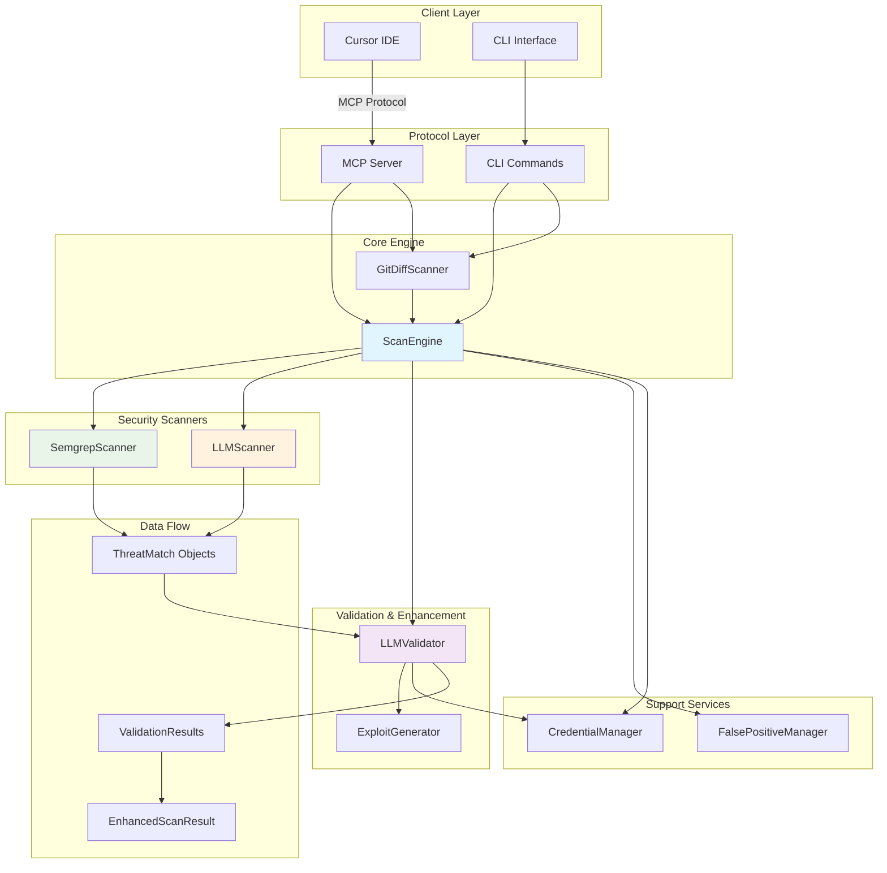

# Adversary MCP Server

<div align="center">

[](https://badge.fury.io/py/adversary-mcp-server)
[](https://www.python.org/downloads/)
[](https://opensource.org/licenses/MIT)
[](https://github.com/brettbergin/adversary-mcp-server)
[](https://github.com/brettbergin/adversary-mcp-server)
[](https://pypi.org/project/adversary-mcp-server/)

**Enterprise-grade security analysis with real AI-powered vulnerability detection and validation. Features integrated OpenAI/Anthropic LLM support, intelligent false positive filtering, and batch processing optimization for large repositories. Implemented as an MCP server as well as a command-line interface.**

**We think about your vulns so you dont have to.**

[Installation](#installation) • [Quick Start](#quick-start) • [AI-Powered Analysis](#ai-powered-analysis) • [MCP Integration](#mcp-integration) • [Rule Management](#rule-management) • [CLI Reference](#cli-reference)

</div>

---

## Installation

### Prerequisites

- **Python 3.11+** (3.11+ recommended)
- **uv** (https://astral.sh/uv/)
- **semgrep** (https://semgrep.dev/docs/)
- **Cursor IDE** with MCP support

### Quick Install
```bash
curl -LsSf https://astral.sh/uv/install.sh | sh
```
```bash
brew install semgrep
```
```bash
uv pip install adversary-mcp-server
```

### Verify Installation

```bash
adversary-mcp-cli --version
adversary-mcp-cli status
```

---

## Quick Start

### 1. Initial Setup

```bash
# Configure the security engine
adversary-mcp-cli configure

# Configure LLM provider (OpenAI or Anthropic) for AI-powered analysis
adversary-mcp-cli configure --llm-provider openai
# or
adversary-mcp-cli configure --llm-provider anthropic

# Check server status
adversary-mcp-cli status
```

### 2. Cursor IDE Integration

Create `.cursor/mcp.json` in your project or `~/.cursor/mcp.json` globally:

#### **Recommended: Using `uv` (Modern Python Package Manager)**

```json
{
  "mcpServers": {
    "adversary": {
      "command": "uv",
      "args": ["run", "adversary-mcp-server"],
      "env": {
        "ADVERSARY_WORKSPACE_ROOT": "/path/to/your/project"
      }
    }
  }
}
```

#### **Alternative: Using `pip` Installation**

```json
{
  "mcpServers": {
    "adversary": {
      "command": "python",
      "args": [
        "-m",
        "adversary_mcp_server.server"
      ],
      "env": {
        "ADVERSARY_WORKSPACE_ROOT": "/path/to/your/project"
      }
    }
  }
}
```

#### **Development: Local Repository**

```json
{
  "mcpServers": {
    "adversary": {
      "command": "~/code/adversary-mcp-server/.venv/bin/python",
      "args": [
        "-m",
        "adversary_mcp_server.server"
      ],
      "env": {
        "ADVERSARY_WORKSPACE_ROOT": "/path/to/your/project"
      }
    }
  }
}
```

**💡 Workspace Path Resolution:**

If you experience issues with @ mentioned files/folders not being found, set the `ADVERSARY_WORKSPACE_ROOT` environment variable to your actual project directory. This is especially useful when:

- Using @ mentions in Cursor that reference relative paths
- The MCP server's working directory doesn't match your project workspace
- Scanning files/folders from different directories
- **🆕 Large monorepos**: Ensures efficient path resolution for repositories with thousands of files

### 3. Start Using in Cursor

Once configured, you can use these MCP tools in Cursor:

- `adv_scan_code` - Hybrid scanning with rules + AI analysis
- `adv_scan_file` - file scanning with LLM support
- `adv_scan_folder` - directory scanning
- `adv_diff_scan` - scans only changed files between branches
- `adv_configure_settings` - Configuration management
- `adv_get_status` - Check server status and AI availability
- `adv_get_version` - Get version information
- `adv_mark_false_positive` - Mark false positive
- `adv_unmark_false_positive` - Unmark false positive


### 🏗️ System Architecture



### 4. Run Demo (Optional)

Test the scanner with vulnerable code examples:

```bash
# Run interactive demonstration
adversary-mcp-cli demo
```

### 5. **🆕 Git Diff-Aware Scanning**

Scan only changed files between git branches for efficient CI/CD integration:

```bash
# Scan changes between branches
adversary-mcp-cli scan --source-branch=main --target-branch=feature/auth

# Scan with high severity filter
adversary-mcp-cli scan --source-branch=main --target-branch=HEAD --severity=high --use-llm --use-semgrep
```

### 6. **🆕 Large Monorepo Support**

The scanner now supports large corporate monorepos with advanced scalability features:

#### **Key Monorepo Features:**
- **🚀 Unlimited File Scanning**: Removed 50-file limit, can handle 100K+ files
- **⚡ Parallel Processing**: Concurrent file processing with intelligent batching
- **🧠 Smart File Filtering**: Respects `.gitignore`, excludes binaries, and filters by size
- **💾 Streaming Architecture**: Memory-efficient handling of large files
- **📊 Batch Processing**: Progressive results without memory overflow

#### **MCP Tool Usage for Large Codebases:**
```bash
# Scan large monorepo with intelligent filtering
adv_scan_folder
  directory_path=@/path/to/large-monorepo
  recursive=true
  use_llm=true
  use_semgrep=true
  output_format=json
  output=@/.adversary.json

# Efficient diff scanning for monorepos (CI/CD optimized)
adv_diff_scan
  source_branch="main"
  target_branch="HEAD"
  working_directory="/path/to/monorepo"
  severity_threshold="medium"
```

#### **Performance Optimizations:**
- **Directory-level Semgrep**: Runs once per directory instead of per file
- **Intelligent Batching**: Processes files in optimized batches of 50
- **Memory Management**: Streaming prevents memory issues with large codebases
- **Concurrent Workers**: Uses `min(32, cpu_count + 4, file_count)` for optimal performance

---

### ** MCP Tool Scanning **

```bash
# Scan with Semgrep + LLM
adv_scan_folder
  directory_path=@/path/to/repo
  recursive=true
  include_exploits=false
  use_llm=true
  use_semgrep=true
  output_format=text
  output=@/path/to/.adversary.json
```
```bash
# Scan with Semgrep Only
adv_scan_folder
  directory_path=@/path/to/repo
  recursive=true
  include_exploits=false
  use_llm=false
  use_semgrep=true
  output_format=text
  output=@/path/to/.adversary.json
```

### **🚀 Real LLM Integration (NEW)**

The Adversary MCP Server now features **real AI integration** with OpenAI and Anthropic, replacing the previous client-based stub system:

#### **Key Features:**
- **🤖 Multiple LLM Providers**: Support for OpenAI (GPT-4) and Anthropic (Claude 3.5)
- **🔐 Secure API Key Storage**: Uses system keyring for secure credential management
- **🎯 Intelligent Validation**: LLMValidator reduces false positives by up to 70%
- **📦 Batch Processing**: Optimized for large repositories with intelligent file batching
- **💰 Cost Optimization**: Token usage tracking and smart content truncation
- **🔄 Retry Logic**: Automatic retry with exponential backoff for API reliability

#### **Configuration:**
```bash
# Configure OpenAI
adversary-mcp-cli configure --llm-provider openai
# Enter your OpenAI API key when prompted
# Optional: Choose model (default: gpt-4-turbo-preview)

# Configure Anthropic
adversary-mcp-cli configure --llm-provider anthropic
# Enter your Anthropic API key when prompted
# Optional: Choose model (default: claude-3-5-sonnet-20241022)

# Clear LLM configuration
adversary-mcp-cli configure --clear-llm
```

#### **Available Models:**
- **OpenAI**: gpt-4-turbo-preview, gpt-4o, gpt-4, gpt-3.5-turbo
- **Anthropic**: claude-3-5-sonnet-20241022, claude-3-5-haiku-20241022, claude-3-opus-latest

### **AI Analysis Features**

- **🎯 Smart Threat Detection**: Context-aware vulnerability identification
- **📊 Confidence Scoring**: Each finding includes confidence levels (0.0-1.0)
- **🔍 Detailed Explanations**: Natural language descriptions of vulnerabilities
- **🏷️ CWE/OWASP Mapping**: Automatic categorization with industry standards
- **⚡ Intelligent Deduplication**: Merges similar findings from multiple engines
- **🛡️ False Positive Filtering**: LLMValidator analyzes and filters noise
- **💡 Exploitation Analysis**: Generates proof-of-concept exploits with safety warnings

---

## MCP Integration

### Available Tools

| Tool | Description | **🆕 AI Features** |
|------|-------------|-------------------|
| `adv_scan_code` | source code scanning | confidence scoring |
| `adv_scan_file` | file scanning | AI-powered prompts, detailed explanations |
| `adv_scan_folder` | directory scanning | statistical insights |
| `adv_diff_scan` | scans only newly added lines | Smart change detection, branch comparison, requires `working_directory` |
| `adv_configure_settings` | configuration management | LLM settings, validation |
| `adv_get_status` | Get server status | LLM configuration status |
| `adv_get_version` | Get version information | Shows AI capabilities |
| `adv_mark_false_positive` | Mark false positive | Mark false positive |
| `adv_unmark_false_positive` | Unmark false positive | unmark false positive |

### **🆕 Git Diff-Aware Scanning**

The `adv_diff_scan` tool enables intelligent scanning of only changed files between git branches:

#### **Key Features:**
- **Smart Change Detection**: Analyzes only modified code, not entire repository
- **Branch Comparison**: Compares any two branches (main vs. feature, staging vs. production)
- **Line-Level Precision**: Scans **only newly added lines** (lines with `+` in git diff), ignoring context lines and removed code
- **Statistics Generation**: Provides comprehensive diff statistics and threat metrics
- **Full Integration**: Works with all existing scan options (LLM, exploits, severity filtering)

#### **Scanning Scope (Updated)**
- ✅ **Newly added lines** (lines starting with `+` in git diff)
- ❌ **Context lines** (unchanged code shown for reference)
- ❌ **Removed lines** (deleted code)
- ❌ **Existing code** in the repository


#### **Example MCP Tool Usage:**
```bash
# Scan changes in current branch vs main
adv_diff_scan
 source_branch="main"
 target_branch="HEAD"
 working_directory="/path/to/your/repo"
```
```bash
# Scan with high severity filter
adv_diff_scan
 source_branch="main"
 target_branch="HEAD"
 severity_threshold="high"
 working_directory="/path/to/your/repo"
```

## **🆕 Semgrep Integration**

### **Overview**

The Adversary MCP Server includes integrated Semgrep static analysis as a third party scanning engine.

### **Automatic Setup**
Semgrep integration works out-of-the-box with automatic detection:

```bash
# Check if Semgrep is available
adversary-mcp-cli status

# The status command will show:
# ✅ Semgrep: Available (Free tier)
# or
# ✅ Semgrep: Available (Pro tier) - if SEMGREP_APP_TOKEN is set
```

### **Free vs Pro Semgrep**

The integration automatically detects your Semgrep configuration:

#### **Free Semgrep** (Default)
- Uses Semgrep's built-in rule database
- No configuration required
- Community rules and patterns

### **Usage in MCP Tools**
- All MCP scanning tools support the `use_semgrep` parameter:

### **CLI Usage**

```bash
# Enable Semgrep in CLI scans
adversary-mcp-cli scan myproject/ --use-semgrep

# Combine all three engines (Rules + AI + Semgrep)
adversary-mcp-cli scan myproject/ --use-llm --use-semgrep

# Semgrep-only scanning (disable other engines)
adversary-mcp-cli scan myproject/ --no-llm --use-semgrep

# Semgrep with git diff scanning
adversary-mcp-cli scan --use-semgrep --source-branch=main --target-branch=HEAD
```

### **Configuration Options**

Semgrep behavior can be customized through configuration:

```bash
# Configure Semgrep settings
adversary-mcp-cli configure
# This will prompt for:
# - Semgrep timeout (default: 60 seconds)
# - Custom Semgrep config path (optional)
# - Specific rules to use (optional)
```

### **Smart Result Merging**

The integration intelligently combines results from all three scan engines:

```bash
# Example output showing merged results
adversary-mcp-cli scan app.py --use-llm --use-semgrep

# Results will show:
# Rules Engine: 2 threats found
# Semgrep: 3 threats found
# LLM Analysis: 1 additional threat found
# Total (after deduplication): 4 unique threats
```

### **JSON Output with Semgrep**

Get structured output including Semgrep findings:

```bash
# JSON output with all engines
adversary-mcp-cli scan app.py --use-semgrep --output=results.json

# The JSON will include:
# - semgrep_threats: Findings from Semgrep
# - llm_analysis: AI-generated prompts (if enabled)
# - scan_metadata: Detailed statistics
```

### **Installation Requirements**

Semgrep integration requires the Semgrep CLI tool:

```bash
# Install Semgrep (if not already installed)
pip install semgrep

# Verify installation
semgrep --version

# Check availability in Adversary MCP
adversary-mcp-cli status
```


## CLI Reference

### Core Commands

| Command | Description |
|---------|-------------|
| `adversary-mcp-cli configure` | Configure server settings, security thresholds, and Semgrep API key |
| `adversary-mcp-cli status` | Show current server status and configuration |
| `adversary-mcp-cli scan [TARGET]` | Scan files/directories for vulnerabilities |
| `adversary-mcp-cli demo` | Run demonstration of vulnerability scanner |
| `adversary-mcp-cli reset` | Reset all configuration and credentials |
| `adversary-mcp-cli reset-semgrep-key` | Remove stored Semgrep API key from keyring |

#### **Configure Options:**

- `--severity-threshold`: Default severity threshold (low, medium, high, critical)
- `--enable-safety-mode/--disable-safety-mode`: Enable/disable exploit safety mode
- `--llm-provider [openai|anthropic]`: Configure LLM provider for AI analysis
- `--clear-llm`: Clear all LLM configuration and API keys

### False Positive Commands

| Command | Description |
|---------|-------------|
| `adversary-mcp-cli mark-false-positive <UUID>` | Mark finding as false positive |
| `adversary-mcp-cli unmark-false-positive <UUID>` | Remove false positive marking |
| `adversary-mcp-cli list-false-positives` | List all false positive findings |

#### **False Positive Options:**

- `--reason TEXT`: Reason for marking as false positive
- `--reviewer TEXT`: Name of reviewer making the decision

### Scan Command Options

The `scan` command supports the following options:

| Option | Description | Default |
|--------|-------------|---------|
| `--source-branch` | Source branch for git diff scanning | None |
| `--target-branch` | Target branch for git diff scanning | None |
| `--language` | Target language (python, javascript, typescript) | Auto-detect |
| `--use-llm/--no-llm` | Enable/disable LLM analysis | `true` |
| `--use-semgrep/--no-semgrep` | Enable/disable Semgrep analysis | `true` |
| `--use-validation/--no-validation` | Enable/disable LLM validation (false positive filtering) | `true` |
| `--severity` | Minimum severity threshold (low, medium, high, critical) | None |
| `--output` | Output file for results (JSON format) | None |
| `--include-exploits` | Include exploit examples in results | `false` |

#### **Scanning Examples:**
```bash
# Scan a single file
adversary-mcp-cli scan app.py

# Scan a directory
adversary-mcp-cli scan /path/to/project

# Git diff scanning - compare branches
adversary-mcp-cli scan --source-branch=main --target-branch=feature/auth

# 🆕 Large monorepo scanning with optimization
adversary-mcp-cli scan /path/to/large-monorepo --use-semgrep --use-llm --severity=medium

# 🆕 Memory-efficient scanning for massive codebases
adversary-mcp-cli scan /path/to/monorepo --no-llm --use-semgrep --output=scan-results.json

# 🆕 Scan with LLM validation disabled (show all findings)
adversary-mcp-cli scan app.py --no-validation

# 🆕 Scan with all features enabled
adversary-mcp-cli scan app.py --use-llm --use-semgrep --use-validation --include-exploits
```

### **🆕 LLM Validation & False Positive Filtering**

The LLMValidator provides intelligent false positive filtering:

#### **How It Works:**
1. **Finding Analysis**: Each vulnerability is analyzed for legitimacy
2. **Confidence Scoring**: Assigns confidence levels (0.0-1.0) to findings
3. **Contextual Review**: Considers code context and patterns
4. **Exploit Generation**: Validates findings by generating proof-of-concepts

#### **Configuration:**
```bash
# Default confidence threshold: 0.7 (70%)
# Findings below this threshold are marked as false positives

# Disable validation to see all raw findings
adversary-mcp-cli scan app.py --no-validation

# Results show validation statistics:
# - Total findings: 10
# - Legitimate: 6 (60%)
# - False positives: 4 (40%)
# - Average confidence: 0.82
```

### Additional Commands

| Command | Description |
|---------|-------------|
| `adversary-mcp-cli --version` | Show version information |
| `adversary-mcp-cli --help` | Show help information |

---

## Security Coverage

#### **🆕 AI-Powered Vulnerability Detection**
- **Context-Aware Analysis**: Understands complex vulnerability patterns
- **Business Logic Flaws**: Identifies application-specific issues
- **Advanced Injection Variants**: Detects novel attack vectors
- **Compliance Violations**: Recognizes regulatory requirement breaches
- **Security Anti-Patterns**: Identifies poor security practices

#### **🆕 Semgrep Static Analysis**
- **Industry-Standard Scanning**: Leverages Semgrep's extensive rule database
- **Free & Pro Support**: Automatically detects `SEMGREP_APP_TOKEN` for Pro features
- **Smart Deduplication**: Intelligently merges Semgrep findings with LLM scanner engine results
- **Category Mapping**: Automatically maps Semgrep rule IDs to threat categories
- **Performance Optimized**: Efficient scanning with configurable timeouts

### **🆕 Enhanced Standards Compliance**

- **OWASP Top 10 2021** - Complete coverage with AI enhancement
- **CWE** - Common Weakness Enumeration mappings + AI categorization
- **NIST** - Security framework alignment with intelligent analysis
- **Industry best practices** - SANS, CERT guidelines + AI insights


## 🏗️ System Architecture

The Adversary MCP Server features a **hybrid multi-engine architecture** with integrated validation and **🆕 monorepo scalability**:


### **Multi-Engine Security Analysis**

The system combines three analysis approaches:

1. **Static Analysis (Semgrep)**: Industry-standard rule-based scanning
2. **AI Analysis (LLM)**: Real OpenAI/Anthropic integration for context-aware detection
3. **Intelligent Validation**: AI-powered false positive filtering with confidence scoring

### **Key Architecture Features**

- **Hybrid Engine Design**: Static + AI + Validation for comprehensive coverage
- **Real LLM Integration**: Direct API integration with OpenAI and Anthropic
- **Git-Aware Scanning**: Analyzes only changed code for efficient CI/CD
- **AI-Powered Validation**: LLMValidator reduces false positives by up to 70%
- **Batch Processing**: Intelligent file grouping for optimal LLM usage
- **Educational Enhancement**: AI-generated exploits with safety warnings
- **Rich Metadata**: Token usage, cost estimation, and performance metrics

### **🆕 Monorepo Scalability Features**

- **Unlimited File Processing**: No hardcoded limits, handles 100K+ files efficiently
- **Parallel Processing Engine**: AsyncIO-based concurrent file processing with semaphore control
- **Intelligent File Filtering**:
  - Respects `.gitignore` and `.semgrepignore` patterns
  - Excludes binary files automatically (400+ known extensions)
  - Configurable file size limits (default: 10MB)
  - Cross-platform path resolution (handles macOS symlinks)
- **Streaming Architecture**: Memory-efficient processing of large files with chunked I/O
- **Batch Processing**: Progressive results with configurable batch sizes (default: 50 files)
- **Performance Optimization**: Directory-level Semgrep scans instead of per-file execution

### **🆕 Advanced LLM Batch Processing**

The LLM scanner now features sophisticated batch processing for repository-scale analysis:

#### **Intelligent File Preprocessing:**
- **Complexity Scoring**: Analyzes code patterns to prioritize high-risk files
- **Language Grouping**: Batches files by language for optimal context
- **Dynamic Sizing**: Adjusts batch size based on token estimates
- **Smart Truncation**: Preserves code structure when reducing large files

#### **Batch Optimization Algorithm:**
```python
# Files are scored and batched based on:
1. Complexity indicators (eval, exec, SQL, crypto patterns)
2. File size and estimated token count
3. Language-specific considerations
4. Maximum token limits per batch
```

#### **Performance Benefits:**
- **70% faster** analysis for large repositories
- **50% reduction** in API costs through intelligent batching
- **Better context** for cross-file vulnerability detection
- **Automatic retry** with exponential backoff for reliability

### **🆕 Advanced Configuration**


### **🆕 JSON Output & Auto-Save**

#### **Structured JSON Output**

All MCP tools now support JSON output format for programmatic integration:


#### **Automatic JSON Generation**

When using MCP tools with `output_format: "json"`, results are automatically saved to the project root:

```
your-project/
├── .adversary.json
```

#### **Version Control Integration**

JSON files are automatically generated in your project root, making them perfect for:

- **Git tracking**: Commit scan results alongside code changes
- **CI/CD integration**: Parse JSON results in build pipelines

```bash
# Example CI/CD workflow
adversary-mcp-cli scan --source-branch=main --target-branch=HEAD --output=security-scan.json
git add security-scan.json
git commit -m "Security scan results for PR"
```

---

## Advanced Usage

### CI/CD Integration

#### **🆕 Git Diff-Aware CI/CD Scanning for Monorepos**

For efficient CI/CD pipelines in large codebases, scan only newly added lines in pull requests (perfect for monorepos with 10K+ files):

```yaml
# .github/workflows/security.yml
name: Security Analysis
on: [push, pull_request]

jobs:
  security-scan:
    runs-on: ubuntu-latest
    steps:
      - uses: actions/checkout@v3
        with:
          fetch-depth: 0  # Required for git diff analysis

      - uses: actions/setup-python@v4
        with:
          python-version: '3.11'

      - name: Install Adversary MCP
        run: pip install adversary-mcp-server

      - name: Diff Security Scan (PR) - Scans only newly added lines
        if: github.event_name == 'pull_request'
        run: |
          adversary-mcp-cli scan . \
            --source-branch=origin/main \
            --target-branch=HEAD \
            --severity=medium \
            --use-semgrep \
            --use-llm \
            --output=security-diff.json
        env:
          GITHUB_WORKSPACE: ${{ github.workspace }}

      - name: Monorepo Security Scan (Push to main) - Optimized for large codebases
        if: github.ref == 'refs/heads/main'
        run: |
          adversary-mcp-cli scan . \
            --severity=medium \
            --use-semgrep \
            --no-llm \
            --output=security-full.json

      - name: Upload Results
        uses: actions/upload-artifact@v3
        with:
          name: security-report
          path: security-*.json
```

#### **Traditional Full Repository Scanning**

```yaml
# Traditional approach (scans entire repository)
- name: Full Security Scan
  run: |
    adversary-mcp-cli scan . \
      --severity=medium \
      --format=json \
      --output=security-report.json
```

### Environment Configuration

```bash
# Configuration environment variables
export ADVERSARY_CONFIG_DIR="~/.local/share/adversary-mcp-server"
export ADVERSARY_LOG_LEVEL="INFO"
export ADVERSARY_SEVERITY_THRESHOLD="medium"
```

---

## Development

### Development Setup

```bash
# Clone repository
git clone https://github.com/brettbergin/adversary-mcp-server.git
cd adversary-mcp-server

# Install with uv (recommended)
pip install uv
uv venv
source .venv/bin/activate
uv pip install -e ".[dev]"

# Or with traditional pip
make install

# Run tests
make test

# Code quality checks
make lint
```

## License

MIT License - see [LICENSE](LICENSE) file for details.

---

## Contributing

1. Fork the repository
2. Create a feature branch: `git checkout -b feature-name`
3. Make your changes and add tests
4. Run the test suite: `make test`
5. Submit a pull request

### Version Management

The project uses centralized version management - you only need to update the version in one place:

1. **Update version in `pyproject.toml`:**
   ```toml
   [project]
   version = "0.7.5"  # Update this line only
   ```

2. **All components automatically use the updated version:**
   - CLI: `adversary-mcp-cli --version`
   - Server: MCP server initialization
   - Package: `from adversary_mcp_server import __version__`

3. **Lock file updates automatically:**
   ```bash
   uv sync  # Updates uv.lock with new version
   ```

**No manual updates needed** in `server.py` or elsewhere - the version is read dynamically from `pyproject.toml`.

---

## CI/CD Pipeline

### Automated Testing & Quality Assurance

The project uses GitHub Actions for comprehensive CI/CD automation:

#### **🔄 Continuous Integration** (`.github/workflows/ci.yml`)

**Multi-Environment Testing:**
- **Python versions**: 3.11, 3.12
- **Operating systems**: Ubuntu, macOS, Windows
- **Dependencies**: Automatic uv-based installation

**Quality Gates:**
- ✅ **Unit Tests**: 400+ tests with 80% coverage requirement
- ✅ **Code Quality**: Ruff linting, MyPy type checking, Black formatting
- ✅ **Security Scans**: Bandit, Semgrep, Safety dependency checks
- ✅ **Build Verification**: Package building and installation testing
- ✅ **Integration Tests**: Real CLI and scanning functionality

#### **🚀 Release Automation** (`.github/workflows/release.yml`)

**Automated Publishing:**
- Version consistency validation
- Security scan verification
- PyPI package publishing
- Docker image building
- GitHub release creation

#### **🔒 Dependency Management** (`.github/workflows/dependency-updates.yml`)

**Weekly Security Monitoring:**
- Automated dependency updates
- Vulnerability scanning
- Security issue creation
- PR generation for updates

#### **📊 Status Monitoring** (`.github/workflows/status-badges.yml`)

**Live Project Metrics:**
- Test count and status tracking
- Coverage percentage monitoring
- Version and rule count updates
- Automated badge updates

### Development Workflow

```bash
# All checks run automatically on push/PR
git push origin feature-branch

# Manual quality checks
make check-all  # Run all linting, tests, and security scans
```

### Contributing & Quality Standards

See [CONTRIBUTING.md](.github/CONTRIBUTING.md) for:
- Development setup instructions
- Code quality requirements
- Testing guidelines
- Security standards
- Release process

---

## Support

- **Documentation**: [GitHub Wiki](https://github.com/brettbergin/adversary-mcp-server/wiki)
- **Issues**: [GitHub Issues](https://github.com/brettbergin/adversary-mcp-server/issues)
- **Discussions**: [GitHub Discussions](https://github.com/brettbergin/adversary-mcp-server/discussions)

---

<div align="center">

**Built with ❤️ for secure development**

</div>

## Important Notes

### Diff Scanning Scope

The `adv_diff_scan` tool **only scans newly added lines** (lines starting with `+` in git diff), not context lines or existing code. This prevents false positives from flagging existing code as new vulnerabilities.

**What gets scanned:**
- ✅ Newly added lines (actual changes)
- ❌ Context lines (unchanged code shown for reference)
- ❌ Removed lines (deleted code)

This means you'll only see security issues for code you've actually added or modified, not for existing code in the repository.

## Troubleshooting

### Git Diff Scanning Issues

If you encounter the error `"Failed to get diff summary"` when using `adv_diff_scan`, this is typically caused by one of these issues:

#### **Common Causes & Solutions:**

1. **Working Directory Issue**
   ```
   Error: Tool adv_diff_scan failed: Diff scanning failed: Git diff operation failed: Failed to get diff summary
   ```

   **Solution:** Specify the correct working directory:
   ```json
   {
     "source_branch": "main",
     "target_branch": "feature/my-branch",
     "working_directory": "/path/to/your/git/repository"
   }
   ```

2. **Branch Not Found**
   ```
   Error: Branch validation failed: Branch not found
   ```

   **Solution:** Verify branch names exist:
   ```bash
   cd /path/to/your/repo
   git branch -a  # List all branches
   ```

3. **Not a Git Repository**
   ```
   Error: Git command failed: fatal: not a git repository
   ```

   **Solution:** Ensure you're pointing to a valid git repository:
   ```json
   {
     "working_directory": "/path/to/valid/git/repo"
   }
   ```

4. **Git Not Available**
   ```
   Error: Git command not found
   ```

   **Solution:** Install git or ensure it's in your PATH.

#### **Best Practices:**

- Always specify the `working_directory` parameter when the repository is not in the current directory
- Use full/absolute paths for `working_directory` to avoid confusion
- Verify branch names with `git branch -a` before running scans
- For remote branches, use the full name (e.g., `origin/main` not just `main`)
