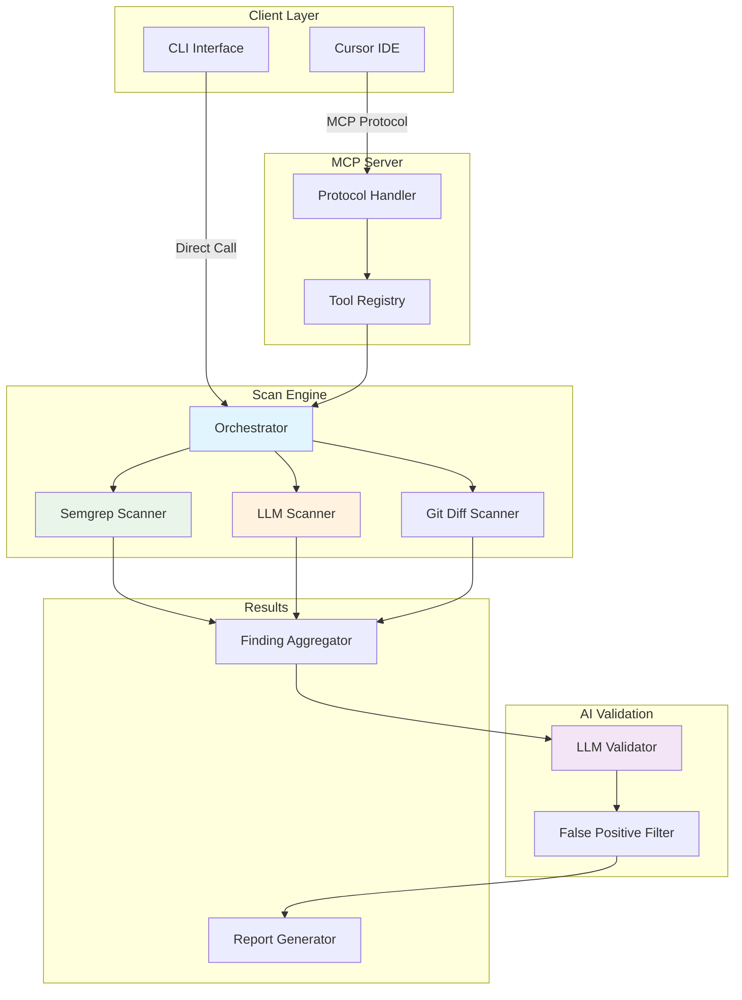

# Adversary MCP Server

<div align="center">

[](https://badge.fury.io/py/adversary-mcp-server)
[](https://www.python.org/downloads/)
[](https://opensource.org/licenses/MIT)
[](https://github.com/brettbergin/adversary-mcp-server)
[](https://github.com/brettbergin/adversary-mcp-server)
[](https://pypi.org/project/adversary-mcp-server/)

**🔒 Enterprise-grade security analysis with AI-powered vulnerability detection and validation**

**We think about your vulns so you don't have to.**

[Installation](#installation) • [Quick Start](#quick-start) • [Cursor Setup](#cursor-ide-setup) • [CLI Usage](#cli-usage) • [MCP Tools](#mcp-tools) • [Architecture](#architecture)

</div>

---

## Features

- 🤖 **AI-Powered Analysis** - OpenAI/Anthropic LLM integration for intelligent vulnerability detection.
- 🎯 **Smart Validation** - Reduces false positives with LLM validation
- 🔍 **Multi-Engine Scanning** - Combines Semgrep static analysis & AI analysis
- 📊 **Real-Time Dashboard** - Monitor scans with live metrics and progress tracking
- 🚀 **Git Diff Scanning** - Analyze only changed code for faster CI/CD integration
- 📦 **Monorepo Ready** - Optimized for large codebases with batch processing

## Installation

### Prerequisites

- **Python 3.11+**
- **uv** - Modern Python package manager ([install](https://astral.sh/uv/))
- **Semgrep** - Static analysis engine ([install](https://semgrep.dev/docs/))

### Quick Install

```bash
# Install uv (recommended package manager)
curl -LsSf https://astral.sh/uv/install.sh | sh

# Install Semgrep
brew install semgrep  # macOS
# or
pip install semgrep   # Other platforms

# Install Adversary MCP Server
uv pip install adversary-mcp-server
```

### Verify Installation

```bash
adversary-mcp-cli --version
adversary-mcp-cli status
```

## Quick Start

### 1. Configure Security Engine

```bash
# Initial configuration
adversary-mcp-cli configure

# Set up AI provider (optional but recommended)
adversary-mcp-cli configure --llm-provider openai
# Enter your OpenAI API key when prompted

adversary-mcp-cli configure --llm-provider anthropic
# Enter your Anthropic API key when prompted

# Check configuration
adversary-mcp-cli status
```

### 2. Run Your First Scan

```bash
# Scan a single file
adversary-mcp-cli scan path/to/file.py

# Scan with AI validation (reduces false positives)
adversary-mcp-cli scan path/to/file.py --use-validation

# Scan entire directory
adversary-mcp-cli scan ./src --use-llm --use-validation
```

## Cursor IDE Setup

### Configure MCP Server

Create `.cursor/mcp.json` in your project:

```json
{
  "mcpServers": {
    "adversary": {
      "command": "uv",
      "args": ["run", "adversary-mcp-server"],
      "env": {
        "ADVERSARY_WORKSPACE_ROOT": "${workspaceFolder}"
      }
    }
  }
}
```

<details>
<summary>Alternative setups (click to expand)</summary>

#### Using pip installation:
```json
{
  "mcpServers": {
    "adversary": {
      "command": "python",
      "args": ["-m", "adversary_mcp_server.server"],
      "env": {
        "ADVERSARY_WORKSPACE_ROOT": "${workspaceFolder}"
      }
    }
  }
}
```

#### For development:
```json
{
  "mcpServers": {
    "adversary": {
      "command": "/path/to/.venv/bin/python",
      "args": ["-m", "adversary_mcp_server.server"]
    }
  }
}
```
</details>

### Using MCP Tools in Cursor

Once configured, these tools are available in Cursor's chat:

- **Ask Cursor**: "Scan this file for security issues using adv_scan_file"
- **Ask Cursor**: "Check for vulnerabilities in the current project with adv_scan_folder"
- **Ask Cursor**: "Show me security issues in recent changes using adv_diff_scan"

## CLI Usage

### Basic Commands

```bash
# Configure the scanner
adversary-mcp-cli configure

# Check status and configuration
adversary-mcp-cli status

# Scan files or directories
adversary-mcp-cli scan <path> [options]

# Manage false positives
adversary-mcp-cli mark-false-positive <finding-id>
adversary-mcp-cli unmark-false-positive <finding-id>
```

### Scanning Examples

```bash
# Basic scan
adversary-mcp-cli scan app.py

# Scan with AI analysis and validation
adversary-mcp-cli scan ./src --use-llm --use-validation

# Scan only changed files (great for CI/CD)
adversary-mcp-cli diff-scan main feature-branch

# Output results as JSON
adversary-mcp-cli scan ./src --json --output results.json

# Scan with specific severity threshold
adversary-mcp-cli scan ./src --min-severity high
```

### Advanced Options

```bash
--use-llm              # Enable AI-powered vulnerability assessment
--use-validation       # Enable false positive filtering
--use-semgrep         # Use Semgrep rules (default: true)
--min-severity        # Filter by severity (low/medium/high/critical)
--json                # Output as JSON
--output <file>       # Save results to file
--include-stats      # Include performance metrics
```

## MCP Tools

### Available Tools

| Tool | Description | Example Usage |
|------|-------------|---------------|
| `adv_scan_code` | Scan code snippets | "Scan this code for vulnerabilities" |
| `adv_scan_file` | Scan specific files | "Check security issues in auth.py" |
| `adv_scan_folder` | Scan directories | "Analyze the src folder for vulnerabilities" |
| `adv_diff_scan` | Scan git changes | "Show security issues in recent commits" |
| `adv_configure_settings` | Update configuration | "Configure OpenAI for security scanning" |
| `adv_get_status` | Check server status | "Is the security scanner configured?" |
| `adv_mark_false_positive` | Mark false positives | "Mark finding XYZ as false positive" |

### MCP Tool Examples

```typescript
// In Cursor, ask the AI assistant:

// Scan current file
"Use adv_scan_file to check this file for security issues"

// Scan with validation
"Run adv_scan_file on auth.py with validation enabled"

// Check recent changes
"Use adv_diff_scan to analyze changes between main and my branch"

```

## Dashboard & Monitoring

### Real-Time Scan Dashboard

The scanner includes a live dashboard for monitoring long-running scans:

```bash
# Scan with dashboard enabled
adversary-mcp-cli scan ./large-repo --use-llm --use-validation

# Dashboard shows:
# ┌─────────────────────────────────────┐
# │ 📊 Security Scan Progress           │
# │                                     │
# │ Files: ████████░░ 156/200 (78%)    │
# │ Time: 00:02:34                     │
# │ Speed: 1.2 files/sec               │
# │                                     │
# │ Findings by Severity:              │
# │ 🔴 Critical: 2                     │
# │ 🟠 High: 5                         │
# │ 🟡 Medium: 12                      │
# │                                     │
# │ Status: Analyzing authentication... │
# └─────────────────────────────────────┘
```

### Performance Metrics

Include `--include-stats` to see detailed metrics:

```json
{
  "performance_metrics": {
    "total_files": 200,
    "files_scanned": 200,
    "total_time": 45.2,
    "files_per_second": 4.42,
    "llm_usage": {
      "total_tokens": 125000,
      "total_cost": 0.38,
      "api_calls": 25
    }
  }
}
```

## Architecture

<div align="center">



</div>

### How It Works

1. **Multi-Engine Scanning**: Combines Semgrep rules with LLM analysis
2. **Intelligent Validation**: LLM validator reduces false positives
3. **Batch Processing**: Optimizes API calls for large codebases
4. **Git Integration**: Focuses on changed code for faster CI/CD
5. **Real-Time Feedback**: Live dashboard for long-running scans

## Configuration

### Environment Variables

```bash
# Core settings
ADVERSARY_WORKSPACE_ROOT=/path/to/project
ADVERSARY_LOG_LEVEL=INFO

# LLM Configuration (optional)
ADVERSARY_LLM_PROVIDER=openai
ADVERSARY_LLM_MODEL=gpt-4-turbo-preview

# Performance tuning
ADVERSARY_MAX_CONCURRENT_SCANS=8
ADVERSARY_CACHE_SIZE_MB=200
```

### Configuration File

Settings are stored in `~/.adversary/config.json`:

```json
{
  "llm_provider": "openai",
  "enable_validation": true,
  "severity_threshold": "medium",
  "enable_caching": true
}
```

## CI/CD Integration

### GitHub Actions

```yaml
name: Security Scan
on: [pull_request]

jobs:
  security:
    runs-on: ubuntu-latest
    steps:
      - uses: actions/checkout@v3

      - name: Install dependencies
        run: |
          pip install uv
          uv pip install adversary-mcp-server

      - name: Run security scan
        run: |
          adversary-mcp-cli diff-scan origin/main HEAD \
            --use-validation \
            --min-severity medium \
            --json \
            --output scan-results.json

      - name: Upload results
        uses: actions/upload-artifact@v3
        with:
          name: security-scan
          path: scan-results.json
```

## Development

### Setup Development Environment

```bash
# Clone repository
git clone https://github.com/brettbergin/adversary-mcp-server.git
cd adversary-mcp-server

# Create virtual environment with uv
uv venv
source .venv/bin/activate  # or `.venv\Scripts\activate` on Windows

# Install in development mode
uv pip install -e ".[dev]"

# Run tests
make test

# Run with live reload
make dev
```

### Running Tests

```bash
# Full test suite
make test

# Quick tests (no coverage)
make test-fast

# Specific test file
pytest tests/test_scanner.py -v
```

## Support

- 📖 [Documentation](https://github.com/brettbergin/adversary-mcp-server/wiki)
- 🐛 [Report Issues](https://github.com/brettbergin/adversary-mcp-server/issues)
- 💬 [Discussions](https://github.com/brettbergin/adversary-mcp-server/discussions)
- 📧 Contact: brettbergin@gmail.com

## License

MIT License - see [LICENSE](LICENSE) for details.

## Contributing

Contributions are welcome! Please see our [Contributing Guide](CONTRIBUTING.md) for details.

---

<div align="center">
Made with ❤️ for software security.
</div>
