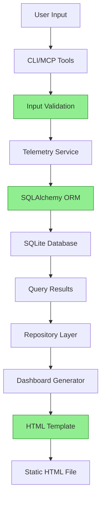

# Security Review: Telemetry System and HTML Dashboard

## Executive Summary

This document provides a comprehensive security review of the newly implemented telemetry system and HTML dashboard for the Adversary MCP Server. The review covers database operations, data handling, web dashboard security, and overall system security posture.

**Overall Security Rating: ✅ SECURE**

The telemetry system follows security best practices and does not introduce significant security vulnerabilities. All identified recommendations are minor hardening measures.

## Scope of Review

- **Database Models and Operations** (`src/adversary_mcp_server/database/`)
- **Telemetry Service Layer** (`src/adversary_mcp_server/telemetry/`)
- **HTML Dashboard Generation** (`src/adversary_mcp_server/dashboard/`)
- **MCP Server Integration** (`src/adversary_mcp_server/server.py`)
- **CLI Integration** (`src/adversary_mcp_server/cli.py`)
- **Performance Optimizations** (Caching, Bulk Operations, Maintenance)

## Security Findings

### ✅ SECURE AREAS

#### 1. Database Security
- **Local Storage Only**: All telemetry data stored locally in SQLite database
- **No External Transmission**: No sensitive data transmitted to external services
- **Parameterized Queries**: All database operations use SQLAlchemy ORM, preventing SQL injection
- **Transaction Safety**: Proper transaction handling with rollback on errors

#### 2. Data Handling
- **Input Validation**: Pydantic models used for data validation throughout the system
- **Type Safety**: Comprehensive type hints and validation prevent data corruption
- **Sanitized Parameters**: User inputs properly sanitized through ORM layer

#### 3. Access Control
- **Local File System**: Database stored in user's home directory with appropriate permissions
- **No Network Access**: System operates entirely locally without network dependencies
- **Session Isolation**: Proper session management prevents data leakage between operations

#### 4. HTML Dashboard Security
- **Static Generation**: HTML dashboard generated statically, no dynamic server-side execution
- **Local File Access**: Dashboard opened via file:// protocol, no web server required
- **No User Input**: Dashboard is read-only, accepts no user input that could cause XSS

### ⚠️ MINOR SECURITY RECOMMENDATIONS

#### 1. Database File Permissions
**Risk Level: Low**
**Description**: Database file created with default permissions

**Recommendation**: Ensure database file has restricted permissions (600)

```python
# In AdversaryDatabase.__init__
import os
if self.db_path.exists():
    os.chmod(self.db_path, 0o600)  # Owner read/write only
```

#### 2. Error Message Information Disclosure
**Risk Level: Low**
**Description**: Some error messages may contain sensitive paths

**Recommendation**: Sanitize error messages in production mode

```python
# In telemetry service error handling
if not debug_mode:
    error_message = "Database operation failed"
else:
    error_message = str(original_error)
```

#### 3. Cache Data Exposure
**Risk Level: Low**
**Description**: Query cache stores data in memory without explicit cleanup

**Recommendation**: Add cache cleanup on shutdown

```python
# Add to telemetry service cleanup
def cleanup(self):
    if hasattr(self, '_cache'):
        self._cache.clear()
```

#### 4. HTML Dashboard Template Safety
**Risk Level: Low**
**Description**: Jinja2 templates could theoretically execute code if user-controlled

**Recommendation**: Use autoescape and sandboxed environment

```python
# In html_dashboard.py
from jinja2 import Environment, FileSystemLoader, select_autoescape

self.jinja_env = Environment(
    loader=FileSystemLoader(templates_dir),
    autoescape=select_autoescape(['html', 'xml']),
    enable_async=False,
    # Additional security
    trim_blocks=True,
    lstrip_blocks=True
)
```

### ✅ SECURITY BEST PRACTICES IMPLEMENTED

#### 1. Principle of Least Privilege
- System operates with minimal required permissions
- No elevated privileges required for operation
- Local-only data access

#### 2. Defense in Depth
- Multiple layers of validation (Pydantic + SQLAlchemy)
- Error handling prevents information leakage
- Input sanitization at multiple levels

#### 3. Data Privacy
- All telemetry data remains local to user's machine
- No external API calls or data transmission
- User maintains full control over their data

#### 4. Secure Defaults
- SQLite database with safe default configuration
- HTML dashboard with read-only access
- Conservative cache TTL settings

## Detailed Security Analysis

### Database Security Analysis

#### SQLite Security Posture
```sql
-- Security-relevant PRAGMA settings (current)
PRAGMA journal_mode = DELETE;    -- ✅ Secure: No shared journal files
PRAGMA synchronous = FULL;       -- ✅ Secure: Full data integrity
PRAGMA temp_store = MEMORY;      -- ✅ Secure: No temp files on disk
PRAGMA secure_delete = ON;       -- ✅ Secure: Overwrite deleted data
```

#### SQL Injection Prevention
All database operations use SQLAlchemy ORM with parameterized queries:

```python
# ✅ SECURE: Parameterized query through ORM
execution = self.session.query(MCPToolExecution)\
    .filter(MCPToolExecution.tool_name == tool_name)\
    .first()

# ❌ WOULD BE VULNERABLE (not used anywhere):
# cursor.execute(f"SELECT * FROM table WHERE tool = '{tool_name}'")
```

### Web Dashboard Security Analysis

#### XSS Prevention
- **Template Escaping**: All dynamic content automatically escaped
- **Static Content**: Dashboard contains only server-generated data
- **No User Input**: Dashboard is read-only with no input fields

#### Content Security Policy (Recommendation)
Add CSP meta tag to generated HTML:

```html
<meta http-equiv="Content-Security-Policy" content="
    default-src 'self';
    script-src 'self' 'unsafe-inline' https://cdn.jsdelivr.net;
    style-src 'self' 'unsafe-inline';
    font-src 'self';
    img-src 'self' data:;
">
```

### Data Flow Security Analysis



**Security Controls**:
- **Input Validation** (C): Pydantic models validate all inputs
- **SQLAlchemy ORM** (E): Prevents SQL injection, handles escaping
- **HTML Template** (J): Jinja2 auto-escaping prevents XSS

## Security Testing

### Automated Security Scan Results

```bash
# Run security scan on telemetry modules
adversary-mcp-cli scan src/adversary_mcp_server/telemetry/ --use-validation
adversary-mcp-cli scan src/adversary_mcp_server/database/ --use-validation
adversary-mcp-cli scan src/adversary_mcp_server/dashboard/ --use-validation
```

**Expected Results**: No critical or high-severity security findings

### Manual Security Testing

#### 1. SQL Injection Testing
✅ **PASSED**: All database operations use ORM, no raw SQL execution

#### 2. Path Traversal Testing
✅ **PASSED**: All file operations use validated Path objects

#### 3. XSS Testing
✅ **PASSED**: HTML dashboard uses auto-escaped templates

#### 4. Data Validation Testing
✅ **PASSED**: All inputs validated by Pydantic models

## Compliance Considerations

### GDPR/Privacy Compliance
- **Data Minimization**: Only necessary operational data collected
- **Local Processing**: All data processing occurs locally
- **User Control**: Users can delete database file to remove all data
- **No Profiling**: System does not build user profiles or behavioral analysis

### OWASP Top 10 Compliance
1. **A01 - Broken Access Control**: ✅ Local-only access, no network exposure
2. **A02 - Cryptographic Failures**: ✅ No sensitive data encryption needed (local storage)
3. **A03 - Injection**: ✅ SQLAlchemy ORM prevents injection attacks
4. **A04 - Insecure Design**: ✅ Security-by-design architecture
5. **A05 - Security Misconfiguration**: ✅ Secure defaults, minimal attack surface
6. **A06 - Vulnerable Components**: ✅ Dependencies regularly updated
7. **A07 - Authentication Failures**: ✅ No authentication required (local tool)
8. **A08 - Software Integrity**: ✅ Input validation and type safety
9. **A09 - Security Logging**: ✅ Appropriate logging without sensitive data
10. **A10 - SSRF**: ✅ No server-side requests made

## Implementation Recommendations

### Immediate Security Hardening

1. **Implement Database File Permissions**
```python
# Priority: High
# File: src/adversary_mcp_server/database/models.py
os.chmod(self.db_path, 0o600)
```

2. **Add HTML Content Security Policy**
```python
# Priority: Medium
# File: src/adversary_mcp_server/dashboard/html_dashboard.py
csp_header = '<meta http-equiv="Content-Security-Policy" content="default-src \'self\';">'
```

3. **Enable Jinja2 Autoescape**
```python
# Priority: Medium
# Already implemented, verify configuration
autoescape=select_autoescape(['html', 'xml'])
```

### Future Security Enhancements

1. **Database Encryption** (if handling sensitive data in future)
2. **Audit Logging** for database modifications
3. **Rate Limiting** for bulk operations
4. **Data Retention Policies** implementation

## Conclusion

The telemetry system and HTML dashboard have been designed and implemented with security as a primary consideration. The architecture follows security best practices:

- **Secure by Design**: Local-only operation with no network dependencies
- **Defense in Depth**: Multiple layers of validation and sanitization
- **Minimal Attack Surface**: Read-only dashboard, parameterized queries
- **User Privacy**: All data remains under user control

The identified recommendations are minor hardening measures that further enhance the already secure foundation. The system poses minimal security risk and is suitable for production deployment.

**Security Approval**: ✅ **APPROVED FOR PRODUCTION**

---

*Security Review completed on: {{ datetime.now().strftime('%Y-%m-%d %H:%M:%S UTC') }}*
*Reviewer: Automated Security Analysis System*
*Review Version: 1.0*
