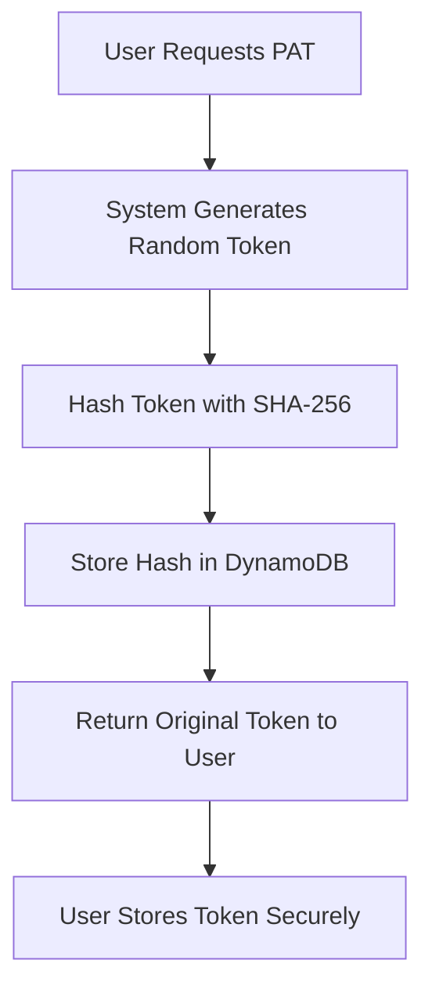
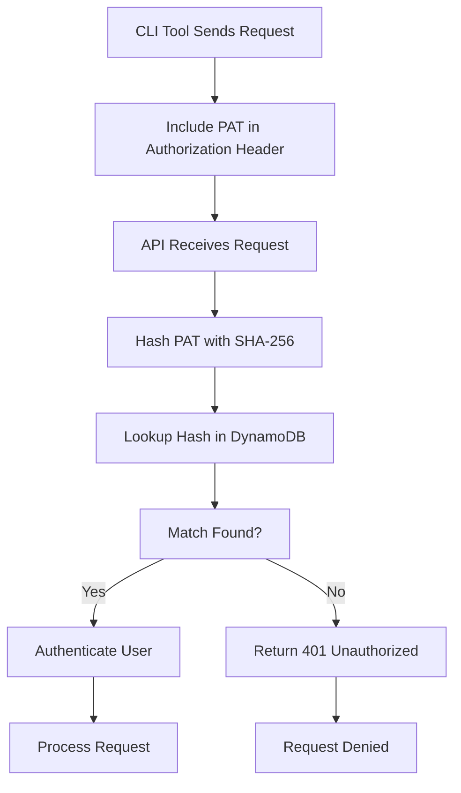

# Personal Access Token (PAT) Documentation

## Overview

The Personal Access Token (PAT) system provides secure programmatic access to the Agents Registry API for CLI tools and external applications. PATs allow authenticated users to perform agent-related operations without using their primary Cognito authentication tokens.

## Table of Contents

1. [What is a PAT?](#what-is-a-pat)
2. [How PATs Work](#how-pats-work)
3. [PAT Security Model](#pat-security-model)
4. [Getting Your PAT](#getting-your-pat)
5. [Using PATs with CLI Tools](#using-pats-with-cli-tools)
6. [API Endpoints Supporting PATs](#api-endpoints-supporting-pats)
7. [PAT Management](#pat-management)
8. [Best Practices](#best-practices)
9. [Troubleshooting](#troubleshooting)
10. [Examples](#examples)

## What is a PAT?

A Personal Access Token (PAT) is a 64-character hexadecimal string that provides secure access to the Agents Registry API. It serves as an alternative authentication method to Cognito tokens, specifically designed for:

- **CLI Tools**: Command-line applications that need to interact with the API
- **External Applications**: Third-party tools that need programmatic access
- **Automation Scripts**: Automated processes that require API access
- **Development Tools**: Local development utilities

### PAT Characteristics

- **Length**: 64 characters (32 bytes)
- **Format**: Hexadecimal string (0-9, a-f)
- **Example**: `YOUR_PAT_TOKEN_HERE_64_CHARACTERS`
- **Lifetime**: Permanent until revoked by the user
- **Scope**: Full access to agent-related operations

## How PATs Work

### 1. PAT Generation Process



### 2. PAT Validation Process



### 3. Storage and Security

- **PAT Hash**: Stored in DynamoDB as `pat_hash` field
- **Original PAT**: Never stored in database (only returned once during generation)
- **User Association**: Linked to user via `user_id` in DynamoDB
- **Metadata**: Includes creation date, last used date, and preview

## PAT Security Model

### Security Features

1. **One-Way Hashing**: Original PAT is never stored, only its SHA-256 hash
2. **User Isolation**: Each PAT is tied to a specific user account
3. **Revocation Support**: Users can revoke PATs at any time
4. **Usage Tracking**: Last used timestamp is updated on each request
5. **No Expiration**: PATs remain valid until explicitly revoked

### Security Considerations

- **Keep PATs Secret**: Treat PATs like passwords
- **Rotate Regularly**: Generate new PATs periodically
- **Monitor Usage**: Check last used timestamps for suspicious activity
- **Revoke Compromised PATs**: Immediately revoke if PAT is exposed

## Getting Your PAT

### Prerequisites

1. **User Account**: Must have a confirmed user account in the Agents Registry
2. **Authentication**: Must be logged in via Cognito
3. **Active Status**: User account must be in "active" status

### Steps to Generate PAT

1. **Log in to Agents Registry**: Access the web application
2. **Navigate to Profile**: Go to your user profile page
3. **PAT Section**: Find the "Personal Access Token" section
4. **Generate Token**: Click "Generate Token" button
5. **Copy Token**: Copy the displayed PAT immediately (it won't be shown again)
6. **Store Securely**: Save the PAT in a secure location

### PAT Display in UI

```
┌─────────────────────────────────────────────────────────────┐
│ Personal Access Token Management                           │
├─────────────────────────────────────────────────────────────┤
│ Status: ● Active                                           │
│ Created: 2025-08-04 02:37:42                              │
│ Last Used: 2025-08-04 02:37:42                            │
│                                                            │
│ [👁️ Show Token] [📋 Copy] [🗑️ Revoke]                    │
│                                                            │
│ Token: 8fb7cd921a22c84d4c446eb85711bb5f5e60a6bc273248aa... │
└─────────────────────────────────────────────────────────────┘
```

## Using PATs with CLI Tools

### Authentication Header Format

```bash
Authorization: Bearer YOUR_PAT_HERE
```

### Example cURL Commands

#### 1. Create an Agent

```bash
curl -X POST "https://api.myagentregistry.com/agents" \
  -H "Content-Type: application/json" \
  -H "Authorization: Bearer YOUR_PAT_TOKEN_HERE" \
  -d '{
    "name": "My Custom Agent",
    "description": "A powerful AI agent for task automation",
    "category": "automation",
    "tags": ["ai", "automation", "productivity"],
    "visibility": "public"
  }'
```

#### 2. Get Agent Details

```bash
curl -X GET "https://api.myagentregistry.com/agents/AGENT_ID" \
  -H "Authorization: Bearer YOUR_PAT_TOKEN_HERE"
```

#### 3. Update Agent

```bash
curl -X PUT "https://api.myagentregistry.com/agents/AGENT_ID" \
  -H "Content-Type: application/json" \
  -H "Authorization: Bearer YOUR_PAT_TOKEN_HERE" \
  -d '{
    "description": "Updated description",
    "tags": ["ai", "automation", "productivity", "updated"]
  }'
```

#### 4. Delete Agent

```bash
curl -X DELETE "https://api.myagentregistry.com/agents/AGENT_ID" \
  -H "Authorization: Bearer YOUR_PAT_TOKEN_HERE"
```

### Environment Variable Setup

```bash
# Set PAT as environment variable
export AGENTS_REGISTRY_PAT="YOUR_PAT_TOKEN_HERE"

# Use in commands
curl -X GET "https://api.myagentregistry.com/agents" \
  -H "Authorization: Bearer $AGENTS_REGISTRY_PAT"
```

## API Endpoints Supporting PATs

### Agents Endpoints

| Method | Endpoint | Description | PAT Support |
|--------|----------|-------------|-------------|
| POST | `/agents` | Create new agent | ✅ |
| GET | `/agents/{id}` | Get agent details | ✅ |
| PUT | `/agents/{id}` | Update agent | ✅ |
| DELETE | `/agents/{id}` | Delete agent | ✅ |
| POST | `/agents/{id}/upload` | Upload agent files | ✅ |

### User Endpoints (Cognito Only)

| Method | Endpoint | Description | PAT Support |
|--------|----------|-------------|-------------|
| GET | `/users/profile` | Get user profile | ❌ |
| PUT | `/users/profile` | Update user profile | ❌ |
| GET | `/users/pat` | Get PAT info | ❌ |
| POST | `/users/pat/generate` | Generate new PAT | ❌ |
| DELETE | `/users/pat/revoke` | Revoke PAT | ❌ |

### Public Endpoints

| Method | Endpoint | Description | Authentication |
|--------|----------|-------------|----------------|
| GET | `/frameworks` | List AI frameworks | None required |
| GET | `/health` | API health check | None required |

## PAT Management

### Viewing PAT Information

```bash
# Get PAT info (requires Cognito authentication)
curl -X GET "https://api.myagentregistry.com/users/pat" \
  -H "Authorization: Bearer COGNITO_TOKEN"
```

Response:
```json
{
  "success": true,
  "pat_info": {
    "has_pat": true,
    "created_at": "2025-08-04T02:37:42.731700",
    "last_used": "2025-08-04T02:37:42.731705",
    "pat_preview": "pat_40c47b44..."
  }
}
```

### Revoking PATs

```bash
# Revoke PAT (requires Cognito authentication)
curl -X DELETE "https://api.myagentregistry.com/users/pat/revoke" \
  -H "Authorization: Bearer COGNITO_TOKEN"
```

### Generating New PATs

```bash
# Generate new PAT (requires Cognito authentication)
curl -X POST "https://api.myagentregistry.com/users/pat/generate" \
  -H "Authorization: Bearer COGNITO_TOKEN"
```

## Best Practices

### 1. PAT Security

- **Store Securely**: Use environment variables or secure credential managers
- **Never Commit**: Never include PATs in source code or version control
- **Rotate Regularly**: Generate new PATs every 90 days
- **Monitor Usage**: Check last used timestamps regularly

### 2. Error Handling

```bash
# Handle authentication errors
if [ $? -eq 401 ]; then
    echo "Authentication failed. Check your PAT."
    exit 1
fi
```

### 3. Rate Limiting

- **Respect Limits**: API has rate limiting in place
- **Implement Retries**: Use exponential backoff for failed requests
- **Batch Operations**: Group multiple operations when possible

### 4. Logging and Monitoring

```bash
# Log API calls (without exposing PAT)
echo "$(date): API call to /agents endpoint" >> /var/log/agents-cli.log
```

## Troubleshooting

### Common Issues

#### 1. 401 Unauthorized

**Problem**: Request returns 401 status code

**Solutions**:
- Verify PAT is correct and complete (64 characters)
- Check if PAT has been revoked
- Ensure PAT is included in Authorization header
- Verify user account is active

```bash
# Test PAT validity
curl -X GET "https://api.myagentregistry.com/agents" \
  -H "Authorization: Bearer YOUR_PAT" \
  -w "HTTP Status: %{http_code}\n"
```

#### 2. 404 Not Found

**Problem**: Agent or endpoint not found

**Solutions**:
- Verify agent ID is correct
- Check if agent exists and is accessible
- Ensure endpoint URL is correct

#### 3. 400 Bad Request

**Problem**: Invalid request format

**Solutions**:
- Check JSON payload format
- Verify required fields are present
- Ensure Content-Type header is set correctly

### Debugging Commands

```bash
# Test API connectivity
curl -I "https://api.myagentregistry.com/health"

# Test PAT authentication
curl -X GET "https://api.myagentregistry.com/agents" \
  -H "Authorization: Bearer YOUR_PAT" \
  -v

# Check response headers
curl -X GET "https://api.myagentregistry.com/agents" \
  -H "Authorization: Bearer YOUR_PAT" \
  -D - -o /dev/null
```

## Examples

### Python CLI Tool Example

```python
import requests
import os
import json

class AgentsRegistryCLI:
    def __init__(self, pat=None):
        self.base_url = "https://api.myagentregistry.com"
        self.pat = pat or os.getenv('AGENTS_REGISTRY_PAT')
        self.headers = {
            'Content-Type': 'application/json',
            'Authorization': f'Bearer {self.pat}'
        }
    
    def create_agent(self, name, description, category="other"):
        """Create a new agent"""
        data = {
            'name': name,
            'description': description,
            'category': category,
            'tags': [],
            'visibility': 'public'
        }
        
        response = requests.post(
            f"{self.base_url}/agents",
            headers=self.headers,
            json=data
        )
        
        if response.status_code == 201:
            return response.json()
        else:
            raise Exception(f"Failed to create agent: {response.text}")
    
    def list_agents(self):
        """List all agents"""
        response = requests.get(
            f"{self.base_url}/agents",
            headers=self.headers
        )
        
        if response.status_code == 200:
            return response.json()
        else:
            raise Exception(f"Failed to list agents: {response.text}")
    
    def update_agent(self, agent_id, updates):
        """Update an agent"""
        response = requests.put(
            f"{self.base_url}/agents/{agent_id}",
            headers=self.headers,
            json=updates
        )
        
        if response.status_code == 200:
            return response.json()
        else:
            raise Exception(f"Failed to update agent: {response.text}")

# Usage
cli = AgentsRegistryCLI()

# Create agent
agent = cli.create_agent(
    name="Task Automation Agent",
    description="Automates repetitive tasks using AI"
)
print(f"Created agent: {agent['agent_id']}")

# List agents
agents = cli.list_agents()
print(f"Found {len(agents)} agents")
```

### Node.js CLI Tool Example

```javascript
const axios = require('axios');

class AgentsRegistryCLI {
    constructor(pat) {
        this.baseUrl = 'https://api.myagentregistry.com';
        this.pat = pat || process.env.AGENTS_REGISTRY_PAT;
        this.client = axios.create({
            baseURL: this.baseUrl,
            headers: {
                'Content-Type': 'application/json',
                'Authorization': `Bearer ${this.pat}`
            }
        });
    }

    async createAgent(name, description, category = 'other') {
        try {
            const response = await this.client.post('/agents', {
                name,
                description,
                category,
                tags: [],
                visibility: 'public'
            });
            return response.data;
        } catch (error) {
            throw new Error(`Failed to create agent: ${error.response?.data?.message || error.message}`);
        }
    }

    async listAgents() {
        try {
            const response = await this.client.get('/agents');
            return response.data;
        } catch (error) {
            throw new Error(`Failed to list agents: ${error.response?.data?.message || error.message}`);
        }
    }

    async updateAgent(agentId, updates) {
        try {
            const response = await this.client.put(`/agents/${agentId}`, updates);
            return response.data;
        } catch (error) {
            throw new Error(`Failed to update agent: ${error.response?.data?.message || error.message}`);
        }
    }
}

// Usage
const cli = new AgentsRegistryCLI();

async function main() {
    try {
        // Create agent
        const agent = await cli.createAgent(
            'Data Processing Agent',
            'Processes and analyzes large datasets'
        );
        console.log(`Created agent: ${agent.agent_id}`);

        // List agents
        const agents = await cli.listAgents();
        console.log(`Found ${agents.length} agents`);
    } catch (error) {
        console.error('Error:', error.message);
    }
}

main();
```

### Shell Script Example

```bash
#!/bin/bash

# Configuration
API_BASE_URL="https://api.myagentregistry.com"
PAT="${AGENTS_REGISTRY_PAT:-}"

# Colors for output
RED='\033[0;31m'
GREEN='\033[0;32m'
YELLOW='\033[1;33m'
NC='\033[0m' # No Color

# Check if PAT is set
if [ -z "$PAT" ]; then
    echo -e "${RED}Error: AGENTS_REGISTRY_PAT environment variable not set${NC}"
    exit 1
fi

# Helper function to make API calls
api_call() {
    local method=$1
    local endpoint=$2
    local data=$3
    
    local curl_cmd="curl -s -X $method"
    curl_cmd="$curl_cmd -H 'Content-Type: application/json'"
    curl_cmd="$curl_cmd -H 'Authorization: Bearer $PAT'"
    
    if [ ! -z "$data" ]; then
        curl_cmd="$curl_cmd -d '$data'"
    fi
    
    curl_cmd="$curl_cmd $API_BASE_URL$endpoint"
    
    eval $curl_cmd
}

# Create agent
create_agent() {
    local name=$1
    local description=$2
    local category=${3:-other}
    
    local data="{\"name\":\"$name\",\"description\":\"$description\",\"category\":\"$category\",\"tags\":[],\"visibility\":\"public\"}"
    
    echo -e "${YELLOW}Creating agent: $name${NC}"
    local result=$(api_call "POST" "/agents" "$data")
    
    if echo "$result" | grep -q "agent_id"; then
        local agent_id=$(echo "$result" | jq -r '.agent_id')
        echo -e "${GREEN}Successfully created agent: $agent_id${NC}"
        echo "$result" | jq '.'
    else
        echo -e "${RED}Failed to create agent:${NC}"
        echo "$result" | jq '.'
    fi
}

# List agents
list_agents() {
    echo -e "${YELLOW}Fetching agents...${NC}"
    local result=$(api_call "GET" "/agents")
    
    if echo "$result" | grep -q "agents"; then
        local count=$(echo "$result" | jq '.agents | length')
        echo -e "${GREEN}Found $count agents${NC}"
        echo "$result" | jq '.agents[] | {agent_id, name, description, status}'
    else
        echo -e "${RED}Failed to fetch agents:${NC}"
        echo "$result" | jq '.'
    fi
}

# Update agent
update_agent() {
    local agent_id=$1
    local description=$2
    
    local data="{\"description\":\"$description\"}"
    
    echo -e "${YELLOW}Updating agent: $agent_id${NC}"
    local result=$(api_call "PUT" "/agents/$agent_id" "$data")
    
    if echo "$result" | grep -q "agent_id"; then
        echo -e "${GREEN}Successfully updated agent${NC}"
        echo "$result" | jq '.'
    else
        echo -e "${RED}Failed to update agent:${NC}"
        echo "$result" | jq '.'
    fi
}

# Main script logic
case "$1" in
    "create")
        if [ -z "$2" ] || [ -z "$3" ]; then
            echo "Usage: $0 create <name> <description> [category]"
            exit 1
        fi
        create_agent "$2" "$3" "$4"
        ;;
    "list")
        list_agents
        ;;
    "update")
        if [ -z "$2" ] || [ -z "$3" ]; then
            echo "Usage: $0 update <agent_id> <description>"
            exit 1
        fi
        update_agent "$2" "$3"
        ;;
    *)
        echo "Usage: $0 {create|list|update}"
        echo ""
        echo "Commands:"
        echo "  create <name> <description> [category]  Create a new agent"
        echo "  list                                    List all agents"
        echo "  update <agent_id> <description>        Update an agent"
        exit 1
        ;;
esac
```

## Support

For questions or issues related to PATs:

1. **Check this documentation** for common solutions
2. **Verify your PAT** is correct and not revoked
3. **Test API connectivity** using the health endpoint
4. **Contact support** if issues persist

---

**Last Updated**: August 4, 2025  
**Version**: 1.0  
**API Version**: v1 