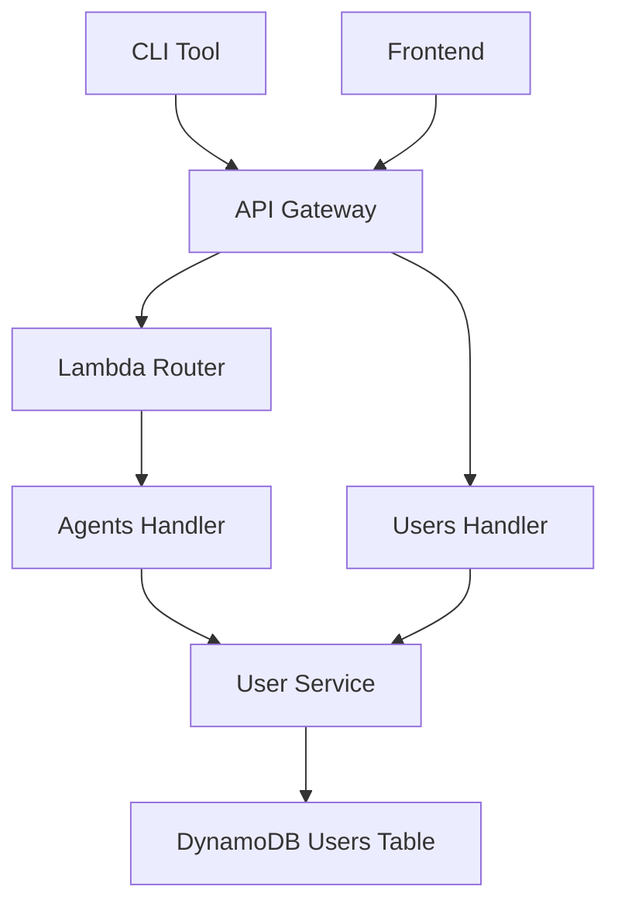
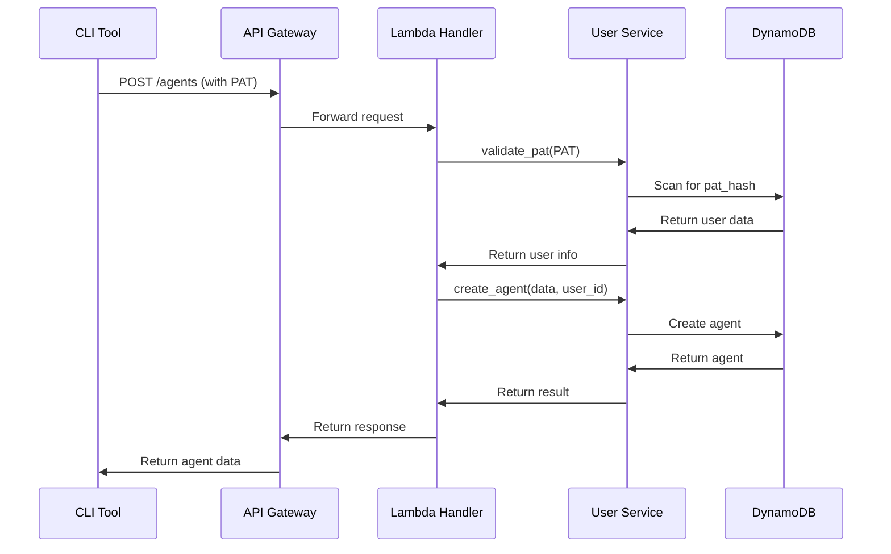
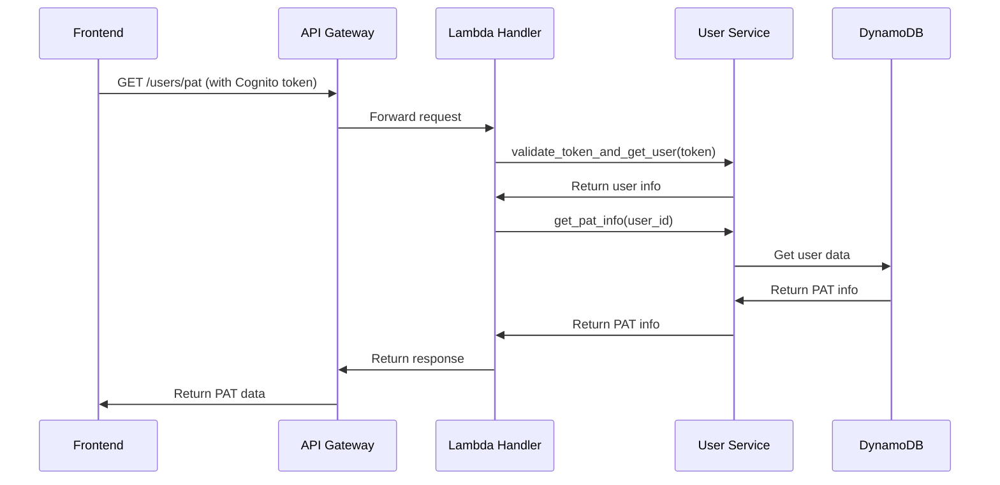

# PAT Technical Implementation Guide

## Overview

This document provides technical details about the Personal Access Token (PAT) implementation in the Agents Registry backend. It covers the architecture, security model, and implementation details for developers who need to understand or extend the PAT system.

## Architecture

### System Components



### Data Flow

1. **Authentication Request**: CLI tool sends request with PAT in Authorization header
2. **Token Validation**: Lambda handler validates PAT using UserService
3. **User Lookup**: System finds user associated with PAT hash
4. **Request Processing**: Agent operations are performed with user context
5. **Response**: Results returned to CLI tool

## Database Schema

### Users Table (DynamoDB)

```json
{
  "user_id": "string (partition key)",
  "email": "string",
  "username": "string",
  "full_name": "string",
  "role": "string",
  "status": "string",
  "pat_hash": "string (SHA-256 hash)",
  "pat_value": "string (original PAT for display)",
  "pat_created_at": "string (ISO timestamp)",
  "pat_last_used": "string (ISO timestamp)",
  "profile": {
    "bio": "string",
    "avatar_url": "string",
    "website_url": "string",
    "github_username": "string",
    "twitter_username": "string"
  },
  "preferences": {
    "theme": "string",
    "language": "string",
    "notifications_enabled": "boolean",
    "public_profile": "boolean",
    "newsletter_subscription": "boolean",
    "timezone": "string"
  },
  "created_at": "string (ISO timestamp)",
  "updated_at": "string (ISO timestamp)"
}
```

### PAT Fields

- **`pat_hash`**: SHA-256 hash of the original PAT (for validation)
- **`pat_value`**: Original PAT value (for display purposes)
- **`pat_created_at`**: Timestamp when PAT was generated
- **`pat_last_used`**: Timestamp of last PAT usage

## Security Implementation

### PAT Generation

```python
def generate_pat(self, user_id: str, token: str) -> str:
    """Generate a Personal Access Token for the user."""
    try:
        # Create a 256-bit hash of the Cognito token
        token_hash = hashlib.sha256(token.encode()).hexdigest()
        
        # Add some randomness to make it unique
        random_suffix = secrets.token_hex(16)
        pat = f"{token_hash[:32]}{random_suffix}"
        
        # Store both the PAT hash and the actual PAT value
        self.users_table.update_item(
            Key={'user_id': user_id},
            UpdateExpression='SET pat_hash = :pat_hash, pat_value = :pat_value, pat_created_at = :pat_created_at, pat_last_used = :pat_last_used',
            ExpressionAttributeValues={
                ':pat_hash': hashlib.sha256(pat.encode()).hexdigest(),
                ':pat_value': pat,  # Store the actual PAT value
                ':pat_created_at': datetime.utcnow().isoformat(),
                ':pat_last_used': datetime.utcnow().isoformat()
            }
        )
        
        return pat
        
    except Exception as e:
        raise Exception(f"Failed to generate PAT: {str(e)}")
```

### PAT Validation

```python
def validate_pat(self, pat: str) -> Optional[Dict[str, Any]]:
    """Validate a Personal Access Token and return user information."""
    try:
        # Hash the provided PAT
        pat_hash = hashlib.sha256(pat.encode()).hexdigest()
        
        # Scan DynamoDB for matching hash
        response = self.users_table.scan(
            FilterExpression='pat_hash = :pat_hash',
            ExpressionAttributeValues={':pat_hash': pat_hash}
        )
        
        if response['Items']:
            user = response['Items'][0]
            
            # Update last used timestamp
            self.users_table.update_item(
                Key={'user_id': user['user_id']},
                UpdateExpression='SET pat_last_used = :pat_last_used',
                ExpressionAttributeValues={
                    ':pat_last_used': datetime.utcnow().isoformat()
                }
            )
            
            return {
                'user_id': user['user_id'],
                'email': user.get('email', ''),
                'username': user.get('username', ''),
                'full_name': user.get('full_name', ''),
                'role': user.get('role', 'user'),
                'status': user.get('status', 'active')
            }
        
        return None
        
    except Exception as e:
        print(f"PAT validation error: {e}")
        return None
```

## API Implementation

### Lambda Handler Structure

```python
def handle_agents_request(event: Dict[str, Any], context: Any) -> Dict[str, Any]:
    """Handle agents requests with PAT authentication."""
    try:
        # Extract path and method
        path = event.get('path', '')
        http_method = event.get('httpMethod', 'GET')
        
        # Route based on path and method
        if path.endswith('/agents') and http_method == 'POST':
            return handle_create_agent(body, event)
        elif agent_id and http_method == 'GET':
            return handle_get_agent(agent_id, event)
        # ... other routes
        
    except Exception as e:
        return error_response(str(e))

def handle_create_agent(body: Dict[str, Any], event: Dict[str, Any]) -> Dict[str, Any]:
    """Handle agent creation with PAT authentication."""
    try:
        # Try PAT authentication first, then fallback to token
        pat_user = extract_pat_user(event)
        if pat_user:
            # Use PAT user info for authentication
            token = f"pat_user_{pat_user['user_id']}"
        else:
            token = extract_token(event)
        
        # Require authentication
        if not token:
            return unauthorized_response("Authentication token required")
        
        agent_data = AgentCreate(**body)
        result = agent_service.create_agent(agent_data, token)
        return success_response(result, 201)
        
    except Exception as e:
        return error_response(str(e))
```

### PAT Extraction

```python
def extract_pat_user(event: Dict[str, Any]) -> Optional[Dict[str, Any]]:
    """Extract and validate PAT from Authorization header."""
    headers = event.get('headers', {})
    authorization = headers.get('Authorization') or headers.get('authorization')
    
    if authorization and authorization.startswith('Bearer '):
        pat = authorization[7:]
        
        # Validate PAT and get user info
        user_info = user_service.validate_pat(pat)
        if user_info:
            return user_info
    
    return None
```

## Authentication Flow

### 1. PAT Authentication (Agents Endpoints)



### 2. Cognito Authentication (User Endpoints)



## Error Handling

### Common Error Responses

```python
def unauthorized_response(message: str = "Unauthorized") -> Dict[str, Any]:
    """Return 401 Unauthorized response."""
    return {
        'statusCode': 401,
        'headers': get_cors_headers(),
        'body': json.dumps({
            'error': 'Unauthorized',
            'message': message
        })
    }

def error_response(message: str, status_code: int = 400) -> Dict[str, Any]:
    """Return error response."""
    return {
        'statusCode': status_code,
        'headers': get_cors_headers(),
        'body': json.dumps({
            'error': 'Bad Request',
            'message': message
        })
    }
```

### Error Scenarios

1. **Invalid PAT**: 401 Unauthorized
2. **Revoked PAT**: 401 Unauthorized
3. **Missing PAT**: 401 Unauthorized
4. **Invalid Request**: 400 Bad Request
5. **Resource Not Found**: 404 Not Found

## Performance Considerations

### DynamoDB Optimization

1. **Indexing**: Consider creating a GSI on `pat_hash` for faster lookups
2. **Caching**: Implement Redis caching for frequently accessed PATs
3. **Batch Operations**: Use batch operations for multiple PAT validations

### Security Optimizations

1. **Rate Limiting**: Implement rate limiting per PAT
2. **Audit Logging**: Log all PAT usage for security monitoring
3. **Token Rotation**: Implement automatic PAT rotation policies

## Monitoring and Logging

### CloudWatch Metrics

```python
import boto3

def log_pat_usage(user_id: str, endpoint: str, success: bool):
    """Log PAT usage for monitoring."""
    cloudwatch = boto3.client('cloudwatch')
    
    cloudwatch.put_metric_data(
        Namespace='AgentsRegistry/PAT',
        MetricData=[
            {
                'MetricName': 'PATUsage',
                'Dimensions': [
                    {'Name': 'UserID', 'Value': user_id},
                    {'Name': 'Endpoint', 'Value': endpoint},
                    {'Name': 'Success', 'Value': str(success)}
                ],
                'Value': 1,
                'Unit': 'Count'
            }
        ]
    )
```

### Security Alerts

```python
def alert_suspicious_pat_usage(user_id: str, pattern: str):
    """Alert on suspicious PAT usage patterns."""
    sns = boto3.client('sns')
    
    message = f"""
    Suspicious PAT usage detected:
    - User ID: {user_id}
    - Pattern: {pattern}
    - Timestamp: {datetime.utcnow().isoformat()}
    """
    
    sns.publish(
        TopicArn='arn:aws:sns:us-east-1:ACCOUNT:security-alerts',
        Message=message,
        Subject='Suspicious PAT Usage Alert'
    )
```

## Testing

### Unit Tests

```python
import pytest
from unittest.mock import Mock, patch

class TestPATValidation:
    def test_valid_pat_returns_user_info(self):
        # Arrange
        pat = "YOUR_PAT_TOKEN_HERE"
        mock_user = {
            'user_id': 'test_user',
            'email': 'test@example.com',
            'pat_hash': hashlib.sha256(pat.encode()).hexdigest()
        }
        
        with patch('boto3.resource') as mock_dynamo:
            mock_table = Mock()
            mock_table.scan.return_value = {'Items': [mock_user]}
            mock_dynamo.return_value.Table.return_value = mock_table
            
            # Act
            user_service = UserService()
            result = user_service.validate_pat(pat)
            
            # Assert
            assert result is not None
            assert result['user_id'] == 'test_user'
    
    def test_invalid_pat_returns_none(self):
        # Arrange
        pat = "invalid_pat"
        
        with patch('boto3.resource') as mock_dynamo:
            mock_table = Mock()
            mock_table.scan.return_value = {'Items': []}
            mock_dynamo.return_value.Table.return_value = mock_table
            
            # Act
            user_service = UserService()
            result = user_service.validate_pat(pat)
            
            # Assert
            assert result is None
```

### Integration Tests

```python
def test_pat_authentication_flow():
    """Test complete PAT authentication flow."""
    # Arrange
    pat = "YOUR_PAT_TOKEN_HERE"
    
    # Act
    response = requests.post(
        "https://api.myagentregistry.com/agents",
        headers={'Authorization': f'Bearer {pat}'},
        json={'name': 'Test Agent', 'description': 'Test Description'}
    )
    
    # Assert
    assert response.status_code == 201
    assert 'agent_id' in response.json()
```

## Deployment

### CDK Configuration

```python
from aws_cdk import aws_lambda as _lambda

class PATLambdaStack(Stack):
    def __init__(self, scope: Construct, construct_id: str, **kwargs):
        super().__init__(scope, construct_id, **kwargs)
        
        # Lambda function for PAT validation
        pat_lambda = _lambda.Function(
            self, "PATValidationFunction",
            runtime=_lambda.Runtime.PYTHON_3_9,
            handler="main.lambda_handler",
            code=_lambda.Code.from_asset("lambda"),
            environment={
                'USERS_TABLE_NAME': users_table.table_name,
                'AGENTS_TABLE_NAME': agents_table.table_name
            }
        )
        
        # Grant DynamoDB permissions
        users_table.grant_read_write_data(pat_lambda)
        agents_table.grant_read_write_data(pat_lambda)
```

### Environment Variables

```bash
# Required environment variables
USERS_TABLE_NAME=agents-registry-users
AGENTS_TABLE_NAME=agents-registry-agents
JWT_SECRET_KEY=your-jwt-secret
```

## Future Enhancements

### Planned Features

1. **PAT Scopes**: Implement fine-grained permissions
2. **PAT Expiration**: Add optional expiration dates
3. **PAT Analytics**: Usage analytics and reporting
4. **PAT Rotation**: Automatic PAT rotation policies
5. **Multi-Factor Authentication**: Require MFA for PAT generation

### Implementation Roadmap

1. **Phase 1**: Basic PAT functionality (✅ Complete)
2. **Phase 2**: PAT scopes and permissions
3. **Phase 3**: Advanced security features
4. **Phase 4**: Analytics and monitoring
5. **Phase 5**: Enterprise features

## Support and Maintenance

### Regular Maintenance Tasks

1. **Monitor PAT Usage**: Check for unusual patterns
2. **Update Security**: Apply security patches
3. **Performance Optimization**: Monitor and optimize performance
4. **Backup Verification**: Verify PAT data backups
5. **Documentation Updates**: Keep documentation current

### Troubleshooting Guide

1. **PAT Validation Issues**: Check DynamoDB connectivity
2. **Performance Issues**: Monitor DynamoDB read/write capacity
3. **Security Issues**: Review CloudWatch logs and alerts
4. **Integration Issues**: Verify API Gateway configuration

---

**Last Updated**: August 4, 2025  
**Version**: 1.0  
**Maintainer**: Agents Registry Development Team 