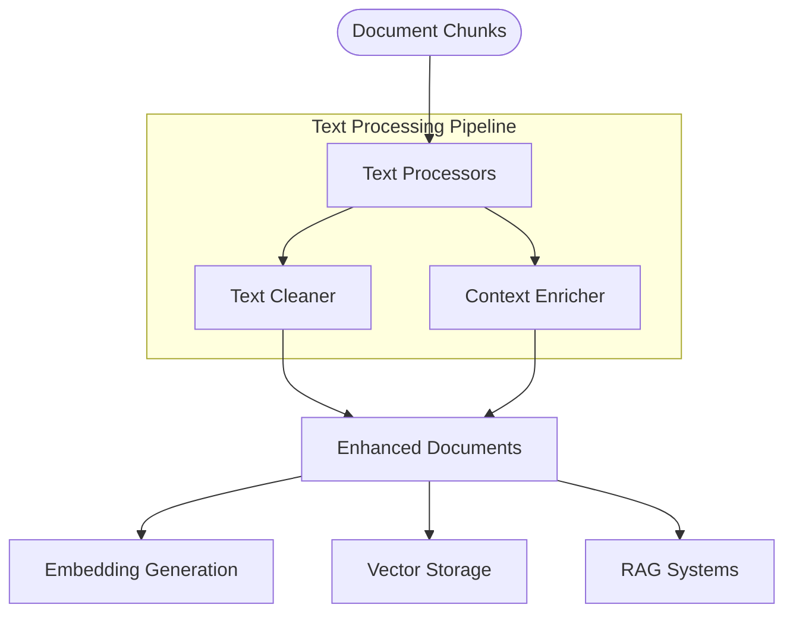

# Text Processors

## Overview

The Text Processors module provides components for post-processing document chunks after extraction and splitting. These processors enhance, transform, and enrich document content to improve downstream tasks like embedding generation, semantic search, and knowledge extraction.



## Key Components

### ITextProcessor Interface

All text processors implement the standard `ITextProcessor` interface which:
- Defines the common contract for all processors
- Enables pipeline composition and chaining
- Provides a consistent processing pattern

### TextCleaner

The `TextCleaner` processor provides text normalization and cleaning capabilities:

- **Whitespace Normalization**: Standardizes spacing, newlines, and indentation
- **Character Cleanup**: Handles special characters, control characters, and encoding issues
- **Content Removal**: Removes boilerplate, repetitive content, and irrelevant sections
- **Text Standardization**: Applies consistent formatting and structure
- **Language-Specific Cleaning**: Handles text based on detected language

### ContextEnricher

The `ContextEnricher` processor enhances documents with additional metadata and context:

- **Metadata Enhancement**: Adds or enriches document metadata
- **Cross-Reference Addition**: Links related content across documents
- **Structural Tagging**: Identifies document structure (headings, sections, etc.)
- **Content Categorization**: Adds topic and category information
- **Language Detection**: Identifies and tags content language

### Utility Functions

The module also includes utility functions for common operations:

- **`save_docs_to_json`**: Serializes and saves documents to JSON files
- **Custom metadata extraction helpers**
- **Document validation utilities**

## Usage Examples

### Basic Text Cleaning

```python
from src.document_loaders.processors import TextCleaner
from seedwork.interfaces.idocument import Document
from src.document_loaders.config import TextCleanerConfig

# Create sample documents
documents = [
    Document(
        page_content="  This is a sample   document \n\n with  irregular spacing. ",
        metadata={"source": "test.txt"}
    ),
    Document(
        page_content="Another\tdocument\nwith\ttabs and\nextra newlines.",
        metadata={"source": "test2.txt"}
    )
]

# Configure the text cleaner
config = TextCleanerConfig(
    remove_extra_whitespace=True,
    remove_urls=True,
    lowercase=False,
    remove_punctuation=False,
    remove_digits=False,
    strip_html=True
)

# Create and apply text cleaner
cleaner = TextCleaner(config=config)
cleaned_documents = cleaner.process(documents)

# Display results
for doc in cleaned_documents:
    print(f"Cleaned text: {doc.page_content}")
    print(f"Metadata: {doc.metadata}")
    print("---")
```

### Context Enrichment

```python
from src.document_loaders.processors import ContextEnricher
from seedwork.interfaces.idocument import Document
from src.document_loaders.config import ContextEnricherConfig

# Create sample documents
documents = [
    Document(
        page_content="The capital of France is Paris. It is known for the Eiffel Tower.",
        metadata={"source": "geography.txt"}
    ),
    Document(
        page_content="Python is a popular programming language created by Guido van Rossum.",
        metadata={"source": "programming.txt"}
    )
]

# Configure the context enricher
config = ContextEnricherConfig(
    detect_language=True,
    extract_keywords=True,
    extract_entities=True,
    add_timestamp=True,
    categorize_content=True
)

# Create and apply context enricher
enricher = ContextEnricher(config=config)
enriched_documents = enricher.process(documents)

# Display results
for doc in enriched_documents:
    print(f"Content: {doc.page_content}")
    print(f"Enhanced metadata: {doc.metadata}")
    print("---")
```

### Creating a Processing Pipeline

```python
from src.document_loaders.processors import TextCleaner, ContextEnricher
from src.document_loaders.file_loaders import PDFLoader
from src.document_loaders.text_splitters import RecursiveTextSplitter

# Create components
loader = PDFLoader()
splitter = RecursiveTextSplitter(chunk_size=1000, chunk_overlap=200)
cleaner = TextCleaner()
enricher = ContextEnricher()

# Process a document through the full pipeline
def process_document(file_path):
    # Extract content
    raw_documents = loader.load(file_path)
    
    # Split into chunks
    chunked_documents = splitter.split_documents(raw_documents)
    
    # Clean text
    cleaned_documents = cleaner.process(chunked_documents)
    
    # Enrich with context
    processed_documents = enricher.process(cleaned_documents)
    
    return processed_documents

# Use the pipeline
documents = process_document("path/to/document.pdf")
print(f"Processed {len(documents)} document chunks")
```

### Implementing a Custom Processor

```python
from src.document_loaders.processors import ITextProcessor
from seedwork.interfaces.idocument import Document
from typing import List, Optional
import re

class SentimentAnalysisProcessor(ITextProcessor):
    """Processor that adds sentiment analysis scores to document metadata."""
    
    def __init__(self, sentiment_model=None):
        """Initialize with optional sentiment model."""
        # Load or initialize sentiment model
        self.sentiment_model = sentiment_model or self._load_default_model()
        
    def _load_default_model(self):
        """Load a default sentiment analysis model."""
        # This is a simplified example - a real implementation would load a proper model
        return {
            "positive_words": ["good", "great", "excellent", "happy", "positive"],
            "negative_words": ["bad", "poor", "terrible", "unhappy", "negative"]
        }
        
    def process(self, documents: List[Document]) -> List[Document]:
        """Process documents to add sentiment metadata."""
        processed_docs = []
        
        for document in documents:
            # Perform basic sentiment analysis
            text = document.page_content.lower()
            positive_count = sum(text.count(word) for word in self.sentiment_model["positive_words"])
            negative_count = sum(text.count(word) for word in self.sentiment_model["negative_words"])
            
            # Calculate sentiment score (-1 to 1)
            total = positive_count + negative_count
            sentiment_score = 0
            if total > 0:
                sentiment_score = (positive_count - negative_count) / total
                
            # Create sentiment metadata
            sentiment_metadata = {
                "sentiment_score": sentiment_score,
                "sentiment_label": "positive" if sentiment_score > 0.1 else 
                                  "negative" if sentiment_score < -0.1 else "neutral",
                "positive_count": positive_count,
                "negative_count": negative_count
            }
            
            # Create new document with updated metadata
            new_metadata = {**document.metadata, "sentiment": sentiment_metadata}
            processed_doc = Document(
                page_content=document.page_content,
                metadata=new_metadata
            )
            
            processed_docs.append(processed_doc)
            
        return processed_docs
```

## Saving Processed Documents

```python
from src.document_loaders.processors.utils import save_docs_to_json
from seedwork.interfaces.idocument import Document

# Create and process documents
documents = [
    Document(
        page_content="Document content 1",
        metadata={"source": "file1.txt", "category": "finance"}
    ),
    Document(
        page_content="Document content 2",
        metadata={"source": "file2.txt", "category": "technology"}
    )
]

# Save documents to JSON
save_docs_to_json(
    documents=documents,
    output_file="processed_documents.json",
    pretty=True
)
```

## Best Practices

1. **Processing Order**:
   - Apply text cleaning before contextual enrichment
   - Consider the pipeline sequence carefully for best results
   - Preserve original metadata when transforming documents

2. **Performance Considerations**:
   - Some processors may be computationally intensive
   - Consider batching for large document collections
   - Implement caching for repetitive processing tasks

3. **Error Handling**:
   - Implement graceful error handling in processor implementations
   - Handle edge cases like empty documents or corrupted text
   - Log processing errors for later investigation

4. **Extensibility**:
   - Create custom processors for domain-specific needs
   - Compose processors into pipelines for complex transformations
   - Share configurations across processing stages when appropriate 