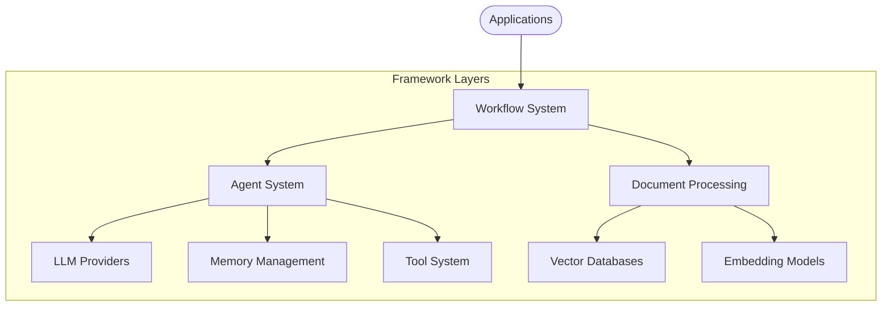
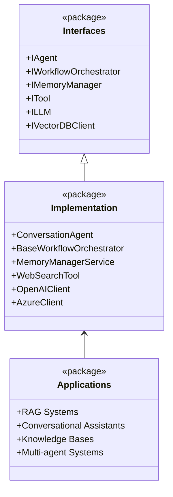

# Arshai

A powerful AI application framework for building complex, intelligent systems with conversational agents, workflow orchestration, and advanced memory management.



## Overview

Arshai is designed to empower developers to build sophisticated AI applications by providing a flexible, modular framework based on clean architecture principles. At its core, Arshai follows an interface-first design that enables easy extension, customization, and implementation of complex AI systems.

### Key Features

- **Agent Framework**: Create intelligent conversational agents with advanced memory management
- **Workflow Orchestration**: Design complex multi-agent systems with directed graph workflows
- **Memory Management**: Implement sophisticated conversation memory with multiple storage options
- **Tool Integration**: Extend agent capabilities with custom tools and external integrations
- **LLM Integration**: Connect with leading LLM providers (OpenAI, Azure OpenAI) with consistent APIs
- **RAG Capabilities**: Build powerful retrieval-augmented generation systems with document processing
- **Structured Outputs**: Enforce structured responses with schema validation
- **Streaming Support**: Enable real-time streaming responses throughout the stack

## Architecture

Arshai implements a clean, layered architecture with clear separation of concerns:



### Core Components

#### Workflow System

The orchestration layer that manages the flow of execution between agents:
- **Workflow Runner**: Interface for executing workflows
- **Workflow Orchestrator**: Manages node execution and state management
- **Nodes**: Wrappers around agents that adapt them for specific business requirements
- **Workflow State**: Carries data and context between nodes

#### Agent System

The intelligent components that process information and make decisions:
- **Conversational Agent**: Primary agent implementation for handling user interactions
- **Memory Integration**: Contextual awareness through working memory
- **Tool Usage**: Tool calling capabilities for extended functionality
- **Response Structuring**: Schema-based response structuring

#### Memory Management

The system that manages conversation context and knowledge:
- **Memory Manager Service**: Orchestrates different memory types
- **Working Memory**: Stores and retrieves conversation context
- **Multiple Providers**: In-memory and Redis implementations

#### Tool System

Extends agent capabilities with specific functionalities:
- **Web Search Tool**: Retrieve information from the web
- **Knowledge Base Tool**: Query vector databases for relevant information
- **Custom Tool Support**: Framework for developing new tools

#### LLM Integration

Connects to large language models through a unified interface:
- **OpenAI Provider**: Integration with OpenAI models
- **Azure Provider**: Integration with Azure OpenAI service
- **Streaming Support**: Real-time response generation
- **Function Calling**: Tool integration through function definitions

## Getting Started

### Installation

```bash
# Install with pip
pip install arshai

# Or with Poetry (recommended)
poetry add arshai

# With optional dependencies
pip install arshai[all]  # Includes redis, milvus, flashrank
```

### Quick Start

Create a conversational agent:

```python
from arshai import Settings, IAgentConfig, IAgentInput

# Initialize settings
settings = Settings()

# Create agent configuration
agent_config = IAgentConfig(
    task_context="You are a helpful assistant that specializes in Python programming.",
    tools=[]
)

# Create conversation agent
agent = settings.create_agent("conversation", agent_config)

# Process a message
response, usage = agent.process_message(
    IAgentInput(
        message="How do I use list comprehensions in Python?",
        conversation_id="conversation_123"
    )
)

print(f"Agent response: {response}")
```

### Building a Workflow

Create a simple workflow with multiple agents:

```python
from arshai import (
    Settings, 
    WorkflowRunner, 
    BaseWorkflowConfig,
    IWorkflowState, 
    IUserContext
)

# Initialize settings
settings = Settings()

# Define workflow configuration
class QAWorkflow(BaseWorkflowConfig):
    def _create_nodes(self):
        return {
            "query_router": self._create_router_node(),
            "research_agent": self._create_research_node(),
            "synthesizer": self._create_synthesis_node()
        }
    
    def _define_edges(self):
        return {
            "query_router": {
                "research": "research_agent"
            },
            "research_agent": "synthesizer"
        }
    
    def _route_input(self, input_data):
        return "research"

# Create workflow runner
workflow_config = QAWorkflow(settings)
workflow_runner = WorkflowRunner(workflow_config)

# Initialize state
user_context = IUserContext(user_id="user123")
initial_state = IWorkflowState(user_context=user_context)

# Run workflow
result = workflow_runner.run({
    "message": "What are the environmental impacts of electric vehicles?",
    "state": initial_state
})

print(result.get("response", ""))
```

### Using Tools

Extend agents with tool capabilities:

```python
from arshai import Settings, IAgentConfig, IAgentInput
from arshai.tools.web_search_tool import WebSearchTool

# Initialize settings
settings = Settings()

# Create tools
web_search = WebSearchTool(settings)

# Create agent with tools
agent_config = IAgentConfig(
    task_context="You are a research assistant that can search the web for information.",
    tools=[web_search]
)

agent = settings.create_agent("conversation", agent_config)

# Process a message that might trigger tool usage
response, usage = agent.process_message(
    IAgentInput(
        message="What are the latest breakthroughs in fusion energy?",
        conversation_id="research_123"
    )
)

print(f"Agent response with web search: {response}")
```

### Using Plugins

Extend Arshai with custom plugins:

```python
from arshai.extensions import load_plugin

# Load a custom plugin
plugin = load_plugin("my_custom_plugin", config={
    "api_key": "your_secret_key"
})

# Use plugin's tools with agents
custom_tool = plugin.get_tool("specialized_tool")
agent_config = IAgentConfig(
    task_context="Agent with custom capabilities",
    tools=[custom_tool]
)
```

## Examples

Explore the `examples/` directory for complete working examples:

- `basic_usage.py`: Demonstrates core agent functionality
- `simple_workflow.py`: Shows basic workflow construction
- `advanced_workflow.py`: Builds complex multi-agent workflows
- `file_indexing_example.py`: Demonstrates document processing and indexing
- `rag_system_usage.py`: Implements retrieval-augmented generation
- `configuration.py`: Shows configuration management techniques

## Component Documentation

Each major component has its own detailed documentation:

- [Agents System](src/agents/README.md)
- [Memory Management](src/memory/README.md)
- [LLM Integration](src/llms/README.md)
- [Tools System](src/tools/README.md)
- [Workflow System](src/workflows/README.md)

## Real-World Applications

Arshai has been used to build several production systems:

1. **Chetor Assistant**: An AI conversational system with integrated knowledge organization
2. **Petro RAG**: A specialized RAG system for the petroleum industry

## Configuration

Arshai uses a flexible configuration system that can be customized through:

- Environment variables
- Configuration files (YAML, JSON)
- Direct settings injection

Example configuration:

```yaml
# config.yaml
llm:
  provider: openai
  model: gpt-4
  temperature: 0.7

memory:
  working_memory:
    provider: redis
    ttl: 86400

workflows:
  debug_mode: true
```

## Extension Points

Arshai v0.2.0 introduces a powerful plugin system for extensibility:

### Plugin System

Create and distribute custom plugins:

```python
from arshai.extensions.base import Plugin, PluginMetadata
from arshai.extensions.hooks import hook, HookType

class MyPlugin(Plugin):
    def get_metadata(self):
        return PluginMetadata(
            name="my_plugin",
            version="1.0.0",
            author="Your Name",
            description="Custom plugin for specialized tasks"
        )
    
    def initialize(self):
        # Set up your plugin
        pass
    
    def shutdown(self):
        # Clean up resources
        pass

# Add hooks to extend behavior
@hook(HookType.BEFORE_AGENT_PROCESS)
def custom_preprocessing(context):
    # Modify agent input before processing
    pass
```

### Extension Methods

1. **Plugin System**: Create reusable plugins with tools, hooks, and providers
2. **Custom Agents**: Implement the `IAgent` interface for specialized agents
3. **Custom Tools**: Add new capabilities by implementing the `ITool` interface
4. **Hook System**: Extend behavior without modifying core code
5. **Custom Nodes**: Create specialized workflow nodes for business logic
6. **New LLM Providers**: Add support for new LLM providers by implementing the `ILLM` interface
7. **Custom Memory Providers**: Implement new storage backends with the `IMemoryManager` interface

## Migration from v0.1.x

If you're upgrading from an older version of Arshai:

1. **Read the [Migration Guide](MIGRATION_GUIDE.md)** for detailed instructions
2. **Use the migration script** for automatic import updates:
   ```bash
   python scripts/migrate_imports.py --path /path/to/your/project
   ```
3. **Enable compatibility mode** for gradual migration:
   ```python
   from arshai.compat import enable_compatibility_mode
   enable_compatibility_mode()
   ```

## What's New in v0.2.0

- 🏗️ **Unified package structure** under `arshai` namespace
- 🔌 **Plugin system** for easy extensibility
- 🪝 **Hook system** for behavior customization
- 📦 **PyPI distribution** for easy installation
- 🔄 **Backward compatibility** layer for smooth migration
- 📚 **Enhanced documentation** and examples
- 🧪 **Improved testing** and CI/CD

## Contributing

Contributions are welcome! Please check out our [Contributing Guidelines](CONTRIBUTING.md) for details on our code of conduct and the process for submitting pull requests.

## License

This project is licensed under the MIT License - see the [LICENSE](LICENSE) file for details. 