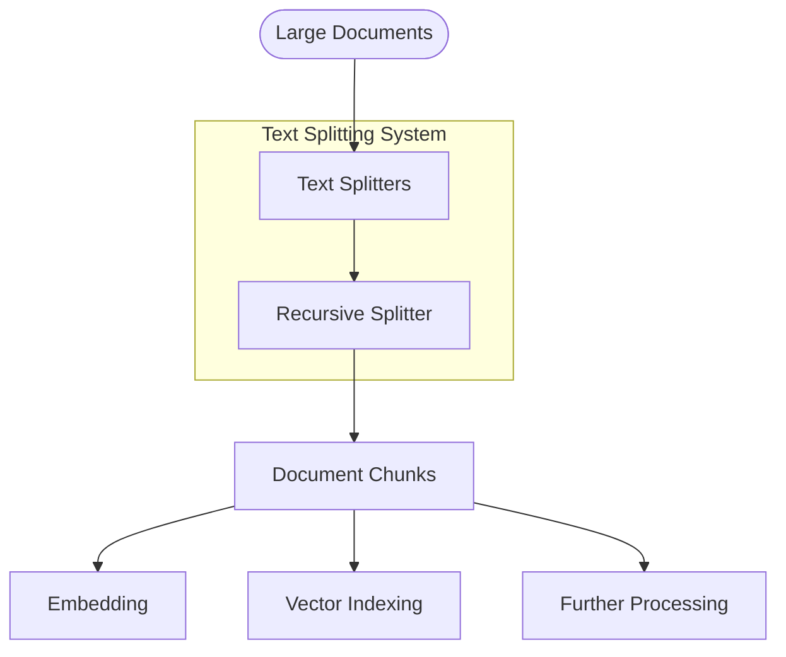

# Text Splitters

## Overview

The Text Splitters module provides specialized components for breaking down large documents into smaller, manageable chunks for processing by language models and vector databases. Effective text splitting is crucial for retrieval-augmented generation (RAG) systems, as it ensures that context windows are appropriately sized and that semantic coherence is maintained.



## Key Components

### ITextSplitter Interface

All text splitters implement the `ITextSplitter` interface, which:
- Defines the standard contract for text splitting operations
- Provides methods for splitting both raw text and document objects
- Ensures consistent behavior across different implementations

### RecursiveTextSplitter

The `RecursiveTextSplitter` is a sophisticated document chunking implementation that:

- Uses a hierarchical approach to chunk documents based on separator patterns
- Preserves semantic content by splitting on increasingly granular delimiters
- Supports configurable chunk sizes and overlap
- Maintains document metadata during splitting
- Handles special document formats and language-specific requirements

## Implementation Details

The `RecursiveTextSplitter` uses a hierarchical approach to text splitting:

1. Attempts to split on primary separators (paragraphs, sections)
2. If resulting chunks are still too large, splits on secondary separators (sentences)
3. Continues with increasingly fine-grained separators (phrases, words) until chunks are within size limits
4. Applies chunk overlap to maintain context between adjacent chunks

The default separator hierarchy is:
```
["\n\n", "\n", ". ", " ", ""]
```

This allows the splitter to preserve logical document structure when possible, falling back to more aggressive splitting only when necessary.

## Usage Examples

### Basic Text Splitting

```python
from src.document_loaders.text_splitters import RecursiveTextSplitter
from seedwork.interfaces.itext_splitter import ITextSplitterConfig

# Create text splitter with default configuration
splitter = RecursiveTextSplitter(
    config=ITextSplitterConfig(
        chunk_size=1000,      # Target chunk size (in characters)
        chunk_overlap=200,    # Overlap between chunks
        separators=["\n\n", "\n", ". ", " ", ""]  # Hierarchy of separators
    )
)

# Split raw text
text = """
This is the first paragraph of a sample document.
It contains multiple sentences that should be kept together.

This is the second paragraph. It has different content.
The separator hierarchy should keep paragraphs intact when possible.

This is a third paragraph with more information about text splitting.
"""

chunks = splitter.split(text)

print(f"Generated {len(chunks)} chunks:")
for i, chunk in enumerate(chunks):
    print(f"Chunk {i+1}: {chunk[:50]}...")
```

### Splitting Document Objects

```python
from src.document_loaders.text_splitters import RecursiveTextSplitter
from seedwork.interfaces.idocument import Document

# Create a document object
document = Document(
    page_content="""
    # Document Title
    
    ## Section 1
    
    This is the content of section 1. It contains important information
    that should be preserved in the splitting process.
    
    ## Section 2
    
    This is the content of section 2. We want to ensure that related
    content stays together when possible.
    """,
    metadata={
        "source": "sample.md",
        "author": "John Doe",
        "date": "2023-06-15"
    }
)

# Create splitter with custom configuration
splitter = RecursiveTextSplitter(
    chunk_size=500,
    chunk_overlap=50,
    separators=["## ", "\n\n", "\n", ". ", " ", ""]
)

# Split the document into chunks
chunks = splitter.split_documents([document])

# Process the chunks
for i, chunk in enumerate(chunks):
    print(f"Chunk {i+1}:")
    print(f"Content preview: {chunk.page_content[:100]}...")
    print(f"Metadata: {chunk.metadata}")
    print("---")
```

### Customizing the Splitting Process

```python
from src.document_loaders.text_splitters import RecursiveTextSplitter
from seedwork.interfaces.itext_splitter import ITextSplitterConfig

# Create a specialized configuration for code documents
code_splitter_config = ITextSplitterConfig(
    chunk_size=1500,
    chunk_overlap=150,
    separators=[
        # First try to split on class/function definitions
        "\nclass ", "\ndef ", "\nfunction ", 
        # Then on logical code blocks
        "\n\n", 
        # Finally on individual lines and characters
        "\n", ";", " ", ""
    ]
)

# Create code-optimized splitter
code_splitter = RecursiveTextSplitter(config=code_splitter_config)

# Sample Python code
python_code = """
class Calculator:
    def __init__(self):
        self.result = 0
        
    def add(self, a, b):
        return a + b
        
    def subtract(self, a, b):
        return a - b
        
    def multiply(self, a, b):
        return a * b
        
    def divide(self, a, b):
        if b == 0:
            raise ValueError("Cannot divide by zero")
        return a / b
"""

# Split the code
code_chunks = code_splitter.split(python_code)

for i, chunk in enumerate(code_chunks):
    print(f"Code Chunk {i+1}: {chunk[:50]}...")
```

### Integration with Document Loading Pipeline

```python
from src.document_loaders.file_loaders import PDFLoader
from src.document_loaders.text_splitters import RecursiveTextSplitter
from src.document_loaders.processors import TextCleaner

# Create a processing pipeline
def process_document(file_path, chunk_size=1000, chunk_overlap=200):
    # 1. Load the document
    loader = PDFLoader()
    documents = loader.load(file_path)
    
    # 2. Split into chunks
    splitter = RecursiveTextSplitter(
        chunk_size=chunk_size,
        chunk_overlap=chunk_overlap
    )
    chunks = splitter.split_documents(documents)
    
    # 3. Clean text (optional)
    cleaner = TextCleaner()
    processed_chunks = cleaner.process(chunks)
    
    return processed_chunks

# Use the pipeline
chunks = process_document("path/to/document.pdf", chunk_size=800)
print(f"Generated {len(chunks)} chunks from the document")
```

## Performance Considerations

### Chunk Size Selection

The optimal chunk size depends on your specific use case:

- **Embedding Models**: Choose chunk size based on the context window of your embedding model
- **Language Models**: For LLM context, consider smaller chunks (1000-1500 characters)
- **Search Granularity**: Smaller chunks provide more precise search results but increase vector storage needs

### Chunk Overlap

Setting appropriate overlap prevents context loss between chunks:

- **Low Overlap** (10-15% of chunk size): Minimizes storage requirements
- **Medium Overlap** (15-30%): Good balance for most use cases
- **High Overlap** (30-50%): Preserves more context but increases storage needs

## Best Practices

1. **Document Structure Awareness**:
   - Choose separators that respect the document's logical structure
   - Customize separators for different document types (code, prose, data)
   - Use format-specific splitters when working with specialized content

2. **Metadata Preservation**:
   - Ensure that document metadata is preserved in split chunks
   - Consider adding chunk-specific metadata (position, page number)
   - Add references to original source locations

3. **Content Coherence**:
   - Set chunk_overlap appropriately to maintain context between chunks
   - Avoid splitting in the middle of crucial information
   - Post-process chunks to ensure they contain complete information units

4. **Pre-Processing Interaction**:
   - Clean and normalize text before splitting
   - Remove irrelevant content to improve chunk quality
   - Consider the entire document processing pipeline