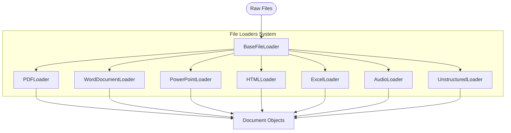

# File Loaders

## Overview

The File Loaders module provides a collection of classes for extracting content from various document types in the Arshai framework. These loaders handle the first stage of document processing, converting raw files into structured document objects that can be further processed by text splitters and processors.



## Key Components

### BaseFileLoader

The `BaseFileLoader` is an abstract base class that:
- Defines the common interface for all file loaders
- Provides utility methods for file handling and metadata extraction
- Enables directory traversal for batch processing
- Handles error reporting and logging

### Specialized Loaders

#### PDFLoader
- Extracts text content from PDF documents
- Handles PDF parsing, including text extraction and basic metadata
- Optionally integrates with text splitters for chunking

#### UnstructuredWordDocumentLoader
- Extracts content from Microsoft Word documents (.doc, .docx)
- Preserves document structure including headings and sections
- Extracts document metadata such as author and creation date

#### UnstructuredPowerPointLoader
- Extracts content from PowerPoint presentations (.ppt, .pptx)
- Processes slides into structured document format
- Preserves slide titles and content organization

#### UnstructuredHTMLLoader
- Extracts content from HTML files
- Handles HTML parsing and content extraction
- Preserves relevant HTML structure in the extracted text

#### UnstructuredExcelLoader
- Extracts content from Excel spreadsheets (.xls, .xlsx)
- Converts tabular data into text format
- Preserves sheet structure and data relationships

#### AudioLoader
- Processes audio files using speech-to-text transcription
- Supports multiple audio formats (.mp3, .wav, .m4a)
- Creates document objects from transcribed content

#### UnstructuredLoader
- General-purpose loader leveraging the unstructured library
- Automatically detects and processes many document types
- Provides consistent extraction across diverse file formats

## Usage Examples

### Basic Usage with a Single File Loader

```python
from src.document_loaders.file_loaders import PDFLoader
from seedwork.interfaces.itext_splitter import ITextSplitterConfig
from src.document_loaders.text_splitters import RecursiveTextSplitter

# Create a text splitter
text_splitter = RecursiveTextSplitter(
    config=ITextSplitterConfig(
        chunk_size=1000,
        chunk_overlap=200
    )
)

# Initialize the PDF loader with text splitter
pdf_loader = PDFLoader(text_splitter=text_splitter)

# Load a document
documents = pdf_loader.load("path/to/document.pdf")

# Process the extracted documents
for doc in documents:
    print(f"Document ID: {doc.metadata.get('document_id')}")
    print(f"Source: {doc.metadata.get('source')}")
    print(f"Content preview: {doc.page_content[:200]}...")
    print(f"Metadata: {doc.metadata}")
    print("---")
```

### Using the General-Purpose UnstructuredLoader

```python
from src.document_loaders.file_loaders import UnstructuredLoader
from src.document_loaders.config import UnstructuredLoaderConfig
from seedwork.interfaces.idocument import Document

# Configure the unstructured loader
config = UnstructuredLoaderConfig(
    strategy="fast",  # "fast" or "accurate"
    include_metadata=True,
    ocr_languages=["eng"]  # OCR languages if needed
)

# Initialize the unstructured loader
loader = UnstructuredLoader(config=config)

# Check if a file type is supported
is_supported = loader.file_type_supported("document.docx")
print(f"Is DOCX supported? {is_supported}")

# Load documents from a directory
documents = loader.load_directory(
    "path/to/documents/",
    glob_pattern="**/*.{pdf,docx,pptx}"
)

print(f"Loaded {len(documents)} documents")
```

### Processing Audio Files

```python
from src.document_loaders.file_loaders import AudioLoader
from src.document_loaders.config import AudioLoaderConfig

# Configure the audio loader
config = AudioLoaderConfig(
    model="whisper-1",  # Speech-to-text model to use
    language="en",       # Language hint
    prompt="Meeting transcript"  # Optional context prompt
)

# Initialize the audio loader
audio_loader = AudioLoader(config=config)

# Load an audio file
documents = audio_loader.load("path/to/recording.mp3")

# Process the transcription
if documents:
    transcript = documents[0].page_content
    print(f"Transcription: {transcript}")
```

## Extension and Customization

### Creating a Custom File Loader

To implement a custom file loader, extend the `BaseFileLoader` class:

```python
from src.document_loaders.file_loaders.base_loader import BaseFileLoader
from seedwork.interfaces.idocument import Document
from typing import List, Optional
import json

class JSONLoader(BaseFileLoader):
    """Custom loader for JSON files."""
    
    def __init__(self, text_splitter=None, config=None):
        super().__init__(text_splitter, config)
        self.supported_extensions = [".json"]
    
    def _extract_content(self, file_path: str) -> List[Document]:
        """Extract content from a JSON file."""
        try:
            with open(file_path, 'r') as f:
                data = json.load(f)
            
            # Convert JSON to text representation
            if isinstance(data, dict):
                content = json.dumps(data, indent=2)
            elif isinstance(data, list):
                content = "\n".join([json.dumps(item, indent=2) for item in data])
            else:
                content = str(data)
                
            # Create document with metadata
            metadata = self._get_metadata(file_path)
            metadata["content_type"] = "application/json"
            
            document = Document(
                page_content=content,
                metadata=metadata
            )
            
            return [document]
            
        except Exception as e:
            self.logger.error(f"Error extracting content from {file_path}: {str(e)}")
            return []
```

## Integration with Text Splitters

File loaders can be integrated with text splitters for automatic chunking:

```python
from src.document_loaders.file_loaders import PDFLoader
from src.document_loaders.text_splitters import RecursiveTextSplitter

# Create text splitter with custom configuration
text_splitter = RecursiveTextSplitter(
    chunk_size=1500,
    chunk_overlap=150,
    separators=["\n\n", "\n", ". ", " ", ""]
)

# Initialize loader with text splitter
pdf_loader = PDFLoader(text_splitter=text_splitter)

# Load and automatically split document
documents = pdf_loader.load("path/to/document.pdf")

print(f"Document was split into {len(documents)} chunks")
```

## Best Practices

1. **File Type Detection**:
   - Use the appropriate specialized loader for each file type
   - Rely on the `UnstructuredLoader` for general-purpose loading
   - Validate file extensions before attempting to load

2. **Error Handling**:
   - Implement robust error handling for malformed files
   - Log extraction errors with appropriate context
   - Return empty document lists rather than raising exceptions

3. **Performance Considerations**:
   - Be aware of memory usage for large documents
   - Consider streaming for very large files
   - Process directories in batches for large collections

4. **Metadata Preservation**:
   - Always include source file information in metadata
   - Preserve original file metadata when available
   - Add extraction timestamps for tracking purposes 