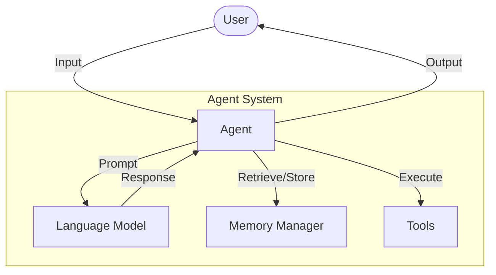
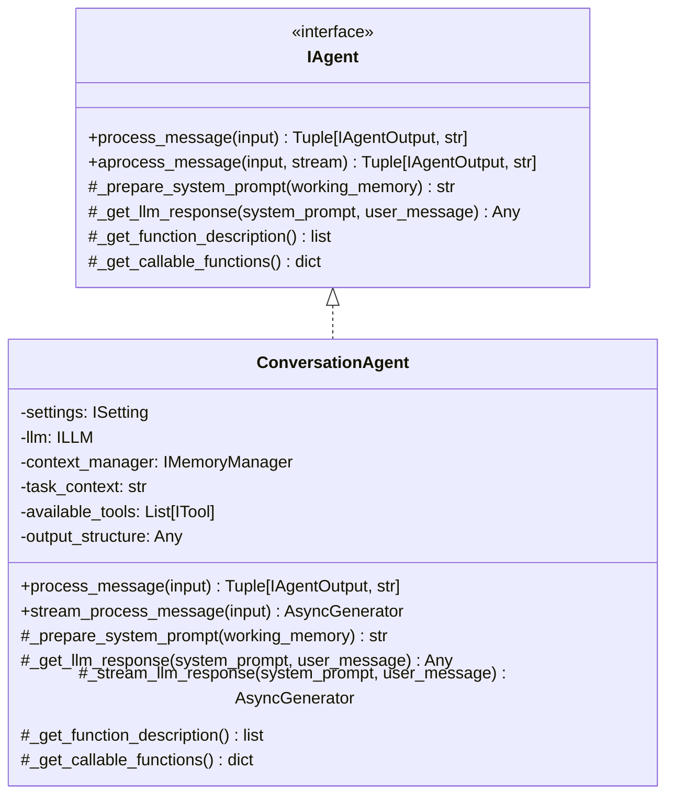
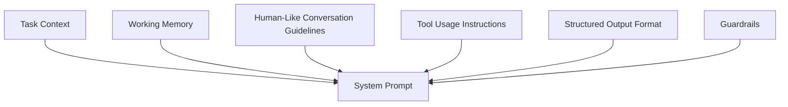
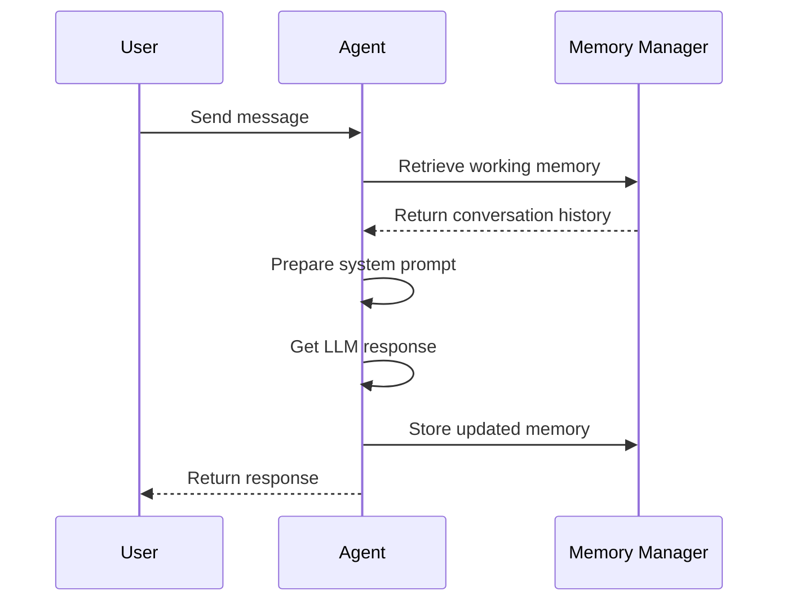

# Agents Module

## Overview

The Agents module forms the core intelligence layer of the Arshai framework, encapsulating interactions with Language Learning Models (LLMs), memory management, and tool usage into purpose-driven interfaces. Agents process user inputs, maintain conversational context, orchestrate LLM interactions, execute appropriate tools, and produce structured responses.



## Architecture

The agent system follows the adapter pattern, with specific agent implementations adapting core LLM capabilities to different use cases while adhering to a common interface.



### Directory Structure

```
agents/
├── __init__.py          # Module initialization and exports
├── conversation.py      # Conversation agent implementation
└── README.md            # Documentation
```

## Key Components

### ConversationAgent

The primary agent implementation for handling user interactions with:
- Dynamic memory management
- Tool usage capabilities
- Structured output formatting
- Async/streaming support
- Human-like conversation patterns

## Implementation Guide

### Agent Configuration

Agents are configured through the `IAgentConfig` interface:

```python
from seedwork.interfaces.iagent import IAgentConfig
from src.tools import SearchTool, CalculatorTool
from src.schemas import ResponseSchema

config = IAgentConfig(
    task_context="You are a helpful assistant that specializes in financial advice.",
    tools=[SearchTool(), CalculatorTool()],
    output_structure=ResponseSchema
)
```

### Creating a Conversation Agent

```python
from seedwork.interfaces.iagent import IAgentInput
from src.agents import ConversationAgent
from src.config.settings import Settings

# Initialize settings
settings = Settings()

# Create conversation agent
agent = ConversationAgent(
    config=config,
    settings=settings
)

# Process a message
response, usage = agent.process_message(
    IAgentInput(
        message="What's the current inflation rate?",
        conversation_id="conversation_123",
        stream=False
    )
)

# Access the response
print(f"Agent response: {response}")
print(f"Token usage: {usage}")
```

### Streaming Support

```python
async def get_streaming_response():
    agent = ConversationAgent(config=config, settings=settings)
    
    async for chunk, usage in agent.stream_process_message(
        IAgentInput(
            message="Explain quantum computing",
            conversation_id="conversation_456",
            stream=True
        )
    ):
        # Handle each chunk of the response
        yield chunk
```

## Integration Points

### System Prompt Composition

The agent dynamically builds a system prompt combining:



### Memory Management Flow



## Advanced Features

### Tool Integration

Agents can execute tools based on LLM decisions:

```python
# Tool definition
tools = [
    SearchTool(),
    WeatherTool(),
    CalculatorTool()
]

# Agent initialization with tools
agent = ConversationAgent(
    config=IAgentConfig(
        task_context="You are a helpful assistant",
        tools=tools
    ),
    settings=settings
)
```

### Structured Output

Agents can enforce structured responses through output schemas:

```python
from pydantic import BaseModel

class ResponseSchema(BaseModel):
    answer: str
    confidence: float
    sources: list[str] = []

# Agent configuration with structured output
config = IAgentConfig(
    task_context="You are a research assistant",
    tools=[],
    output_structure=ResponseSchema
)
```

## Best Practices

1. **Task Context**: Provide clear, detailed instructions in the task context to guide the agent's behavior
2. **Memory Management**: Implement proper memory management for context-aware conversations
3. **Tool Selection**: Only provide tools that are relevant to the agent's purpose
4. **Error Handling**: Implement robust error handling for LLM and tool failures
5. **Prompt Engineering**: Carefully design system prompts for optimal agent performance

## Performance Considerations

- LLM calls are the most time-consuming operations
- Consider token usage and context window limitations
- Implement caching strategies for frequently used information
- Use streaming for responsive user experiences with longer responses 