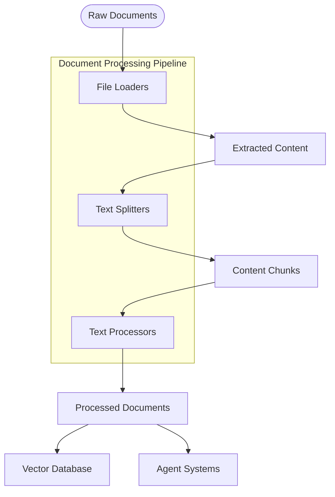
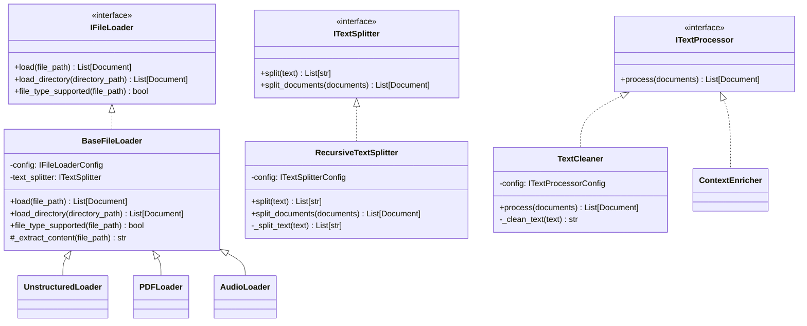

# Document Loaders Module

## Overview

The Document Loaders module provides a modular system for ingesting, processing, and transforming various document formats in the Arshai framework. It follows a multi-stage pipeline approach for document processing, with clear separation between extraction, chunking, and post-processing steps.



## Architecture

The document loading system follows a three-stage architecture:

1. **Extraction/Parsing**: File loaders extract raw content from documents
2. **Chunking/Splitting**: Text splitters break content into manageable chunks
3. **Processing**: Processors transform chunks for specific use cases



### Directory Structure

```
document_loaders/
├── __init__.py               # Module initialization and exports
├── config.py                 # Configuration models for loaders and processors
├── file_loaders/             # File extraction implementations
│   ├── __init__.py           # Submodule initialization
│   ├── base_loader.py        # Abstract base loader class
│   ├── unstructured_loader.py # General-purpose loader using unstructured
│   ├── pdf_loader.py         # PDF-specific loader
│   ├── audio_loader.py       # Audio file loader
│   ├── word_loader.py        # Word document loader
│   ├── powerpoint_loader.py  # PowerPoint loader
│   ├── html_loader.py        # HTML document loader
│   └── excel_loader.py       # Excel spreadsheet loader
├── text_splitters/           # Text splitting implementations
│   ├── __init__.py           # Submodule initialization
│   └── recursive_splitter.py # Recursive text splitting strategy
└── processors/               # Post-processing implementations
    ├── __init__.py           # Submodule initialization
    ├── text_cleaner.py       # Text cleaning and normalization
    ├── context_enricher.py   # Metadata and context enhancement
    └── utils.py              # Processor utilities
```

## Key Components

### File Loaders

File loaders are responsible for extracting raw content from documents:

- **BaseFileLoader**: Abstract base class defining the loader interface
- **UnstructuredLoader**: General-purpose loader using the unstructured library
- **PDFLoader**: Specialized loader for PDF documents
- **AudioLoader**: Loader for audio files with transcription
- **Specialized Loaders**: Word, PowerPoint, HTML, and Excel loaders

### Text Splitters

Text splitters break down document content into manageable chunks:

- **RecursiveTextSplitter**: Splits text based on a hierarchy of delimiters
- Handles various content types and maintains context across chunks

### Processors

Processors apply transformations to document chunks:

- **TextCleaner**: Normalizes and cleans text content
- **ContextEnricher**: Adds additional metadata and context to documents

## Implementation Guide

### Loading and Processing Documents

```python
from src.document_loaders import (
    PDFLoader, 
    RecursiveTextSplitter, 
    TextCleaner,
    ContextEnricher
)

# Initialize components
pdf_loader = PDFLoader()
text_splitter = RecursiveTextSplitter(chunk_size=1000, chunk_overlap=200)
text_cleaner = TextCleaner()
context_enricher = ContextEnricher()

# Process a document
def process_document(file_path):
    # Step 1: Load document and extract content
    documents = pdf_loader.load(file_path)
    
    # Step 2: Split documents into chunks
    chunked_documents = text_splitter.split_documents(documents)
    
    # Step 3: Clean text
    cleaned_documents = text_cleaner.process(chunked_documents)
    
    # Step 4: Enrich with additional context
    processed_documents = context_enricher.process(cleaned_documents)
    
    return processed_documents
```

### Working with Multiple File Types

```python
from src.document_loaders import (
    UnstructuredLoader,
    RecursiveTextSplitter
)

# Create a general-purpose loader with custom configuration
loader = UnstructuredLoader(
    config=UnstructuredLoaderConfig(
        strategy="fast",
        include_metadata=True
    ),
    text_splitter=RecursiveTextSplitter(
        chunk_size=1500,
        chunk_overlap=150
    )
)

# Process multiple file types in a directory
documents = loader.load_directory("path/to/documents/")

# Documents are already chunked thanks to the integrated text splitter
print(f"Loaded {len(documents)} document chunks")
```

### Creating a Custom Processor

```python
from src.document_loaders import ITextProcessor
from seedwork.interfaces.idocument import Document
from typing import List
import re

class KeyphraseExtractor(ITextProcessor):
    """Processor that extracts keyphrases from documents."""
    
    def __init__(self, max_phrases=5):
        self.max_phrases = max_phrases
        
    def process(self, documents: List[Document]) -> List[Document]:
        """Extract keyphrases and add them to document metadata."""
        processed_docs = []
        
        for document in documents:
            # Extract keyphrases (simplified example)
            text = document.page_content
            # This is a simplistic approach - real implementation would use NLP
            potential_phrases = re.findall(r'\b[A-Z][a-z]+ [a-z]+ [a-z]+\b', text)
            keyphrases = potential_phrases[:self.max_phrases]
            
            # Update metadata
            metadata = document.metadata.copy()
            metadata["keyphrases"] = keyphrases
            
            # Create new document with updated metadata
            processed_doc = Document(
                page_content=document.page_content,
                metadata=metadata
            )
            
            processed_docs.append(processed_doc)
            
        return processed_docs
```

## Integration with Vector Databases

```python
from src.document_loaders import PDFLoader, RecursiveTextSplitter
from src.embeddings import OpenAIEmbedding
from src.vector_db import PineconeVectorDB

# Initialize components
pdf_loader = PDFLoader()
text_splitter = RecursiveTextSplitter(chunk_size=1000, chunk_overlap=100)
embedding_model = OpenAIEmbedding()
vector_db = PineconeVectorDB(index_name="knowledge-base")

# Process and index documents
def index_document(file_path):
    # Extract and chunk document
    raw_documents = pdf_loader.load(file_path)
    chunked_documents = text_splitter.split_documents(raw_documents)
    
    # Create embeddings for each chunk
    documents_with_embeddings = []
    for doc in chunked_documents:
        embedding = embedding_model.embed_query(doc.page_content)
        documents_with_embeddings.append({
            "id": doc.metadata.get("document_id"),
            "content": doc.page_content,
            "metadata": doc.metadata,
            "embedding": embedding
        })
    
    # Store in vector database
    vector_db.add_documents(documents_with_embeddings)
    
    return f"Indexed {len(documents_with_embeddings)} chunks from {file_path}"
```

## Best Practices

1. **Chunking Strategy**: 
   - Choose appropriate chunk sizes based on your embedding model's context window
   - Use appropriate chunk overlap to maintain context across chunks
   - Consider content structure when selecting splitting strategy

2. **Document Processing**:
   - Apply text cleaning before other processing steps
   - Preserve important metadata throughout the pipeline
   - Use modular processors that can be composed in different orders

3. **Performance Considerations**:
   - Some file types (like PDFs with scanned pages) may require OCR and be slower to process
   - Batch document processing for large collections
   - Consider parallel processing for large document sets

4. **Error Handling**:
   - Implement robust error handling for corrupted files
   - Have fallback strategies for different file types
   - Log processing issues for later inspection 