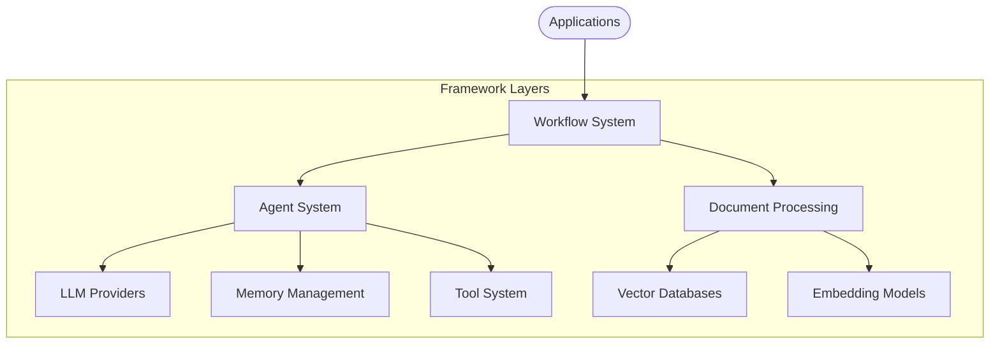
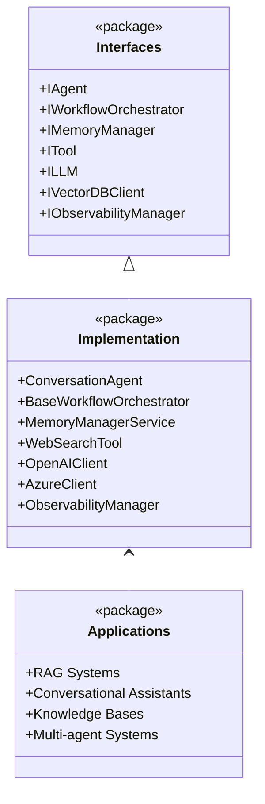
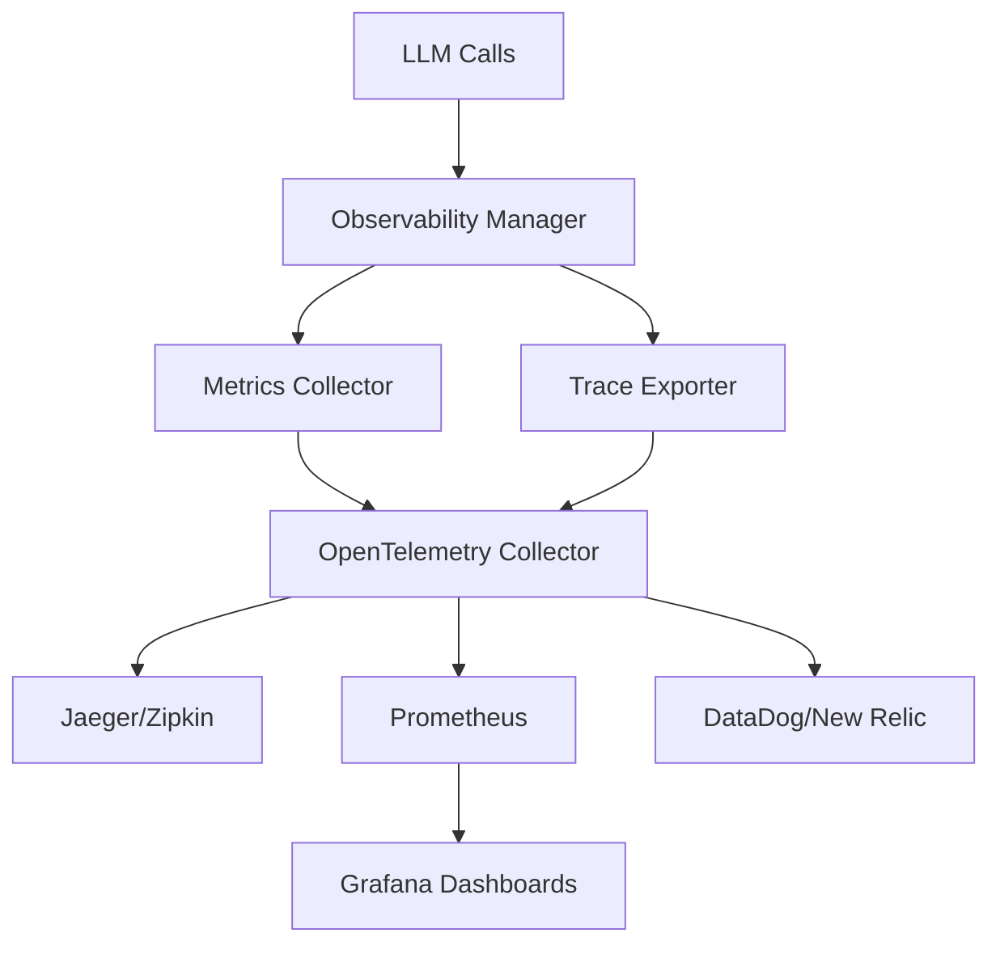

# Arshai

A powerful AI application framework for building complex, intelligent systems with conversational agents, workflow orchestration, and advanced memory management.



## Overview

Arshai is designed to empower developers to build sophisticated AI applications by providing a flexible, modular framework based on clean architecture principles. At its core, Arshai follows an interface-first design that enables easy extension, customization, and implementation of complex AI systems.

### Key Features

- **Agent Framework**: Create intelligent conversational agents with advanced memory management
- **Workflow Orchestration**: Design complex multi-agent systems with directed graph workflows
- **Memory Management**: Implement sophisticated conversation memory with multiple storage options
- **Tool Integration**: Extend agent capabilities with custom tools and external integrations
- **LLM Integration**: Connect with leading LLM providers (OpenAI, Azure OpenAI, Google Gemini, OpenRouter) with progressive streaming, unified function interface, and comprehensive architecture documentation
- **Observability System**: Comprehensive monitoring and instrumentation for LLM interactions with OpenTelemetry support
- **RAG Capabilities**: Build powerful retrieval-augmented generation systems with document processing
- **Structured Outputs**: Enforce structured responses with schema validation
- **Streaming Support**: Enable real-time streaming responses with token-level performance tracking

## Architecture

Arshai implements a clean, layered architecture with clear separation of concerns:



### Core Components

#### Workflow System

The orchestration layer that manages the flow of execution between agents:
- **Workflow Runner**: Interface for executing workflows
- **Workflow Orchestrator**: Manages node execution and state management
- **Nodes**: Wrappers around agents that adapt them for specific business requirements
- **Workflow State**: Carries data and context between nodes

#### Agent System

The intelligent components that process information and make decisions:
- **Conversational Agent**: Primary agent implementation for handling user interactions
- **Memory Integration**: Contextual awareness through working memory
- **Tool Usage**: Tool calling capabilities for extended functionality
- **Response Structuring**: Schema-based response structuring

#### Memory Management

The system that manages conversation context and knowledge:
- **Memory Manager Service**: Orchestrates different memory types
- **Working Memory**: Stores and retrieves conversation context
- **Multiple Providers**: In-memory and Redis implementations

#### Tool System

Extends agent capabilities with specific functionalities:
- **Web Search Tool**: Retrieve information from the web
- **Knowledge Base Tool**: Query vector databases for relevant information
- **Custom Tool Support**: Framework for developing new tools

#### LLM Integration

Connects to large language models through a unified, production-ready architecture:

**Providers & Capabilities:**
- **OpenAI Provider**: Direct API integration with delta streaming
- **Azure Provider**: Enterprise deployment with native structured parsing  
- **Google Gemini Provider**: Native SDK integration with dual authentication
- **OpenRouter Provider**: HTTP proxy access to multiple models with safe connection handling
- **Anthropic Provider**: Integration with Claude models (via OpenRouter)

**Advanced Architecture Features:**
- **Progressive Streaming**: Real-time function execution during streaming for optimal performance
- **Unified Function Interface**: Consistent callable-based approach across all providers
- **Background Tasks**: Fire-and-forget execution for logging, notifications, and analytics
- **Multi-Turn Conversations**: Intelligent conversation management with context preservation
- **Error Resilience**: Graceful handling of function failures with context for model recovery
- **Usage Tracking**: Standardized token usage monitoring across all providers

**Framework Benefits:**
- **Behavioral Consistency**: All providers implement identical interfaces
- **Easy Extension**: Add new providers with minimal code (5 abstract methods)
- **Production Ready**: Comprehensive error handling, usage tracking, and observability
- **Developer Experience**: Clear patterns, extensive documentation, and troubleshooting guides

#### Observability System

Production-ready monitoring and instrumentation for AI systems with OpenTelemetry integration:

**Key Metrics (Zero-Fallback Monitoring)**:
- `llm_time_to_first_token_seconds` - Latency from request start to first token
- `llm_time_to_last_token_seconds` - Total response generation time
- `llm_duration_first_to_last_token_seconds` - Token generation duration
- `llm_completion_tokens` - Accurate token counting per provider

**Enterprise Features**:
- **OpenTelemetry Native**: Export to Jaeger, Prometheus, Datadog, New Relic, any OTLP backend
- **LLM Usage Data Integration**: Direct usage from LLM responses for accurate token counts
- **Streaming Observability**: Real-time token-level timing for streaming responses
- **Non-Intrusive Design**: Zero side effects on LLM calls with graceful degradation
- **Factory Integration**: Automatic instrumentation through LLMFactory
- **YAML Configuration**: Production-ready configuration management
- **Privacy Controls**: Configurable prompt/response logging with length limits
- **Performance Optimization**: Async methods for high-throughput scenarios

## Getting Started

### Installation

```bash
# Install with pip
pip install arshai

# Or with Poetry (recommended)
poetry add arshai

# With optional dependencies
pip install arshai[all]          # All features: redis, milvus, flashrank, observability
pip install arshai[observability] # OpenTelemetry observability features
pip install arshai[redis]        # Redis memory backend
pip install arshai[milvus]       # Milvus vector database
pip install arshai[flashrank]    # FlashRank reranking
```

#### Observability Dependencies

For comprehensive observability features:

```bash
# Core OpenTelemetry packages
pip install opentelemetry-api opentelemetry-sdk

# OTLP exporters (choose based on your backend)
pip install opentelemetry-exporter-otlp-proto-grpc  # For Jaeger, DataDog, etc.
pip install opentelemetry-exporter-otlp-proto-http  # HTTP OTLP export

```

### Quick Start

Create a conversational agent:

```python
from arshai import Settings, IAgentConfig, IAgentInput

# Initialize settings
settings = Settings()

# Create agent configuration
agent_config = IAgentConfig(
    task_context="You are a helpful assistant that specializes in Python programming.",
    tools=[]
)

# Create conversation agent
agent = settings.create_agent("conversation", agent_config)

# Process a message
response, usage = agent.process_message(
    IAgentInput(
        message="How do I use list comprehensions in Python?",
        conversation_id="conversation_123"
    )
)

print(f"Agent response: {response}")
```

### Building a Workflow

Create a simple workflow with multiple agents:

```python
from arshai import (
    Settings, 
    WorkflowRunner, 
    BaseWorkflowConfig,
    IWorkflowState, 
    IUserContext
)

# Initialize settings
settings = Settings()

# Define workflow configuration
class QAWorkflow(BaseWorkflowConfig):
    def _create_nodes(self):
        return {
            "query_router": self._create_router_node(),
            "research_agent": self._create_research_node(),
            "synthesizer": self._create_synthesis_node()
        }
    
    def _define_edges(self):
        return {
            "query_router": {
                "research": "research_agent"
            },
            "research_agent": "synthesizer"
        }
    
    def _route_input(self, input_data):
        return "research"

# Create workflow runner
workflow_config = QAWorkflow(settings)
workflow_runner = WorkflowRunner(workflow_config)

# Initialize state
user_context = IUserContext(user_id="user123")
initial_state = IWorkflowState(user_context=user_context)

# Run workflow
result = workflow_runner.run({
    "message": "What are the environmental impacts of electric vehicles?",
    "state": initial_state
})

print(result.get("response", ""))
```

### Using Tools with LLM Direct Integration

Extend functionality with the unified function interface:

```python
from arshai.llms.openai import OpenAIClient
from arshai.core.interfaces.illm import ILLMConfig, ILLMInput

# Initialize LLM client
config = ILLMConfig(model="gpt-4o", temperature=0.7)
client = OpenAIClient(config)

# Define functions that can be called by the LLM
def get_weather(location: str) -> str:
    """Get current weather for a location."""
    return f"Weather in {location}: 22°C, sunny"

def log_interaction(action: str, user_id: str = "anonymous") -> None:
    """BACKGROUND TASK: Log user interaction for analytics.
    This runs independently without affecting the conversation."""
    print(f"📊 Logged: {action} by {user_id}")

# LLM with unified function interface
input_data = ILLMInput(
    system_prompt="You are a helpful assistant with access to weather data.",
    user_message="What's the weather like in Tokyo? Also please log this request.",
    regular_functions={"get_weather": get_weather},      # Returns results to conversation
    background_tasks={"log_interaction": log_interaction} # Fire-and-forget execution
)

# Progressive streaming with real-time function execution
async for chunk in client.stream(input_data):
    if chunk.get("llm_response"):
        print(chunk["llm_response"], end="", flush=True)

# Functions execute immediately during streaming, not after completion
```

### Observability and Monitoring

Monitor your AI system's performance with comprehensive observability and OpenTelemetry integration:

#### Quick Start with Observability

```python
from arshai.core.interfaces.illm import ILLMConfig, ILLMInput
from src.factories.llm_factory import LLMFactory
from arshai.observability import ObservabilityConfig

# Configure observability from YAML
config = ObservabilityConfig.from_yaml("config.yaml")

# Create LLM client with automatic observability
llm_config = ILLMConfig(model="gpt-4", temperature=0.7)
client = LLMFactory.create_with_observability(
    provider="openai",
    config=llm_config,
    observability_config=config
)

# All calls are automatically instrumented with zero side effects
input_data = ILLMInput(
    system_prompt="You are a helpful assistant.",
    user_message="Explain machine learning in simple terms."
)

response = client.chat_completion(input_data)
# Four key metrics automatically collected:
# ✅ llm_time_to_first_token_seconds - Latency tracking
# ✅ llm_time_to_last_token_seconds - Total response time
# ✅ llm_duration_first_to_last_token_seconds - Generation duration
# ✅ llm_completion_tokens - Accurate token counting

print(f"Response: {response['llm_response']}")
```

#### Streaming Observability

```python
# Streaming responses with real-time token timing
async for chunk in client.stream_completion(input_data):
    if chunk.get('llm_response'):
        print(chunk['llm_response'], end='', flush=True)
    
    # Final chunk contains usage metrics
    if chunk.get('usage'):
        usage = chunk['usage']
        print(f"\n📊 Tokens: {usage.total_tokens}")
        # All timing metrics automatically captured during streaming
```

#### Production Configuration

```yaml
# config.yaml - Production-ready observability setup
observability:
  # Service identification
  service_name: "my-ai-app"
  service_version: "1.0.0"
  environment: "production"
  
  # Core controls (always enabled - no fallbacks)
  trace_requests: true
  collect_metrics: true
  track_token_timing: true
  
  # OpenTelemetry export (works with any OTLP backend)
  otlp_endpoint: "http://localhost:4317"  # Jaeger, DataDog, New Relic, etc.
  otlp_timeout: 10
  
  # Privacy controls (recommended for production)
  log_prompts: false
  log_responses: false
  max_prompt_length: 1000
  max_response_length: 1000
  
  # Performance tuning
  metric_export_interval: 60
  trace_sampling_rate: 0.1  # 10% sampling
  
  # Provider-specific configuration
  provider_configs:
    openai:
      track_token_timing: true
    anthropic:
      track_token_timing: true
    google:
      track_token_timing: false  # Disable for specific providers
```

#### End-to-End Testing

The observability system includes comprehensive testing infrastructure:

```bash
# Run complete end-to-end tests with real observability backends
cd tests/e2e/observability/
export OPENAI_API_KEY="your-key"
./run_test.sh

# Services will be available at:
# • Jaeger (Traces): http://localhost:16686
# • Prometheus (Metrics): http://localhost:9090  
# • Grafana (Dashboards): http://localhost:3000
```

#### Manual Observability Manager

For advanced use cases:

```python
from arshai.observability import ObservabilityManager

# Manual timing context
obs_manager = ObservabilityManager(config)

async with obs_manager.observe_streaming_llm_call("openai", "gpt-4", "custom_call") as timing:
    # Your LLM interaction here
    response = await your_llm_call()
    
    # Manual timing recording
    timing.record_first_token()
    timing.record_token()
    
    # Update with usage data from LLM response
    await obs_manager.record_usage_data(timing, response['usage'])
    
    print(f"Time to first token: {timing.time_to_first_token:.3f}s")
    print(f"Total tokens: {timing.total_tokens}")
```

### Using Plugins

Extend Arshai with custom plugins:

```python
from arshai.extensions import load_plugin

# Load a custom plugin
plugin = load_plugin("my_custom_plugin", config={
    "api_key": "your_secret_key"
})

# Use plugin's tools with agents
custom_tool = plugin.get_tool("specialized_tool")
agent_config = IAgentConfig(
    task_context="Agent with custom capabilities",
    tools=[custom_tool]
)
```

## Observability and Monitoring

Arshai provides enterprise-grade observability for production AI systems with comprehensive OpenTelemetry integration and zero-fallback monitoring.

### 🎯 Key Features

- **Zero-Fallback Monitoring**: Always capture the 4 critical LLM metrics without any fallback mechanisms
- **OpenTelemetry Native**: Export to any OTLP-compatible backend (Jaeger, Prometheus, Datadog, New Relic)
- **LLM Usage Data Integration**: Accurate token counting from LLM response usage data
- **Streaming Observability**: Real-time token-level timing for streaming responses
- **Non-Intrusive Design**: Zero side effects on LLM calls with graceful degradation
- **Production-Ready**: Comprehensive configuration, privacy controls, and performance optimization

### 📊 The Four Key Metrics

Every LLM interaction automatically captures these critical performance metrics:

| Metric | Description | Use Case |
|--------|-------------|----------|
| `llm_time_to_first_token_seconds` | Latency from request start to first token | User experience, response time SLAs |
| `llm_time_to_last_token_seconds` | Total response generation time | End-to-end performance monitoring |
| `llm_duration_first_to_last_token_seconds` | Token generation duration | Throughput analysis, model performance |
| `llm_completion_tokens` | Accurate completion token count | Cost tracking, usage monitoring |

### 🏗️ Architecture



### 🚀 Quick Setup

#### 1. Basic Configuration

```yaml
# config.yaml
observability:
  service_name: "my-ai-service"
  track_token_timing: true
  otlp_endpoint: "http://localhost:4317"
```

#### 2. Factory Integration

```python
from src.factories.llm_factory import LLMFactory
from arshai.observability import ObservabilityConfig

config = ObservabilityConfig.from_yaml("config.yaml")
client = LLMFactory.create_with_observability(
    provider="openai",
    config=llm_config,
    observability_config=config
)

# All calls automatically instrumented
response = client.chat_completion(input_data)
```

#### 3. Verify Data Collection

```bash
# Start observability stack
cd tests/e2e/observability/
docker-compose up -d

# View metrics: http://localhost:9090
# View traces: http://localhost:16686
# View dashboards: http://localhost:3000
```

### 📈 Supported Backends

#### Metrics Backends
- **Prometheus** + Grafana
- **DataDog** (via OTLP)
- **New Relic** (via OTLP)
- **AWS CloudWatch** (via OTLP)
- **Azure Monitor** (via OTLP)
- **Google Cloud Monitoring** (via OTLP)

#### Tracing Backends
- **Jaeger**
- **Zipkin**
- **DataDog APM**
- **New Relic Distributed Tracing**
- **AWS X-Ray**
- **Azure Application Insights**

### 🔧 Advanced Configuration

#### Provider-Specific Settings

```yaml
observability:
  provider_configs:
    openai:
      track_token_timing: true
    anthropic:
      track_token_timing: true
    google:
      track_token_timing: false  # Disable for specific providers
```

#### Privacy and Security

```yaml
observability:
  # Privacy controls (recommended for production)
  log_prompts: false
  log_responses: false
  max_prompt_length: 1000
  max_response_length: 1000
  
  # Custom attributes (avoid sensitive data)
  custom_attributes:
    team: "ai-platform"
    environment: "production"
```

#### Performance Tuning

```yaml
observability:
  # High-throughput settings
  metric_export_interval: 30
  trace_sampling_rate: 0.05  # 5% sampling
  max_span_attributes: 64
  
  # Async processing for better performance
  non_intrusive: true
```

### 🧪 Testing and Development

#### End-to-End Test Suite

```bash
# Complete observability testing with real backends
cd tests/e2e/observability/
export OPENAI_API_KEY="your-key"
./run_test.sh

# Tests verify:
# ✅ All 4 key metrics collected
# ✅ OTLP export working
# ✅ Multiple provider support
# ✅ Streaming observability
# ✅ No side effects on LLM calls
```

#### Development Setup

```yaml
# Development configuration
observability:
  service_name: "arshai-dev"
  environment: "development"
  
  # Debug settings
  log_prompts: true
  log_responses: true
  trace_sampling_rate: 1.0  # 100% sampling
  
  # Local OTLP collector
  otlp_endpoint: "http://localhost:4317"
```

### 📚 Production Deployment

#### Docker Compose for Production

The `tests/e2e/observability/docker-compose.yml` provides a production-ready template:

```bash
# Production observability stack
docker-compose -f tests/e2e/observability/docker-compose.yml up -d

# Includes:
# - OpenTelemetry Collector
# - Jaeger for distributed tracing
# - Prometheus for metrics collection
# - Grafana with pre-built dashboards
```

#### Kubernetes Deployment

```yaml
# Example Kubernetes configuration
apiVersion: v1
kind: ConfigMap
metadata:
  name: observability-config
data:
  config.yaml: |
    observability:
      service_name: "arshai-prod"
      otlp_endpoint: "http://otel-collector:4317"
      track_token_timing: true
      log_prompts: false
      log_responses: false
```

### 🔍 Monitoring and Alerting

#### Key Metrics to Monitor

```promql
# Prometheus queries for monitoring
# Average time to first token
histogram_quantile(0.95, rate(llm_time_to_first_token_seconds_bucket[5m]))

# Token throughput
rate(llm_completion_tokens[5m])

# Error rate
rate(llm_requests_failed[5m]) / rate(llm_requests_total[5m])

# Active requests
llm_active_requests
```

#### Grafana Dashboard

Pre-built dashboards available in `tests/e2e/observability/dashboards/`:
- **LLM Performance**: Token timing metrics with percentiles
- **Cost Tracking**: Token usage and provider distribution
- **Error Monitoring**: Failed requests and error patterns
- **Throughput Analysis**: Request rates and concurrent processing

### 🔗 Integration Examples

#### With Existing Monitoring

```python
# Custom metrics alongside Arshai observability
from arshai.observability import ObservabilityManager
from prometheus_client import Counter, Histogram

# Your existing metrics
business_requests = Counter('business_requests_total', 'Business requests')
user_satisfaction = Histogram('user_satisfaction_score', 'User satisfaction')

# Arshai observability (automatic LLM metrics)
obs_config = ObservabilityConfig.from_yaml("config.yaml")
client = LLMFactory.create_with_observability("openai", llm_config, obs_config)

# Both systems work together
business_requests.inc()
response = client.chat_completion(input_data)  # LLM metrics automatic
user_satisfaction.observe(calculate_satisfaction(response))
```

## Examples

Explore the `examples/` directory for complete working examples:

- `basic_usage.py`: Demonstrates core agent functionality
- `simple_workflow.py`: Shows basic workflow construction
- `advanced_workflow.py`: Builds complex multi-agent workflows
- `file_indexing_example.py`: Demonstrates document processing and indexing
- `rag_system_usage.py`: Implements retrieval-augmented generation
- `llm_observability_example.py`: Comprehensive observability system usage with real backends
- `observability_usage_example.py`: Advanced observability patterns and custom metrics
- `configuration.py`: Shows configuration management techniques

### **📖 LLM Architecture Examples**

See the comprehensive LLM documentation for detailed examples:
- **Progressive streaming** with real-time function execution
- **Background tasks** for logging and notifications  
- **Multi-provider implementations** with consistent interfaces
- **Error handling patterns** and troubleshooting guides
- **Performance optimization** techniques

## Component Documentation

Each major component has its own detailed documentation:

- [Agents System](src/agents/README.md)
- [Memory Management](src/memory/README.md)
- [LLM Integration](arshai/llms/README.md) - **Comprehensive implementation guide with critical notes**
- [Observability System](arshai/observability/README.md)
- [Tools System](src/tools/README.md)
- [Workflow System](src/workflows/README.md)

### **📚 Complete LLM Documentation**

For comprehensive understanding of the LLM architecture:

- **[Technical Architecture](docs/technical/llm_architecture.md)**: Complete architectural overview with design decisions and rationale
- **[User Guide](docs/guides/llm_usage.md)**: Practical examples and usage patterns for all providers
- **[Contributing Guide](docs/contributing/llm_providers.md)**: Step-by-step implementation guide for new providers
- **[Implementation README](arshai/llms/README.md)**: Critical implementation notes and troubleshooting

## Real-World Applications

Arshai has been used to build several production systems:

1. **Chetor Assistant**: An AI conversational system with integrated knowledge organization
2. **Petro RAG**: A specialized RAG system for the petroleum industry

## Configuration

Arshai uses a flexible configuration system that can be customized through:

- Environment variables
- Configuration files (YAML, JSON)
- Direct settings injection

Example configuration:

```yaml
# config.yaml - Complete Arshai configuration
llm:
  provider: openai
  model: gpt-4
  temperature: 0.7

memory:
  working_memory:
    provider: redis
    ttl: 86400

# Comprehensive observability configuration
observability:
  # Service identification
  service_name: "arshai-app"
  service_version: "1.0.0"
  environment: "production"
  
  # Core monitoring (always enabled)
  trace_requests: true
  collect_metrics: true
  track_token_timing: true
  
  # OpenTelemetry export
  otlp_endpoint: "http://localhost:4317"
  otlp_timeout: 10
  
  # Privacy controls (recommended for production)
  log_prompts: false
  log_responses: false
  max_prompt_length: 1000
  max_response_length: 1000
  
  # Provider-specific settings
  provider_configs:
    openai:
      track_token_timing: true
    anthropic:
      track_token_timing: true
    google:
      track_token_timing: false
  
  # Performance tuning
  metric_export_interval: 60
  trace_sampling_rate: 0.1

workflows:
  debug_mode: true
```

## Extension Points

Arshai v0.2.0 introduces a powerful plugin system for extensibility:

### Plugin System

Create and distribute custom plugins:

```python
from arshai.extensions.base import Plugin, PluginMetadata
from arshai.extensions.hooks import hook, HookType

class MyPlugin(Plugin):
    def get_metadata(self):
        return PluginMetadata(
            name="my_plugin",
            version="1.0.0",
            author="Your Name",
            description="Custom plugin for specialized tasks"
        )
    
    def initialize(self):
        # Set up your plugin
        pass
    
    def shutdown(self):
        # Clean up resources
        pass

# Add hooks to extend behavior
@hook(HookType.BEFORE_AGENT_PROCESS)
def custom_preprocessing(context):
    # Modify agent input before processing
    pass
```

### Extension Methods

1. **Plugin System**: Create reusable plugins with tools, hooks, and providers
2. **Custom Agents**: Implement the `IAgent` interface for specialized agents
3. **Custom Tools**: Add new capabilities by implementing the `ITool` interface
4. **Hook System**: Extend behavior without modifying core code
5. **Custom Nodes**: Create specialized workflow nodes for business logic
6. **New LLM Providers**: Add support for new LLM providers by implementing the `ILLM` interface
7. **Custom Memory Providers**: Implement new storage backends with the `IMemoryManager` interface

## Migration from v0.1.x

If you're upgrading from an older version of Arshai:

1. **Read the [Migration Guide](MIGRATION_GUIDE.md)** for detailed instructions
2. **Use the migration script** for automatic import updates:
   ```bash
   python scripts/migrate_imports.py --path /path/to/your/project
   ```
3. **Enable compatibility mode** for gradual migration:
   ```python
   from arshai.compat import enable_compatibility_mode
   enable_compatibility_mode()
   ```

## What's New in v0.2.0

- 🏗️ **Unified package structure** under `arshai` namespace
- 🔌 **Plugin system** for easy extensibility
- 🪝 **Hook system** for behavior customization
- 📦 **PyPI distribution** for easy installation
- 🔄 **Backward compatibility** layer for smooth migration
- 📚 **Enhanced documentation** and examples
- 🧪 **Improved testing** and CI/CD

## Contributing

Contributions are welcome! Please check out our [Contributing Guidelines](CONTRIBUTING.md) for details on our code of conduct and the process for submitting pull requests.

## License

This project is licensed under the MIT License - see the [LICENSE](LICENSE) file for details. 