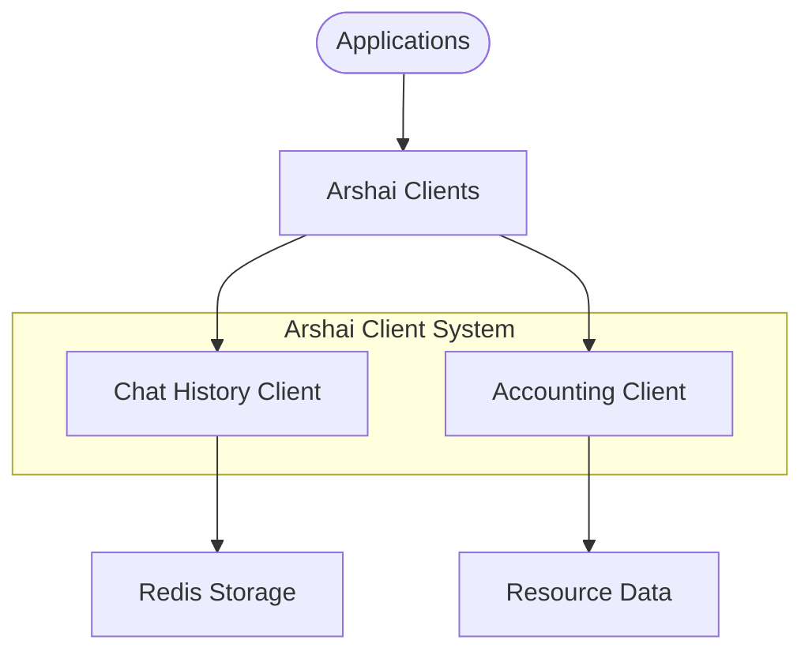
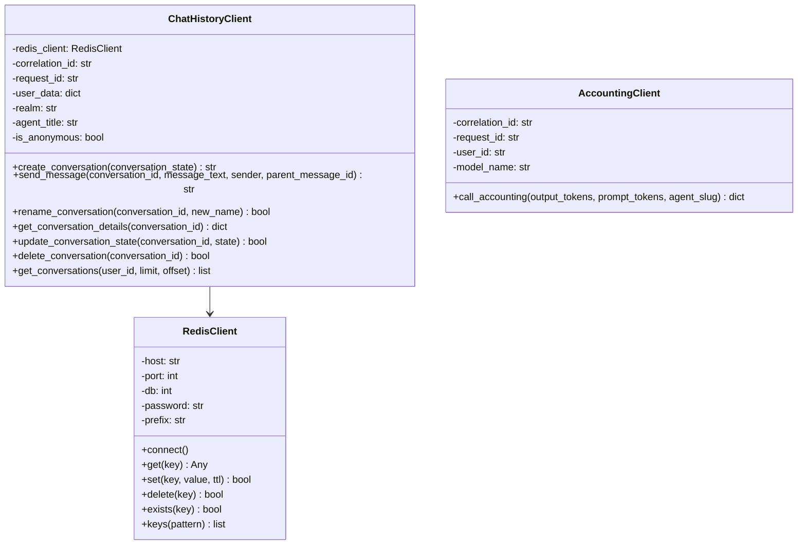

# Arshai Clients Module

## Overview

The Arshai Clients module provides specialized client implementations for interacting with Arshai-specific services, including chat history management and usage accounting. These clients enable applications to track conversations, persist message history, and monitor resource usage.



## Architecture

The Arshai client system follows a clean interface pattern to standardize interactions with backend services:



### Directory Structure

```
clients/arshai/
├── __init__.py              # Module initialization and exports
├── chat_history_client.py   # Chat history management client
├── accounting.py            # Usage accounting client
└── README.md                # Documentation
```

## Key Components

### ChatHistoryClient

The ChatHistoryClient provides conversation history management capabilities:

- **Conversation Creation**: Create and initialize new conversations
- **Message Management**: Store and retrieve conversation messages
- **Conversation Metadata**: Manage conversation names, states, and other metadata
- **User Association**: Link conversations with user identities
- **Conversation Listing**: Retrieve all conversations for a user

### AccountingClient

The AccountingClient tracks resource usage and costs:

- **Token Accounting**: Record input and output token usage
- **Model Association**: Track usage per AI model
- **Agent Attribution**: Associate usage with specific agent implementations
- **User Attribution**: Track usage per user for billing and analytics

## Implementation Guide

### Using ChatHistoryClient

```python
from src.clients.arshai.chat_history_client import ChatHistoryClient

# Initialize the chat history client
chat_history = ChatHistoryClient(
    correlation_id="correlation-123",
    request_id="request-456",
    user_data={
        "user_id": "user123",
        "details": {
            "given_name": "John",
            "family_name": "Doe"
        }
    },
    realm="production",
    agent_title="Customer Support Agent",
    is_anonymous=False
)

# Create a new conversation
conversation_id = await chat_history.create_conversation(
    conversation_state="normal"
)

# Send user message
user_message_id = await chat_history.send_message(
    conversation_id=conversation_id,
    message_text="How can I reset my password?",
    sender="end_user",
    parent_message_id=None,
    metadata={"source": "web"}
)

# Send assistant response
assistant_message_id = await chat_history.send_message(
    conversation_id=conversation_id,
    message_text="You can reset your password by clicking on 'Forgot Password' on the login page.",
    sender="assistant",
    parent_message_id=user_message_id,
    metadata={"confidence": 0.95}
)

# Get conversation details
conversation = await chat_history.get_conversation_details(
    conversation_id=conversation_id
)

# Update conversation name
await chat_history.rename_conversation(
    conversation_id=conversation_id,
    new_name="Password Reset Help"
)
```

### Using AccountingClient

```python
from src.clients.arshai.accounting import AccountingClient

# Initialize the accounting client
accounting = AccountingClient(
    correlation_id="correlation-123",
    request_id="request-456",
    user_id="user123"
)

# Set the model name
accounting.model_name = "gpt-4"

# Log usage after request completion
usage_record = await accounting.call_accounting(
    output_tokens=150,
    prompt_tokens=250,
    agent_slug="customer-support"
)

print(f"Usage recorded: {usage_record}")
```

## Integration with Agents

The Arshai clients are typically used in agent workflows for tracking conversations and usage:

```python
from src.agents import ConversationAgent
from src.clients.arshai.chat_history_client import ChatHistoryClient
from src.clients.arshai.accounting import AccountingClient

# Initialize clients
chat_history = ChatHistoryClient(
    correlation_id="correlation-123",
    request_id="request-456",
    user_data={"user_id": "user123"}
)

accounting = AccountingClient(
    correlation_id="correlation-123",
    request_id="request-456",
    user_id="user123"
)

# Create agent
agent = ConversationAgent(
    config=agent_config,
    settings=settings
)

# Process user message
async def process_user_message(conversation_id, message_text):
    # Store user message
    user_message_id = await chat_history.send_message(
        conversation_id=conversation_id,
        message_text=message_text,
        sender="end_user",
        parent_message_id=None
    )
    
    # Process with agent
    response, usage = agent.process_message(message_text)
    
    # Store assistant response
    assistant_message_id = await chat_history.send_message(
        conversation_id=conversation_id,
        message_text=response,
        sender="assistant",
        parent_message_id=user_message_id
    )
    
    # Record token usage
    await accounting.call_accounting(
        output_tokens=usage.completion_tokens,
        prompt_tokens=usage.prompt_tokens,
        agent_slug="conversation"
    )
    
    return response
```

## Configuration

The Arshai clients depend on proper Redis configuration:

```python
# Redis connection through environment variables
REDIS_HOST = os.getenv("REDIS_HOST", "localhost")
REDIS_PORT = int(os.getenv("REDIS_PORT", "6379"))
REDIS_DB = int(os.getenv("REDIS_DB", "0"))
REDIS_PASSWORD = os.getenv("REDIS_PASSWORD", "")
REDIS_PREFIX = os.getenv("REDIS_PREFIX", "arshai:")
```

## Best Practices

1. **Error Handling**:
   - Implement proper error handling for Redis connection issues
   - Ensure graceful degradation when history services are unavailable
   - Log connection issues for debugging

2. **Data Management**:
   - Set appropriate TTL values for conversation data
   - Implement data retention policies
   - Consider GDPR and privacy requirements for conversation storage

3. **Security Considerations**:
   - Secure Redis connection with appropriate authentication
   - Encrypt sensitive data before storage
   - Implement proper access controls 