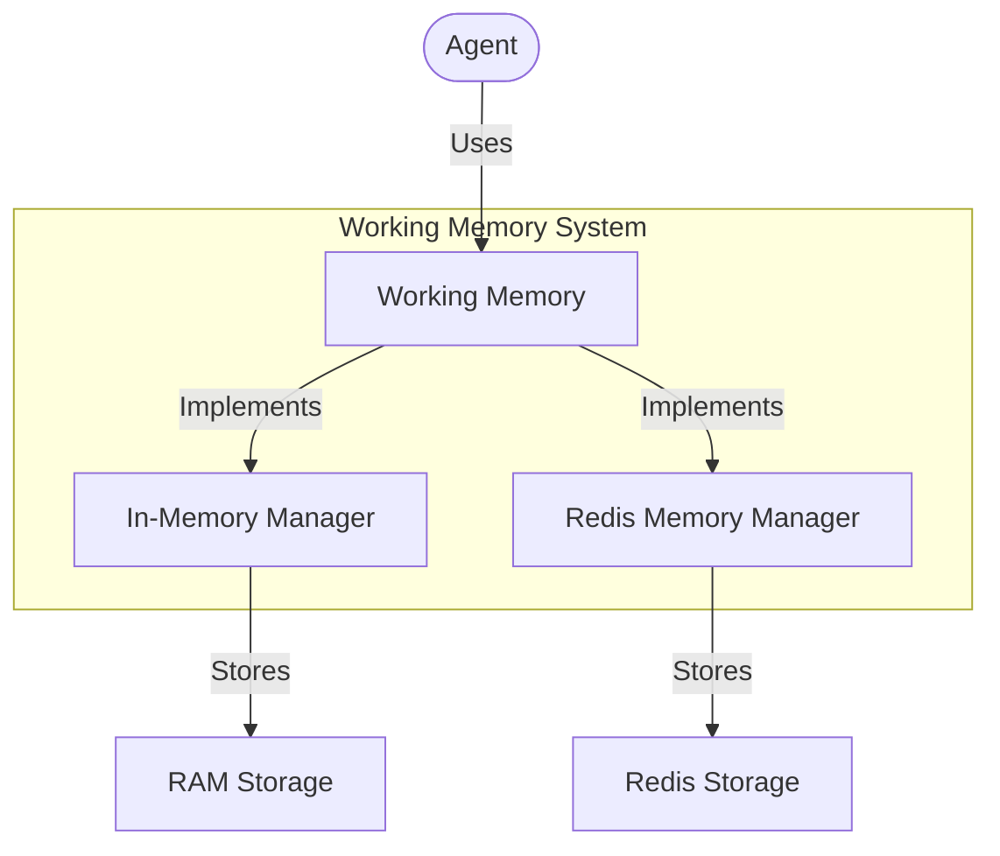
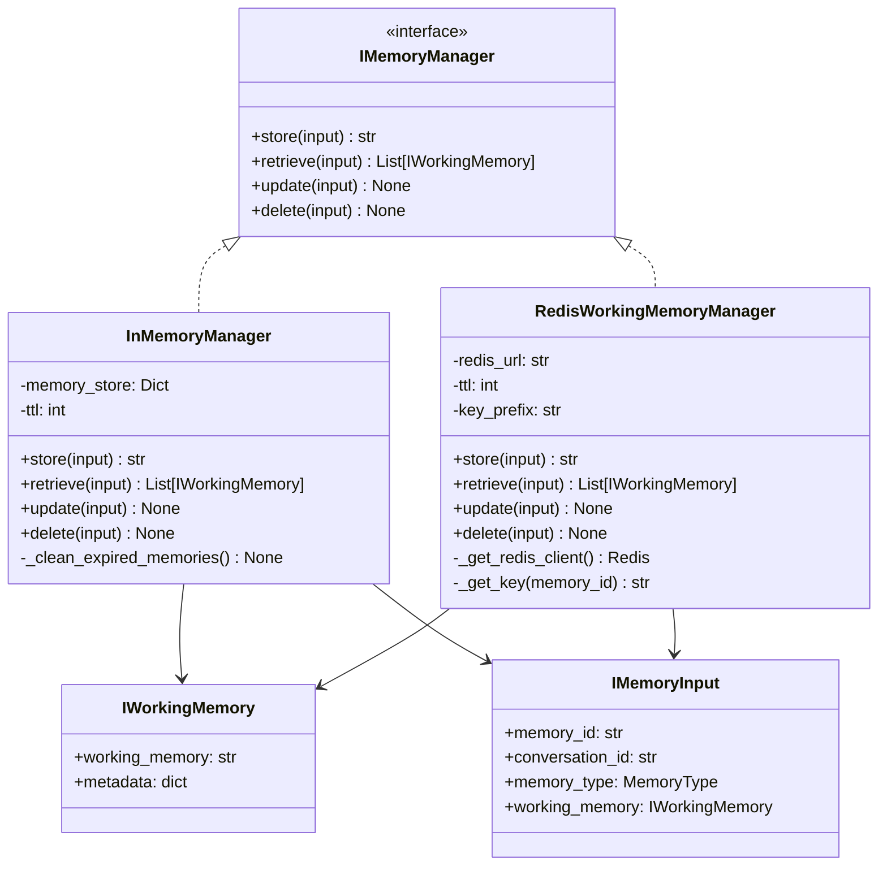

# Working Memory Module

## Overview

The Working Memory module provides implementations of memory managers for storing and retrieving conversational state in the Arshai framework. Working memory is a critical component for maintaining context in conversations between agents and users, enabling contextual understanding and coherent responses across interactions.



## Architecture

The working memory system follows a clean interface pattern with provider-specific implementations:



## Implementation Details

### InMemoryManager

The `InMemoryManager` provides a lightweight, non-persistent memory implementation:

- Uses an in-memory dictionary for storage
- Supports TTL (Time-To-Live) for automatic expiration
- Includes periodic cleanup of expired memories
- Ideal for development, testing, and stateless applications

### RedisWorkingMemoryManager

The `RedisWorkingMemoryManager` provides a persistent, scalable memory implementation:

- Uses Redis for distributed, persistent storage
- Leverages Redis TTL functionality for automatic expiration
- Handles serialization and deserialization of memory objects
- Ideal for production deployments and stateful applications

## Usage Examples

### Using InMemoryManager

```python
from seedwork.interfaces.imemorymanager import IMemoryInput, IWorkingMemory, MemoryType
from src.memory.working_memory import InMemoryManager

# Create memory manager
memory_manager = InMemoryManager(ttl=3600)  # 1 hour TTL

# Create working memory instance
working_memory = IWorkingMemory(
    working_memory="""
    USER PROFILE:
    Name: John Doe
    
    AGENT PROFILE:
    Role: Technical Assistant
    
    CONVERSATION HISTORY:
    User asked about Python installation.
    Agent provided download links.
    
    CURRENT CONVERSATION:
    User is having issues with pip install.
    """,
    metadata={
        "timestamp": "2023-06-15T14:30:00Z",
        "session_id": "session123"
    }
)

# Store memory
memory_id = memory_manager.store(
    IMemoryInput(
        memory_id=None,  # Auto-generate ID
        conversation_id="conversation123",
        memory_type=MemoryType.WORKING_MEMORY,
        working_memory=working_memory
    )
)

# Retrieve memory
memories = memory_manager.retrieve(
    IMemoryInput(
        conversation_id="conversation123",
        memory_type=MemoryType.WORKING_MEMORY
    )
)

if memories:
    print(f"Retrieved memory: {memories[0].working_memory}")

# Update memory
working_memory.working_memory += "\nUser resolved the pip issue by updating Python."
memory_manager.update(
    IMemoryInput(
        memory_id=memory_id,
        conversation_id="conversation123",
        memory_type=MemoryType.WORKING_MEMORY,
        working_memory=working_memory
    )
)

# Delete memory
memory_manager.delete(
    IMemoryInput(
        memory_id=memory_id,
        conversation_id="conversation123",
        memory_type=MemoryType.WORKING_MEMORY
    )
)
```

### Using RedisWorkingMemoryManager

```python
from seedwork.interfaces.imemorymanager import IMemoryInput, IWorkingMemory, MemoryType
from src.memory.working_memory import RedisWorkingMemoryManager

# Create Redis-backed memory manager
memory_manager = RedisWorkingMemoryManager(
    redis_url="redis://localhost:6379/0",
    ttl=86400,  # 24 hours TTL
    key_prefix="arshai:memory:"
)

# Create and store working memory
working_memory = IWorkingMemory(
    working_memory="""
    USER PROFILE:
    Name: Jane Smith
    
    AGENT PROFILE:
    Role: Customer Support
    
    CONVERSATION HISTORY:
    User inquired about subscription plans.
    Agent explained available options.
    
    CURRENT CONVERSATION:
    User wants to upgrade their subscription.
    """,
    metadata={
        "user_id": "user456",
        "agent_id": "support_agent"
    }
)

# Store memory
memory_id = memory_manager.store(
    IMemoryInput(
        memory_id=None,
        conversation_id="conversation456",
        memory_type=MemoryType.WORKING_MEMORY,
        working_memory=working_memory
    )
)

# Retrieve memory by conversation ID
memories = memory_manager.retrieve(
    IMemoryInput(
        conversation_id="conversation456",
        memory_type=MemoryType.WORKING_MEMORY
    )
)

# Working with retrieved memories
if memories:
    for memory in memories:
        print(f"Memory ID: {memory_id}")
        print(f"Content: {memory.working_memory}")
        print(f"Metadata: {memory.metadata}")
```

## Integration with Memory Manager Service

Both implementations are used by the `MemoryManagerService` which acts as a factory:

```python
from src.memory.memory_manager import MemoryManagerService
from seedwork.interfaces.imemorymanager import IMemoryInput, IWorkingMemory

# Initialize memory manager service with configuration
memory_service = MemoryManagerService(
    config={
        "working_memory": {
            "provider": "redis",  # or "in_memory"
            "ttl": 3600,
            "redis_url": "redis://localhost:6379/0"
        }
    }
)

# Use the service's simplified API
memory_id = memory_service.store_working_memory(
    conversation_id="conversation123",
    memory_data="Working memory content",
    metadata={"user_id": "user123"}
)

memory = memory_service.retrieve_working_memory(
    conversation_id="conversation123"
)

memory_service.update_working_memory(
    conversation_id="conversation123",
    memory_data="Updated working memory content"
)

memory_service.delete_working_memory(
    conversation_id="conversation123"
)
```

## Configuration

Configure working memory providers through environment variables or application settings:

### In-Memory Configuration
```python
# Default configuration
in_memory_config = {
    "ttl": 3600  # 1 hour TTL in seconds
}
```

### Redis Configuration
```python
# Environment variables
REDIS_URL = os.getenv("REDIS_URL", "redis://localhost:6379/0")
REDIS_PREFIX = os.getenv("REDIS_PREFIX", "arshai:memory:")
REDIS_TTL = int(os.getenv("REDIS_TTL", "86400"))  # 24 hours default
```

## Considerations

### In-Memory Manager Considerations
- **Pros**: Fast access, no external dependencies
- **Cons**: Memory is lost on application restart, not suitable for distributed systems
- **Best for**: Development, testing, single-instance applications

### Redis Manager Considerations
- **Pros**: Persistent storage, works across application restarts, suitable for distributed systems
- **Cons**: Requires Redis infrastructure, introduces network latency
- **Best for**: Production environments, stateful applications, distributed systems

## Implementation Notes

Both implementations handle edge cases such as:
- Automatic generation of memory IDs when not provided
- Proper serialization/deserialization of complex objects
- Handling non-existent memories gracefully
- Efficient memory cleanup to prevent memory leaks 