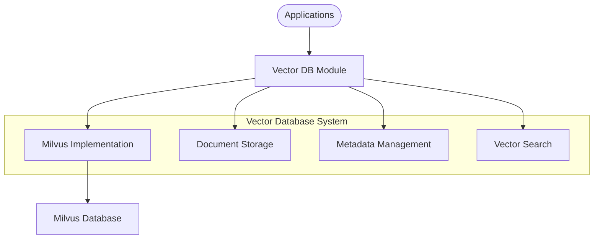
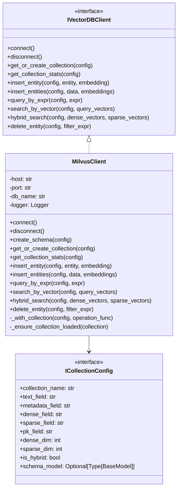

# Vector Database Module

## Overview

The Vector Database module provides integration with vector database systems for storing, retrieving, and querying vector embeddings. It enables semantic search capabilities and vector-based retrieval for knowledge bases, retrieval-augmented generation, and other AI applications that require similarity search.



## Architecture

The vector database system implements the adapter pattern with a clean interface that abstracts provider-specific details:



### Directory Structure

```
vector_db/
├── __init__.py             # Module initialization and exports
├── milvus_client.py        # Milvus vector database client implementation
└── README.md               # Documentation
```

## Key Components

### Vector Database Client

The vector database client provides access to vector database capabilities:

- **MilvusClient**: Implementation for Milvus vector database
- Connection management and error handling
- Collection creation and schema management
- Vector insertion and querying operations
- Support for hybrid search (dense + sparse vectors)

### Collection Configuration

The collection configuration defines how documents and vectors are stored:

- **Collection name and field mappings**
- Vector dimensions and types
- Primary key and schema definitions
- Hybrid search configuration
- Optional Pydantic schema model for complex data

## Implementation Guide

### Basic Vector Database Setup

```python
from src.config.settings import Settings
from src.vector_db import MilvusClient
from seedwork.interfaces.ivector_db_client import ICollectionConfig

# Create Milvus client
vector_db = MilvusClient()

# Connect to the database
vector_db.connect()

# Define collection configuration
collection_config = ICollectionConfig(
    collection_name="knowledge_base",
    text_field="content",
    metadata_field="metadata",
    dense_field="dense_vector",
    sparse_field="sparse_vector",
    pk_field="id",
    dense_dim=1536,  # For OpenAI embeddings
    sparse_dim=0,    # No sparse vectors in this example
    is_hybrid=False  # Only using dense vectors
)

# Get or create collection
collection = vector_db.get_or_create_collection(collection_config)

# Get collection statistics
stats = vector_db.get_collection_stats(collection_config)
print(f"Collection stats: {stats}")
```

### Inserting Document Vectors

```python
from src.embeddings import OpenAIEmbedding

# Initialize embedding model
embedding_model = OpenAIEmbedding()

# Prepare document
document = {
    "content": "This is a sample document about artificial intelligence and its applications.",
    "metadata": {
        "source": "example.txt",
        "author": "John Doe",
        "date": "2023-06-15"
    }
}

# Generate embedding
embedding = embedding_model.embed_query(document["content"])

# Insert document with embedding
vector_db.insert_entity(
    config=collection_config,
    entity=document,
    documents_embedding={"dense": embedding}
)
```

### Searching for Similar Documents

```python
# Generate query embedding
query = "What are the applications of AI?"
query_embedding = embedding_model.embed_query(query)

# Search for similar documents
search_results = vector_db.search_by_vector(
    config=collection_config,
    query_vectors={"dense": query_embedding},
    output_fields=["content", "metadata"],
    limit=5
)

# Process search results
for result in search_results:
    print(f"Score: {result.score}")
    print(f"Content: {result.entity.get('content')}")
    print(f"Metadata: {result.entity.get('metadata')}")
    print("---")
```

### Hybrid Search (Dense + Sparse Vectors)

```python
from src.embeddings import OpenAIEmbedding, SparseEmbedding

# Initialize embedding models
dense_model = OpenAIEmbedding()
sparse_model = SparseEmbedding()

# Configure hybrid collection
hybrid_config = ICollectionConfig(
    collection_name="hybrid_knowledge_base",
    text_field="content",
    metadata_field="metadata",
    dense_field="dense_vector",
    sparse_field="sparse_vector",
    pk_field="id",
    dense_dim=1536,
    sparse_dim=30000,  # For sparse BM25-style embeddings
    is_hybrid=True
)

# Create hybrid collection
vector_db.get_or_create_collection(hybrid_config)

# Generate both embedding types
query = "What are the applications of AI?"
dense_embedding = dense_model.embed_query(query)
sparse_embedding = sparse_model.embed_query(query)

# Perform hybrid search
hybrid_results = vector_db.hybrid_search(
    config=hybrid_config,
    dense_vectors=dense_embedding,
    sparse_vectors=sparse_embedding,
    output_fields=["content", "metadata"],
    limit=5
)
```

## Integration with Document Loading Pipeline

```python
from src.document_loaders import PDFLoader, RecursiveTextSplitter
from src.embeddings import OpenAIEmbedding
from src.vector_db import MilvusClient
from seedwork.interfaces.ivector_db_client import ICollectionConfig
from uuid import uuid4

# Initialize components
pdf_loader = PDFLoader()
text_splitter = RecursiveTextSplitter(chunk_size=1000, chunk_overlap=100)
embedding_model = OpenAIEmbedding()
vector_db = MilvusClient()

# Connect to database
vector_db.connect()

# Define collection config
collection_config = ICollectionConfig(
    collection_name="document_store",
    text_field="content",
    metadata_field="metadata",
    dense_field="dense_vector",
    sparse_field="sparse_vector",
    pk_field="id",
    dense_dim=1536,
    is_hybrid=False
)

# Create collection
vector_db.get_or_create_collection(collection_config)

# Process and index document
def index_document(file_path):
    # Step 1: Load and split document
    raw_documents = pdf_loader.load(file_path)
    chunked_documents = text_splitter.split_documents(raw_documents)
    
    # Step 2: Process each chunk
    for chunk in chunked_documents:
        # Generate unique ID
        doc_id = str(uuid4())
        
        # Create embeddings
        embedding = embedding_model.embed_query(chunk.page_content)
        
        # Prepare document entity
        entity = {
            "id": doc_id,
            "content": chunk.page_content,
            "metadata": chunk.metadata
        }
        
        # Insert into vector database
        vector_db.insert_entity(
            config=collection_config,
            entity=entity,
            documents_embedding={"dense": embedding}
        )
    
    return f"Indexed {len(chunked_documents)} chunks from {file_path}"
```

## Best Practices

1. **Collection Design**:
   - Create separate collections for different document types or domains
   - Choose appropriate vector dimensions based on your embedding model
   - Design your schema to include all necessary metadata fields

2. **Performance Optimization**:
   - Batch document insertions for better performance
   - Use appropriate search parameters for your use case
   - Select only needed output fields during search
   - Consider hybrid search for improved recall and precision

3. **Error Handling**:
   - Implement proper error handling for database operations
   - Monitor collection growth and performance
   - Implement connection pooling for high-throughput applications

4. **Configuration Management**:
   - Use environment variables for database connection settings
   - Create reusable collection configurations
   - Consider using a schema model for complex document structures
   
5. **Security Considerations**:
   - Secure database credentials
   - Implement proper access controls
   - Sanitize query expressions to prevent injection attacks