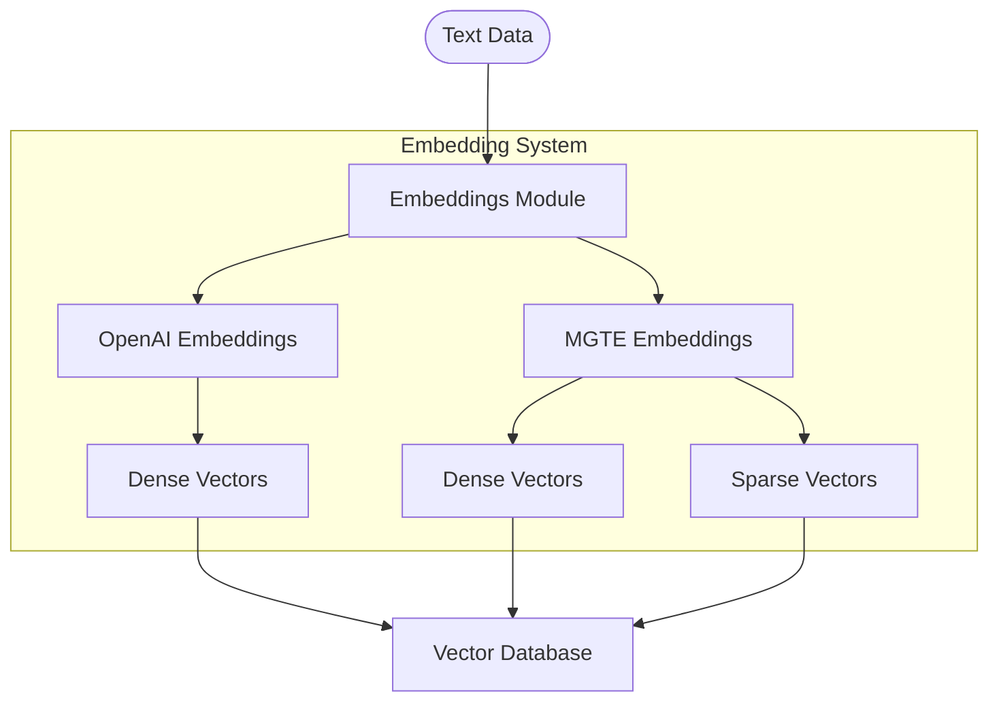
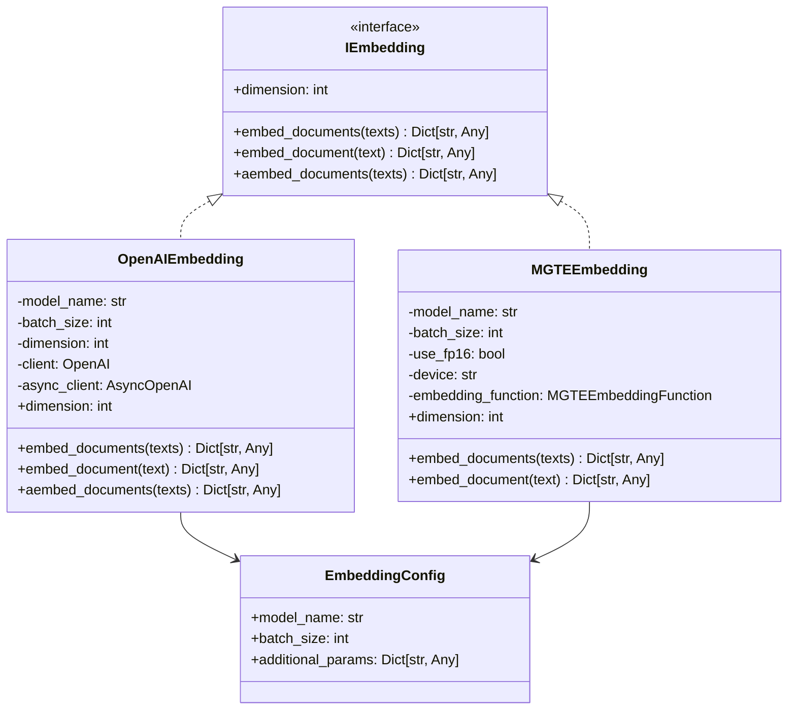

# Embeddings Module

## Overview

The Embeddings module provides vector representation capabilities for text data, enabling semantic search, similarity comparisons, and retrieval-augmented generation (RAG). It supports multiple embedding models with a consistent interface for integration with other Arshai components.



## Architecture

The embeddings system follows a clean interface-based design pattern:



### Directory Structure

```
embeddings/
├── __init__.py           # Module initialization and exports
├── openai_embeddings.py  # OpenAI embeddings implementation
├── mgte_embeddings.py    # MGTE embeddings implementation
└── README.md             # Documentation
```

## Key Components

### Embedding Providers

#### OpenAIEmbedding

Implementation that uses OpenAI's embedding models to generate dense vector representations:
- Support for multiple OpenAI embedding models
- Synchronous and asynchronous embedding generation
- Batched processing for efficiency
- Automatic dimension handling for different models

#### MGTEEmbedding

Milvus General Text Embeddings implementation that generates both dense and sparse vectors:
- Hybrid embedding generation (dense + sparse)
- Hardware acceleration support (CPU/GPU)
- Optimized memory usage with FP16 option
- Batched processing for efficiency

### Embedding Interface

All embedding providers implement the `IEmbedding` interface with these key methods:
- `embed_document`: Generate embeddings for a single text
- `embed_documents`: Generate embeddings for multiple texts
- `aembed_documents`: Asynchronously generate embeddings for multiple texts
- `dimension` property: Get the dimension of the embeddings

## Implementation Guide

### Basic Usage

```python
from src.embeddings import OpenAIEmbedding
from seedwork.interfaces.iembedding import EmbeddingConfig

# Initialize OpenAI embeddings
config = EmbeddingConfig(
    model_name="text-embedding-3-small",
    batch_size=32
)
embeddings = OpenAIEmbedding(config)

# Generate embeddings for a single document
text = "This is a sample document to embed."
embedding = embeddings.embed_document(text)
print(f"Generated embedding with dimension: {len(embedding['dense'])}")

# Generate embeddings for multiple documents
texts = [
    "First document to embed",
    "Second document to embed",
    "Third document to embed"
]
embeddings_result = embeddings.embed_documents(texts)
print(f"Generated {len(embeddings_result['dense'])} embeddings")
```

### Hybrid Embeddings with MGTE

```python
from src.embeddings import MGTEEmbedding
from seedwork.interfaces.iembedding import EmbeddingConfig

# Initialize MGTE embeddings with GPU acceleration
config = EmbeddingConfig(
    model_name="milvus/mgte-base",
    batch_size=16,
    additional_params={
        "use_fp16": True,
        "device": "cuda"
    }
)
embeddings = MGTEEmbedding(config)

# Generate hybrid embeddings
text = "This is a sample document for hybrid embedding."
result = embeddings.embed_document(text)

print(f"Dense vector dimension: {len(result['dense'])}")
print(f"Sparse vector: {result['sparse']}")
```

### Asynchronous Embedding Generation

```python
import asyncio
from src.embeddings import OpenAIEmbedding
from seedwork.interfaces.iembedding import EmbeddingConfig

async def generate_embeddings():
    # Initialize embeddings
    config = EmbeddingConfig(
        model_name="text-embedding-3-small",
        batch_size=32
    )
    embeddings = OpenAIEmbedding(config)
    
    # Generate embeddings for many documents
    texts = ["Document " + str(i) for i in range(100)]
    result = await embeddings.aembed_documents(texts)
    
    print(f"Generated {len(result['dense'])} embeddings")

# Run the async function
asyncio.run(generate_embeddings())
```

## Integration with Vector Database

```python
from src.embeddings import OpenAIEmbedding
from src.vector_db import MilvusClient
from seedwork.interfaces.iembedding import EmbeddingConfig
from seedwork.interfaces.ivector_db_client import ICollectionConfig

# Initialize components
embedding_config = EmbeddingConfig(
    model_name="text-embedding-3-small",
    batch_size=32
)
embeddings = OpenAIEmbedding(embedding_config)

vector_db = MilvusClient()
vector_db.connect()

# Configure collection
collection_config = ICollectionConfig(
    collection_name="documents",
    text_field="content",
    metadata_field="metadata",
    dense_field="vector",
    pk_field="id",
    dense_dim=embeddings.dimension,
    is_hybrid=False
)

# Create collection
vector_db.get_or_create_collection(collection_config)

# Index document
document = {
    "id": "doc1",
    "content": "This is a sample document about artificial intelligence.",
    "metadata": {"source": "example", "author": "Arshai"}
}

# Generate embedding
embedding_result = embeddings.embed_document(document["content"])

# Store in vector database
vector_db.insert_entity(
    config=collection_config,
    entity=document,
    documents_embedding=embedding_result
)
```

## Supported Models

### OpenAI
- `text-embedding-3-small`: 1536-dimensional embeddings
- `text-embedding-3-large`: 3072-dimensional embeddings
- `text-embedding-ada-002`: 1536-dimensional embeddings (legacy)

### MGTE
- `milvus/mgte-base`: Milvus General Text Embeddings base model
- `milvus/mgte-large`: Milvus General Text Embeddings large model

## Configuration

Embedding providers are configured through the `EmbeddingConfig` class:

```python
from seedwork.interfaces.iembedding import EmbeddingConfig

# OpenAI configuration
openai_config = EmbeddingConfig(
    model_name="text-embedding-3-small",
    batch_size=32
)

# MGTE configuration
mgte_config = EmbeddingConfig(
    model_name="milvus/mgte-base",
    batch_size=16,
    additional_params={
        "use_fp16": True,
        "device": "cuda" # or "cpu"
    }
)
```

## Best Practices

1. **Model Selection**:
   - Use OpenAI embeddings for general purposes when only dense vectors are needed
   - Use MGTE embeddings when both dense and sparse vectors are required
   - Consider computation costs and token usage when selecting models

2. **Performance Optimization**:
   - Use appropriate batch sizes to balance throughput and memory usage
   - Consider FP16 precision for MGTE when accuracy can be slightly compromised
   - Use GPU acceleration for MGTE when available
   - Implement caching for frequently embedded texts

3. **Error Handling**:
   - Implement proper error handling for API failures
   - Have fallback strategies for embedding service disruptions
   - Monitor token usage for API-based embeddings 