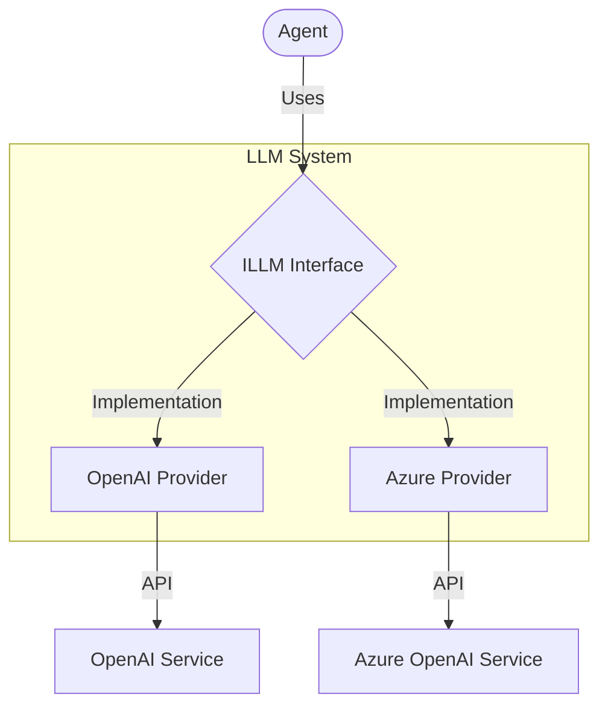
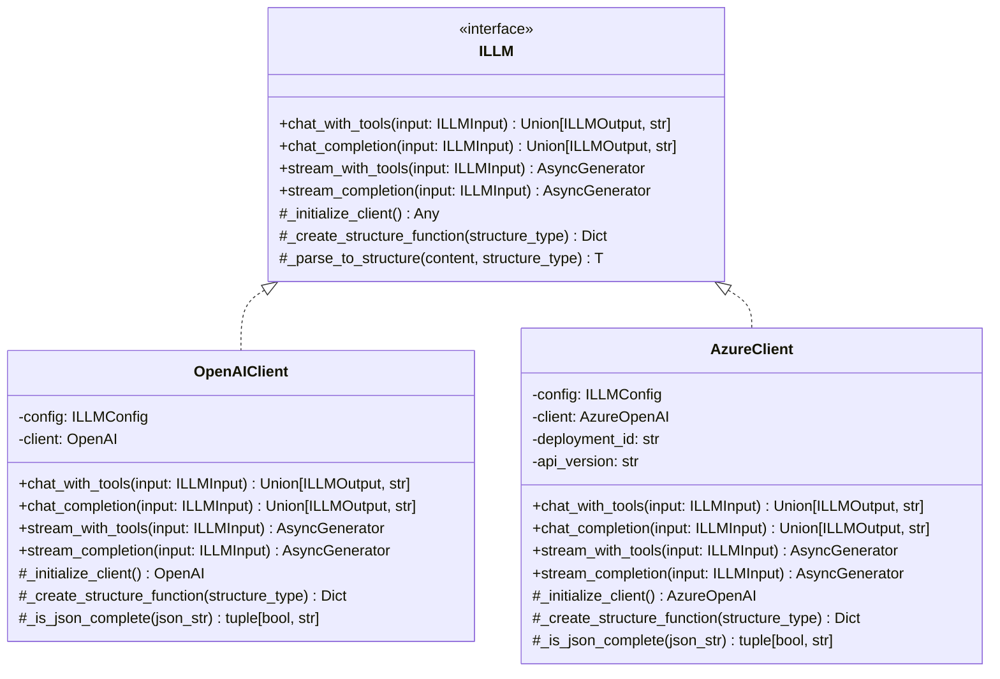
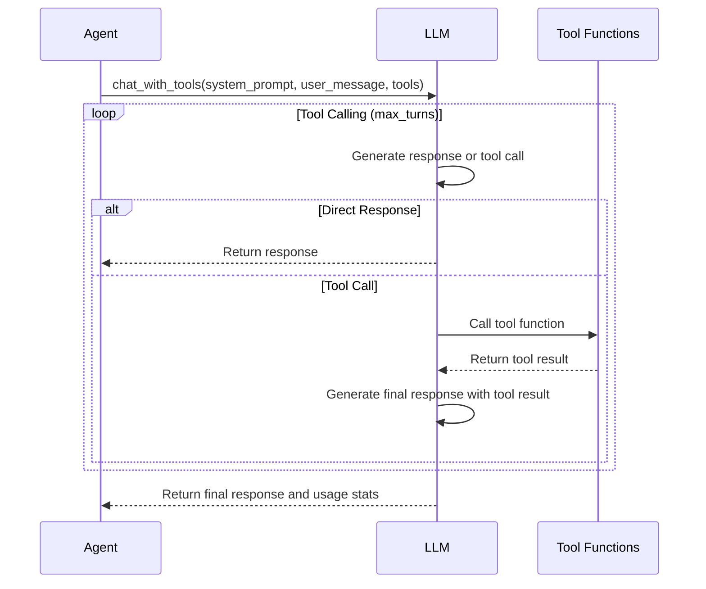
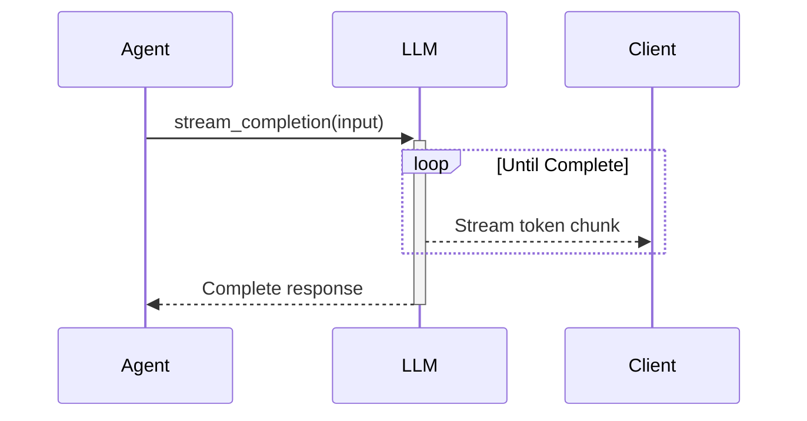

# LLMs Module

## Overview

The LLMs module provides a unified interface for interacting with various Language Learning Model (LLM) providers. It abstracts away provider-specific implementation details and provides a consistent API for prompt construction, API communication, response parsing, and error handling.



## Architecture

The LLM system follows a clean architecture with interfaces defining the contract and concrete implementations for each provider:



### Directory Structure

```
llms/
├── __init__.py           # Module initialization and exports
├── openai.py             # OpenAI implementation
├── azure.py              # Azure OpenAI implementation
└── README.md             # Documentation
```

## Key Components

### LLM Interface

The `ILLM` interface defines the contract for all LLM providers with these key methods:

- `chat_with_tools`: Process messages with tool/function calling capability
- `chat_completion`: Simple chat completion without tools
- `stream_with_tools`: Streaming version of chat with tools
- `stream_completion`: Streaming version of chat completion

### Provider Implementations

#### OpenAIClient

OpenAI API implementation that:
- Supports GPT-3.5 and GPT-4 models
- Handles tool/function calling
- Provides streaming capabilities
- Supports structured output formatting

#### AzureClient

Azure OpenAI implementation that:
- Supports Azure-hosted OpenAI models
- Requires additional Azure-specific configuration
- Maintains API compatibility with OpenAI
- Handles deployment-specific settings

### Input/Output Models

#### ILLMInput

Represents the input to an LLM with:
- `input_type`: Type of LLM call (chat completion or chat with tools)
- `system_prompt`: Instructions for the LLM
- `user_message`: User's message to process
- `tools_list`: Available tools definitions
- `callable_functions`: Functions that can be called by the LLM
- `structure_type`: Optional structure for formatted output
- `max_turns`: Maximum number of tool calling turns

#### ILLMOutput

Represents the output from an LLM with:
- `agent_message`: The LLM's response
- Usage statistics and metadata

## Implementation Guide

### Basic Usage

```python
from seedwork.interfaces.illm import ILLMConfig, ILLMInput, LLMInputType
from src.llms import OpenAIClient

# Initialize the LLM
llm_config = ILLMConfig(
    model="gpt-4",
    temperature=0.7,
    max_tokens=2000
)
llm = OpenAIClient(llm_config)

# Simple chat completion
response = llm.chat_completion(
    ILLMInput(
        input_type=LLMInputType.CHAT_COMPLETION,
        system_prompt="You are a helpful assistant.",
        user_message="What is the capital of France?"
    )
)

print(response["llm_response"])
```

### Using Function/Tool Calling

```python
from seedwork.interfaces.illm import ILLMInput, LLMInputType
from pydantic import BaseModel, Field

# Define output structure
class WeatherResponse(BaseModel):
    temperature: float = Field(description="Current temperature in Celsius")
    condition: str = Field(description="Weather condition (sunny, cloudy, etc.)")
    forecast: str = Field(description="Short forecast for the next 24 hours")

# Define tool function
def get_weather(location: str):
    # Real implementation would call a weather API
    return {
        "location": location,
        "temperature": 22.5,
        "condition": "Partly Cloudy",
        "humidity": 65
    }

# Create tool definition
weather_tool = {
    "name": "get_weather",
    "description": "Get current weather for a location",
    "parameters": {
        "type": "object",
        "properties": {
            "location": {
                "type": "string",
                "description": "City name or location"
            }
        },
        "required": ["location"]
    }
}

# Use the LLM with tools
response = llm.chat_with_tools(
    ILLMInput(
        input_type=LLMInputType.CHAT_WITH_TOOLS,
        system_prompt="You are a helpful weather assistant.",
        user_message="What's the weather like in Paris?",
        tools_list=[weather_tool],
        callable_functions={"get_weather": get_weather},
        structure_type=WeatherResponse,
        max_turns=3
    )
)

print(response["llm_response"].model_dump())
```

### Streaming Responses

```python
import asyncio

async def stream_example():
    async for chunk in llm.stream_completion(
        ILLMInput(
            input_type=LLMInputType.CHAT_COMPLETION,
            system_prompt="You are a helpful assistant.",
            user_message="Write a short story about a robot learning to paint."
        )
    ):
        if chunk["llm_response"]:
            print(chunk["llm_response"], end="", flush=True)

# Run the async function
asyncio.run(stream_example())
```

## Integration Flow

### Chat with Tools Flow



### Streaming Flow



## Provider-Specific Configuration

### OpenAI

Configuration via environment variables:
- `OPENAI_API_KEY`: API key for authentication

```python
# Example config
config = ILLMConfig(
    model="gpt-4",
    temperature=0.7,
    max_tokens=2000
)
```

### Azure OpenAI

Configuration via environment variables:
- `AZURE_OPENAI_API_KEY`: API key for authentication
- `AZURE_OPENAI_ENDPOINT`: Azure endpoint URL

```python
# Example config with Azure-specific parameters
config = ILLMConfig(
    model="gpt-4",
    temperature=0.7,
    max_tokens=2000
)

azure_llm = AzureClient(
    config=config,
    deployment_id="my-gpt4-deployment",
    api_version="2023-05-15"
)
```

## Best Practices

1. **System Prompts**: 
   - Keep system prompts clear and concise
   - Include specific instructions for expected response format
   - Provide context relevant to the task

2. **Tool Definitions**:
   - Name tools clearly based on their function
   - Write detailed descriptions for each parameter
   - Mark required parameters appropriately
   - Keep parameter schemas simple

3. **Error Handling**:
   - Implement robust handling for API errors
   - Set appropriate timeouts for API calls
   - Consider implementing automatic retries for transient failures

4. **Performance Optimization**:
   - Use streaming for long responses
   - Select appropriate model based on task complexity
   - Optimize token usage by keeping prompts concise
   - Consider caching for repeated identical queries

5. **Security Considerations**:
   - Never hardcode API keys
   - Validate and sanitize all user inputs
   - Implement content filtering for sensitive outputs
   - Control model temperature based on use case safety requirements 