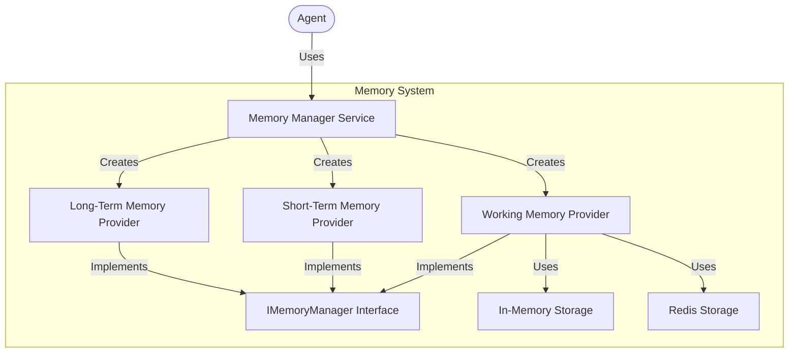
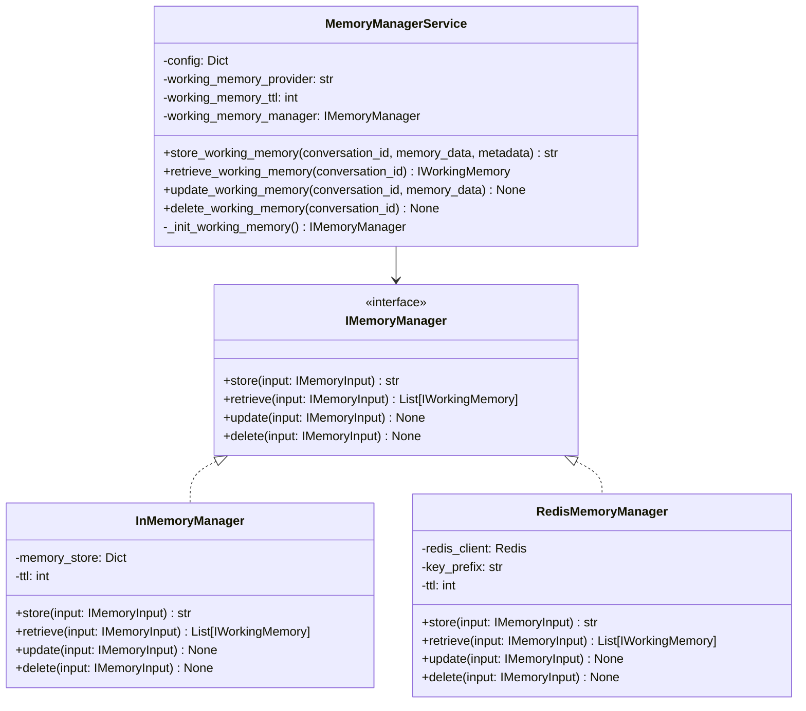
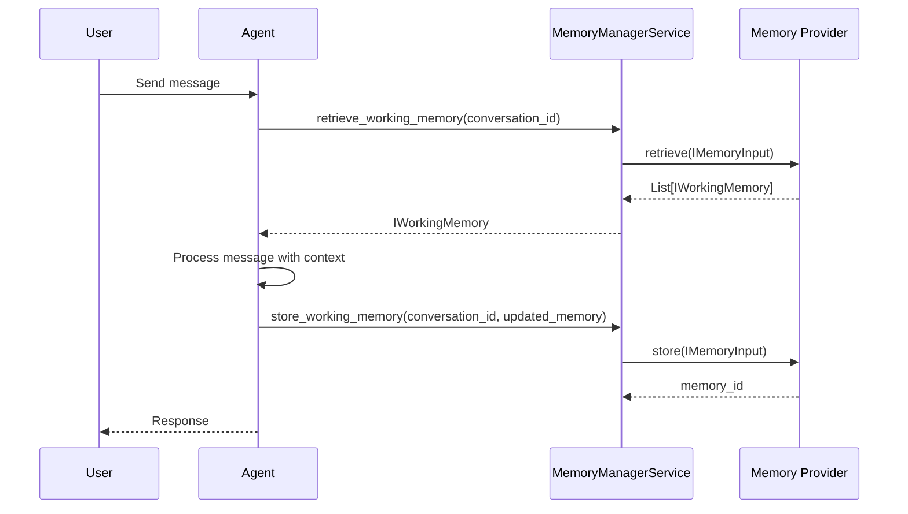

# Memory Module

## Overview

The Memory module provides robust conversation persistence and retrieval capabilities for the Arshai framework. It manages different types of memory, with a primary focus on working memory for conversational contexts. The system follows a clean architecture with separation between the management service, memory providers, and storage implementations.



## Architecture

The memory system uses a layered architecture with provider-specific implementations:



### Directory Structure

```
memory/
├── __init__.py               # Module initialization and exports
├── memory_manager.py         # Memory manager service implementation
├── memory_types.py           # Memory type enumerations
├── working_memory/           # Working memory implementations 
│   ├── __init__.py           # Submodule initialization
│   ├── in_memory_manager.py  # In-memory implementation
│   └── redis_memory_manager.py # Redis implementation
├── short_term/               # Short-term memory implementations
└── long_term/                # Long-term memory implementations
```

## Key Components

### MemoryManagerService

The central orchestrator for memory operations that:
- Initializes memory providers based on configuration
- Provides simplified methods for memory operations
- Handles fallback to in-memory storage when needed
- Manages initialization of empty memory when needed

### Memory Providers

#### InMemoryManager

A non-persistent memory implementation that:
- Stores data in an in-memory dictionary
- Provides fast access for development and testing
- Supports automatic TTL-based expiration

#### RedisMemoryManager

A Redis-backed memory implementation that:
- Provides persistent storage across application restarts
- Handles data serialization and deserialization
- Supports automatic TTL-based key expiration

### Data Models

The memory system uses well-defined data models:

#### IWorkingMemory

A structured representation of an agent's working memory with:
- User profile information
- Agent profile information
- Conversation history
- Dialogue planning and goals
- Knowledge cache
- Conversation mood indicators

## Implementation Guide

### Configuring Memory

```python
from src.config.settings import Settings

# Configure memory with default settings
settings = Settings()

# Configure memory with custom settings
custom_settings = Settings(
    memory_config={
        "working_memory": {
            "provider": "redis",
            "ttl": 86400  # 24 hours
        }
    }
)
```

### Using Memory in Applications

```python
from src.memory import MemoryManagerService

# Initialize memory manager
memory_manager = MemoryManagerService(
    config={
        "working_memory": {
            "provider": "in_memory",
            "ttl": 3600  # 1 hour
        }
    }
)

# Store working memory
conversation_id = "conversation_123"
working_memory = IWorkingMemory(
    working_memory="""
    USER PROFILE:
    John Doe, software engineer interested in AI.

    AGENT PROFILE:
    Technical assistant specializing in programming help.

    CONVERSATION STORY:
    User has been asking about Python programming and machine learning frameworks.

    CURRENT CONVERSATION HISTORY:
    User asked about TensorFlow vs PyTorch differences.

    DIALOGUE PLANNING AND GOALS:
    Provide technical comparisons while keeping explanations accessible.

    KNOWLEDGE CACHE:
    TensorFlow is developed by Google, PyTorch by Facebook.
    TensorFlow has static computation graphs, PyTorch uses dynamic ones.

    CONVERSATION MOOD:
    Technical, inquisitive
    """
)
memory_manager.store_working_memory(conversation_id, working_memory)

# Retrieve working memory
retrieved_memory = memory_manager.retrieve_working_memory(conversation_id)
print(retrieved_memory.working_memory)

# Delete working memory
memory_manager.delete_working_memory(conversation_id)
```

## Memory Flow in Agent Interactions



## Best Practices

1. **Memory Initialization**: Always provide fallback for missing memory with `IWorkingMemory.initialize_memory()`
2. **TTL Management**: Configure appropriate TTL values based on use case requirements
3. **Provider Selection**: Choose the appropriate provider based on deployment environment
4. **Error Handling**: Implement robust error handling for storage failures
5. **Memory Structure**: Maintain the structured format of working memory for optimal LLM performance

## Provider-Specific Considerations

### In-Memory Provider

- Best for development, testing, and stateless applications
- Data is lost on application restart
- No additional infrastructure required

### Redis Provider

- Best for production deployments and stateful applications
- Requires Redis server access
- Configuration via environment variables:
  - `REDIS_URL`: Redis connection string
  - `REDIS_PASSWORD`: Redis password if required
  - `REDIS_PREFIX`: Key prefix for namespacing (default: "arshai:memory")

## Performance Considerations

- Working memory operations are lightweight and fast
- Redis provider adds network latency but provides persistence
- Memory retrieval should be optimized to minimize latency in agent response times
- Consider connection pooling for Redis in high-throughput scenarios 