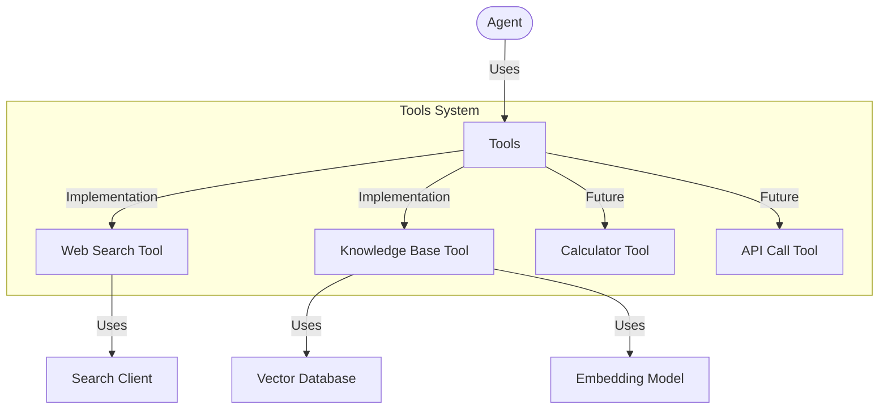
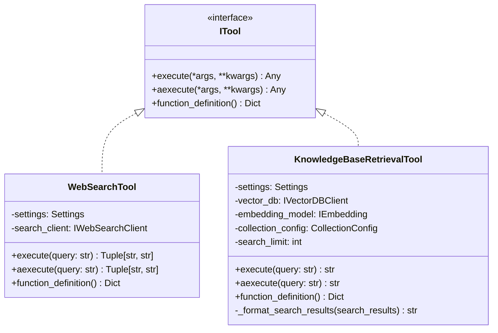
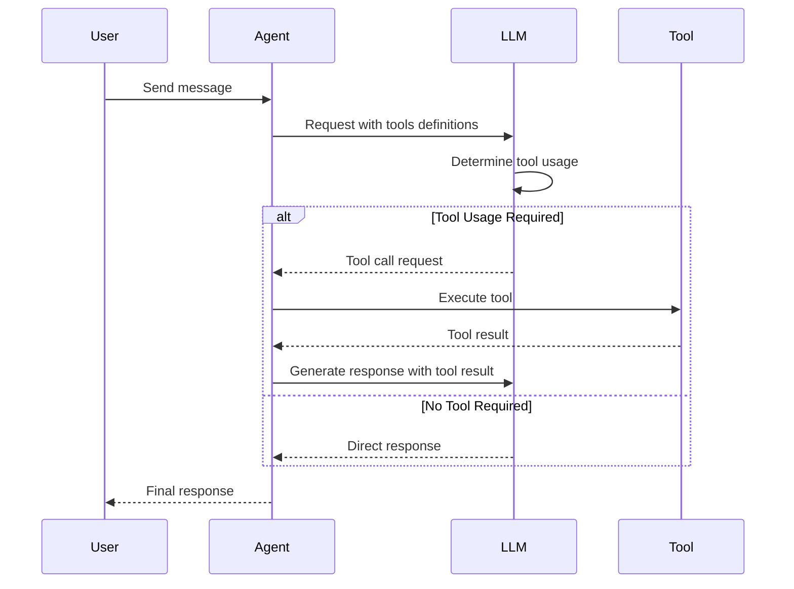

# Tools Module

## Overview

The Tools module provides a collection of specialized capabilities that extend the functionality of agents beyond conversation. Tools enable agents to interact with external systems, retrieve information, and perform actions in the real world, following a clean interface-based architecture.



## Architecture

The tool system follows the command pattern, where each tool encapsulates a specific action with a consistent interface:



### Directory Structure

```
tools/
├── __init__.py                # Module initialization and exports
├── web_search_tool.py         # Web search implementation
├── knowledge_base_tool.py     # Knowledge base retrieval implementation
└── README.md                  # Documentation
```

## Key Components

### ITool Interface

The `ITool` interface defines the contract for all tools with these key methods:

- `execute`: Synchronous execution of the tool's functionality
- `aexecute`: Asynchronous execution of the tool's functionality
- `function_definition`: Property that returns the tool's definition for LLMs

### Tool Implementations

#### WebSearchTool

A tool for retrieving information from the web that:
- Takes a search query as input
- Uses a configurable web search client
- Returns formatted search results and source URLs
- Supports both synchronous and asynchronous execution

#### KnowledgeBaseRetrievalTool

A tool for retrieving information from vector databases that:
- Takes a natural language query as input
- Generates embeddings for semantic search
- Supports both dense and hybrid search strategies
- Returns formatted knowledge with source attribution
- Handles multiple result types and metadata formats

## Implementation Guide

### Using Existing Tools

```python
from src.tools import WebSearchTool, KnowledgeBaseRetrievalTool
from src.config.settings import Settings

# Initialize settings
settings = Settings()

# Create tools
web_search = WebSearchTool(settings)
knowledge_base = KnowledgeBaseRetrievalTool(settings)

# Use tools directly
search_results, urls = web_search.execute("What are the recent advancements in AI?")
kb_results = knowledge_base.execute("How does the Arshai package handle memory management?")

print(f"Web search results: {search_results}")
print(f"Knowledge base results: {kb_results}")
```

### Providing Tools to Agents

```python
from seedwork.interfaces.iagent import IAgentConfig
from src.agents import ConversationAgent
from src.tools import WebSearchTool, KnowledgeBaseRetrievalTool
from src.config.settings import Settings

# Initialize settings
settings = Settings()

# Create tools
tools = [
    WebSearchTool(settings),
    KnowledgeBaseRetrievalTool(settings)
]

# Create agent with tools
agent = ConversationAgent(
    config=IAgentConfig(
        task_context="You are a research assistant with access to search tools.",
        tools=tools
    ),
    settings=settings
)

# Process a message that might trigger tool usage
response, usage = agent.process_message(
    IAgentInput(
        message="Find information about quantum computing breakthroughs in 2023",
        conversation_id="research_123"
    )
)
```

### Creating a Custom Tool

To implement a new tool, create a class that implements the `ITool` interface:

```python
from typing import Dict, Any
from seedwork.interfaces.itool import ITool
from seedwork.interfaces.isetting import ISetting

class CalculatorTool(ITool):
    """Tool for performing mathematical calculations"""
    
    def __init__(self, settings: ISetting):
        self.settings = settings
        
    @property
    def function_definition(self) -> Dict:
        """Get the function definition for the LLM"""
        return {
            "name": "calculate",
            "description": "Perform mathematical calculations",
            "parameters": {
                "type": "object",
                "properties": {
                    "expression": {
                        "type": "string",
                        "description": "Mathematical expression to evaluate (e.g. '2 + 2 * 3')"
                    }
                },
                "required": ["expression"]
            }
        }
        
    def execute(self, expression: str) -> str:
        """Execute the calculator with the provided expression"""
        try:
            # Using eval with strict restrictions for safety
            result = eval(expression, {"__builtins__": {}}, {})
            return f"Result: {result}"
        except Exception as e:
            return f"Error calculating result: {str(e)}"
            
    async def aexecute(self, expression: str) -> str:
        """Async version simply calls the sync version"""
        return self.execute(expression)
```

## Tool Integration Flow

### Tool Execution Flow in Agents



## Best Practices

1. **Tool Definition Clarity**:
   - Provide clear, specific descriptions of tool functionality
   - Make parameter descriptions explicit and unambiguous
   - Mark required parameters appropriately

2. **Error Handling**:
   - Implement robust error handling within tool execution
   - Return helpful error messages when tool execution fails
   - Log errors with appropriate context for debugging

3. **Performance Optimization**:
   - Implement caching for expensive or repetitive tool calls
   - Use asynchronous execution for I/O-bound operations
   - Set appropriate timeouts for external service calls

4. **Security Considerations**:
   - Validate and sanitize all input parameters
   - Implement rate limiting for expensive operations
   - Use principle of least privilege for external service access
   - Consider potential for prompt injection in tool parameters

5. **Tool Design**:
   - Keep tools focused on a single responsibility
   - Design tools to be stateless when possible
   - Provide both synchronous and asynchronous interfaces
   - Return structured data that's easy for LLMs to process 