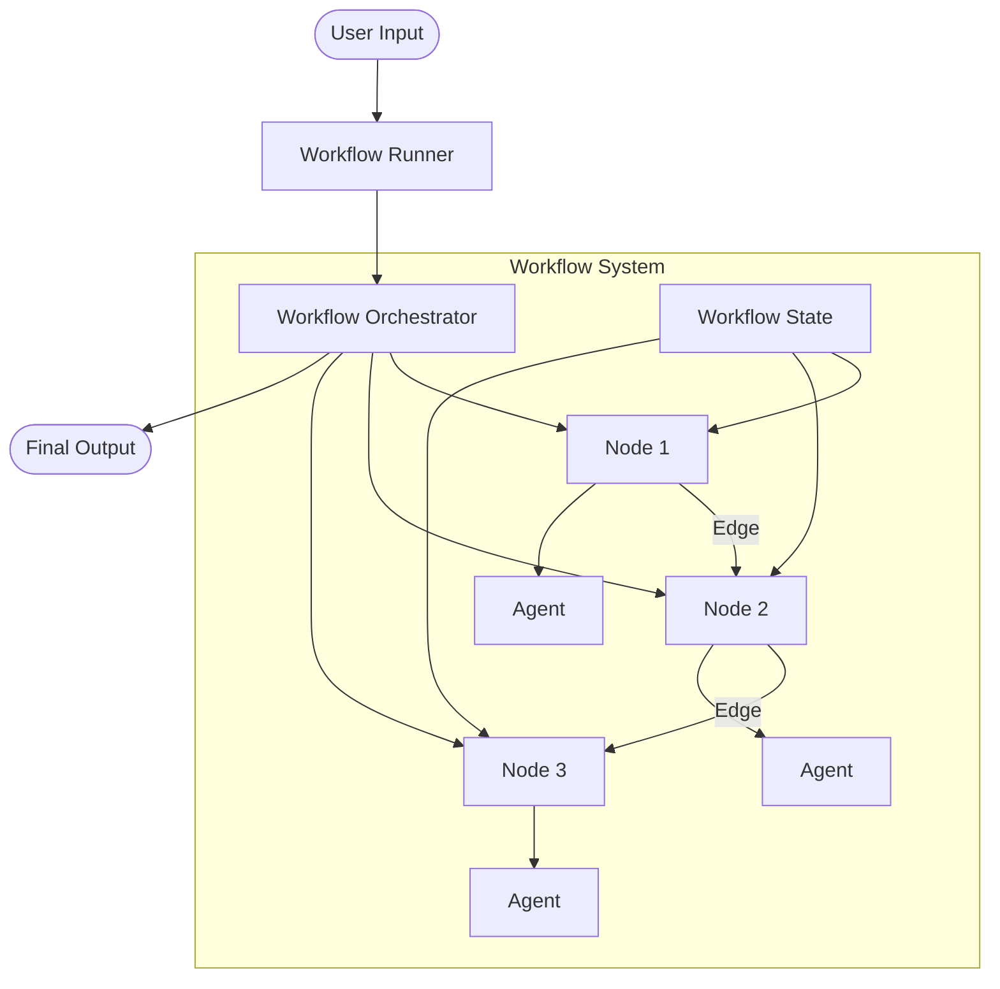
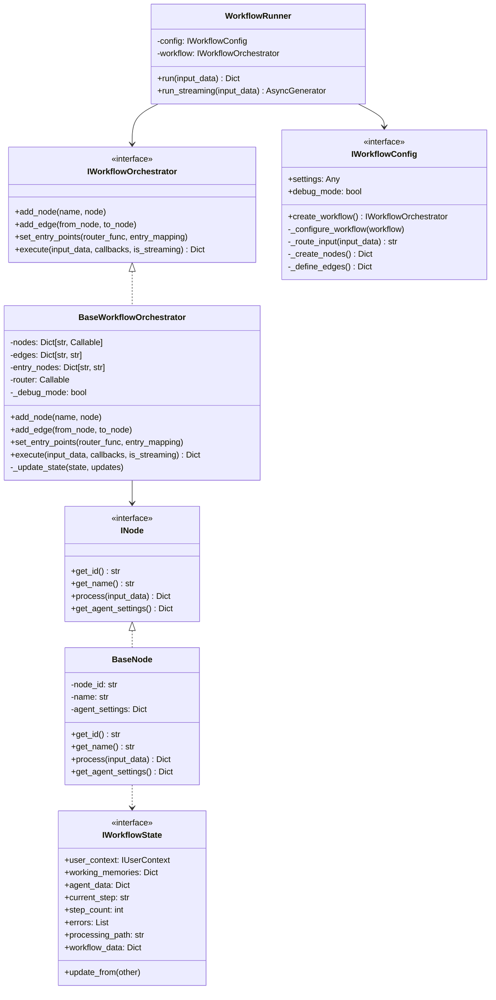
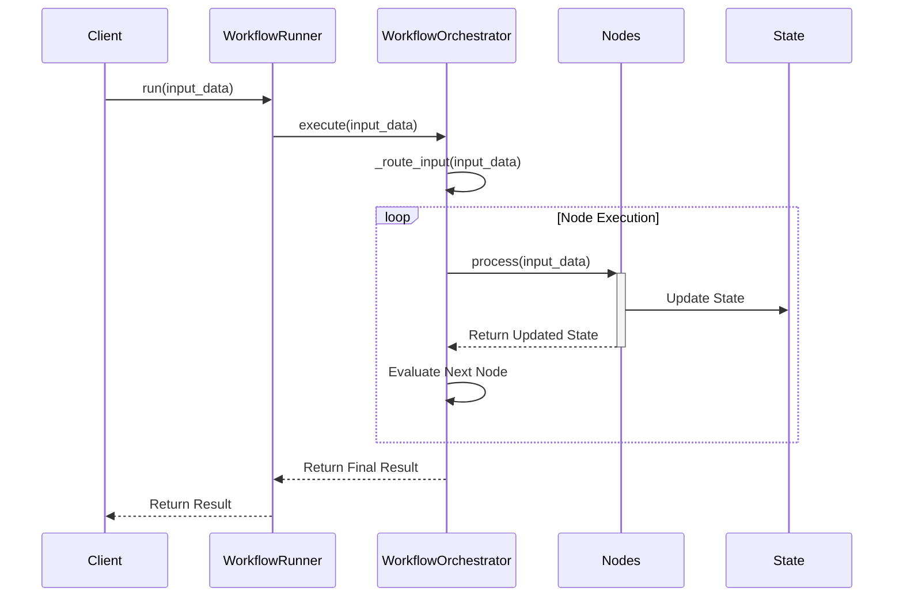

# Workflows Module

## Overview

The Workflows module is the orchestration layer of the Arshai framework, enabling the creation of complex multi-agent systems with defined execution paths, state management, and conditional routing. Workflows are represented as directed graphs where nodes process information and edges determine the flow between nodes.



## Architecture

The workflow system implements a directed graph model with a clean separation between the workflow runner, orchestrator, nodes, and state management:



### Directory Structure

```
workflows/
├── __init__.py              # Module initialization and exports
├── workflow_orchestrator.py # Core workflow orchestration implementation
├── workflow_runner.py       # Execution interface for workflows
├── node.py                  # Node implementation with agent integration
├── workflow_config.py       # Configuration for workflow definition
└── README.md                # Documentation
```

## Key Components

### Workflow Orchestrator

The orchestrator is responsible for:
- Managing the flow of execution between nodes
- Routing input to the appropriate entry point
- Maintaining workflow state across node executions
- Error handling and workflow resumption
- Supporting both synchronous and streaming execution modes

### Nodes

Nodes are the processing units within a workflow that:
- Wrap agents to provide business-specific logic
- Operate on and update workflow state
- Can make routing decisions for dynamic workflows
- Support both synchronous and asynchronous processing

### Workflow State

The workflow state provides a comprehensive record of the workflow's execution:
- User context information
- Working memory for each agent
- Current execution step and path
- Error tracking and recovery information
- Custom workflow data storage

### Workflow Configuration

The configuration defines the structure and behavior of a workflow:
- Node definitions and connections
- Entry point routing logic
- Debug settings and execution options
- Custom workflow parameters

### Workflow Runner

The runner provides a simplified interface for workflow execution:
- Initialization from configuration
- Execution management
- State persistence
- Streaming response handling

## Implementation Guide

### Creating a Workflow

The first step in using workflows is to create a workflow configuration:

```python
from seedwork.interfaces.iworkflow import IWorkflowState, IUserContext
from src.workflows import WorkflowRunner
from src.workflows.workflow_config import BaseWorkflowConfig

# Define workflow configuration
class CustomerSupportWorkflow(BaseWorkflowConfig):
    def _create_nodes(self):
        """Create workflow nodes."""
        return {
            "router": self._create_router_node(),
            "technical_support": self._create_technical_node(),
            "billing_support": self._create_billing_node(),
            "general_support": self._create_general_node(),
            "escalation": self._create_escalation_node(),
            "response_generator": self._create_response_node()
        }
    
    def _define_edges(self):
        """Define relationships between nodes."""
        return {
            "router": {
                "technical": "technical_support",
                "billing": "billing_support",
                "general": "general_support"
            },
            "technical_support": {
                "resolved": "response_generator",
                "escalate": "escalation"
            },
            "billing_support": {
                "resolved": "response_generator",
                "escalate": "escalation"
            },
            "general_support": {
                "resolved": "response_generator",
                "escalate": "escalation"
            },
            "escalation": "response_generator"
        }
    
    def _route_input(self, input_data):
        """Define how to route initial input."""
        message = input_data.get("message", "").lower()
        if "technical" in message or "error" in message:
            return "technical"
        elif "billing" in message or "payment" in message:
            return "billing"
        else:
            return "general"
```

### Running a Workflow

Once you have defined a workflow configuration, you can create and run the workflow:

```python
from src.config.settings import Settings

# Initialize settings
settings = Settings()

# Create workflow configuration
workflow_config = CustomerSupportWorkflow(settings, debug_mode=True)

# Create workflow runner
workflow_runner = WorkflowRunner(workflow_config)

# Initialize workflow state
user_context = IUserContext(user_id="user123")
initial_state = IWorkflowState(user_context=user_context)

# Run the workflow
result = workflow_runner.run({
    "message": "I'm having a technical issue with my account login",
    "state": initial_state
})

# Process the result
final_state = result["state"]
response = result.get("response", "")

print(f"Processing path: {final_state.processing_path}")
print(f"Steps: {final_state.step_count}")
print(f"Response: {response}")
```

### Streaming Workflow Execution

For real-time processing and progressive results:

```python
import asyncio

async def run_streaming_workflow():
    workflow_runner = WorkflowRunner(workflow_config)
    
    async for chunk in workflow_runner.run_streaming({
        "message": "I need help with my billing statement",
        "state": initial_state
    }):
        if "response_chunk" in chunk:
            print(chunk["response_chunk"], end="", flush=True)

# Run the async function
asyncio.run(run_streaming_workflow())
```

## Node Integration with Agents

Nodes typically integrate with agents to process information:

```python
from src.workflows.node import BaseNode
from seedwork.interfaces.iagent import IAgentInput

class AgentNode(BaseNode):
    def __init__(self, node_id, name, agent, **kwargs):
        super().__init__(node_id, name, **kwargs)
        self.agent = agent
    
    async def process(self, input_data):
        # Extract state from input data
        state = input_data["state"]
        
        # Get message from workflow data
        message = input_data.get("message", "")
        
        # Create agent input
        agent_input = IAgentInput(
            message=message,
            conversation_id=f"{state.user_context.user_id}_{self.node_id}",
            stream=input_data.get("is_streaming", False)
        )
        
        # Process with agent
        response, usage = self.agent.process_message(agent_input)
        
        # Update state with agent's response
        state.workflow_data[f"{self.node_id}_response"] = response
        
        # Determine routing based on agent's response
        route = self._determine_next_route(response)
        
        # Return updated state and routing information
        return {
            "state": state,
            "route": route,
            "response": response
        }
    
    def _determine_next_route(self, response):
        """Custom logic to determine the next node."""
        if "escalate" in response.lower():
            return "escalate"
        return "resolved"
```

## Workflow Execution Flow



## Best Practices

1. **Workflow Design**:
   - Keep workflows focused on a specific business process
   - Design for reusability and composability
   - Use descriptive node and edge names

2. **State Management**:
   - Store only necessary data in workflow state
   - Use appropriate state fields for different types of data
   - Consider state size for long-running workflows

3. **Error Handling**:
   - Implement error recovery mechanisms in critical nodes
   - Design fallback paths for error conditions
   - Log detailed error information for debugging

4. **Performance**:
   - Use asynchronous processing for I/O-bound operations
   - Implement streaming for responsive user experiences
   - Consider adding caching for expensive operations

5. **Testing**:
   - Test individual nodes in isolation
   - Create test workflows for critical paths
   - Simulate error conditions to validate recovery

## Advanced Features

1. **Dynamic Routing**:
   - Nodes can return specific route values to override default edges
   - Use conditional logic based on state content
   - Implement priority-based edge selection

2. **Parallel Processing**:
   - Create parallel execution branches that reunite later
   - Implement fan-out/fan-in patterns for data processing

3. **Persistent Workflows**:
   - Save workflow state for resumption
   - Implement checkpointing for long-running workflows
   - Support workflow migration between systems 