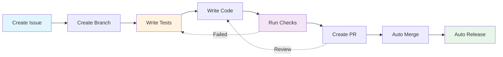
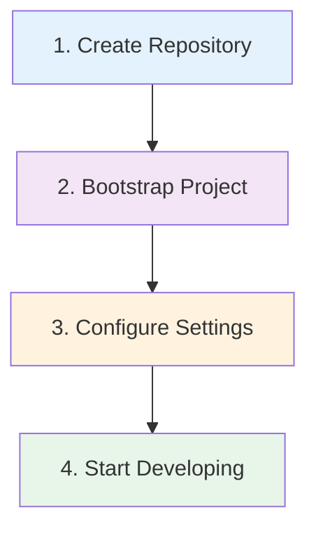
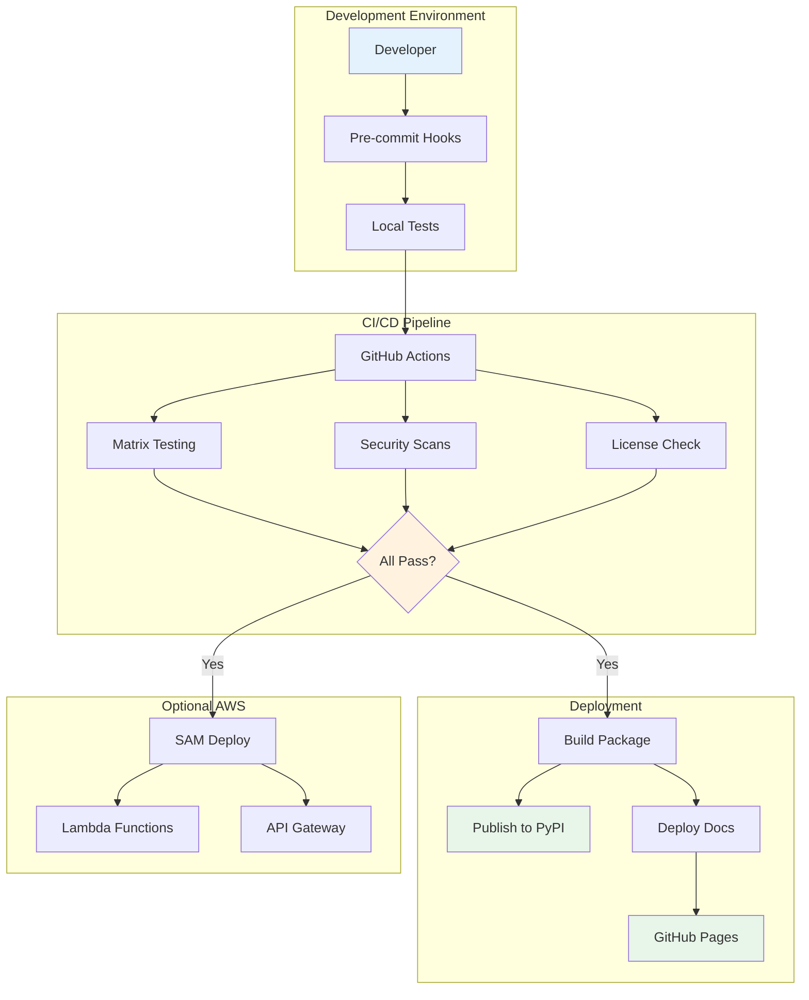

# Python Library Template 🚀

**Enterprise-ready Python library template with security scanning, automated publishing, and comprehensive tooling.**

Create production-quality Python libraries with confidence. This template provides everything you need to build, test, and publish professional Python packages.

[](https://github.com/svange/augint-library/actions/workflows/pipeline.yaml)
[](https://pypi.org/project/augint-library/)
[](https://www.python.org/downloads/)

[](https://python-poetry.org/)
[](https://github.com/psf/black)
[](https://github.com/astral-sh/ruff)
[](https://github.com/pre-commit/pre-commit)
[](https://renovatebot.com)

[](https://pytest.org/)
[](https://github.com/features/actions)
[](https://github.com/semantic-release/semantic-release)
[](https://aws.amazon.com/serverless/sam/)
[](https://www.gnu.org/licenses/agpl-3.0)


## 📊 Live Dashboards

| 📖 **[Documentation](https://svange.github.io/augint-library)** | 🧪 **[Unit Tests](https://svange.github.io/augint-library/unit-test-report.html)** | 🔬 **[Integration Tests](https://svange.github.io/augint-library/integration-test-report.html)** | 📊 **[Coverage](https://svange.github.io/augint-library/htmlcov/index.html)** | ⚡ **[Benchmarks](https://svange.github.io/augint-library/benchmark-report.html)** | 🔒 **[Security](https://svange.github.io/augint-library/security-reports.html)** | ⚖️ **[Compliance](https://svange.github.io/augint-library/license-compatibility.html)** |
|:-:|:-:|:-:|:-:|:-:|:-:|:-:|


## 🔑 Key Development Characteristics

| Characteristic | Details |
|:--------------|:--------|
| **Merge Strategy** | Configurable (see .env) |
| **Deployment Model** | Tag-based to PyPI |
| **Environments** | Local → PyPI |
| **Preview Environments** | N/A (library) |
| **Pipeline Features** | Semantic release, Auto-publish to PyPI |
| **Special Considerations** | 90% coverage requirement, Mutation testing |

---

## 🎯 Perfect For

- **Open Source Libraries** - Share your code with the world
- **Internal Company Packages** - Professional standards for private code  
- **Research Code** - Reproducible, well-tested scientific computing
- **CLI Tools** - Build robust command-line interfaces
- **Microservice Libraries** - Shared code between services

## 🔄 Development Workflow



## ⚡ What You Get

**Zero-Config CI/CD Pipeline**
- Matrix testing with HTML reports
- Automated security scanning (Bandit, Safety, pip-audit, Semgrep)
- License compatibility checking and compliance reports
- Semantic versioning with automated changelog generation

**Enterprise-Grade Quality**
- Pre-commit hooks (Ruff, Black, conventional commits)
- Test-driven development setup with Click CLI testing
- Code coverage reporting with beautiful HTML dashboards
- API documentation auto-generated and deployed to GitHub Pages

**Modern Python Stack**
- Poetry dependency management with security/compliance groups
- Trusted publishing to PyPI/TestPyPI (no API keys needed)
- Optional AWS SAM integration with ephemeral test environments
- Windows/Git Bash compatibility with comprehensive guidance

**Privacy-Conscious Telemetry**
- Opt-in anonymous usage tracking to improve your library

## 📚 Documentation

For AI-optimized documentation navigation, see [LINKS.md](./LINKS.md)
- Community insights via Sentry integration
- Full transparency on collected data
- Easy enable/disable controls

## 🚀 Quick Start

Get your library up and running in minutes:



### 1️⃣ Create Your Repository

```bash
# Option A: Use GitHub template (recommended)
gh repo create my-awesome-lib --template svange/augint-library --public
cd my-awesome-lib

# Option B: Clone directly
git clone https://github.com/svange/augint-library.git my-awesome-lib
cd my-awesome-lib
rm -rf .git && git init
```

### 2️⃣ Bootstrap Your Project

```bash
# Stage 1: Customize template
python scripts/bootstrap-stage1.py
# - Enter your project name
# - Configure basic settings
# - Updates all references automatically

# Stage 2: AWS integration (optional)
python scripts/bootstrap-stage2.py
# - Sets up SAM pipeline
# - Configures OIDC authentication
# - Creates test environments
```

### 3️⃣ Configure Repository Settings

1. **Enable GitHub Pages** (Settings → Pages → Source: GitHub Actions)
2. **Set up branch protection** for `main`:
   - Require PR reviews
   - Require status checks
   - Include administrators
3. **Add repository secrets** (if needed):
   - `PYPI_API_TOKEN` (for manual publishing)
   - Custom secrets for your project

### 4️⃣ Start Developing!

```bash
# Install dependencies
poetry install
pre-commit install

# Create your first feature
git checkout -b feat/amazing-feature
# ... write code ...
pytest  # All tests pass!
git add . && git commit -m "feat: add amazing feature"
git push -u origin feat/amazing-feature
```

**📋 Detailed setup guide: [Bootstrap Documentation](guides/setup/bootstrap.md)**

**That's it!** Your CI/CD pipeline is now running with full security scanning and automated publishing.

## 🏗️ Architecture Overview



## 📦 What's Included

### 🔧 Development Tools
- **Poetry** - Modern dependency management
- **Pre-commit** - Automated code quality checks
- **Ruff** - Fast Python linter and formatter
- **Mypy** - Static type checking
- **Pytest** - Testing with fixtures and coverage

### 🛡️ Security & Compliance
- **Bandit** - Security vulnerability scanning
- **Safety** - Dependency vulnerability checks
- **pip-audit** - Supply chain security
- **Semgrep** - Custom security rules
- **License checking** - Automated compliance reports

### 📊 Quality Assurance
- **90%+ test coverage** requirement
- **Mutation testing** - Test quality validation
- **Benchmarking** - Performance tracking
- **HTML test reports** - Beautiful test dashboards
- **Renovate** - Automated dependency updates

### 🚀 CI/CD Features
- **Matrix testing** - Python 3.9, 3.10, 3.11, 3.12
- **Semantic versioning** - Automated releases
- **Trusted publishing** - Secure PyPI uploads
- **GitHub Pages** - Documentation hosting
- **PR auto-merge** - For passing builds

### 🎯 Optional Features
- **AWS SAM** - Serverless deployment
- **Feature flags** - Gradual rollouts
- **Telemetry** - Anonymous usage tracking
- **Docker support** - Containerized development

## 🎯 Common Use Cases

<details>
<summary><b>📚 Creating a Python Library</b></summary>

```python
# src/mylib/core.py
"""Core functionality for mylib."""

def process_data(data: list[dict]) -> list[dict]:
    """Process data with validation.

    Args:
        data: List of dictionaries to process

    Returns:
        Processed data

    Example:
        >>> process_data([{"value": 1}])
        [{"value": 1, "processed": True}]
    """
    return [{"processed": True, **item} for item in data]
```

```python
# tests/test_core.py
import pytest
from mylib.core import process_data

def test_process_data():
    result = process_data([{"value": 1}])
    assert result[0]["processed"] is True
    assert result[0]["value"] == 1
```
</details>

<details>
<summary><b>🖥️ Building a CLI Tool</b></summary>

```python
# src/mylib/cli.py
import click
from .core import process_data

@click.command()
@click.argument('input_file', type=click.Path(exists=True))
@click.option('--output', '-o', help='Output file')
def cli(input_file, output):
    """Process INPUT_FILE and save results."""
    # Load data
    with open(input_file) as f:
        data = json.load(f)

    # Process
    result = process_data(data)

    # Output
    if output:
        with open(output, 'w') as f:
            json.dump(result, f)
        click.echo(f"✓ Saved to {output}")
    else:
        click.echo(json.dumps(result, indent=2))
```
</details>

<details>
<summary><b>🔌 Creating a Plugin System</b></summary>

```python
# src/mylib/plugins.py
from typing import Protocol

class ProcessorPlugin(Protocol):
    """Protocol for processor plugins."""

    def process(self, data: dict) -> dict:
        """Process a single item."""
        ...

def load_plugins() -> dict[str, ProcessorPlugin]:
    """Dynamically load all plugins."""
    # Implementation here
    pass
```
</details>

## 🎯 Project Planning (Recommended First Step)

### Why Plan First?
Research shows that **projects with documented requirements are 97% more likely to succeed**. Poor requirements gathering causes 39% of software project failures. Take 15-30 minutes to plan your project properly—it will save hours of development time.

### Generate Your Project Requirements
Before coding, create comprehensive planning documents using Claude Code's interactive planning workflow:

```bash
# Launch the interactive planning workflow
# Note: Specify guides/ directory for output to avoid conflicts with pdoc
claude /plan
```

**What this creates:**
- **Product Requirements Document (PRD)** - Clear project vision, user needs, and success criteria
- **Technical Specification** - Architecture approach, technology decisions, and implementation plan  
- **User Stories** (if applicable) - Detailed scenarios and acceptance criteria
- **Development Roadmap** - Feature prioritization and implementation phases

### Planning Workflow Features
- **Research-backed methodology** - Based on 2024-2025 software project success factors
- **Adaptive questioning** - Adjusts based on project type (library, API, CLI tool, web app)
- **Comprehensive coverage** - Business requirements, technical approach, and implementation planning
- **Living documents** - Easy to update as requirements evolve
- **AI optimization** - Provides Claude with complete project context for better assistance

### Project Types Supported
- **Python Libraries** - Package development with clear API design
- **CLI Tools** - Command-line applications with user workflow planning  
- **REST APIs** - Service development with endpoint specification
- **Web Applications** - Full-stack projects with user experience planning

### Sample Planning Session
```bash
$ claude /plan

🎯 Let's plan your project for maximum success!

Phase 1: Project Discovery
What is the name of your project? my-data-processor
In one sentence, what does this project do? Transforms messy CSV data into clean, validated datasets
Who will use this project? Data analysts and Python developers working with CSV files

[Interactive session continues...]

✅ Generated comprehensive planning documents:
   - guides/PRD.md
   - guides/TECHNICAL_SPECIFICATION.md  
   - guides/USER_STORIES.md

> **📁 Important**: Planning documents are saved in `guides/` to avoid conflicts with pdoc-generated API documentation in `docs/`. This also ensures maximum context inclusion for Claude Code.

🚀 Ready to start development with clear requirements!
```

### When to Use Planning
- **✅ Always recommended** - 15-30 minutes of planning saves hours of development
- **✅ New projects** - Essential for getting started on the right track
- **✅ Complex features** - Break down complicated requirements into manageable pieces
- **✅ Team projects** - Ensure everyone understands the vision and approach
- **✅ Client work** - Professional documentation and clear expectations

## 📋 Prerequisites

**Required Tools:**
- [Python 3.9+](https://python.org) and [Poetry](https://python-poetry.org)
- [Git](https://git-scm.com) and [GitHub CLI](https://cli.github.com) (optional)
- **For AWS features:** [AWS CLI](https://aws.amazon.com/cli/) and [SAM CLI](https://aws.amazon.com/serverless/sam/)
- **For secret management:** [chezmoi](https://chezmoi.io) and [age](https://age-encryption.org)

**PyPI Setup (Important - Do This First!):**
1. Reserve your package name on [PyPI](https://pypi.org) and [TestPyPI](https://test.pypi.org)
2. Set up [Trusted Publishing](https://pypi.org/manage/account/#trusted-publishers):
   - Publisher: GitHub Actions
   - Repository: `your-account/your-repo`
   - Workflow: `pipeline.yaml`
   - Environment: `pypi`

**Windows Users:**
```powershell
# Install tools
winget install Python.Python.3.11
winget install twpayne.chezmoi
winget install --id FiloSottile.age

# Set environment for Claude Code
$env:CLAUDE_CODE_GIT_BASH_PATH="C:\gitbash\bin\bash.exe"
```

**AWS Setup (Optional - One Time Per Account):**
```bash
# Enable GitHub Actions OIDC
aws iam create-open-id-connect-provider \
  --url https://token.actions.githubusercontent.com \
  --client-id-list sts.amazonaws.com
```

## 🏗️ Project Setup

This template uses a **two-stage bootstrap process** that eliminates common setup friction:

| Stage | Purpose | When to Run |
|-------|---------|-------------|
| **Stage 1** | Template customization | Immediately after cloning |
| **Stage 2** | AWS integration | After `sam pipeline bootstrap` |

**Why two stages?** This approach prevents dependency conflicts and handles the interactive SAM setup gracefully.

See the [Bootstrap Guide](guides/setup/bootstrap.md) for complete setup instructions.

## 📚 Guides

**📖 [Complete Guides Index](guides/README.md)** - Organized access to all project guides and instructional content

### Quick Links
- **Setup**: [Bootstrap Guide](guides/setup/bootstrap.md) | [Contributing Guide](guides/setup/contributing.md)
- **Development**: [Claude Development Guide](guides/development/claude-guide.md) | [Automation Testing](guides/development/automation-test.md)
- **Troubleshooting**: [Claude Code on Windows](guides/development/troubleshooting/claude-code-windows.md)

## 📝 Documentation Best Practices

**API Documentation** (Google-style docstrings):
```python
def process_data(data: list[str], format: str = "json") -> dict:
    """Process input data and return formatted results.

    Args:
        data: List of strings to process.
        format: Output format ("json" or "xml").

    Returns:
        Processed data in specified format.

    Example:
        >>> process_data(["item1", "item2"])
        {"processed": ["item1", "item2"]}
    """
```

**Library vs CLI Design:**
- Use `__all__` to control public API surface
- Keep CLI commands in separate modules
- Document both library and CLI usage in module docstrings

## 🛠️ Development Workflow

### Using Make (Recommended)
```bash
# Daily development - clean, simple commands
make test          # Run unit tests (excludes slow/CI-only)
make test-all      # Run all tests including slow ones
make lint          # Lint and auto-fix with ruff
make format        # Format code with ruff
make security      # Run security scans
make docs          # Generate documentation
make clean         # Remove all build artifacts

# See all available commands
make help
```

### Using Poetry Directly
```bash
# If you prefer direct commands
poetry run pytest              # Run tests
poetry run pytest -m ""        # Run all tests including slow  
poetry run ruff check --fix    # Lint and fix
poetry run ruff format .       # Format code

# Security and compliance
poetry install --with security,compliance
poetry run bandit -r src/
poetry run safety check
poetry run pip-licenses
```

## 📊 Telemetry (Optional)

Help improve your library by enabling anonymous usage telemetry:

```bash
# Check status
ai-test-script telemetry status

# Enable with consent prompt
ai-test-script telemetry enable

# Test configuration
ai-test-script telemetry test
```

See [Telemetry Documentation](docs/telemetry.md) for details on privacy guarantees and configuration.

## 💡 Pro Tips

- **Repository Setup**: See `.github/REPOSITORY_SETUP.md` for branch protection, linear history, and Renovate configuration
- **Renovate**: Auto-merge is configured for safe updates (patch/minor)
- **Security Scans**: Only run on main/dev branches to keep feature branches fast
- **Windows Users**: All commands work in Git Bash, PowerShell, and CMD (see [troubleshooting guide](guides/development/troubleshooting/claude-code-windows.md))
- **Claude Code**: See the [Claude Development Guide](guides/development/claude-guide.md) for AI-assisted development

## 🖥️ MCP Server Setup
- **Add MCP Servers**: Use `claude mcp add <server-name>` to add servers for GitHub, AWS, and more.
   - **GitHub MCP Server Setup**:
     1. Ensure CLAUDE_GITHUB_PAT is set as an env var
     2. Run this command:
     ```powershell
     claude mcp add-json github "{
       `"command`": `"docker`",
       `"args`": [
         `"run`",
         `"-i`",
         `"--rm`",
         `"-e`",
         `"GITHUB_PERSONAL_ACCESS_TOKEN`",
         `"ghcr.io/github/github-mcp-server`"
       ],
       `"env`": {
         `"GITHUB_PERSONAL_ACCESS_TOKEN`": `"$($env:CLAUDE_GITHUB_PAT)`"
       }
     }"
     ```
   - **Context7**: `claude mcp add --transport sse context7 https://mcp.context7.com/sse`
   ```bash
   claude mcp add --transport sse context7 https://mcp.context7.com/sse
   ```
