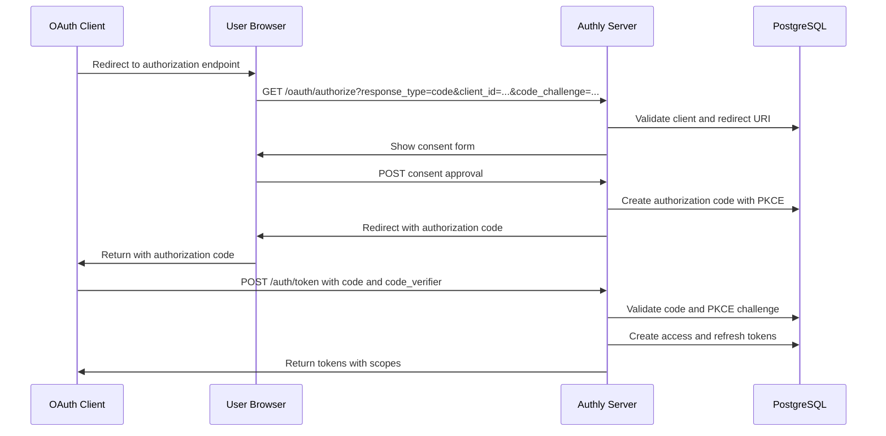
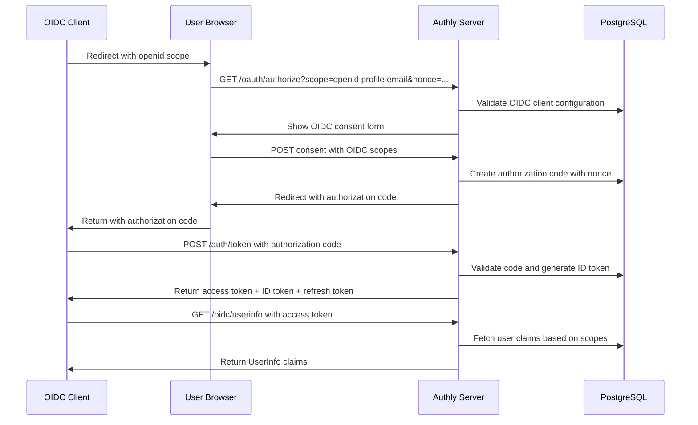
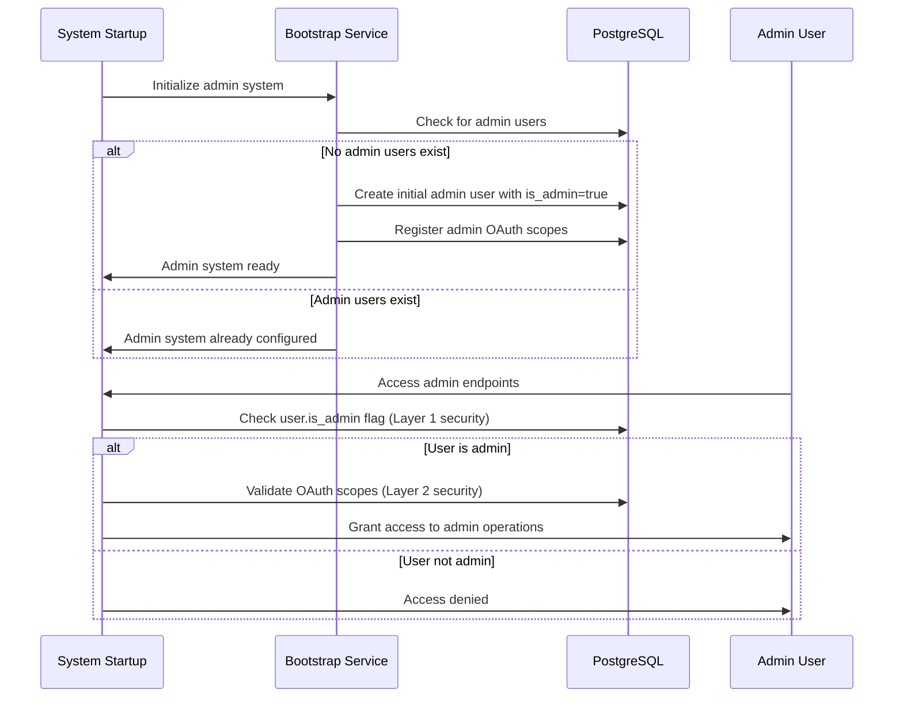

# Authly Architecture Documentation

## Overview

Authly is a production-ready OAuth 2.1 + OpenID Connect Core 1.0 + Session Management 1.0 authorization server built with modern Python patterns and enterprise-grade security. This document provides comprehensive architectural guidance for understanding, maintaining, and extending the system.

## Architectural Principles

### 1. Security-First Design
- **Defense in Depth**: Multiple layers of security controls throughout the system
- **Secure by Default**: All components default to secure configurations
- **Principle of Least Privilege**: Minimal required permissions for all operations
- **Zero Trust Architecture**: Every request is authenticated and authorized

### 2. Modern Python Patterns
- **Async-First**: Complete async/await implementation for maximum concurrency
- **Type Safety**: Comprehensive type annotations with Pydantic v2 validation
- **Package-by-Feature**: Domain-driven organization with self-contained modules
- **Dependency Injection**: FastAPI's advanced DI system for loose coupling

### 3. Production Readiness
- **Observability**: Comprehensive logging, health checks, and monitoring
- **Scalability**: Stateless design with pluggable backends for horizontal scaling
- **Reliability**: Circuit breakers, rate limiting, and graceful degradation
- **Maintainability**: Clean architecture with clear separation of concerns

### 4. Standards Compliance
- **OAuth 2.1**: Full RFC compliance with mandatory PKCE support
- **OpenID Connect Core 1.0**: Complete OIDC implementation with Session Management 1.0 and proper discovery
- **JWT Best Practices**: Secure token handling with proper validation
- **OWASP Security**: Following OWASP guidelines for authentication systems

## System Architecture

### High-Level Architecture

```
┌─────────────────────────────────────────────────────────────────┐
│                        Authly OAuth 2.1 + OIDC Server         │
├─────────────────────────────────────────────────────────────────┤
│  API Layer (FastAPI)                                           │
│  ┌──────────────┬──────────────┬──────────────┬─────────────┐   │
│  │ OAuth Router │ OIDC Router  │ Admin Router │ Auth Router │   │
│  │ /oauth/*     │ /oidc/*      │ /admin/*     │ /auth/*     │   │
│  └──────────────┴──────────────┴──────────────┴─────────────┘   │
├─────────────────────────────────────────────────────────────────┤
│  Security Layer                                                │
│  ┌──────────────┬──────────────┬──────────────┬─────────────┐   │
│  │ JWT Auth     │ OAuth Scopes │ Rate Limiter │ Admin Auth  │   │
│  │ Dependencies │ Validation   │ Middleware   │ Two-Layer   │   │
│  └──────────────┴──────────────┴──────────────┴─────────────┘   │
├─────────────────────────────────────────────────────────────────┤
│  Service Layer (Business Logic)                                │
│  ┌──────────────┬──────────────┬──────────────┬─────────────┐   │
│  │ OAuth Service│ OIDC Service │ Token Service│ User Service│   │
│  │ Authorization│ ID Tokens    │ Lifecycle    │ Management  │   │
│  │ & Discovery  │ & UserInfo   │ & Rotation   │ & Roles     │   │
│  └──────────────┴──────────────┴──────────────┴─────────────┘   │
├─────────────────────────────────────────────────────────────────┤
│  Repository Layer (Data Access)                                │
│  ┌──────────────┬──────────────┬──────────────┬─────────────┐   │
│  │ Client Repo  │ Scope Repo   │ Token Repo   │ User Repo   │   │
│  │ OAuth Clients│ OAuth Scopes │ JWT Storage  │ User Accounts│   │
│  └──────────────┴──────────────┴──────────────┴─────────────┘   │
├─────────────────────────────────────────────────────────────────┤
│  Database Layer (PostgreSQL)                                   │
│  ┌──────────────┬──────────────┬──────────────┬─────────────┐   │
│  │ oauth_clients│ oauth_scopes │ tokens       │ users       │   │
│  │ + OIDC fields│ + admin perms│ + OAuth assoc│ + admin flag│   │
│  └──────────────┴──────────────┴──────────────┴─────────────┘   │
└─────────────────────────────────────────────────────────────────┘
```

### Component Architecture

#### 1. API Layer (`src/authly/api/`)
**Purpose**: HTTP endpoints, middleware, and request/response handling

**Key Components**:
- **OAuth Router** (`oauth_router.py`): OAuth 2.1 endpoints (authorize, token, discovery, revoke)
- **OIDC Router** (`oidc_router.py`): OpenID Connect endpoints (userinfo, jwks)
- **Admin Router** (`admin_router.py`): Administrative API with localhost security
- **Auth Router** (`auth_router.py`): Authentication endpoints with multiple grant types
- **Security Middleware**: Rate limiting, CORS, admin restrictions

**Design Patterns**:
- Router-based organization for clear endpoint grouping
- Dependency injection for authentication and authorization
- Middleware pipeline for cross-cutting concerns
- Pydantic models for request/response validation

#### 2. Security Layer
**Purpose**: Authentication, authorization, and security enforcement

**Two-Layer Security Model**:
```python
# Layer 1: Intrinsic Authority (Bootstrap Security)
user.is_admin = True  # Database-level admin flag

# Layer 2: OAuth Scopes (Fine-grained Permissions)
required_scopes = ["admin:clients:write", "admin:scopes:read"]
```

**Key Components**:
- **JWT Authentication**: Token validation with proper audience checks
- **OAuth Scope Validation**: Fine-grained permission enforcement
- **Admin Dependencies**: Two-layer security for administrative operations
- **Rate Limiting**: Brute force protection with pluggable backends

#### 3. Service Layer (`src/authly/{oauth,oidc,tokens,users}/`)
**Purpose**: Business logic, validation, and orchestration

**Package-by-Feature Organization**:
```
oauth/          # OAuth 2.1 implementation
├── models.py           # Data models
├── *_repository.py     # Data access
├── *_service.py        # Business logic
└── discovery.py        # Server metadata

oidc/           # OpenID Connect implementation
├── models.py           # OIDC-specific models
├── id_token.py         # ID token generation
├── userinfo.py         # UserInfo endpoint
├── jwks.py            # Key management
└── discovery.py        # OIDC discovery

tokens/         # Token lifecycle
├── models.py           # Token models
├── repository.py       # Token storage
├── service.py          # Token operations
└── store/             # Pluggable backends

users/          # User management
├── models.py           # User models
├── repository.py       # User data access
└── service.py          # User operations
```

**Service Layer Principles**:
- Clear separation between data access and business logic
- Async-first design for scalability
- Comprehensive error handling and validation
- Transaction management at service boundaries

#### 4. Repository Layer
**Purpose**: Data access abstraction and database operations

**Repository Pattern Benefits**:
- Clean separation from business logic
- Testable database operations
- Consistent error handling
- Transaction boundary management

**Key Repositories**:
- **ClientRepository**: OAuth client CRUD with OIDC extensions
- **ScopeRepository**: OAuth scope management with admin permissions
- **TokenRepository**: JWT storage with OAuth client associations
- **UserRepository**: User account management with role-based access
- **AuthorizationCodeRepository**: PKCE code lifecycle management

#### 5. Database Layer (PostgreSQL)
**Purpose**: Persistent storage with advanced PostgreSQL features

**Modern PostgreSQL Features**:
- **UUID Primary Keys**: Security and distribution benefits
- **Array Types**: Efficient storage of scopes and redirect URIs
- **JSON/JSONB**: Flexible metadata storage for OIDC client configurations
- **Indexes**: Strategic indexing for OAuth flow performance
- **Constraints**: Data integrity at the database level

## Core Flows

### 1. OAuth 2.1 Authorization Code Flow with PKCE



### 2. OpenID Connect Authorization Code Flow



### 3. Admin Bootstrap Flow (Solving IAM Paradox)



## Security Architecture

### 1. Authentication Mechanisms

**JWT Token Authentication**:
```python
# Token structure with OAuth integration
{
    "sub": "user-uuid",          # Subject (user ID)
    "iss": "https://auth.domain", # Issuer
    "aud": ["api", "client-id"],  # Audience
    "exp": 1234567890,           # Expiration
    "iat": 1234567890,           # Issued at
    "jti": "token-uuid",         # JWT ID for revocation
    "scope": "read write admin", # OAuth scopes
    "client_id": "oauth-client"  # Associated OAuth client
}
```

**Password Authentication** (Backward Compatibility):
- bcrypt hashing with secure salt generation
- Rate limiting on authentication attempts
- Account lockout after repeated failures

### 2. Authorization Model

**Two-Layer Security Architecture**:

**Layer 1: Intrinsic Authority**
- Database-level `is_admin` flag on user accounts
- Solves bootstrap paradox (admin access without OAuth dependency)
- Used for initial system setup and emergency access

**Layer 2: OAuth Scopes**
- Fine-grained permissions for specific operations
- Standard OAuth scope validation
- Hierarchical scope inheritance

**Admin Scopes Hierarchy**:
```
admin:system         # System-level operations
├── admin:users      # User management
├── admin:clients    # OAuth client management
│   ├── admin:clients:read    # Read OAuth clients
│   └── admin:clients:write   # Create/update OAuth clients
├── admin:scopes     # OAuth scope management
│   ├── admin:scopes:read     # Read OAuth scopes
│   └── admin:scopes:write    # Create/update OAuth scopes
└── admin:tokens     # Token management
    ├── admin:tokens:read     # Read token information
    └── admin:tokens:revoke   # Revoke tokens
```

### 3. Security Controls

**Input Validation**:
- Pydantic v2 models with comprehensive constraints
- SQL injection prevention with parameterized queries
- XSS prevention with proper template escaping

**Rate Limiting**:
```python
# Configurable rate limiting per endpoint
@rate_limiter.limit("5/minute")  # Login attempts
@rate_limiter.limit("100/minute")  # API calls
@rate_limiter.limit("10/minute")   # Admin operations
```

**CORS and Security Headers**:
- Configurable CORS policies
- Security headers (HSTS, CSP, X-Frame-Options)
- Cookie security (HttpOnly, Secure, SameSite)

## Data Architecture

### Database Schema Design

**Core Tables with OAuth 2.1 + OIDC Extensions**:

```sql
-- Users with admin authority
CREATE TABLE users (
    id UUID PRIMARY KEY DEFAULT gen_random_uuid(),
    username VARCHAR(50) UNIQUE NOT NULL,
    email VARCHAR(255) UNIQUE NOT NULL,
    password_hash VARCHAR(255) NOT NULL,
    is_admin BOOLEAN DEFAULT false,  -- Layer 1 security
    is_active BOOLEAN DEFAULT true,
    is_verified BOOLEAN DEFAULT false,
    created_at TIMESTAMP WITH TIME ZONE DEFAULT CURRENT_TIMESTAMP,
    updated_at TIMESTAMP WITH TIME ZONE DEFAULT CURRENT_TIMESTAMP
);

-- OAuth clients with OIDC extensions
CREATE TABLE oauth_clients (
    id UUID PRIMARY KEY DEFAULT gen_random_uuid(),
    client_id VARCHAR(255) UNIQUE NOT NULL,
    client_name VARCHAR(255) NOT NULL,
    client_secret_hash VARCHAR(255),  -- NULL for public clients
    client_type VARCHAR(20) NOT NULL CHECK (client_type IN ('confidential', 'public')),
    redirect_uris TEXT[] NOT NULL,
    
    -- OAuth 2.1 requirements
    require_pkce BOOLEAN DEFAULT true,
    
    -- OIDC-specific fields (15 additional fields)
    application_type VARCHAR(20) DEFAULT 'web',
    token_endpoint_auth_method VARCHAR(50) DEFAULT 'client_secret_basic',
    id_token_signed_response_alg VARCHAR(10) DEFAULT 'RS256',
    subject_type VARCHAR(20) DEFAULT 'public',
    sector_identifier_uri TEXT,
    request_uris TEXT[],
    -- ... additional OIDC fields
    
    is_active BOOLEAN DEFAULT true,
    created_at TIMESTAMP WITH TIME ZONE DEFAULT CURRENT_TIMESTAMP,
    updated_at TIMESTAMP WITH TIME ZONE DEFAULT CURRENT_TIMESTAMP
);

-- OAuth scopes with admin permissions
CREATE TABLE oauth_scopes (
    id UUID PRIMARY KEY DEFAULT gen_random_uuid(),
    scope_name VARCHAR(255) UNIQUE NOT NULL,
    description TEXT,
    is_default BOOLEAN DEFAULT false,
    is_admin_scope BOOLEAN DEFAULT false,  -- Admin permission flag
    is_active BOOLEAN DEFAULT true,
    created_at TIMESTAMP WITH TIME ZONE DEFAULT CURRENT_TIMESTAMP
);

-- Authorization codes with PKCE
CREATE TABLE authorization_codes (
    id UUID PRIMARY KEY DEFAULT gen_random_uuid(),
    code VARCHAR(255) UNIQUE NOT NULL,
    client_id UUID NOT NULL REFERENCES oauth_clients(id),
    user_id UUID NOT NULL REFERENCES users(id),
    scopes TEXT[] NOT NULL,
    code_challenge VARCHAR(255) NOT NULL,
    code_challenge_method VARCHAR(10) DEFAULT 'S256',
    redirect_uri TEXT NOT NULL,
    nonce VARCHAR(255),  -- OIDC nonce parameter
    expires_at TIMESTAMP WITH TIME ZONE NOT NULL,
    created_at TIMESTAMP WITH TIME ZONE DEFAULT CURRENT_TIMESTAMP
);

-- Tokens with OAuth client association
CREATE TABLE tokens (
    id UUID PRIMARY KEY DEFAULT gen_random_uuid(),
    user_id UUID NOT NULL REFERENCES users(id),
    client_id UUID REFERENCES oauth_clients(id),  -- OAuth client association
    token_jti VARCHAR(64) UNIQUE NOT NULL,
    token_type VARCHAR(10) NOT NULL CHECK (token_type IN ('access', 'refresh')),
    scopes TEXT[],  -- OAuth scopes for this token
    invalidated BOOLEAN DEFAULT false,
    expires_at TIMESTAMP WITH TIME ZONE NOT NULL,
    created_at TIMESTAMP WITH TIME ZONE DEFAULT CURRENT_TIMESTAMP
);

-- JWKS keys for OIDC
CREATE TABLE jwks_keys (
    id UUID PRIMARY KEY DEFAULT gen_random_uuid(),
    key_id VARCHAR(255) UNIQUE NOT NULL,
    key_type VARCHAR(10) NOT NULL,  -- 'RSA', 'EC', 'oct'
    algorithm VARCHAR(10) NOT NULL,  -- 'RS256', 'ES256', 'HS256'
    key_data JSONB NOT NULL,  -- JWK representation
    is_active BOOLEAN DEFAULT true,
    created_at TIMESTAMP WITH TIME ZONE DEFAULT CURRENT_TIMESTAMP
);
```

### Indexing Strategy

**Performance Indexes**:
```sql
-- Authentication lookups
CREATE INDEX idx_users_email ON users(email) WHERE is_active = true;
CREATE INDEX idx_users_username ON users(username) WHERE is_active = true;

-- OAuth flow optimization
CREATE INDEX idx_clients_client_id ON oauth_clients(client_id) WHERE is_active = true;
CREATE INDEX idx_auth_codes_code ON authorization_codes(code) WHERE expires_at > CURRENT_TIMESTAMP;
CREATE INDEX idx_tokens_jti ON tokens(token_jti) WHERE invalidated = false;

-- Admin operations
CREATE INDEX idx_scopes_admin ON oauth_scopes(scope_name) WHERE is_admin_scope = true;
CREATE INDEX idx_users_admin ON users(id) WHERE is_admin = true;
```

## Configuration Architecture

### Configuration Management

**Multi-Provider Configuration System**:
```python
# Strategy pattern for different environments
class AuthlyConfig:
    @classmethod
    def load(cls, secret_provider: SecretProvider, db_provider: DatabaseProvider):
        return cls(
            database_url=db_provider.get_database_url(),
            jwt_secret=secret_provider.get_jwt_secret(),
            jwt_refresh_secret=secret_provider.get_jwt_refresh_secret(),
            # ... additional configuration
        )

# Environment-specific providers
EnvSecretProvider()      # Production: environment variables
FileSecretProvider()     # Development: .env files
StaticSecretProvider()   # Testing: hardcoded values
```

**Configuration Hierarchy**:
1. **Environment Variables** (Production)
2. **Configuration Files** (Development)
3. **Default Values** (Fallback)

### Secret Management

**Secure Secret Storage**:
```python
class SecureSecrets:
    """Memory-safe secret storage with encryption."""
    
    def __init__(self):
        self._key = Fernet.generate_key()
        self._cipher = Fernet(self._key)
        self._secrets = {}
    
    def store_secret(self, name: str, value: str) -> None:
        encrypted = self._cipher.encrypt(value.encode())
        self._secrets[name] = encrypted
        # Clear original value from memory
        del value
    
    def __del__(self):
        # Secure cleanup on destruction
        for key in self._secrets:
            self._secrets[key] = b'\x00' * len(self._secrets[key])
```

## Deployment Architecture

### Production Deployment

**Multi-Stage Docker Build**:
```dockerfile
# Stage 1: Dependencies
FROM python:3.13-slim as dependencies
RUN pip install uv
COPY pyproject.toml uv.lock ./
RUN uv export --no-hashes > requirements.txt

# Stage 2: Application
FROM python:3.13-slim as application
COPY --from=dependencies requirements.txt .
RUN pip install --no-cache-dir -r requirements.txt
COPY src/ ./src/
RUN useradd --create-home --shell /bin/bash authly
USER authly
EXPOSE 8000
CMD ["python", "-m", "authly", "serve"]
```

**Kubernetes Deployment**:
```yaml
apiVersion: apps/v1
kind: Deployment
metadata:
  name: authly-server
spec:
  replicas: 3
  selector:
    matchLabels:
      app: authly
  template:
    metadata:
      labels:
        app: authly
    spec:
      containers:
      - name: authly
        image: authly:latest
        ports:
        - containerPort: 8000
        env:
        - name: DATABASE_URL
          valueFrom:
            secretKeyRef:
              name: authly-secrets
              key: database-url
        - name: JWT_SECRET_KEY
          valueFrom:
            secretKeyRef:
              name: authly-secrets
              key: jwt-secret
        livenessProbe:
          httpGet:
            path: /health
            port: 8000
          initialDelaySeconds: 30
          periodSeconds: 10
        readinessProbe:
          httpGet:
            path: /health/ready
            port: 8000
          initialDelaySeconds: 5
          periodSeconds: 5
```

### Scaling Considerations

**Horizontal Scaling**:
- Stateless application design
- Database connection pooling
- Redis for distributed rate limiting
- Load balancer with session affinity for OAuth flows

**Performance Optimization**:
- Async connection pooling with psycopg3
- Strategic database indexing
- JWT token caching
- OIDC discovery metadata caching

## Testing Architecture

### Testing Philosophy

**Real Integration Testing**:
- PostgreSQL testcontainers for authentic database testing
- Real HTTP requests with FastAPI TestClient
- No mocking of core components
- Transaction isolation for test independence

### Test Organization

**Test Categories**:
```
tests/
├── test_auth_*.py           # Authentication flows
├── test_oauth_*.py          # OAuth 2.1 compliance
├── test_oidc_*.py           # OpenID Connect flows
├── test_admin_*.py          # Admin API and CLI
├── test_users_*.py          # User management
├── test_tokens_*.py         # Token lifecycle
├── test_repositories_*.py   # Data access layer
├── test_services_*.py       # Business logic
└── test_integration_*.py    # End-to-end flows
```

**Test Infrastructure**:
```python
# Real database testing with testcontainers
@pytest.fixture(scope="session")
async def postgres_container():
    container = PostgresContainer("postgres:17")
    with container:
        yield container

# Transaction isolation for test independence
@pytest.fixture
async def transaction_manager(postgres_container):
    settings = DatabaseSettings.from_container(postgres_container)
    db = Database(settings)
    await db.create_pool()
    yield TransactionManager(db.pool)
    await db.cleanup()

# Real API testing
@pytest.fixture
async def test_client(transaction_manager):
    app = create_app(transaction_manager)
    async with AsyncTestClient(app) as client:
        yield client
```

## Extension Points

### 1. Custom Authentication Providers

**OAuth Provider Interface**:
```python
class OAuthProvider(ABC):
    @abstractmethod
    async def validate_client(self, client_id: str, client_secret: str) -> bool:
        pass
    
    @abstractmethod
    async def generate_authorization_code(self, client_id: str, user_id: str, scopes: List[str]) -> str:
        pass
```

### 2. Custom Token Stores

**Token Store Interface**:
```python
class TokenStore(ABC):
    @abstractmethod
    async def store_token(self, token: TokenModel) -> None:
        pass
    
    @abstractmethod
    async def get_token(self, jti: str) -> Optional[TokenModel]:
        pass
    
    @abstractmethod
    async def revoke_token(self, jti: str) -> bool:
        pass
```

### 3. Custom Rate Limiters

**Rate Limiter Interface**:
```python
class RateLimiter(ABC):
    @abstractmethod
    async def is_allowed(self, key: str, limit: int, window: int) -> bool:
        pass
    
    @abstractmethod
    async def record_request(self, key: str) -> None:
        pass
```

## Architectural Decision Records

### ADR-001: Two-Layer Security Model

**Decision**: Implement both intrinsic authority (is_admin flag) and OAuth scopes for admin access.

**Rationale**: 
- Solves bootstrap paradox (how to create first OAuth client without OAuth access)
- Provides emergency access mechanism
- Enables fine-grained permissions while maintaining system access

**Consequences**:
- Slightly more complex authorization logic
- Clear separation between system access and functional permissions
- Easier system recovery and maintenance

### ADR-002: Package-by-Feature Organization

**Decision**: Organize code by business domain rather than technical layer.

**Rationale**:
- Higher cohesion within feature modules
- Easier to understand and maintain
- Better encapsulation of domain logic
- Supports microservice extraction if needed

**Consequences**:
- Some code duplication across features
- Clearer module boundaries
- Better team ownership of features

### ADR-003: Real Integration Testing

**Decision**: Use testcontainers and real databases for all integration tests.

**Rationale**:
- Higher confidence in database interactions
- Catches real-world integration issues
- Tests actual SQL queries and constraints
- No mocking complexity or maintenance

**Consequences**:
- Slower test execution
- Higher test infrastructure complexity
- Much higher confidence in deployments
- Easier debugging of integration issues

### ADR-004: Async-First Design

**Decision**: Implement complete async/await pattern throughout the application.

**Rationale**:
- Better scalability under load
- More efficient resource utilization
- Modern Python best practices
- Future-proof for high-concurrency scenarios

**Consequences**:
- Slightly more complex code patterns
- Requires async-compatible libraries
- Better performance characteristics
- More complex debugging in some cases

## Monitoring and Observability

### Logging Strategy

**Structured Logging**:
```python
import structlog

logger = structlog.get_logger("authly.oauth")

await logger.ainfo(
    "oauth_authorization_granted",
    client_id=client.client_id,
    user_id=str(user.id),
    scopes=requested_scopes,
    duration_ms=duration
)
```

**Log Levels and Categories**:
- **ERROR**: System errors, security violations, integration failures
- **WARN**: Suspicious activity, deprecated features, rate limit warnings
- **INFO**: Business events, successful operations, system state changes
- **DEBUG**: Detailed flow information, performance metrics

### Health Checks

**Multi-Level Health Monitoring**:
```python
@router.get("/health")
async def health_check():
    return {"status": "healthy", "timestamp": datetime.utcnow()}

@router.get("/health/ready")
async def readiness_check(db: Database = Depends(get_database)):
    """Deep health check including database connectivity."""
    try:
        async with db.connection() as conn:
            await conn.execute("SELECT 1")
        return {"status": "ready", "database": "connected"}
    except Exception as e:
        raise HTTPException(status_code=503, detail=f"Database unavailable: {e}")

@router.get("/health/live")
async def liveness_check():
    """Minimal liveness check for container orchestration."""
    return {"status": "alive"}
```

### Metrics and Monitoring

**Key Metrics to Monitor**:
- OAuth authorization success/failure rates
- Token generation and validation latency
- Database connection pool utilization
- Authentication attempt rates and failures
- Admin operation frequency and types

**Security Monitoring**:
- Failed authentication attempts
- Suspicious OAuth flow patterns
- Admin privilege escalation attempts
- Rate limit violations
- Token validation failures

## Best Practices

### 1. Security Best Practices

- **Never log sensitive data** (passwords, tokens, secrets)
- **Use constant-time comparisons** for security-critical operations
- **Implement proper CSRF protection** for state-changing operations
- **Validate all inputs** at API boundaries with Pydantic models
- **Use parameterized queries** to prevent SQL injection
- **Implement proper session management** with secure cookies

### 2. Performance Best Practices

- **Use connection pooling** for database operations
- **Implement proper caching** for frequently accessed data
- **Use async patterns** throughout the application
- **Optimize database queries** with proper indexing
- **Implement rate limiting** to prevent abuse
- **Use lazy loading** for expensive operations

### 3. Maintainability Best Practices

- **Write comprehensive tests** for all new features
- **Document architectural decisions** in ADRs
- **Use type annotations** throughout the codebase
- **Follow consistent code formatting** with Black and isort
- **Implement proper error handling** with specific exception types
- **Maintain backward compatibility** when possible

### 4. Deployment Best Practices

- **Use multi-stage Docker builds** for smaller images
- **Implement proper health checks** for container orchestration
- **Use secrets management** for sensitive configuration
- **Monitor application metrics** and set up alerting
- **Implement proper logging** for troubleshooting
- **Use database migrations** for schema changes

This architecture documentation provides a comprehensive foundation for understanding, maintaining, and extending the Authly OAuth 2.1 + OIDC authorization server. The design emphasizes security, scalability, and maintainability while following modern Python and web application best practices.