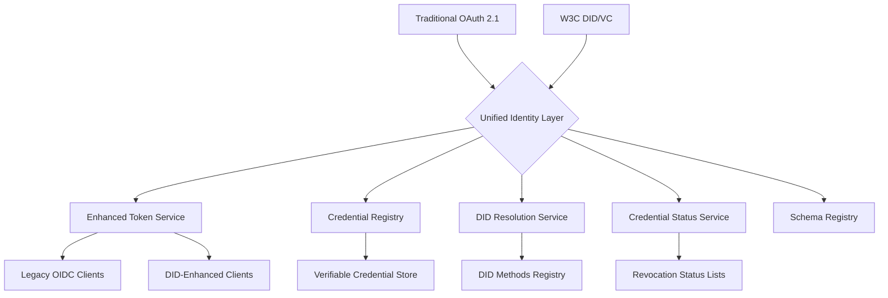

# W3C Decentralized Identifiers (DID) Integration Roadmap

**Document Type:** Future Feature Technical Specification  
**Version:** 2.0 (Enhanced)  
**Created:** 2025-07-16  
**Status:** Future Implementation Planning  
**Priority:** Medium-High (Strategic Innovation)

## 📋 **Executive Summary**

This document outlines the strategic roadmap for integrating W3C Decentralized Identifiers (DIDs) and Verifiable Credentials (VCs) into Authly. This evolution will position Authly as a next-generation authorization server that bridges traditional OAuth 2.1/OIDC with emerging decentralized identity standards. 

The implementation focuses on high-value enterprise use cases, robust user-centric key management, and a seamless developer experience, all while maintaining full backward compatibility with existing OAuth workflows.

## 🎯 **Strategic Vision**

### **Market Positioning**
Authly will become the **first production-ready OAuth server with native, user-friendly DID support**, targeting the emerging intersection of traditional enterprise authentication and decentralized identity technologies. Our positioning is **"OIDC with superpowers"**—all the maturity of OAuth combined with the future-proof capabilities of decentralized identity.

### **Value Proposition**
- **Future-proof authentication**: Support both centralized and decentralized identity models in a single platform.
- **Secure and Simple Identity Recovery**: Solve the "lost key, lost identity" problem with user-centric recovery mechanisms.
- **Reduced integration complexity**: DIDs eliminate the need for complex, brittle federation setups.
- **Enhanced privacy and control**: Users control their own identity and credentials.
- **Cryptographic security**: Verifiable credentials provide tamper-proof, trustworthy authentication.

### **Success Metrics**
- **Enterprise adoption**: 50+ B2B customers using DID features within 18 months.
- **Technical leadership**: First OAuth server to achieve DID interoperability certification.
- **Developer adoption**: 1,000+ developers actively using the DID developer toolkit.
- **Standards influence**: Authly team contributing to W3C DID and DIF specifications.

## 🔐 **User-Centric Identity Management & Recovery**

**Core Challenge:** The single greatest barrier to mainstream DID adoption is the "lost key = lost identity" problem. Our strategy directly confronts this by making secure, user-friendly key management and recovery a core, Phase 1 feature.

### **Key Management Philosophy**
- **User in Control**: The user, not the server, always holds the private keys.
- **Frictionless Experience**: Key management should be as seamless as modern password managers.
- **No Single Point of Failure**: Eliminate scenarios where a single lost device results in a lost identity.

### **Multi-Layered Recovery Architecture**

Authly will support a multi-layered approach to key management, allowing users to choose their preferred balance of security and convenience.

1.  **Password Manager Sync (Primary Method)**: Integration with Passkeys and major password managers (1Password, Bitwarden) to sync DIDs across a user's devices. This is the recommended approach for most users.
2.  **Social Recovery**: Users can designate trusted entities (e.g., other personal devices, family members, or even institutions) as recovery agents. Recovering an identity would require a quorum (e.g., 2 of 3) of these agents to approve the action.
3.  **Hardware Token Backup**: Support for exporting an encrypted, standards-based backup of a DID to a hardware token (like a YubiKey) or a secure file for "cold storage".

### **Implementation in Core Phases**
- **Phase 1**: Implement Passkey/Password Manager integration for DID creation and sync. Add support for secure, encrypted file-based backups.
- **Phase 2**: Introduce the Social Recovery framework, allowing users to configure trusted recovery agents via a simple UI.

## 🔄 **DID + OIDC Compatibility Analysis**

### **Architectural Relationship: Complementary, Not Competitive**
DIDs and OIDC operate at different layers and enhance each other:

```
┌─────────────────────────────────────┐
│        Application Layer            │ ← OAuth 2.1/OIDC (Authorization)
├─────────────────────────────────────┤
│        Identity Layer               │ ← DIDs (Identity Resolution & Recovery)
├─────────────────────────────────────┤
│        Cryptographic Layer          │ ← Verifiable Credentials (Proof)
└─────────────────────────────────────┘
```
- **OIDC** = "Who can access what" (authorization protocol)
- **DIDs** = "Who is this person" (identity resolution, verification, and recovery)

### **Integration Patterns**

#### **Pattern 1: DID-Enhanced OIDC (Primary Approach)**
```python
# Traditional OIDC ID Token
{
  "iss": "https://authly.example.com",
  "sub": "user123",                    # Traditional subject
  "email": "alice@example.com",
  "name": "Alice Johnson"
}

# DID-Enhanced OIDC ID Token
{
  "iss": "https://authly.example.com",
  "sub": "did:web:alice.example.com",  # DID as subject identifier
  "email": "alice@example.com",
  "name": "Alice Johnson",
  "did_document": "...",               # Optional: Full DID document
  "verification_method": "did:web:alice.example.com#key-1",
  "vc_claims": {                       # Claims from verified credentials
    "professional_license": "...",
    "employment_status": "active"
  }
}
```

#### **Pattern 2: Parallel Authentication Flows**
```python
@router.get("/oauth/authorize")
async def authorization_endpoint(
    # Standard OIDC parameters
    response_type: str,
    client_id: str,
    redirect_uri: str,
    scope: str,
    
    # DID enhancement parameters (optional)
    did_hint: Optional[str] = None,           # Suggest which DID to use
    vc_requirements: Optional[str] = None,    # Required verifiable credentials
    auth_method: str = "traditional"          # "traditional" | "did" | "hybrid"
):
    if auth_method == "did":
        # Pure DID authentication, still returns OIDC-compliant tokens
        return await handle_did_authentication(...)
    elif auth_method == "hybrid":
        # Traditional auth + DID verification
        return await handle_hybrid_authentication(...)
    else:
        # Standard OIDC flow
        return await handle_traditional_authentication(...)
```

### **Backward Compatibility Strategy**

#### **Phase 1: Transparent Enhancement**
```javascript
// Existing OIDC client code works unchanged
const userInfo = await fetch('/oidc/userinfo', {
  headers: { 'Authorization': `Bearer ${accessToken}` }
});

const user = await userInfo.json();
// Standard OIDC claims still work
console.log(user.sub);    // Now might be a DID instead of user123
console.log(user.email);  // Still works as before

// New DID claims available if present
if (user.did) {
  console.log('User has DID:', user.did);
  console.log('Verified credentials:', user.vc_claims);
}
```

#### **Phase 2: DID-Aware Clients**
```javascript
// Enhanced client can request DID-specific features
const authUrl = new URL('/oauth/authorize', 'https://authly.example.com');
authUrl.searchParams.set('response_type', 'code');
authUrl.searchParams.set('client_id', 'my-app');
authUrl.searchParams.set('scope', 'openid profile email did:credentials');
authUrl.searchParams.set('auth_method', 'hybrid');  # Request DID enhancement
```

## 🏗️ **Technical Architecture Overview**

### **Hybrid Identity Architecture**



### **Credential Revocation Architecture**
To ensure credentials can be invalidated securely and in a decentralized manner, Authly will implement the **W3C Verifiable Credential Status List 2021** specification.

- **Mechanism**: Issuers publish a bitstring list where each bit corresponds to a credential's status (valid or revoked). This is highly efficient and privacy-preserving.
- **`CredentialStatusService`**: A new service responsible for creating, managing, and publishing these status lists.
- **Discovery**: The `credential_status_endpoint` will be added to the OIDC discovery document, allowing verifiers to locate the relevant status lists.

### **OIDC Discovery Enhancement**
```python
# Enhanced OIDC discovery document with DID extensions
@router.get("/.well-known/openid_configuration")
async def enhanced_oidc_discovery() -> Dict[str, Any]:
    """OIDC discovery with DID capability advertisement"""
    
    base_config = {
        # Standard OIDC metadata
        "issuer": "https://authly.example.com",
        "authorization_endpoint": "https://authly.example.com/oauth/authorize", 
        "token_endpoint": "https://authly.example.com/oauth/token",
        "userinfo_endpoint": "https://authly.example.com/oidc/userinfo",
        "jwks_uri": "https://authly.example.com/.well-known/jwks.json",
        # ... other standard fields
    }
    
    # Add DID extensions if enabled
    if DID_CONFIG.enable_did_support:
        base_config.update({
            # DID capability advertisement
            "did_methods_supported": DID_CONFIG.supported_did_methods,
            "verifiable_credentials_supported": True,
            "credential_formats_supported": ["jwt_vc", "ldp_vc"],
            
            # Enhanced scopes
            "scopes_supported": base_config["scopes_supported"] + [
                "did:read", "did:credentials", "vc:issue", "vc:verify"
            ],
            
            # DID-specific endpoints
            "did_resolution_endpoint": "https://authly.example.com/did/resolve",
            "credential_verification_endpoint": "https://authly.example.com/credentials/verify",
            "credential_status_endpoint": "https://authly.example.com/credentials/status",
            "schema_registry_endpoint": "https://authly.example.com/schemas",

            # Subject identifier types
            "subject_types_supported": ["public", "pairwise", "did"]
        })
    
    return base_config
```

### **OIDC UserInfo Enhancement**
```python
@router.get("/oidc/userinfo")
async def enhanced_userinfo_endpoint(
    token: str = Depends(verify_access_token)
) -> Dict[str, Any]:
    """OIDC UserInfo endpoint enhanced with DID claims"""
    
    user = await get_user_from_token(token)
    
    # Standard OIDC claims
    claims = {
        "sub": user.primary_did or user.user_id,  # DID as primary identifier
        "email": user.email,
        "name": user.full_name,
    }
    
    # Enhanced DID claims (if user has DID)
    if user.primary_did:
        claims.update({
            "did": user.primary_did,
            "did_method": user.primary_did.split(":")[1]
        })
        
        # Include verified credential claims if requested scope
        token_scopes = await get_token_scopes(token)
        if "did:credentials" in token_scopes:
            claims["vc_claims"] = await extract_vc_claims(user.verified_credentials)
    
    return claims
```

## 🏛️ **Governance and Credential Schema Management**

For enterprise use cases to succeed, the structure of Verifiable Credentials must be predictable and discoverable.

### **Credential Schema Registry**
Authly will provide a **Credential Schema Registry** where organizations can publish, discover, and manage JSON schemas for the VCs they issue and consume.

- **Functionality**:
    - Publish new schemas (e.g., for an `EmployeeCredential`).
    - Version schemas to allow for graceful evolution.
    - Discover schemas via a public, cacheable API endpoint.
- **Endpoint**: A new endpoint, `/schemas/{schema_id}`, will be added for retrieving schema definitions.

### **B2B Federation Governance**
For B2B scenarios, Authly will provide a default **Trust Framework Template**. This template will be a legal and technical document that partner organizations can use to agree upon:
- The schemas for credentials they will exchange.
- The required claims for authentication and authorization.
- The DID methods and revocation policies they will use.

## 🧪 **Testing Strategy & Developer Experience (DX)**

A strong testing culture is a core tenet of Authly. This will extend to our DID/VC implementation with a focus on both robustness and a world-class developer experience.

### **Comprehensive Testing Strategy**
1.  **Unit Testing**: All new components (`DIDResolver`, `CredentialStatusService`, signature libraries) will have 100% unit test coverage.
2.  **Integration Testing**: The test suite will be extended with a **"Mock DID Wallet"** test harness. This will allow for end-to-end testing of DID authentication flows without requiring a real browser or wallet.
3.  **Interoperability Testing**: We will maintain a suite of tests that run against other major open-source DID implementations and popular identity wallets to ensure broad compatibility.

### **Developer Experience (DX) Toolkit**
To accelerate adoption, we will provide a rich toolkit for developers building on Authly.
1.  **`did:dev` Method**: A local-only, transient DID method (`did:dev:<random_string>`) that requires no network calls or complex setup, allowing for rapid prototyping and testing.
2.  **Test Credential Faucet**: An API endpoint where developers can request signed, valid VCs of various types (e.g., `EmailCredential`, `EmployeeCredential`) for use in their development environment.
3.  **DID/VC Debugger**: An interactive web tool where developers can paste a DID Document or a Verifiable Credential and get a detailed breakdown of its structure, signature validity, and revocation status, with clear, actionable error messages.

## 🚀 **Implementation Roadmap**

### **Phase 1: Foundation & User Security (Months 1-3)**
**Objective:** Basic DID infrastructure, storage, and user-centric key management.
- **Core DID Support**: Enhanced User Model, DID Document storage.
- **Database Schema Extensions**: `did_documents`, `verification_methods`, `did_resolution_cache`.
- **Basic DID Resolution**: `DIDResolutionService` supporting `did:web` and `did:key`.
- **User Key Management**:
    - **Implement Passkey/`did:key` creation flow.**
    - **Provide secure, encrypted file-based backup for DIDs.**

### **Phase 2: Authentication & Recovery (Months 4-6)**
**Objective:** DID-based authentication flows and social recovery.
- **DID Authentication Endpoint**: `/auth/did` for signature-based auth.
- **Enhanced OAuth Authorization Flow**: Extend `/oauth/authorize` to accept DID hints.
- **Social Recovery Implementation**:
    - **Allow users to designate trusted DIDs as recovery agents.**
    - **Build the UI and service logic for quorum-based recovery.**

### **Phase 3: Verifiable Credentials & Revocation (Months 7-9)**
**Objective:** Issue, verify, and revoke credentials.
- **Credential Issuance Service**: `VerifiableCredentialService` for issuing VCs.
- **Credential Verification**: Enhance `verify_credential` with robust checks.
- **Revocation Implementation**:
    - **Build the `CredentialStatusService` based on the Status List 2021 spec.**
    - **Add status checking to the verification flow.**
- **Developer Toolkit**: Launch the initial version of the DX Toolkit (did:dev, Test Faucet).

### **Phase 4: Enterprise Integration & Governance (Months 10-12)**
**Objective:** Production-ready enterprise features.
- **B2B Identity Federation**: `EnterpriseIdentityService` for managing trust relationships.
- **Federated Authentication Endpoint**: `/federation/authenticate`.
- **Governance Framework**:
    - **Launch the Credential Schema Registry.**
    - **Publish the B2B Trust Framework Template.**

## 📊 **Use Case Implementation Priorities**

### **Tier 1: Immediate Implementation (Months 1-6)**

#### **1. B2B SaaS Authentication**
```python
# Example: Marketing agency accessing client CRM
agency_employee_credential = {
    "type": ["VerifiableCredential", "EmployeeCredential"],
    "issuer": "did:web:marketing-agency.com",
    "credentialSubject": {
        "id": "did:key:employee123...",
        "role": "account_manager",
        "client_clearance": ["acme_corp", "beta_inc"]
    }
}
```
**Business Value:** Reduced integration costs, clear B2B pain point.

#### **2. API Service Authentication**
```python
# Services authenticate using DIDs instead of shared secrets
service_credential = {
    "type": ["VerifiableCredential", "ServiceCredential"],
    "issuer": "did:web:api-gateway.company.com",
    "credentialSubject": {
        "id": "did:web:payment-service.company.com",
        "allowed_operations": ["process_payment", "refund"]
    }
}
```
**Business Value:** Enhanced security, simplified key management.

*(Additional Tiers and detailed use cases from the original document are preserved here.)*

## 🔧 **Technical Implementation Details**

### **Configuration Management**
```python
class DIDConfig(BaseSettings):
    # Core DID settings
    enable_did_support: bool = False
    default_did_method: str = "web"
    issuer_did: Optional[str] = None
    
    # Resolution settings
    did_resolution_timeout: int = 10
    did_cache_ttl: int = 3600
    supported_did_methods: List[str] = ["web", "key", "jwk", "dev"] # Added 'dev'
    
    # Credential settings
    default_credential_validity_days: int = 365
    
    # Security settings
    require_did_document_https: bool = True
    
    # Federation settings
    enable_b2b_federation: bool = False

DID_CONFIG = DIDConfig()
```

### **Security Considerations**
*(This section is preserved from the original document, detailing DID document validation, key strength checks, etc.)*

### **Performance Optimization**
*(This section is preserved from the original document, detailing caching strategies, parallel processing, etc.)*

## 📈 **Adoption Strategy**
*(This section is preserved from the original document.)*

## 🚧 **Risk Mitigation**
*(This section is preserved from the original document, with an added risk for key management.)*

### **Security Risks**
- **Key Management Complexity**: Users may lose private keys or mismanage them.
  - *Mitigation*: **This is our highest priority user-facing risk.** Address with a multi-layered strategy: Passkey sync as the default, social recovery as a backup, and clear guidance for users. The goal is to make key management invisible for most users.

## 🔮 **Future Enhancements**
*(This section is preserved from the original document.)*

## 📝 **Success Metrics & KPIs**
*(This section is preserved from the original document, with added metrics for recovery and DX.)*

### **Adoption Metrics**
- **Active DIDs**: 10,000+ unique DIDs in first year.
- **Credential Issuance**: 50,000+ credentials issued.
- **Developer Adoption**: 1,000+ developers using DID APIs and DX Toolkit.
- **Successful Recoveries**: Track usage of recovery mechanisms, aiming for a >98% success rate for users who have configured it.

---

**Document Ownership:** Authly Development Team  
**Review Cycle:** Quarterly  
**Next Review:** 2025-10-16  
**Implementation Start:** Q1 2026 (pending business approval)