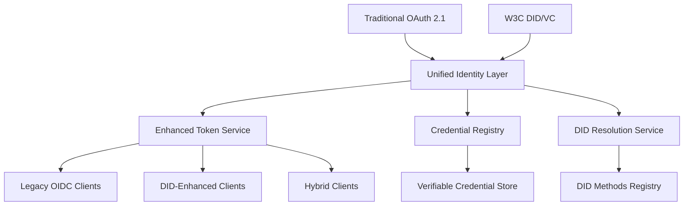

# W3C Decentralized Identifiers (DID) Integration Roadmap

**Document Type:** Future Feature Technical Specification  
**Version:** 1.0  
**Created:** 2025-07-13  
**Status:** Future Implementation Planning  
**Priority:** Medium-High (Strategic Innovation)

## 📋 **Executive Summary**

This document outlines the strategic roadmap for integrating W3C Decentralized Identifiers (DIDs) and Verifiable Credentials (VCs) into Authly, positioning it as a next-generation authorization server that bridges traditional OAuth 2.1/OIDC with emerging decentralized identity standards. The implementation will focus on high-value enterprise use cases while maintaining backward compatibility with existing OAuth workflows.

## 🎯 **Strategic Vision**

### **Market Positioning**
Authly will become the **first production-ready OAuth server with native DID support**, targeting the emerging intersection of traditional enterprise authentication and decentralized identity technologies.

### **Value Proposition**
- **Future-proof authentication** - Support both centralized and decentralized identity models
- **Reduced integration complexity** - DIDs eliminate complex federation setups
- **Enhanced privacy** - Users control their identity and credentials
- **Cryptographic security** - Verifiable credentials provide tamper-proof authentication

### **Success Metrics**
- **Enterprise adoption** - 50+ B2B customers using DID features within 18 months
- **Technical leadership** - First OAuth server to achieve DID interoperability certification
- **Developer adoption** - 1000+ developers experimenting with DID APIs
- **Standards influence** - Authly team contributing to W3C DID specifications

## 🔄 **DID + OIDC Compatibility Analysis**

### **Architectural Relationship: Complementary, Not Competitive**

**Key Insight:** DIDs and OIDC operate at different layers and enhance each other rather than compete:

```
┌─────────────────────────────────────┐
│        Application Layer            │ ← OAuth 2.1/OIDC (Authorization)
├─────────────────────────────────────┤
│        Identity Layer               │ ← DIDs (Identity Resolution)
├─────────────────────────────────────┤
│        Cryptographic Layer          │ ← Verifiable Credentials (Proof)
└─────────────────────────────────────┘
```

- **OIDC** = "Who can access what" (authorization/authentication protocol)
- **DIDs** = "Who is this person" (identity resolution and verification)

### **Integration Patterns**

#### **Pattern 1: DID-Enhanced OIDC (Primary Approach)**
```python
# Traditional OIDC ID Token
{
  "iss": "https://authly.example.com",
  "sub": "user123",                    # Traditional subject
  "email": "alice@example.com",
  "name": "Alice Johnson"
}

# DID-Enhanced OIDC ID Token
{
  "iss": "https://authly.example.com",
  "sub": "did:web:alice.example.com",  # DID as subject identifier
  "email": "alice@example.com",
  "name": "Alice Johnson",
  "did_document": "...",               # Optional: Full DID document
  "verification_method": "did:web:alice.example.com#key-1",
  "vc_claims": {                       # Claims from verified credentials
    "professional_license": "...",
    "employment_status": "active"
  }
}
```

#### **Pattern 2: Parallel Authentication Flows**
```python
@router.get("/oauth/authorize")
async def authorization_endpoint(
    # Standard OIDC parameters
    response_type: str,
    client_id: str,
    redirect_uri: str,
    scope: str,
    
    # DID enhancement parameters (optional)
    did_hint: Optional[str] = None,           # Suggest which DID to use
    vc_requirements: Optional[str] = None,    # Required verifiable credentials
    auth_method: str = "traditional"          # "traditional" | "did" | "hybrid"
):
    if auth_method == "did":
        # Pure DID authentication, still returns OIDC-compliant tokens
        return await handle_did_authentication(...)
    elif auth_method == "hybrid":
        # Traditional auth + DID verification
        return await handle_hybrid_authentication(...)
    else:
        # Standard OIDC flow
        return await handle_traditional_authentication(...)
```

### **Backward Compatibility Strategy**

#### **Phase 1: Transparent Enhancement**
```javascript
// Existing OIDC client code works unchanged
const userInfo = await fetch('/oidc/userinfo', {
  headers: { 'Authorization': `Bearer ${accessToken}` }
});

const user = await userInfo.json();
// Standard OIDC claims still work
console.log(user.sub);    // Now might be a DID instead of user123
console.log(user.email);  // Still works as before

// New DID claims available if present
if (user.did) {
  console.log('User has DID:', user.did);
  console.log('Verified credentials:', user.vc_claims);
}
```

#### **Phase 2: DID-Aware Clients**
```javascript
// Enhanced client can request DID-specific features
const authUrl = new URL('/oauth/authorize', 'https://authly.example.com');
authUrl.searchParams.set('response_type', 'code');
authUrl.searchParams.set('client_id', 'my-app');
authUrl.searchParams.set('scope', 'openid profile email did:credentials');
authUrl.searchParams.set('auth_method', 'hybrid');  # Request DID enhancement
```

## 🏗️ **Technical Architecture Overview**

### **Hybrid Identity Architecture**



### **Hybrid Identity Service Architecture**
```python
class HybridIdentityService:
    """Service supporting both traditional OIDC and DID-enhanced flows"""
    
    def __init__(self):
        self.traditional_auth = TraditionalOAuthService()
        self.did_auth = DIDAuthenticationService()
        self.credential_service = VerifiableCredentialService()
        self.did_resolver = DIDResolutionService()
    
    async def authenticate_user(
        self, 
        auth_request: AuthRequest
    ) -> AuthResult:
        """Unified authentication supporting multiple identity types"""
        
        if auth_request.has_did():
            # DID-based authentication
            did_result = await self.authenticate_with_did(auth_request)
            
            # Still return OIDC-compliant tokens
            return await self.create_oidc_tokens(
                subject=did_result.did,
                claims=did_result.verified_claims,
                auth_method="did_signature"
            )
            
        elif auth_request.has_verifiable_credential():
            # Credential-based authentication
            vc_result = await self.verify_credential(auth_request.credential)
            
            return await self.create_oidc_tokens(
                subject=vc_result.subject_did,
                claims=vc_result.credential_claims,
                auth_method="verifiable_credential"
            )
            
        else:
            # Traditional OIDC authentication
            return await self.traditional_authenticate(auth_request)
    
    async def create_oidc_tokens(
        self,
        subject: str,
        claims: Dict[str, Any],
        auth_method: str
    ) -> TokenSet:
        """Create OIDC-compliant tokens with optional DID enhancements"""
        
        # Standard OIDC ID token
        id_token_claims = {
            "iss": self.issuer,
            "sub": subject,
            "aud": auth_request.client_id,
            "exp": int(time.time()) + 3600,
            "iat": int(time.time()),
            "auth_time": int(time.time()),
            "auth_method": auth_method,  # Custom claim
        }
        
        # Add verified claims from DID/VC
        if claims:
            id_token_claims.update(claims)
        
        # If subject is a DID, add DID-specific claims
        if subject.startswith("did:"):
            id_token_claims.update({
                "did": subject,
                "did_method": subject.split(":")[1]
            })
        
        return TokenSet(
            access_token=await self.create_access_token(subject, scopes),
            id_token=await self.create_id_token(id_token_claims),
            refresh_token=await self.create_refresh_token(subject)
        )

class UnifiedIdentityService:
    """Unified service supporting both traditional and DID-based identity"""
    
    def __init__(self):
        self.traditional_auth = TraditionalOAuthService()
        self.did_auth = DIDAuthenticationService()
        self.credential_service = VerifiableCredentialService()
        self.did_resolver = DIDResolutionService()
    
    async def authenticate(self, auth_request: AuthRequest) -> AuthResult:
        """Unified authentication supporting multiple identity types"""
        if auth_request.has_did_proof():
            return await self.did_auth.authenticate(auth_request)
        elif auth_request.has_verifiable_credential():
            return await self.credential_service.verify(auth_request)
        else:
            return await self.traditional_auth.authenticate(auth_request)
```

### **OIDC Discovery Enhancement**
```python
# Enhanced OIDC discovery document with DID extensions
@router.get("/.well-known/openid_configuration")
async def enhanced_oidc_discovery() -> Dict[str, Any]:
    """OIDC discovery with DID capability advertisement"""
    
    base_config = {
        # Standard OIDC metadata
        "issuer": "https://authly.example.com",
        "authorization_endpoint": "https://authly.example.com/oauth/authorize", 
        "token_endpoint": "https://authly.example.com/oauth/token",
        "userinfo_endpoint": "https://authly.example.com/oidc/userinfo",
        "jwks_uri": "https://authly.example.com/.well-known/jwks.json",
        "response_types_supported": ["code"],
        "subject_types_supported": ["public"],
        "id_token_signing_alg_values_supported": ["RS256"],
        "scopes_supported": ["openid", "profile", "email"],
        "token_endpoint_auth_methods_supported": ["client_secret_basic", "client_secret_post"],
        "code_challenge_methods_supported": ["S256"]
    }
    
    # Add DID extensions if enabled
    if DID_CONFIG.enable_did_support:
        base_config.update({
            # DID capability advertisement
            "did_methods_supported": DID_CONFIG.supported_did_methods,
            "verifiable_credentials_supported": True,
            "did_authentication_methods_supported": [
                "Ed25519Signature2020",
                "JsonWebSignature2020"
            ],
            "credential_formats_supported": ["jwt_vc", "ldp_vc"],
            
            # Enhanced scopes
            "scopes_supported": base_config["scopes_supported"] + [
                "did:read", "did:credentials", "vc:issue", "vc:verify"
            ],
            
            # DID-specific endpoints
            "did_resolution_endpoint": "https://authly.example.com/did/resolve",
            "credential_verification_endpoint": "https://authly.example.com/credentials/verify",
            "did_authentication_endpoint": "https://authly.example.com/auth/did",
            
            # Subject identifier types
            "subject_types_supported": ["public", "pairwise", "did"]
        })
    
    return base_config
```

### **OIDC UserInfo Enhancement**
```python
@router.get("/oidc/userinfo")
async def enhanced_userinfo_endpoint(
    token: str = Depends(verify_access_token)
) -> Dict[str, Any]:
    """OIDC UserInfo endpoint enhanced with DID claims"""
    
    user = await get_user_from_token(token)
    
    # Standard OIDC claims
    claims = {
        "sub": user.primary_did or user.user_id,  # DID as primary identifier
        "email": user.email,
        "email_verified": user.email_verified,
        "name": user.full_name,
        "preferred_username": user.username
    }
    
    # Enhanced DID claims (if user has DID)
    if user.primary_did:
        claims.update({
            "did": user.primary_did,
            "did_document_url": f"/.well-known/did/{user.primary_did}",
            "verification_methods": [vm.id for vm in user.verification_methods],
            "did_method": user.primary_did.split(":")[1]
        })
        
        # Include verified credential claims if requested scope
        token_scopes = await get_token_scopes(token)
        if "did:credentials" in token_scopes:
            claims["vc_claims"] = await extract_vc_claims(user.verified_credentials)
    
    return claims
```

### **Real-World Integration Scenarios**

#### **Scenario 1: Enterprise SSO with Professional Credentials**
```python
# Employee logs in with traditional credentials
# System checks for professional certifications via DID/VC
# OIDC token includes both traditional and verified claims

enhanced_oidc_token = {
    "sub": "did:web:alice.company.com",
    "email": "alice@company.com", 
    "name": "Alice Johnson",
    
    # Traditional employment claims
    "department": "engineering",
    "employee_id": "EMP001",
    "role": "senior_engineer",
    
    # DID-verified professional credentials
    "aws_certification": "solutions-architect-professional",
    "security_clearance": "secret", 
    "professional_license": "PE-12345",
    "credential_issuers": [
        "did:web:aws.amazon.com",
        "did:web:security-agency.gov",
        "did:web:engineering-board.org"
    ]
}
```

#### **Scenario 2: Cross-Organization B2B Collaboration**
```python
# Partner company employee accesses your system
# Their DID proves employment at trusted partner
# OIDC token shows federation metadata and verified access rights

federated_oidc_token = {
    "sub": "did:web:bob.partner-company.com",
    "name": "Bob Smith",
    "email": "bob@partner-company.com",
    
    # Federation metadata 
    "federation_type": "b2b_partnership",
    "home_organization": "did:web:partner-company.com",
    "trust_framework": "enterprise_federation_v1",
    
    # Verified access rights from partner's credential
    "partner_access_level": "read_write",
    "project_clearance": ["project_alpha", "project_beta"],
    "employment_status": "active",
    "department": "integration_team"
}
```

#### **Scenario 3: API Service Authentication**
```python
# Microservice authenticates using DID instead of shared secrets
# OIDC token carries service identity and capabilities

service_oidc_token = {
    "sub": "did:web:payment-service.company.com",
    "client_id": "payment-processor-v2",
    
    # Service identity claims
    "service_type": "payment_processor", 
    "api_version": "v2.1",
    "deployment_environment": "production",
    
    # Verified service capabilities
    "allowed_operations": ["process_payment", "refund", "query_status"],
    "rate_limit_tier": "premium",
    "compliance_certifications": ["pci_dss", "sox"],
    "service_mesh_identity": "payment.company.internal"
}
```

## 🚀 **Implementation Roadmap**

### **Phase 1: Foundation (Months 1-3)**
**Objective:** Basic DID infrastructure and storage

#### **Core DID Support**
```python
# Enhanced User Model
class User(BaseModel):
    # Traditional fields
    user_id: UUID
    username: str
    email: str
    password_hash: str
    
    # DID fields
    primary_did: Optional[str] = None
    did_documents: List[DIDDocument] = []
    verification_methods: List[VerificationMethod] = []
    
    class Config:
        json_encoders = {
            DIDDocument: lambda v: v.to_dict()
        }

# DID Document Model
class DIDDocument(BaseModel):
    id: str  # The DID itself
    context: List[str] = ["https://www.w3.org/ns/did/v1"]
    verification_method: List[VerificationMethod] = []
    authentication: List[str] = []  # References to verification methods
    assertion_method: List[str] = []
    key_agreement: List[str] = []
    capability_invocation: List[str] = []
    capability_delegation: List[str] = []
    service: List[ServiceEndpoint] = []
    
    def to_dict(self) -> Dict[str, Any]:
        """Convert to W3C DID Document format"""
        return {
            "@context": self.context,
            "id": self.id,
            "verificationMethod": [vm.to_dict() for vm in self.verification_method],
            "authentication": self.authentication,
            "assertionMethod": self.assertion_method,
            # ... other fields
        }
```

#### **Database Schema Extensions**
```sql
-- DID Documents table
CREATE TABLE did_documents (
    did VARCHAR(255) PRIMARY KEY,
    user_id UUID REFERENCES users(user_id),
    document JSONB NOT NULL,
    created_at TIMESTAMP WITH TIME ZONE DEFAULT NOW(),
    updated_at TIMESTAMP WITH TIME ZONE DEFAULT NOW(),
    is_active BOOLEAN DEFAULT TRUE
);

-- Verification Methods table
CREATE TABLE verification_methods (
    id VARCHAR(255) PRIMARY KEY,
    did VARCHAR(255) REFERENCES did_documents(did),
    method_type VARCHAR(100) NOT NULL, -- Ed25519VerificationKey2020, JsonWebKey2020
    controller VARCHAR(255) NOT NULL,
    public_key_jwk JSONB,
    public_key_multibase TEXT,
    created_at TIMESTAMP WITH TIME ZONE DEFAULT NOW(),
    revoked_at TIMESTAMP WITH TIME ZONE NULL
);

-- DID Resolution Cache
CREATE TABLE did_resolution_cache (
    did VARCHAR(255) PRIMARY KEY,
    document JSONB NOT NULL,
    cached_at TIMESTAMP WITH TIME ZONE DEFAULT NOW(),
    expires_at TIMESTAMP WITH TIME ZONE NOT NULL,
    resolution_method VARCHAR(50) NOT NULL
);

CREATE INDEX idx_did_documents_user_id ON did_documents(user_id);
CREATE INDEX idx_verification_methods_did ON verification_methods(did);
CREATE INDEX idx_verification_methods_controller ON verification_methods(controller);
CREATE INDEX idx_did_resolution_expires ON did_resolution_cache(expires_at);
```

#### **Basic DID Resolution**
```python
class DIDResolutionService:
    """Resolve DIDs to DID Documents according to W3C DID spec"""
    
    def __init__(self):
        self.resolvers = {
            'web': WebDIDResolver(),
            'key': KeyDIDResolver(),
            'jwk': JWKDIDResolver()
        }
        self.cache = DIDResolutionCache()
    
    async def resolve(self, did: str) -> DIDResolutionResult:
        """Resolve DID to DID Document with caching"""
        # Check cache first
        cached = await self.cache.get(did)
        if cached and not cached.is_expired():
            return cached
        
        # Extract DID method
        method = self._extract_method(did)
        if method not in self.resolvers:
            raise UnsupportedDIDMethod(f"Method '{method}' not supported")
        
        # Resolve using appropriate resolver
        result = await self.resolvers[method].resolve(did)
        
        # Cache successful resolution
        if result.document:
            await self.cache.store(did, result, ttl=3600)  # 1 hour cache
        
        return result
    
    def _extract_method(self, did: str) -> str:
        """Extract method from DID (e.g., 'web' from 'did:web:example.com')"""
        parts = did.split(':')
        if len(parts) < 3 or parts[0] != 'did':
            raise InvalidDID(f"Invalid DID format: {did}")
        return parts[1]

class WebDIDResolver:
    """Resolver for did:web method"""
    
    async def resolve(self, did: str) -> DIDResolutionResult:
        """Resolve did:web by fetching from web location"""
        try:
            url = self._did_to_url(did)
            async with httpx.AsyncClient() as client:
                response = await client.get(
                    f"{url}/.well-known/did.json",
                    timeout=10.0,
                    headers={"Accept": "application/json"}
                )
                response.raise_for_status()
                
                document = DIDDocument(**response.json())
                return DIDResolutionResult(
                    document=document,
                    metadata={"retrieved_at": datetime.utcnow()}
                )
                
        except Exception as e:
            return DIDResolutionResult(
                error=f"Resolution failed: {str(e)}"
            )
    
    def _did_to_url(self, did: str) -> str:
        """Convert did:web to HTTPS URL"""
        # did:web:example.com -> https://example.com
        # did:web:example.com:path:to:did -> https://example.com/path/to/did
        parts = did.split(':')[2:]  # Remove 'did:web'
        domain = parts[0]
        path = '/'.join(parts[1:]) if len(parts) > 1 else ''
        return f"https://{domain}/{path}".rstrip('/')
```

### **Phase 2: Authentication Integration (Months 4-6)**
**Objective:** DID-based authentication flows

#### **DID Authentication Endpoint**
```python
@router.post("/auth/did")
async def did_authenticate(
    request: DIDAuthRequest,
    db: AsyncSession = Depends(get_db)
) -> TokenResponse:
    """
    Authenticate using DID and cryptographic proof
    
    Supports:
    - DID signature-based authentication
    - Verifiable Presentation authentication
    - Challenge-response protocols
    """
    try:
        # Resolve DID to get verification methods
        did_result = await did_resolver.resolve(request.did)
        if not did_result.document:
            raise HTTPException(400, "Could not resolve DID")
        
        # Verify authentication proof
        verification_result = await did_auth_service.verify_auth_proof(
            proof=request.proof,
            did_document=did_result.document,
            challenge=request.challenge,
            domain=get_base_url(request)
        )
        
        if not verification_result.valid:
            raise HTTPException(401, "Invalid DID authentication proof")
        
        # Get or create user for this DID
        user = await get_or_create_user_for_did(db, request.did)
        
        # Issue OAuth tokens
        tokens = await token_service.issue_tokens(
            user=user,
            client_id=request.client_id,
            scopes=request.scopes or ["openid"],
            auth_method="did_signature"
        )
        
        return TokenResponse(
            access_token=tokens.access_token,
            token_type="Bearer",
            expires_in=tokens.expires_in,
            refresh_token=tokens.refresh_token,
            scope=" ".join(tokens.scopes),
            # DID-specific fields
            did=request.did,
            verification_method=verification_result.verification_method_id
        )
        
    except Exception as e:
        logger.error(f"DID authentication failed: {e}")
        raise HTTPException(500, "DID authentication error")

class DIDAuthRequest(BaseModel):
    did: str = Field(..., regex=r"^did:[a-z0-9]+:.+$")
    proof: DIDProof
    challenge: str
    client_id: Optional[str] = None
    scopes: Optional[List[str]] = None

class DIDProof(BaseModel):
    type: str  # "Ed25519Signature2020", "JsonWebSignature2020"
    created: datetime
    verification_method: str  # Reference to verification method in DID document
    proof_purpose: str = "authentication"
    challenge: str
    domain: str
    proof_value: str  # Base64-encoded signature
```

#### **Enhanced OAuth Authorization Flow**
```python
@router.get("/oauth/authorize")
async def enhanced_authorization_endpoint(
    # Standard OAuth parameters
    response_type: str = Query(...),
    client_id: str = Query(...),
    redirect_uri: str = Query(...),
    scope: Optional[str] = Query(None),
    state: Optional[str] = Query(None),
    
    # PKCE parameters
    code_challenge: Optional[str] = Query(None),
    code_challenge_method: Optional[str] = Query(None),
    
    # DID parameters
    did: Optional[str] = Query(None),
    verification_method: Optional[str] = Query(None),
    presentation_definition: Optional[str] = Query(None),
    
    request: Request,
    db: AsyncSession = Depends(get_db)
):
    """
    Enhanced authorization endpoint supporting both traditional and DID-based flows
    """
    
    # Validate client
    client = await get_oauth_client(db, client_id)
    if not client:
        raise HTTPException(400, "Invalid client_id")
    
    # Validate redirect URI
    if redirect_uri not in client.redirect_uris:
        raise HTTPException(400, "Invalid redirect_uri")
    
    if did:
        # DID-based authorization flow
        return await handle_did_authorization(
            did=did,
            verification_method=verification_method,
            presentation_definition=presentation_definition,
            client=client,
            redirect_uri=redirect_uri,
            scope=scope,
            state=state,
            code_challenge=code_challenge,
            code_challenge_method=code_challenge_method,
            request=request
        )
    else:
        # Traditional OAuth flow
        return await handle_traditional_authorization(
            client=client,
            redirect_uri=redirect_uri,
            scope=scope,
            state=state,
            code_challenge=code_challenge,
            code_challenge_method=code_challenge_method,
            request=request
        )

async def handle_did_authorization(
    did: str,
    verification_method: Optional[str],
    presentation_definition: Optional[str],
    client: OAuthClient,
    redirect_uri: str,
    scope: Optional[str],
    state: Optional[str],
    code_challenge: Optional[str],
    code_challenge_method: Optional[str],
    request: Request
) -> Response:
    """Handle DID-based authorization request"""
    
    # Generate challenge for DID authentication
    challenge = secrets.token_urlsafe(32)
    
    # Store authorization request
    auth_request = AuthorizationRequest(
        client_id=client.client_id,
        redirect_uri=redirect_uri,
        scope=scope,
        state=state,
        code_challenge=code_challenge,
        code_challenge_method=code_challenge_method,
        did=did,
        verification_method=verification_method,
        challenge=challenge,
        expires_at=datetime.utcnow() + timedelta(minutes=10)
    )
    
    request_id = await store_authorization_request(auth_request)
    
    # Return DID authentication challenge page
    return templates.TemplateResponse("did_auth_challenge.html", {
        "request": request,
        "did": did,
        "challenge": challenge,
        "domain": get_base_url(request),
        "request_id": request_id,
        "client_name": client.client_name,
        "scopes": scope.split() if scope else []
    })
```

### **Phase 3: Verifiable Credentials (Months 7-9)**
**Objective:** Issue and verify credentials

#### **Credential Issuance Service**
```python
class VerifiableCredentialService:
    """Service for issuing and verifying Verifiable Credentials"""
    
    def __init__(self, signing_service: SigningService):
        self.signing_service = signing_service
        self.issuer_did = settings.AUTHLY_ISSUER_DID
    
    async def issue_credential(
        self,
        subject_did: str,
        credential_type: str,
        claims: Dict[str, Any],
        validity_period: timedelta = timedelta(days=365)
    ) -> VerifiableCredential:
        """Issue a verifiable credential to a subject"""
        
        credential_id = f"urn:uuid:{uuid4()}"
        issued_at = datetime.utcnow()
        expires_at = issued_at + validity_period
        
        # Create credential
        credential = {
            "@context": [
                "https://www.w3.org/2018/credentials/v1",
                f"https://authly.example.com/contexts/{credential_type}"
            ],
            "id": credential_id,
            "type": ["VerifiableCredential", credential_type],
            "issuer": self.issuer_did,
            "issuanceDate": issued_at.isoformat() + "Z",
            "expirationDate": expires_at.isoformat() + "Z",
            "credentialSubject": {
                "id": subject_did,
                **claims
            }
        }
        
        # Sign credential
        proof = await self.signing_service.create_proof(
            document=credential,
            verification_method=f"{self.issuer_did}#key-1",
            proof_purpose="assertionMethod"
        )
        
        credential["proof"] = proof.to_dict()
        
        # Store credential
        vc = VerifiableCredential(**credential)
        await self.store_credential(vc)
        
        return vc
    
    async def verify_credential(
        self,
        credential: VerifiableCredential
    ) -> VerificationResult:
        """Verify a verifiable credential"""
        
        try:
            # 1. Verify structure
            if not self._validate_structure(credential):
                return VerificationResult(
                    valid=False,
                    error="Invalid credential structure"
                )
            
            # 2. Verify expiration
            if credential.is_expired():
                return VerificationResult(
                    valid=False,
                    error="Credential has expired"
                )
            
            # 3. Resolve issuer DID
            issuer_result = await did_resolver.resolve(credential.issuer)
            if not issuer_result.document:
                return VerificationResult(
                    valid=False,
                    error="Could not resolve issuer DID"
                )
            
            # 4. Verify signature
            signature_valid = await self.signing_service.verify_proof(
                document=credential.to_dict(),
                proof=credential.proof,
                did_document=issuer_result.document
            )
            
            if not signature_valid:
                return VerificationResult(
                    valid=False,
                    error="Invalid credential signature"
                )
            
            # 5. Check revocation status (if applicable)
            revocation_status = await self._check_revocation_status(credential)
            if revocation_status.revoked:
                return VerificationResult(
                    valid=False,
                    error="Credential has been revoked"
                )
            
            return VerificationResult(
                valid=True,
                issuer=credential.issuer,
                subject=credential.credential_subject.id,
                verified_claims=credential.credential_subject.to_dict()
            )
            
        except Exception as e:
            return VerificationResult(
                valid=False,
                error=f"Verification failed: {str(e)}"
            )

# Credential management endpoints
@router.post("/credentials/issue")
async def issue_credential(
    request: CredentialIssuanceRequest,
    current_user: User = Depends(get_current_admin_user)
) -> VerifiableCredential:
    """Issue a verifiable credential (admin only)"""
    
    credential = await vc_service.issue_credential(
        subject_did=request.subject_did,
        credential_type=request.credential_type,
        claims=request.claims,
        validity_period=timedelta(days=request.validity_days or 365)
    )
    
    return credential

@router.post("/credentials/verify")
async def verify_credential(
    credential: VerifiableCredential
) -> VerificationResult:
    """Verify a verifiable credential"""
    
    result = await vc_service.verify_credential(credential)
    return result
```

### **Phase 4: Enterprise Integration (Months 10-12)**
**Objective:** Production-ready enterprise features

#### **B2B Identity Federation**
```python
class EnterpriseIdentityService:
    """Service for enterprise B2B identity federation using DIDs"""
    
    async def establish_trust_relationship(
        self,
        partner_organization_did: str,
        trust_framework: str = "b2b_federation"
    ) -> TrustRelationship:
        """Establish trust relationship with partner organization"""
        
        # Resolve partner's DID document
        partner_doc = await did_resolver.resolve(partner_organization_did)
        if not partner_doc.document:
            raise ValueError("Cannot resolve partner organization DID")
        
        # Validate partner's capabilities
        if not self._validate_partner_capabilities(partner_doc.document):
            raise ValueError("Partner does not support required capabilities")
        
        # Create trust relationship
        relationship = TrustRelationship(
            partner_did=partner_organization_did,
            trust_framework=trust_framework,
            established_at=datetime.utcnow(),
            status="active",
            capabilities=self._extract_capabilities(partner_doc.document)
        )
        
        await self.store_trust_relationship(relationship)
        
        return relationship
    
    async def authenticate_partner_employee(
        self,
        employee_credential: VerifiableCredential,
        required_claims: List[str]
    ) -> EmployeeAuthResult:
        """Authenticate employee from partner organization"""
        
        # Verify the credential
        verification_result = await vc_service.verify_credential(employee_credential)
        if not verification_result.valid:
            return EmployeeAuthResult(
                authenticated=False,
                error="Invalid employee credential"
            )
        
        # Check if issuer is a trusted partner
        trust_relationship = await self.get_trust_relationship(verification_result.issuer)
        if not trust_relationship or trust_relationship.status != "active":
            return EmployeeAuthResult(
                authenticated=False,
                error="Credential issuer is not a trusted partner"
            )
        
        # Validate required claims are present
        missing_claims = [
            claim for claim in required_claims
            if claim not in verification_result.verified_claims
        ]
        
        if missing_claims:
            return EmployeeAuthResult(
                authenticated=False,
                error=f"Missing required claims: {missing_claims}"
            )
        
        return EmployeeAuthResult(
            authenticated=True,
            employee_did=verification_result.subject,
            organization_did=verification_result.issuer,
            verified_claims=verification_result.verified_claims,
            access_level=self._determine_access_level(verification_result.verified_claims)
        )

# B2B Federation endpoints
@router.post("/federation/establish-trust")
async def establish_trust(
    request: TrustEstablishmentRequest,
    current_user: User = Depends(get_current_admin_user)
) -> TrustRelationship:
    """Establish trust relationship with partner organization"""
    
    relationship = await enterprise_service.establish_trust_relationship(
        partner_organization_did=request.partner_did,
        trust_framework=request.trust_framework
    )
    
    return relationship

@router.post("/federation/authenticate")
async def federated_authenticate(
    request: FederatedAuthRequest
) -> TokenResponse:
    """Authenticate using partner organization credential"""
    
    # Authenticate the employee credential
    auth_result = await enterprise_service.authenticate_partner_employee(
        employee_credential=request.credential,
        required_claims=request.required_claims or []
    )
    
    if not auth_result.authenticated:
        raise HTTPException(401, auth_result.error)
    
    # Create temporary user session for federated user
    temp_user = await create_federated_user_session(
        employee_did=auth_result.employee_did,
        organization_did=auth_result.organization_did,
        verified_claims=auth_result.verified_claims,
        access_level=auth_result.access_level
    )
    
    # Issue OAuth tokens
    tokens = await token_service.issue_tokens(
        user=temp_user,
        client_id=request.client_id,
        scopes=request.scopes or ["openid", "profile"],
        auth_method="federated_credential"
    )
    
    return TokenResponse(
        access_token=tokens.access_token,
        token_type="Bearer",
        expires_in=tokens.expires_in,
        scope=" ".join(tokens.scopes),
        # Federation-specific fields
        employee_did=auth_result.employee_did,
        organization_did=auth_result.organization_did,
        federation_type="b2b_credential"
    )
```

## 📊 **Use Case Implementation Priorities**

### **Tier 1: Immediate Implementation (Months 1-6)**

#### **1. B2B SaaS Authentication**
```python
# Example: Marketing agency accessing client CRM
agency_employee_credential = {
    "type": ["VerifiableCredential", "EmployeeCredential"],
    "issuer": "did:web:marketing-agency.com",
    "credentialSubject": {
        "id": "did:key:employee123...",
        "role": "account_manager",
        "employment_status": "active",
        "client_clearance": ["acme_corp", "beta_inc"],
        "access_level": "read_write",
        "department": "client_services"
    }
}

# Client CRM can verify this credential without any prior integration
# with the marketing agency's identity system
```

**Business Value:**
- ✅ **Immediate ROI** - Reduced integration costs
- ✅ **Clear use case** - Existing B2B pain point
- ✅ **Measurable impact** - Track integration time reduction

#### **2. API Service Authentication**
```python
# Services authenticate using DIDs instead of shared secrets
service_credential = {
    "type": ["VerifiableCredential", "ServiceCredential"],
    "issuer": "did:web:api-gateway.company.com",
    "credentialSubject": {
        "id": "did:web:payment-service.company.com",
        "service_type": "payment_processor",
        "api_version": "v2.1",
        "rate_limit_tier": "premium",
        "allowed_operations": ["process_payment", "refund", "query_status"]
    }
}
```

**Business Value:**
- ✅ **Enhanced security** - Cryptographic authentication
- ✅ **Simplified key management** - No shared secrets
- ✅ **Audit trail** - Verifiable service interactions

### **Tier 2: Medium-term Implementation (Months 7-12)**

#### **3. Professional Credentials Platform**
```python
# Engineer proving AWS certification
professional_credential = {
    "type": ["VerifiableCredential", "ProfessionalCertification"],
    "issuer": "did:web:aws.amazon.com",
    "credentialSubject": {
        "id": "did:key:engineer456...",
        "certification": "AWS Solutions Architect Professional",
        "certification_id": "AWS-SAP-123456",
        "issue_date": "2024-06-01",
        "expiration_date": "2027-06-01",
        "specializations": ["serverless", "containers", "security"]
    }
}

# Employers can instantly verify professional credentials
# without contacting certification providers
```

### **Tier 3: Long-term Implementation (Months 13-18)**

#### **4. Healthcare Data Interoperability**
```python
# Patient-controlled medical records
medical_credential = {
    "type": ["VerifiableCredential", "MedicalRecord"],
    "issuer": "did:web:mayo-clinic.org",
    "credentialSubject": {
        "id": "did:key:patient789...",
        "record_type": "vaccination_record",
        "vaccinations": [
            {
                "vaccine": "COVID-19 mRNA",
                "manufacturer": "Pfizer",
                "lot_number": "ABC123",
                "administration_date": "2024-01-15",
                "administering_provider": "Dr. Smith, MD"
            }
        ],
        "privacy_level": "selective_disclosure"
    }
}
```

## 🔧 **Technical Implementation Details**

### **Configuration Management**
```python
class DIDConfig(BaseSettings):
    # Core DID settings
    enable_did_support: bool = False
    default_did_method: str = "web"
    issuer_did: Optional[str] = None
    
    # Resolution settings
    did_resolution_timeout: int = 10
    did_cache_ttl: int = 3600
    supported_did_methods: List[str] = ["web", "key", "jwk"]
    
    # Credential settings
    default_credential_validity_days: int = 365
    credential_revocation_endpoint: Optional[str] = None
    
    # Security settings
    require_did_document_https: bool = True
    max_verification_methods_per_did: int = 10
    
    # Federation settings
    enable_b2b_federation: bool = False
    trusted_organization_registry: Optional[str] = None

# Environment-based configuration
DID_CONFIG = DIDConfig(
    enable_did_support=os.getenv("AUTHLY_ENABLE_DID", "false").lower() == "true",
    issuer_did=os.getenv("AUTHLY_ISSUER_DID"),
    supported_did_methods=os.getenv("AUTHLY_DID_METHODS", "web,key").split(",")
)
```

### **Security Considerations**
```python
class DIDSecurityService:
    """Security service for DID operations"""
    
    async def validate_did_document(self, document: DIDDocument) -> ValidationResult:
        """Validate DID document security properties"""
        
        issues = []
        
        # Check for minimum security requirements
        if len(document.verification_method) == 0:
            issues.append("DID document must have at least one verification method")
        
        # Validate verification methods
        for vm in document.verification_method:
            if vm.type not in SUPPORTED_KEY_TYPES:
                issues.append(f"Unsupported verification method type: {vm.type}")
            
            if not self._validate_public_key(vm):
                issues.append(f"Invalid public key in verification method: {vm.id}")
        
        # Check for security anti-patterns
        if self._has_weak_keys(document):
            issues.append("DID document contains weak cryptographic keys")
        
        return ValidationResult(
            valid=len(issues) == 0,
            issues=issues
        )
    
    def _validate_public_key(self, vm: VerificationMethod) -> bool:
        """Validate public key cryptographic properties"""
        try:
            if vm.type == "Ed25519VerificationKey2020":
                # Validate Ed25519 public key
                if vm.public_key_multibase:
                    key_bytes = multibase.decode(vm.public_key_multibase)
                    return len(key_bytes) == 32  # Ed25519 public keys are 32 bytes
                elif vm.public_key_jwk:
                    # Validate JWK format
                    jwk = vm.public_key_jwk
                    return jwk.get("kty") == "OKP" and jwk.get("crv") == "Ed25519"
            
            elif vm.type == "JsonWebKey2020":
                # Validate JWK
                jwk = vm.public_key_jwk
                if not jwk:
                    return False
                
                kty = jwk.get("kty")
                if kty == "RSA":
                    # Check RSA key size
                    n = jwk.get("n")
                    if n:
                        key_size = len(base64url_decode(n)) * 8
                        return key_size >= 2048  # Minimum 2048-bit RSA
                elif kty == "EC":
                    # Check elliptic curve
                    crv = jwk.get("crv")
                    return crv in ["P-256", "P-384", "P-521", "secp256k1"]
            
            return False
            
        except Exception:
            return False
```

### **Performance Optimization**
```python
class DIDPerformanceOptimizer:
    """Optimize DID operations for production performance"""
    
    def __init__(self):
        self.resolution_cache = LRUCache(maxsize=1000)
        self.verification_cache = LRUCache(maxsize=500)
        self.signature_cache = LRUCache(maxsize=100)
    
    async def optimized_resolution(self, did: str) -> DIDResolutionResult:
        """Resolve DID with caching and parallel verification"""
        
        # Check cache first
        cached_result = self.resolution_cache.get(did)
        if cached_result and not cached_result.is_expired():
            return cached_result
        
        # Resolve with timeout
        try:
            result = await asyncio.wait_for(
                did_resolver.resolve(did),
                timeout=DID_CONFIG.did_resolution_timeout
            )
            
            # Cache successful results
            if result.document:
                self.resolution_cache[did] = result
            
            return result
            
        except asyncio.TimeoutError:
            return DIDResolutionResult(
                error="DID resolution timeout"
            )
    
    async def batch_verify_credentials(
        self,
        credentials: List[VerifiableCredential]
    ) -> List[VerificationResult]:
        """Verify multiple credentials in parallel"""
        
        # Group credentials by issuer to optimize DID resolution
        issuer_groups = {}
        for cred in credentials:
            issuer = cred.issuer
            if issuer not in issuer_groups:
                issuer_groups[issuer] = []
            issuer_groups[issuer].append(cred)
        
        # Resolve all issuer DIDs in parallel
        issuer_docs = await asyncio.gather(*[
            self.optimized_resolution(issuer)
            for issuer in issuer_groups.keys()
        ])
        
        # Create issuer document lookup
        issuer_lookup = dict(zip(issuer_groups.keys(), issuer_docs))
        
        # Verify all credentials in parallel
        verification_tasks = []
        for cred in credentials:
            issuer_doc = issuer_lookup[cred.issuer]
            if issuer_doc.document:
                task = vc_service.verify_credential_with_document(cred, issuer_doc.document)
                verification_tasks.append(task)
            else:
                # Handle resolution failure
                verification_tasks.append(
                    asyncio.create_task(
                        self._create_failed_verification(cred, issuer_doc.error)
                    )
                )
        
        results = await asyncio.gather(*verification_tasks)
        return results
```

## 📈 **Adoption Strategy**

### **Phase 1: Developer Adoption**
- **SDK Development** - Python, Node.js, Go SDKs for DID integration
- **Documentation** - Comprehensive guides and tutorials
- **Developer Tools** - DID validator, credential builder, test harnesses
- **Community Building** - Open source contributions, conference talks

### **Phase 2: Early Adopter Program**
- **Beta Partners** - 10-20 forward-thinking companies
- **Use Case Validation** - Prove value in real-world scenarios
- **Feedback Integration** - Iterate based on user feedback
- **Case Studies** - Document success stories

### **Phase 3: Enterprise Sales**
- **Solution Packages** - Pre-configured DID solutions for common use cases
- **Professional Services** - Implementation and consulting services
- **Certification Program** - DID integration certification for partners
- **Standards Leadership** - Drive W3C specification development

## 🚧 **Risk Mitigation**

### **Technical Risks**
- **Standards Evolution** - W3C specs may change
  - *Mitigation*: Stay involved in standards process, design for flexibility
- **Performance Impact** - Cryptographic operations add latency
  - *Mitigation*: Implement caching, parallel processing, async operations
- **Interoperability** - Different DID implementations may not work together
  - *Mitigation*: Focus on well-established methods, extensive testing

### **Market Risks**
- **Slow Adoption** - Market may not be ready for DIDs
  - *Mitigation*: Maintain traditional OAuth compatibility, gradual rollout
- **Competing Standards** - Alternative identity solutions may emerge
  - *Mitigation*: Monitor market, maintain architectural flexibility

### **Security Risks**
- **Key Management** - Users may lose private keys
  - *Mitigation*: Implement key recovery mechanisms, multi-factor verification
- **Credential Fraud** - Malicious actors may create fake credentials
  - *Mitigation*: Strong verification processes, revocation mechanisms

## 🔮 **Future Enhancements**

### **Advanced Features (18+ months)**
- **Zero-Knowledge Proofs** - Selective disclosure without revealing full credentials
- **Credential Schemas** - Standardized credential formats for interoperability
- **Decentralized Governance** - Community-driven trust frameworks
- **Cross-Chain Integration** - Blockchain-based DID methods

### **Ecosystem Integration**
- **Identity Wallets** - Integration with mobile identity wallets
- **Browser Extensions** - Native browser support for DID authentication
- **IoT Devices** - DID support for Internet of Things authentication
- **Enterprise Systems** - Deep integration with existing IAM solutions

## 📝 **Success Metrics & KPIs**

### **Technical Metrics**
- **DID Resolution Performance** - < 500ms average resolution time
- **Credential Verification Speed** - < 100ms average verification time
- **System Availability** - 99.9% uptime for DID services
- **Interoperability Score** - 95% compatibility with major DID implementations

### **Adoption Metrics**
- **Active DIDs** - 10,000+ unique DIDs in first year
- **Credential Issuance** - 50,000+ credentials issued
- **Enterprise Customers** - 100+ companies using DID features
- **Developer Adoption** - 1,000+ developers using DID APIs

### **Business Metrics**
- **Revenue Impact** - 25% of new revenue from DID-enabled features
- **Customer Retention** - 95% retention rate for DID-using customers
- **Market Position** - Top 3 OAuth providers with DID support
- **Standards Influence** - 5+ W3C specification contributions

---

**Document Ownership:** Authly Development Team  
**Review Cycle:** Quarterly  
**Next Review:** 2025-10-13  
**Implementation Start:** Q1 2026 (pending business approval)

## 💡 **Strategic Benefits of the Hybrid Approach**

### **"OIDC with Superpowers" Positioning**

This hybrid DID + OIDC architecture provides Authly with a unique market position: **"OIDC with superpowers"** - all the benefits of mature OIDC with the future-proof capabilities of decentralized identity.

#### **For Existing OIDC Clients:**
- **Zero disruption** - Existing integrations continue working unchanged
- **Gradual enhancement** - Clients can adopt DID features incrementally  
- **Standard compliance** - Still fully OIDC-compliant tokens and flows
- **Future-proofing** - Ready for decentralized identity evolution

#### **For New DID-Aware Clients:**
- **Cryptographic verification** - Tamper-proof identity assertions
- **Cross-domain portability** - Identities work across organizations
- **User sovereignty** - Users control their identity and credentials
- **Reduced integration overhead** - No complex federation setups needed

#### **For Enterprise Customers:**
- **Risk mitigation** - Evolution rather than revolution in identity systems
- **Competitive advantage** - Early access to next-generation identity features
- **Standards alignment** - Following W3C and industry direction
- **Investment protection** - Existing OIDC investments remain valuable

### **Evolution vs. Revolution**

**Key Strategic Insight:** DIDs and OIDC are partners, not competitors:

1. **Protocol Level** - OIDC remains the authorization protocol
2. **Identity Level** - DIDs provide stronger identity resolution  
3. **Client Level** - Existing OIDC clients continue working seamlessly
4. **Token Level** - JWT tokens carry both traditional and DID claims
5. **Federation Level** - DID verification enhances traditional federation

### **Market Differentiation**

This approach positions Authly uniquely in the identity market:

| **Traditional OAuth Providers** | **Pure DID Solutions** | **Authly's Hybrid Approach** |
|----------------------------------|-------------------------|-------------------------------|
| ✅ Mature, stable               | ❌ Experimental         | ✅ Mature foundation + innovation |
| ✅ Large client ecosystem       | ❌ Limited adoption     | ✅ Existing clients + new capabilities |
| ❌ Centralized identity          | ✅ Decentralized        | ✅ Both models supported |
| ❌ Complex federation           | ✅ Cryptographic trust  | ✅ Simplified federation |
| ❌ Vendor lock-in               | ✅ User-controlled      | ✅ User choice + portability |

### **Implementation Benefits**

1. **Immediate Value** - B2B authentication improvements from day one
2. **Gradual Adoption** - Clients migrate at their own pace
3. **Risk Management** - Fallback to proven OIDC patterns
4. **Standards Leadership** - Influence emerging DID/VC specifications
5. **Competitive Moat** - First-mover advantage in hybrid identity

## 🔐 **DID + Passkeys Integration: Modern UX Architecture**

### **The Passwordless Evolution**

**Key Insight:** DIDs and Passkeys are complementary technologies that together create the ideal modern authentication experience:

```
Password Era → Passkey Era → DID + Passkey Era
```

- **Passkeys**: Solve device-level authentication with biometrics
- **DIDs**: Solve cross-platform identity portability
- **Together**: Seamless, secure, user-controlled identity

### **User Experience Challenges & Solutions**

#### **Challenge: Multi-Device Key Management**
```
❌ Browser-only storage: "Lost my laptop, lost my identity"
❌ Manual key backup: "Where did I save that recovery phrase?"
❌ Complex UX: "Users shouldn't think about cryptographic keys"
```

#### **Solution: Password Manager Integration**
```
✅ Encrypted sync via Bitwarden/1Password
✅ Biometric unlock on each device
✅ Automatic cross-device availability
✅ Professional key management UX
```

### **Technical Integration Architecture**

#### **DID Creation with Passkey Infrastructure**
```javascript
class PasskeyDIDService {
    async createDIDWithPasskey(userInfo) {
        // 1. Create passkey credential (WebAuthn)
        const passkey = await navigator.credentials.create({
            publicKey: {
                challenge: new Uint8Array(32),
                rp: { name: "Authly" },
                user: {
                    id: userInfo.userId,
                    name: userInfo.email,
                    displayName: "Your Digital Identity"
                },
                pubKeyCredParams: [{ alg: -8, type: "public-key" }], // Ed25519
                authenticatorSelection: {
                    authenticatorAttachment: "cross-platform", // Enable sync
                    userVerification: "required",
                    residentKey: "required"
                }
            }
        });
        
        // 2. Derive DID from passkey public key
        const publicKey = extractPublicKey(passkey.response);
        const did = createDIDKey(publicKey);
        
        // 3. Store association for seamless auth
        await this.storePasskeyDIDMapping({
            credentialId: passkey.id,
            did: did,
            userId: userInfo.userId
        });
        
        return {
            did: did,
            credentialId: passkey.id,
            canSyncAcrossDevices: true
        };
    }
    
    async authenticateWithDID(did, challenge) {
        // Use existing passkey infrastructure for DID signing
        const assertion = await navigator.credentials.get({
            publicKey: {
                challenge: challenge,
                allowCredentials: [{
                    id: await this.getCredentialIdForDID(did),
                    type: "public-key"
                }],
                userVerification: "required" // Biometric prompt
            }
        });
        
        return {
            did: did,
            signature: assertion.response.signature,
            authenticatorData: assertion.response.authenticatorData
        };
    }
}
```

#### **Password Manager DID Support**
```javascript
// Bitwarden DID Extension Architecture
class BitwardenDIDVault {
    async storeDIDIdentity(didData) {
        return await this.vault.createItem({
            type: "did_identity",
            name: `${didData.displayName} (Digital Identity)`,
            fields: {
                did: {
                    value: didData.did,
                    type: "text",
                    readonly: true
                },
                displayName: {
                    value: didData.displayName,
                    type: "text"
                },
                privateKey: {
                    value: didData.privateKey,
                    type: "hidden", // Encrypted by Bitwarden
                    sensitive: true
                },
                publicKey: {
                    value: didData.publicKey,
                    type: "text",
                    readonly: true
                },
                credentialId: {
                    value: didData.credentialId,
                    type: "hidden"
                },
                supportedSites: {
                    value: didData.websites,
                    type: "array"
                }
            },
            folders: ["Digital Identities"],
            sync: true // Sync across all devices
        });
    }
    
    async getDIDForDomain(domain) {
        // Auto-suggest DID for website (like password autofill)
        const dids = await this.vault.searchByDomain(domain, "did_identity");
        return dids.length > 0 ? dids[0] : null;
    }
    
    async signWithDID(did, challenge, userVerification = true) {
        // Bitwarden handles the crypto, user provides biometric/master password
        if (userVerification) {
            await this.vault.requestUserVerification();
        }
        
        const identity = await this.vault.getDIDIdentity(did);
        const signature = await this.cryptoService.signWithKey(
            identity.privateKey,
            challenge
        );
        
        return signature;
    }
}

// 1Password SSH-like DID Integration
class OnePasswordDIDAgent {
    async listDIDIdentities() {
        // Similar to `ssh-add -l` but for DIDs
        return await this.op.cli.list({
            category: "DID_IDENTITY",
            fields: ["did", "displayName", "websites"]
        });
    }
    
    async signChallenge(did, challenge) {
        // Similar to SSH agent signing
        return await this.op.cli.sign({
            identity: did,
            challenge: challenge,
            requireTouch: true // Biometric confirmation
        });
    }
}
```

#### **Cross-Device Synchronization Flow**
```python
class CrossDeviceDIDFlow:
    """Seamless DID experience across devices"""
    
    async def setup_new_device(self, user_credentials):
        """Set up DIDs on new device using password manager sync"""
        
        # 1. User authenticates to password manager
        vault_session = await self.password_manager.authenticate(user_credentials)
        
        # 2. Download encrypted DID identities
        did_identities = await vault_session.getDIDIdentities()
        
        # 3. Set up local WebAuthn credentials for each DID
        local_credentials = []
        for identity in did_identities:
            # Create device-specific passkey linked to DID
            credential = await self.create_local_credential(identity)
            local_credentials.append(credential)
        
        # 4. Register device with identity provider
        await self.register_device_with_authly(local_credentials)
        
        return SetupResult(
            identities_restored=len(did_identities),
            device_ready=True,
            sync_enabled=True
        )
    
    async def create_local_credential(self, did_identity):
        """Create device-specific credential linked to synced DID"""
        
        # Create local passkey that can unlock the synced DID private key
        credential = await navigator.credentials.create({
            publicKey: {
                challenge: generate_challenge(),
                rp: { name: "DID Manager" },
                user: {
                    id: did_identity.did.encode(),
                    name: did_identity.displayName,
                    displayName: f"Device access for {did_identity.displayName}"
                },
                pubKeyCredParams: [{ alg: -8, type: "public-key" }],
                authenticatorSelection: {
                    authenticatorAttachment: "platform", # This device only
                    userVerification: "required",
                    residentKey: "required"
                }
            }
        })
        
        # Link local credential to synced DID
        await self.link_credential_to_did(credential.id, did_identity.did)
        
        return credential
```

### **User Experience Design**

#### **Setup Flow (One-Time)**
```yaml
# Seamless onboarding experience
DID_Setup_Flow:
  step_1:
    title: "Create Your Digital Identity"
    description: "Set up passwordless login that works everywhere"
    action: "Create Identity"
    ui: passkey_creation_dialog
    
  step_2:
    title: "Save to Password Manager"
    description: "Your identity will sync across all your devices"
    options:
      - "Save to Bitwarden"
      - "Save to 1Password" 
      - "Save to iCloud Keychain"
    auto_detect: true
    
  step_3:
    title: "Ready to Go!"
    description: "Use biometric login on any of your devices"
    demonstration: quick_demo_video
```

#### **Daily Authentication Flow**
```yaml
# Frictionless daily usage
DID_Auth_Flow:
  step_1:
    trigger: user_visits_site
    ui: "Sign in with Digital Identity" # Instead of username/password
    
  step_2:
    action: password_manager_detects_site
    ui: autofill_suggestion # "Use identity from Bitwarden"
    
  step_3:
    action: user_selects_identity
    ui: biometric_prompt # Face ID, Touch ID, Windows Hello
    
  step_4:
    result: instant_authentication
    time: "<500ms total"
```

#### **Cross-Device Experience**
```yaml
# Seamless device switching
Multi_Device_Flow:
  scenario: "User gets new laptop"
  
  device_setup:
    - install_password_manager
    - login_with_master_password
    - automatic_did_sync
    - ready_to_use
    
  first_auth:
    - visit_authly_enabled_site
    - biometric_prompt_appears
    - authenticate_instantly
    - "Works exactly like primary device"
```

### **Privacy & Security Model**

#### **Key Distribution Architecture**
```python
class DIDPrivacyModel:
    """Privacy-preserving key management"""
    
    def __init__(self):
        self.storage_layers = {
            'device_local': SecureEnclave(),      # Hardware security
            'password_manager': EncryptedVault(), # Cross-device sync
            'backup_recovery': SecureShards(),    # Disaster recovery
            'server_none': NoStorage()            # Server never sees keys
        }
    
    async def store_did_key(self, did, private_key, user_preference):
        """Store key according to user's privacy preference"""
        
        if user_preference == "maximum_privacy":
            # Device-only storage, no sync
            await self.storage_layers['device_local'].store(did, private_key)
            
        elif user_preference == "convenience":
            # Password manager sync with recovery
            await self.storage_layers['password_manager'].store(did, private_key)
            await self.storage_layers['backup_recovery'].create_shards(private_key)
            
        # Server NEVER stores private keys regardless of preference
        assert not self.storage_layers['server_none'].has_key(did)
```

#### **Trust Model**
```yaml
Trust_Relationships:
  user_trusts:
    - their_device_security # Hardware secure enclave
    - password_manager_encryption # Bitwarden/1Password security
    - their_biometric_data # Face ID, fingerprint
    
  user_does_not_trust:
    - authly_server # Authly cannot access private keys
    - network_connections # All auth is cryptographically verified
    - third_party_services # Identity is self-sovereign
    
  verification_model:
    - server_verifies_signatures # Public key cryptography
    - user_controls_disclosure # Choose what to share
    - cryptographic_proof # No need for server trust
```

### **Implementation Roadmap Addition**

#### **Phase 1.5: Passkey Integration (Months 2-3)**
```python
# Add to existing Phase 1
class PasskeyDIDIntegration:
    """Integrate DID creation with WebAuthn/Passkey infrastructure"""
    
    async def enhance_user_registration(self, registration_request):
        """Enhanced registration supporting both traditional and DID flows"""
        
        # Check if client supports WebAuthn/Passkeys
        if registration_request.supports_webauthn:
            # Offer DID creation with passkey
            return await self.create_user_with_passkey_did(registration_request)
        else:
            # Fall back to traditional registration
            return await self.create_traditional_user(registration_request)
    
    async def create_user_with_passkey_did(self, request):
        """Create user account with integrated passkey-DID"""
        
        # 1. Traditional user creation
        user = await self.create_user_account(request.email, request.user_info)
        
        # 2. Initiate passkey creation
        passkey_options = self.generate_passkey_creation_options(user)
        
        # 3. Client creates passkey and derives DID
        # (Handled client-side)
        
        # 4. Store passkey-DID association
        await self.register_passkey_did(user, request.passkey_response)
        
        return UserCreationResult(
            user=user,
            authentication_methods=["password", "passkey", "did"],
            setup_complete=True
        )
```

#### **Phase 2.5: Password Manager APIs (Months 5-6)**
```python
# Add to existing Phase 2
class PasswordManagerIntegration:
    """APIs for password manager integration"""
    
    @router.get("/did/export/bitwarden")
    async def export_for_bitwarden(self, user: User = Depends(authenticate)):
        """Export DID in Bitwarden-compatible format"""
        return BitwardenDIDItem(
            type="did_identity",
            name=f"{user.display_name} Digital Identity",
            fields=self.create_bitwarden_fields(user.primary_did),
            notes="Created by Authly - Sync across devices enabled"
        )
    
    @router.post("/did/import/password-manager")
    async def import_from_password_manager(self, import_data: DIDImportRequest):
        """Import DID identity from password manager"""
        
        # Verify ownership through signature challenge
        challenge = self.generate_challenge()
        
        return ChallengeResponse(
            challenge=challenge,
            instructions="Sign this challenge with your password manager",
            expected_did=import_data.did
        )
```

### **Success Metrics for Passkey Integration**

#### **User Experience Metrics**
- **Setup Time**: < 30 seconds from start to DID creation
- **Authentication Speed**: < 2 seconds including biometric unlock
- **Cross-Device Setup**: < 60 seconds on new device
- **User Satisfaction**: > 90% prefer DID+Passkey over passwords

#### **Technical Metrics**
- **Passkey Adoption Rate**: % of users choosing passkey-DID vs traditional
- **Multi-Device Usage**: % of users accessing from multiple devices
- **Password Manager Integration**: % of users with successful sync
- **Authentication Success Rate**: > 99.5% first-attempt success

#### **Security Metrics**
- **Private Key Exposure**: 0% (server never sees keys)
- **Account Recovery Success**: > 95% via password manager backup
- **Phishing Resistance**: 100% (cryptographic verification)
- **Device Loss Recovery**: < 5 minutes via password manager sync

This integration strategy positions Authly as the first OAuth provider to seamlessly combine DIDs with the modern passwordless ecosystem, creating a user experience that's both secure and delightful.

This roadmap positions Authly at the forefront of the decentralized identity revolution while maintaining its core strength as a production-ready OAuth 2.1/OIDC authorization server. The gradual, use-case-driven approach ensures market relevance while building toward a decentralized future.

## 🏥 **Healthcare Sector Implementation**

### **Healthcare DID Use Cases**

The healthcare sector represents one of the most compelling use cases for DID technology due to its need for secure, interoperable, and patient-controlled identity management. Healthcare DIDs enable:

- **Patient-Controlled Identity**: Patients own their medical identity and control access permissions
- **Provider Verification**: Cryptographic proof of medical licenses and certifications
- **Cross-Institution Interoperability**: Seamless data sharing without complex federation setups
- **Emergency Access**: Secure break-glass access for life-threatening situations
- **Audit Compliance**: Immutable audit trails for HIPAA/GDPR compliance

### **Simple DID Concepts**

#### **Basic DID Document Structure**
```json
{
  "@context": "https://www.w3.org/ns/did/v1",
  "id": "did:example:123456789abcdefghi",
  "verificationMethod": [{
    "id": "did:example:123456789abcdefghi#key-1",
    "type": "Ed25519VerificationKey2020",
    "controller": "did:example:123456789abcdefghi",
    "publicKeyMultibase": "z6MkhaXgBZDvotDkL5257faiztiGiC2QtKLGpbnnEGta2doK"
  }],
  "authentication": ["did:example:123456789abcdefghi#key-1"]
}
```

#### **Patient DID (Minimal)**
```json
{
  "@context": "https://www.w3.org/ns/did/v1",
  "id": "did:healthcare:patient:alice-smith-123",
  "verificationMethod": [{
    "id": "did:healthcare:patient:alice-smith-123#key-1",
    "type": "Ed25519VerificationKey2020",
    "controller": "did:healthcare:patient:alice-smith-123",
    "publicKeyMultibase": "z6MkpTHR8VNsBxYAAWHut2Geadd9jSwuBV8xRoAnwWsdvktH"
  }],
  "authentication": ["did:healthcare:patient:alice-smith-123#key-1"]
}
```

#### **Doctor DID (Minimal)**
```json
{
  "@context": "https://www.w3.org/ns/did/v1",
  "id": "did:healthcare:provider:dr-jones-md-456",
  "verificationMethod": [{
    "id": "did:healthcare:provider:dr-jones-md-456#license-key",
    "type": "Ed25519VerificationKey2020",
    "controller": "did:healthcare:provider:dr-jones-md-456",
    "publicKeyMultibase": "z6MkrJVnaZifDTTa1F7xC7nSvqJQZjGPRZfhP6BHnvFCrXA"
  }],
  "authentication": ["did:healthcare:provider:dr-jones-md-456#license-key"]
}
```

#### **Hospital DID (Minimal)**
```json
{
  "@context": "https://www.w3.org/ns/did/v1",
  "id": "did:healthcare:institution:city-hospital",
  "verificationMethod": [{
    "id": "did:healthcare:institution:city-hospital#institutional-key",
    "type": "Ed25519VerificationKey2020",
    "controller": "did:healthcare:institution:city-hospital",
    "publicKeyMultibase": "z6MkjvBkt8ETnxXGBFPSGgYKb43q7oNHLX8BiYSdb2vYbFWT"
  }],
  "authentication": ["did:healthcare:institution:city-hospital#institutional-key"]
}
```

### **Healthcare Verifiable Credentials**

#### **Medical License Credential (Simple)**
```json
{
  "@context": "https://www.w3.org/2018/credentials/v1",
  "id": "urn:uuid:medical-license-789",
  "type": ["VerifiableCredential", "MedicalLicense"],
  "issuer": "did:healthcare:authority:medical-board",
  "issuanceDate": "2024-01-15T00:00:00Z",
  "credentialSubject": {
    "id": "did:healthcare:provider:dr-jones-md-456",
    "licenseNumber": "MD-12345",
    "specialty": "Cardiology",
    "validUntil": "2025-12-31T23:59:59Z"
  }
}
```

#### **Patient Consent Credential (Simple)**
```json
{
  "@context": "https://www.w3.org/2018/credentials/v1",
  "id": "urn:uuid:consent-456",
  "type": ["VerifiableCredential", "ConsentCredential"],
  "issuer": "did:healthcare:patient:alice-smith-123",
  "issuanceDate": "2024-07-16T12:00:00Z",
  "credentialSubject": {
    "id": "did:healthcare:patient:alice-smith-123",
    "authorizedProvider": "did:healthcare:provider:dr-jones-md-456",
    "permissions": ["read", "write"],
    "dataTypes": ["demographics", "lab_results"],
    "validUntil": "2025-07-16T12:00:00Z"
  }
}
```

#### **Lab Result Credential (Simple)**
```json
{
  "@context": "https://www.w3.org/2018/credentials/v1",
  "id": "urn:uuid:lab-result-789",
  "type": ["VerifiableCredential", "LabResult"],
  "issuer": "did:healthcare:institution:city-hospital",
  "issuanceDate": "2024-07-16T08:30:00Z",
  "credentialSubject": {
    "id": "did:healthcare:patient:alice-smith-123",
    "testName": "Blood Glucose",
    "result": "95 mg/dL",
    "referenceRange": "70-100 mg/dL",
    "status": "normal",
    "orderingProvider": "did:healthcare:provider:dr-jones-md-456"
  }
}
```

### **Healthcare DID Integration Benefits**

1. **Patient Sovereignty**: Patients control their medical identity and data access
2. **Interoperability**: Works across different healthcare systems without complex integrations
3. **Privacy Protection**: Selective disclosure of medical information
4. **Emergency Access**: Secure break-glass access for critical situations
5. **Audit Compliance**: Immutable audit trails for regulatory compliance
6. **Fraud Prevention**: Cryptographic verification of medical credentials
7. **Cross-Border Care**: Portable medical identity for international patients
8. **Research Ethics**: Verifiable consent for medical research participation

### **Healthcare Implementation Roadmap**

#### **Phase 1: Foundation (Months 1-3)**
- Basic healthcare DID document structures
- Patient, provider, and institution identity models
- Simple credential issuance and verification

#### **Phase 2: Integration (Months 4-6)**
- EHR system integration with DID authentication
- Medical license verification system
- Patient consent management platform

#### **Phase 3: Advanced Features (Months 7-9)**
- Selective disclosure for lab results
- Emergency access protocols
- Cross-institution data sharing

#### **Phase 4: Compliance (Months 10-12)**
- HIPAA compliance verification
- GDPR right-to-be-forgotten implementation
- Comprehensive audit trail system

### **Healthcare Security Considerations**

- **Private Key Management**: Secure storage and backup of patient keys
- **Emergency Access**: Break-glass procedures for life-threatening situations
- **Consent Revocation**: Immediate effect consent withdrawal mechanisms
- **Data Minimization**: Only necessary data disclosure for specific purposes
- **Audit Requirements**: Comprehensive logging for regulatory compliance

## 🔒 **DID Privacy Model: From Real Identity to Obfuscated Identity**

### **Understanding DID Privacy Protection**

One of the most powerful aspects of DIDs is how they "hide" the connection between a real person and their digital identity. This section explains how a real identity transforms into a privacy-preserving DID through cryptographic obfuscation.

### **Privacy Transformation Journey**

#### **Step 1: Real World Identity (Fully Identifiable)**
```json
{
  "realWorldPerson": {
    "firstName": "Dr. Sarah",
    "lastName": "Johnson", 
    "dateOfBirth": "1985-03-15",
    "socialSecurityNumber": "123-45-6789",
    "medicalLicenseNumber": "MD-CA-789012",
    "hospitalEmployeeId": "HOSP-EMP-456",
    "emailAddress": "sarah.johnson@cityhospital.com",
    "phoneNumber": "+1-555-123-4567",
    "homeAddress": "123 Medical Drive, San Francisco, CA 94105"
  }
}
```

#### **Step 2: Cryptographic Key Generation (Privacy Boundary)**
```json
{
  "cryptographicTransformation": {
    "privateKey": "ed25519_private_key_32_bytes_random", // Never shared
    "publicKey": "z6MkpTHR8VNsBxYAAWHut2Geadd9jSwuBV8xRoAnwWsdvktH", // Derived from private key
    "did": "did:healthcare:provider:z6MkpTHR8VNsBxYAAWHut2Geadd9jSwuBV8xRoAnwWsdvktH",
    
    "privacyBarrier": "🔒 NO MATHEMATICAL CONNECTION TO REAL IDENTITY 🔒"
  }
}
```

#### **Step 3: DID Document (Pseudonymous Identity)**
```json
{
  "@context": "https://www.w3.org/ns/did/v1",
  "id": "did:healthcare:provider:z6MkpTHR8VNsBxYAAWHut2Geadd9jSwuBV8xRoAnwWsdvktH",
  "verificationMethod": [{
    "id": "did:healthcare:provider:z6MkpTHR8VNsBxYAAWHut2Geadd9jSwuBV8xRoAnwWsdvktH#key-1",
    "type": "Ed25519VerificationKey2020",
    "controller": "did:healthcare:provider:z6MkpTHR8VNsBxYAAWHut2Geadd9jSwuBV8xRoAnwWsdvktH",
    "publicKeyMultibase": "z6MkpTHR8VNsBxYAAWHut2Geadd9jSwuBV8xRoAnwWsdvktH"
  }],
  "authentication": ["did:healthcare:provider:z6MkpTHR8VNsBxYAAWHut2Geadd9jSwuBV8xRoAnwWsdvktH#key-1"]
}
```

### **The Privacy Axes: What Makes DIDs Private**

#### **Axis 1: Unlinkability (No Direct Connection)**
```
Real Identity ➔ [CRYPTOGRAPHIC BARRIER] ➔ DID

❌ You CANNOT derive "Sarah Johnson" from "did:healthcare:provider:z6Mk..."
❌ You CANNOT find her SSN, address, or phone number from the DID
❌ You CANNOT reverse-engineer the DID to get personal information
```

#### **Axis 2: Selective Disclosure (Choose What to Reveal)**
```json
{
  "scenario": "Dr. Sarah wants to prescribe medication",
  "whatSheReveals": {
    "her_did": "did:healthcare:provider:z6MkpTHR8VNsBxYAAWHut2Geadd9jSwuBV8xRoAnwWsdvktH",
    "medical_license": "verified_via_credential", // No actual license number shown
    "specialty": "cardiology",
    "prescription_authority": "cryptographically_proven"
  },
  "whatSheHides": {
    "real_name": "HIDDEN",
    "home_address": "HIDDEN", 
    "phone_number": "HIDDEN",
    "employee_id": "HIDDEN",
    "other_patients": "HIDDEN"
  }
}
```

#### **Axis 3: Context Separation (Different DIDs for Different Purposes)**
```json
{
  "sarah_multiple_contexts": {
    "as_doctor": "did:healthcare:provider:z6MkpTHR8VNsBxYAAWHut2Geadd9jSwuBV8xRoAnwWsdvktH",
    "as_researcher": "did:research:scientist:z6MkjvBkt8ETnxXGBFPSGgYKb43q7oNHLX8BiYSdb2vYbFWT", 
    "as_patient": "did:healthcare:patient:z6MkhaXgBZDvotDkL5257faiztiGiC2QtKLGpbnnEGta2doK",
    "as_citizen": "did:civic:voter:z6MkrJVnaZifDTTa1F7xC7nSvqJQZjGPRZfhP6BHnvFCrXA"
  },
  "privacy_benefit": "Even if someone knows one DID, they cannot connect it to her other identities"
}
```

#### **Axis 4: Temporal Privacy (Time-Based Isolation)**
```json
{
  "temporal_separation": {
    "morning_consultation": {
      "time": "2024-07-16T09:00:00Z",
      "did_used": "did:healthcare:provider:z6MkpTHR8VNsBxYAAWHut2Geadd9jSwuBV8xRoAnwWsdvktH",
      "session_id": "sess_morning_abc123"
    },
    "afternoon_consultation": {
      "time": "2024-07-16T14:00:00Z", 
      "did_used": "did:healthcare:provider:z6MkpTHR8VNsBxYAAWHut2Geadd9jSwuBV8xRoAnwWsdvktH",
      "session_id": "sess_afternoon_def456"
    },
    "privacy_note": "Same DID, but different session contexts prevent correlation"
  }
}
```

### **Real-World Privacy Demonstration**

#### **Scenario: Dr. Sarah's Day with Privacy Protection**

##### **Traditional System (Privacy Nightmare)**
```json
{
  "traditional_system": {
    "hospital_database": {
      "employee_id": "HOSP-EMP-456",
      "name": "Dr. Sarah Johnson",
      "department": "Cardiology",
      "patients_accessed": ["patient_123", "patient_456", "patient_789"],
      "prescriptions_written": ["rx_001", "rx_002", "rx_003"],
      "login_times": ["09:00", "14:30", "18:45"],
      "computer_used": "WORKSTATION-12"
    },
    "privacy_problem": "Anyone with database access can see EVERYTHING about Dr. Sarah"
  }
}
```

##### **DID System (Privacy Protected)**
```json
{
  "did_system": {
    "interaction_1": {
      "time": "09:00",
      "action": "Access patient record",
      "did_used": "did:healthcare:provider:z6MkpTHR8VNsBxYAAWHut2Geadd9jSwuBV8xRoAnwWsdvktH",
      "verifiable_claim": "I am a licensed cardiologist",
      "patient_sees": "Authorized provider accessed my record",
      "what_is_hidden": "Doctor's real name, home address, other patients"
    },
    "interaction_2": {
      "time": "14:30",
      "action": "Prescribe medication",
      "did_used": "did:healthcare:provider:z6MkpTHR8VNsBxYAAWHut2Geadd9jSwuBV8xRoAnwWsdvktH",
      "verifiable_claim": "I have prescription authority",
      "pharmacy_sees": "Valid prescription from licensed provider",
      "what_is_hidden": "Doctor's identity, other prescriptions, patient history"
    },
    "interaction_3": {
      "time": "18:45",
      "action": "Research data contribution",
      "did_used": "did:research:scientist:z6MkjvBkt8ETnxXGBFPSGgYKb43q7oNHLX8BiYSdb2vYbFWT",
      "verifiable_claim": "I am a qualified researcher",
      "research_system_sees": "Authorized researcher contributed data",
      "what_is_hidden": "Connection to her doctor identity, patients, hospital"
    }
  }
}
```

### **The Magic of Cryptographic Obfuscation**

#### **How the "Hiding" Actually Works**

```json
{
  "cryptographic_explanation": {
    "step_1_key_generation": {
      "input": "Random 32 bytes from secure random generator",
      "process": "Ed25519 key generation algorithm",
      "output": {
        "private_key": "5K...secret_never_shared...8M",
        "public_key": "z6MkpTHR8VNsBxYAAWHut2Geadd9jSwuBV8xRoAnwWsdvktH"
      },
      "privacy_property": "Public key is mathematically derived from private key but reveals NOTHING about the person"
    },
    "step_2_did_creation": {
      "input": "Public key: z6MkpTHR8VNsBxYAAWHut2Geadd9jSwuBV8xRoAnwWsdvktH",
      "process": "Add DID method prefix",
      "output": "did:healthcare:provider:z6MkpTHR8VNsBxYAAWHut2Geadd9jSwuBV8xRoAnwWsdvktH",
      "privacy_property": "DID is just a formatted public key - no personal information encoded"
    },
    "step_3_verification": {
      "when_used": "Dr. Sarah signs a medical record",
      "process": "Cryptographic signature with private key",
      "verification": "Others verify signature using public key from DID",
      "privacy_property": "Proves she signed it, but doesn't reveal who 'she' is in real life"
    }
  }
}
```

### **What Attackers CANNOT Do**

```json
{
  "attack_resistance": {
    "scenario_1": {
      "attacker_has": "did:healthcare:provider:z6MkpTHR8VNsBxYAAWHut2Geadd9jSwuBV8xRoAnwWsdvktH",
      "attacker_wants": "Dr. Sarah Johnson's real identity",
      "attack_methods": [
        "Reverse cryptographic hash", // ❌ Mathematically impossible
        "Brute force key generation", // ❌ Would take billions of years
        "Correlation with other data" // ❌ No linkable information in DID
      ],
      "result": "FAILURE - Cannot determine real identity"
    },
    "scenario_2": {
      "attacker_has": "Access to hospital database with real names",
      "attacker_wants": "Connect real names to DID activities",
      "attack_methods": [
        "Match timestamps", // ❌ DIDs used across multiple sessions
        "Behavioral analysis", // ❌ No unique behavioral signatures in DID
        "Cross-reference patterns" // ❌ Multiple DIDs break correlation
      ],
      "result": "FAILURE - Cannot link DIDs to real identities"
    }
  }
}
```

### **Privacy Power Demonstration**

#### **The Ultimate Privacy Test**

```json
{
  "privacy_challenge": {
    "setup": "1000 doctors all use DID system for 1 year",
    "challenge_data": {
      "public_information": [
        "1000 different DIDs used",
        "50,000 medical records accessed", 
        "25,000 prescriptions written",
        "10,000 research contributions",
        "All cryptographic signatures and timestamps"
      ],
      "hidden_information": [
        "Which doctor is which DID", // ❌ Impossible to determine
        "Real names of doctors", // ❌ No connection to DIDs
        "Which doctor treated which patient", // ❌ Unless patient explicitly shares
        "Doctor's personal information", // ❌ Never encoded in DID
        "Cross-context activities" // ❌ Separate DIDs prevent correlation
      ]
    },
    "privacy_guarantee": "Even with ALL public DID data, you CANNOT identify any real doctor"
  }
}
```

### **Key Privacy Principles**

1. **Cryptographic Unlinkability**: DIDs are mathematically unconnected to real identities
2. **Selective Disclosure**: You choose what to reveal in each interaction
3. **Context Separation**: Different DIDs for different life contexts
4. **Temporal Privacy**: Time-based isolation prevents correlation
5. **Verifiable Claims**: Prove qualities without revealing identity
6. **Revocable Consent**: Withdraw permissions at any time

### **The Privacy Transformation Summary**

```
Real Identity → [Cryptographic Barrier] → DID → [Selective Disclosure] → Context-Specific Claims

"Dr. Sarah Johnson" → [Private Key Generation] → "did:healthcare:provider:z6Mk..." → [Credential Presentation] → "I am a licensed cardiologist"
```

**The power of DID privacy**: You can **prove you're qualified** without **revealing who you are**!

This is why DIDs are revolutionary - they break the traditional link between identity verification and personal information exposure. You get strong authentication with unprecedented privacy protection.