# 📜 bluer-journal

📜 `@journal` with command access maintained in a github repo.  

```mermaid
graph LR

    journal_git_cd["@journal<br>git<br>cd"]

    journal_git_pull["@journal<br>git<br>pull"]

    journal_git_push["@journal<br>git<br>push"]

    journal_open["@journal<br>open"]

    journal_sync["@journal<br>sync"]

    journal["📜 journal"]:::folder
    git["🗄️ git"]:::folder

    journal_git_cd --> git

    git --> journal_git_pull
    journal_git_pull --> journal

    journal --> journal_git_push
    journal_git_push --> git

    journal_open --> git

    journal --> journal_sync
    journal_sync --> journal
    journal_sync --> git

    classDef folder fill:#999,stroke:#333,stroke-width:2px;
```

---

> 📜 For the [Global South](https://github.com/kamangir/bluer-south).

---

    

built by 🌀 [`bluer README`](https://github.com/kamangir/bluer-objects/tree/main/bluer_objects/README), based on 📜 [`bluer_journal-5.76.1`](https://github.com/kamangir/bluer-journal).
