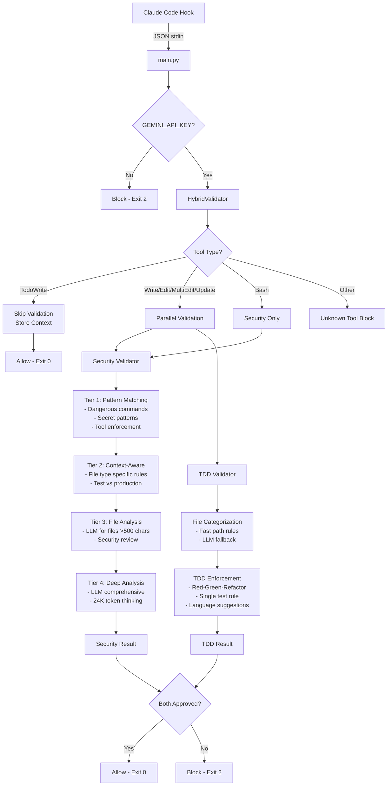

# CC-Validator Architecture Flow

## Overview
The CC-Validator uses a hybrid approach combining rule-based patterns and LLM-powered analysis to validate Claude Code operations.

## End-to-End Flow

## Processor Types

### 1. Rule-Based Processors (No LLM)
- **Security Tier 1**: Pattern matching for dangerous commands
  - Example: `rm -rf /`, `chmod 777 /`, API key patterns
  - Location: `security_validator.py` lines 337-367
  
- **Security Tier 2**: Context-aware rules
  - Different validation for test/config/template files
  - Location: `security_validator.py` lines 209-245

- **File Categorization Fast Path**: 
  - Obvious patterns: `test_*.py`, `*.md`, `package.json`
  - Location: `file_categorization.py` lines 31-87

### 2. LLM-Based Processors (Uses Gemini)
- **Security Tier 3**: File content analysis
  - Triggered for files >500 characters
  - Uses file upload to Gemini
  - Location: `security_validator.py` lines 246-274

- **Security Tier 4**: Comprehensive analysis
  - Deep thinking with 24K token budget
  - Structured output via Pydantic
  - Location: `security_validator.py` lines 275-336

- **File Categorization LLM**: 
  - For ambiguous files not matching fast path
  - Categories: test, implementation, structural, config, docs, data, template
  - Location: `file_categorization.py` lines 88-130

- **TDD Validation**:
  - Enforces Red-Green-Refactor cycle
  - Language-aware suggestions
  - Location: `tdd_validator.py` lines 366-433

## Test Failure Analysis

### 1. Security Test Failure ("> /dev/sda")
- **Root Cause**: Missing pattern in rule-based Tier 1
- **Not LLM Related**: Pure pattern matching gap
- **Fix**: Add pattern for device file redirects

### 2. TDD Test Failures (Branch Protection)
- **Root Cause**: Tests running on 'main' branch
- **Not Processor Issue**: Branch validation working correctly
- **Fix**: Tests should use feature branch environment

### 3. Language Suggestion Hallucination
- **Root Cause**: Gemini LLM generating cross-language suggestions
- **LLM Issue**: Despite prompts saying "no Java references"
- **Known Issue**: Documented as Gemini limitation

## Key Architectural Insights

1. **Hybrid Design**: Mix of fast rule-based and intelligent LLM processing
2. **Fail-Safe**: Defaults to blocking when uncertain
3. **Parallel Execution**: Security and TDD run concurrently via asyncio
4. **Context Persistence**: 20-minute cache for test results and todos
5. **Streaming JSON**: Handles Gemini's streamed responses properly

## Performance Characteristics
- Rule-based tiers: <100ms
- LLM tiers: 2-10 seconds depending on complexity
- Parallel execution reduces overall latency
- 8-second timeout for Claude Code hooks
