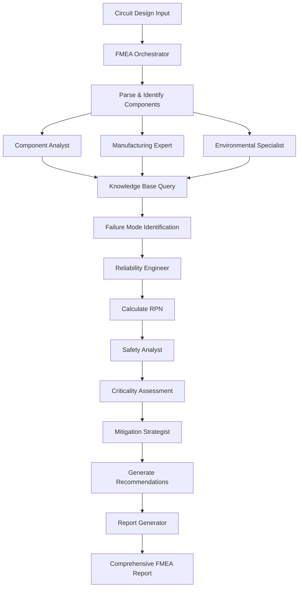

# FMEA System Architecture for Circuit-Synth

## Overview

The FMEA (Failure Mode and Effects Analysis) system for circuit-synth requires a sophisticated architecture with multiple specialized agents, a comprehensive knowledge base, and intelligent orchestration. This document outlines the complete system design.

## 1. Knowledge Base Architecture

### 1.1 Directory Structure
```
circuit-synth/
├── knowledge_base/fmea/
│   ├── failure_modes/
│   │   ├── component_specific/
│   │   │   ├── capacitors.yaml
│   │   │   ├── resistors.yaml
│   │   │   ├── inductors.yaml
│   │   │   ├── semiconductors/
│   │   │   │   ├── diodes.yaml
│   │   │   │   ├── transistors.yaml
│   │   │   │   ├── mosfets.yaml
│   │   │   │   └── ics.yaml
│   │   │   ├── connectors.yaml
│   │   │   ├── crystals.yaml
│   │   │   └── power_supplies.yaml
│   │   ├── environmental/
│   │   │   ├── thermal.yaml
│   │   │   ├── mechanical.yaml
│   │   │   ├── chemical.yaml
│   │   │   └── electrical.yaml
│   │   └── manufacturing/
│   │       ├── solder_defects.yaml
│   │       ├── assembly_issues.yaml
│   │       └── pcb_fabrication.yaml
│   │
│   ├── reliability_data/
│   │   ├── mil_hdbk_217f/          # Military reliability handbook
│   │   ├── manufacturer_data/       # Component manufacturer MTBF data
│   │   ├── field_data/             # Historical field failure data
│   │   └── test_data/              # Internal test results
│   │
│   ├── standards/
│   │   ├── IEC_60812.yaml         # FMEA standard
│   │   ├── AIAG_VDA.yaml          # Automotive FMEA
│   │   ├── MIL_STD_1629A.yaml     # Military FMEA
│   │   ├── SAE_J1739.yaml         # SAE FMEA standard
│   │   └── IPC_standards.yaml      # Electronics manufacturing
│   │
│   ├── mitigation_strategies/
│   │   ├── design_improvements.yaml
│   │   ├── component_selection.yaml
│   │   ├── protection_circuits.yaml
│   │   ├── thermal_management.yaml
│   │   └── manufacturing_controls.yaml
│   │
│   ├── industry_specific/
│   │   ├── automotive/
│   │   ├── aerospace/
│   │   ├── medical/
│   │   ├── consumer/
│   │   └── industrial/
│   │
│   └── templates/
│       ├── fmea_worksheets/
│       ├── report_formats/
│       └── checklists/
```

### 1.2 Knowledge Base Schema

#### Failure Mode Entry Schema
```yaml
failure_mode:
  id: "FM-CAP-001"
  component_type: "capacitor"
  failure_mechanism: "dielectric_breakdown"
  description: "Dielectric material fails causing short circuit"
  
  causes:
    - overvoltage_stress
    - manufacturing_defect
    - aging_degradation
    - thermal_stress
    
  effects:
    local: "Capacitor shorts, current surge"
    system: "Power supply failure, protection circuit activation"
    user: "Device shutdown, potential safety hazard"
    
  detection_methods:
    - in_circuit_test
    - functional_test
    - thermal_imaging
    - visual_inspection
    
  occurrence_factors:
    base_rate: 5  # 1-10 scale
    modifiers:
      - factor: "voltage_derating"
        adjustment: -2  # Reduces occurrence
      - factor: "high_temperature"
        adjustment: +2  # Increases occurrence
      - factor: "quality_grade"
        adjustment: -1  # Military grade reduces risk
        
  severity_assessment:
    safety_critical: 9
    mission_critical: 8
    performance_impact: 6
    cosmetic: 2
    
  mitigation:
    design:
      - "Use voltage derating (50% of rated voltage)"
      - "Add redundant capacitors in parallel"
      - "Implement overvoltage protection"
    component:
      - "Select automotive/military grade components"
      - "Use polymer capacitors for critical applications"
    manufacturing:
      - "100% incoming inspection"
      - "Burn-in testing"
      - "X-ray inspection for internal defects"
```

## 2. Specialized FMEA Agents

### 2.1 Agent Hierarchy

```
fmea-orchestrator (Master Coordinator)
├── fmea-component-analyst
├── fmea-failure-physicist  
├── fmea-reliability-engineer
├── fmea-manufacturing-expert
├── fmea-safety-analyst
├── fmea-environmental-specialist
├── fmea-mitigation-strategist
└── fmea-report-generator
```

### 2.2 Agent Specifications

#### FMEA Orchestrator
- **Role**: Master coordinator for FMEA analysis
- **Responsibilities**:
  - Parse circuit design and identify analysis scope
  - Delegate to specialized agents
  - Aggregate and prioritize findings
  - Generate comprehensive reports
  - Manage workflow and dependencies

#### FMEA Component Analyst
- **Role**: Component-level failure analysis
- **Expertise**:
  - Component physics and failure mechanisms
  - Manufacturer specifications and datasheets
  - Component derating and selection
  - Substitution and obsolescence risks

#### FMEA Failure Physicist
- **Role**: Deep physics-based failure analysis
- **Expertise**:
  - Semiconductor physics
  - Material science
  - Thermal dynamics
  - Electromigration and aging mechanisms
  - Stress analysis (thermal, mechanical, electrical)

#### FMEA Reliability Engineer
- **Role**: Statistical reliability analysis
- **Expertise**:
  - MIL-HDBK-217F calculations
  - Weibull analysis
  - MTBF/MTTF predictions
  - Reliability block diagrams
  - Fault tree analysis

#### FMEA Manufacturing Expert
- **Role**: Manufacturing and assembly failure modes
- **Expertise**:
  - SMT assembly defects
  - Solder joint reliability
  - PCB fabrication issues
  - IPC standards compliance
  - DFM/DFA principles

#### FMEA Safety Analyst
- **Role**: Safety-critical failure analysis
- **Expertise**:
  - Functional safety (ISO 26262, IEC 61508)
  - Hazard analysis
  - Safety integrity levels (SIL/ASIL)
  - Fail-safe design principles
  - Compliance requirements

#### FMEA Environmental Specialist
- **Role**: Environmental stress analysis
- **Expertise**:
  - Temperature cycling effects
  - Humidity and moisture ingress
  - Vibration and shock
  - EMI/EMC considerations
  - Chemical compatibility

#### FMEA Mitigation Strategist
- **Role**: Design improvement recommendations
- **Expertise**:
  - Protection circuit design
  - Redundancy strategies
  - Component selection optimization
  - Test coverage improvement
  - Cost-benefit analysis

## 3. Dedicated FMEA Commands

### 3.1 Command Structure

```bash
# Main FMEA command with subcommands
cs-fmea <subcommand> [options]

Subcommands:
  analyze       - Complete FMEA analysis
  component     - Component-specific analysis
  subsystem     - Subsystem-level analysis
  environmental - Environmental stress analysis
  manufacturing - Manufacturing defect analysis
  safety        - Safety-critical analysis
  reliability   - Reliability prediction
  mitigation    - Generate mitigation strategies
  report        - Generate detailed reports
  database      - Manage failure mode database
```

### 3.2 Detailed Commands

```bash
# Complete analysis with all agents
cs-fmea analyze <circuit> --industry automotive --standard AIAG-VDA --detail high

# Component-specific deep dive
cs-fmea component <circuit> --component U1 --physics-analysis --thermal-model

# Subsystem analysis
cs-fmea subsystem <circuit> --subsystem power_supply --interactions

# Environmental analysis
cs-fmea environmental <circuit> --profile MIL-STD-810G --temperature -40,85 --vibration

# Manufacturing analysis
cs-fmea manufacturing <circuit> --process SMT --ipc-class 3 --yield-target 99.9

# Safety analysis
cs-fmea safety <circuit> --standard ISO-26262 --asil D --fta --fmeda

# Reliability prediction
cs-fmea reliability <circuit> --method MIL-HDBK-217F --environment ground-benign --mission-time 87600

# Mitigation strategy generation
cs-fmea mitigation <circuit> --budget 1000 --timeline 30days --priority safety

# Report generation
cs-fmea report <analysis-id> --format detailed --sections all --compliance AIAG-VDA
```

## 4. Knowledge Base Access Architecture

### 4.1 Access Patterns

```python
class FMEAKnowledgeBase:
    """Central knowledge base for FMEA system"""
    
    def __init__(self):
        self.failure_modes = FailureModeDatabase()
        self.reliability_data = ReliabilityDatabase()
        self.standards = StandardsDatabase()
        self.mitigation = MitigationDatabase()
        
    def query_failure_modes(self, component_type, environment=None, industry=None):
        """Query relevant failure modes with context"""
        pass
        
    def calculate_occurrence(self, component, conditions):
        """Calculate occurrence rating based on conditions"""
        pass
        
    def get_mitigation_strategies(self, failure_mode, constraints):
        """Get applicable mitigation strategies"""
        pass
        
    def get_industry_requirements(self, industry, standard):
        """Get industry-specific requirements"""
        pass
```

### 4.2 Agent Access Methods

```python
# Each agent has specialized access methods
class ComponentAnalystAccess:
    def get_component_failure_modes(self, component):
        """Access component-specific failure data"""
        
    def get_manufacturer_reliability(self, part_number):
        """Access manufacturer reliability data"""
        
    def get_derating_guidelines(self, component_type):
        """Access derating recommendations"""

class ReliabilityEngineerAccess:
    def get_base_failure_rates(self, component):
        """Access MIL-HDBK-217F data"""
        
    def get_environmental_factors(self, environment):
        """Access pi factors for calculations"""
        
    def get_field_failure_data(self, similar_products):
        """Access historical field data"""
```

## 5. Workflow Integration

### 5.1 Analysis Workflow



### 5.2 Data Flow

1. **Input Processing**: Circuit design → Component extraction → Context identification
2. **Analysis Distribution**: Parallel analysis by specialized agents
3. **Knowledge Integration**: Query knowledge base for relevant data
4. **Risk Calculation**: Aggregate findings and calculate risk metrics
5. **Mitigation Planning**: Generate actionable recommendations
6. **Report Generation**: Compile comprehensive documentation

## 6. Implementation Priority

### Phase 1: Core Infrastructure
- Knowledge base structure
- Basic failure mode database
- Orchestrator agent
- Component analyst agent

### Phase 2: Specialized Analysis
- Reliability engineer agent
- Manufacturing expert agent
- Environmental specialist agent
- Expanded failure mode database

### Phase 3: Advanced Features
- Safety analyst agent
- Mitigation strategist agent
- Industry-specific modules
- AI-powered prediction

### Phase 4: Integration & Optimization
- Complete workflow automation
- Machine learning integration
- Historical data analysis
- Predictive failure modeling

## 7. Benefits of This Architecture

1. **Scalability**: Easy to add new agents and knowledge domains
2. **Modularity**: Each agent can be developed and improved independently
3. **Expertise**: Specialized agents provide deep domain knowledge
4. **Flexibility**: Supports various industries and standards
5. **Intelligence**: Knowledge base grows and improves over time
6. **Automation**: Reduces manual effort in FMEA generation
7. **Accuracy**: Multiple perspectives reduce oversight risks
8. **Compliance**: Built-in support for industry standards