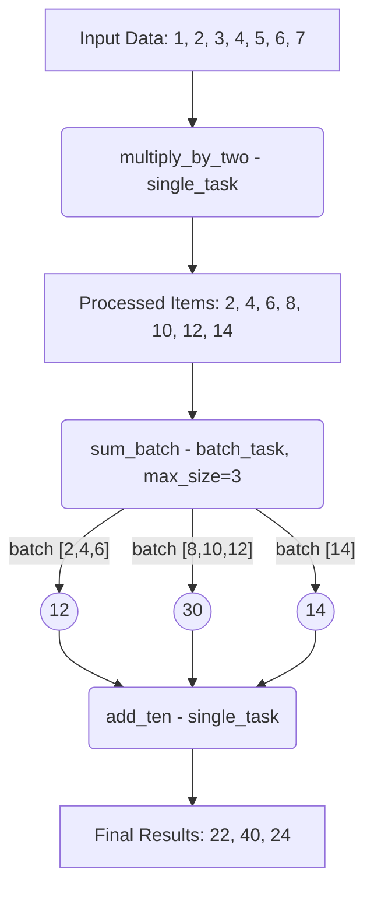
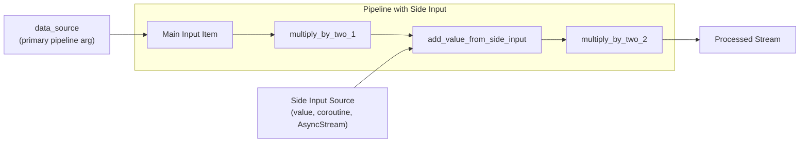
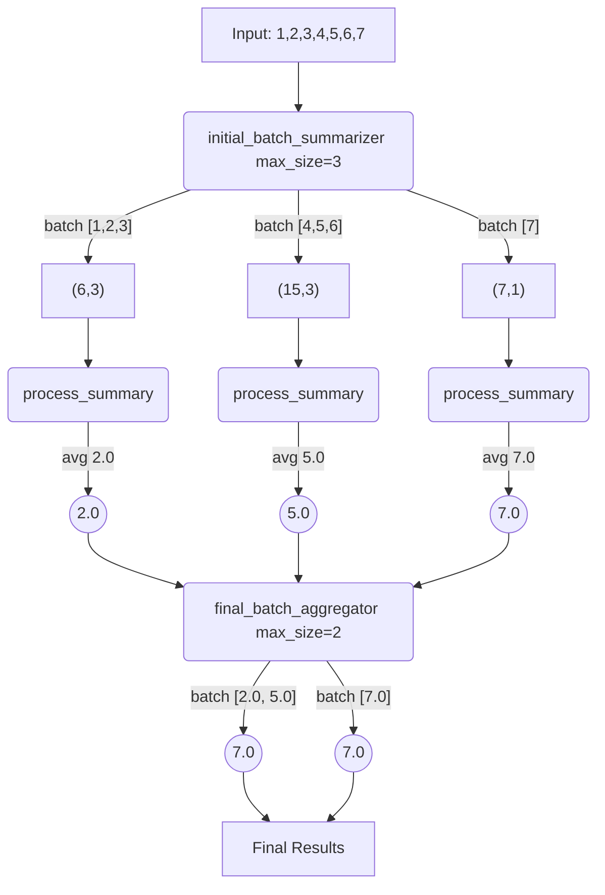

# Conveyor Streaming

[](https://github.com/ju-bezdek/conveyor/actions)
[](https://codecov.io/gh/ju-bezdek/conveyor)
[](https://www.python.org/downloads/)
[](https://opensource.org/licenses/MIT)

A Python library for efficient asynchronous pipeline processing with real-time streaming capabilities.

This library implements streaming of intermediate results between pipeline stages, allowing subsequent tasks to begin processing as soon as any individual item completes a stage, while still preserving original input ordering when needed by default (with option for streaming ASAP and wait for all to be completed).

### The fundamental challenge:
> ```python
> # This pattern is everywhere, but streaming is hard:
> # Especially if different chunks can take different time to process
> 
> Individual Processing → Batch Processing → Individual Processing
>        (fast)              (slower)           (fast)
> 
> 
> # Examples:
> # • Fetch RAG results → Re-Rank → Enrich ( → stream to UI)
> # • Compress → ML batch inference → Apply
> # • Validate → Batch database ops → Send notifications
> ```

## Key Benefits

- **Early Results Delivery**: Get initial results quickly without waiting for all items to finish processing
- **Order Preservation**: Stream results in original order while maintaining maximum parallelism
- **Optimal Resource Usage**: Process items concurrently through all pipeline stages
- **Flexible Consumption**: Stream results as they're ready or collect them all at completion

## Use Cases

- **API Response Streaming**: Show initial results to users immediately while processing continues
- **Batch Processing with Previews**: Process large datasets in batches but deliver completed batch results as they finish
- **Long-Running Pipeline Visibility**: Monitor progress of multi-stage transformations in real-time
- **Efficient Resource Management**: Maximize throughput for IO-bound workloads by ensuring all stages remain active

## Features

- Define atomic tasks that process single items or batches of items
- Chain tasks together to create powerful asynchronous pipelines
- Flexible output handling: consume results as an async stream or collect them all at once
- Robust error handling: Configure retry logic and error recovery strategies at the task level
- Designed for extensibility

## Installation

```bash
pip install conveyor-streaming 
```


## Quick Start

```python
import asyncio
from conveyor import single_task, batch_task

# Define some tasks
@single_task
async def multiply_by_two(x: int) -> int:
    print(f"Multiplying {x} by 2")
    await asyncio.sleep(0.01) # simulate io-bound work
    return x * 2

@batch_task(max_size=3)
async def sum_batch(batch: list[int]) -> int:
    print(f"Summing batch: {batch}")
    await asyncio.sleep(0.05) # simulate io-bound work
    s = sum(batch)
    print(f"Sum of batch {batch} is {s}")
    return s

@single_task
async def add_ten(x: int) -> int:
    print(f"Adding 10 to {x}")
    await asyncio.sleep(0.01)
    return x + 10

async def main():
    # Create a pipeline
    pipeline = multiply_by_two | sum_batch | add_ten

    data_source = [1, 2, 3, 4, 5, 6, 7]

    # Option 1: Process results as they come
    print("Streaming results as they come...")
    stream = pipeline(data_source)
    async for item in stream:
        print(f"Streamed item: {item}")
        
    # Option 2: Collect all results
    print("\nCollecting all results...")
    # Re-create stream for fresh iteration
    results = await pipeline(data_source).collect()
    print(f"Collected results: {results}")
    # Expected:
    # 1*2=2, 2*2=4, 3*2=6 -> sum_batch([2,4,6]) = 12 -> add_ten(12) = 22
    # 4*2=8, 5*2=10, 6*2=12 -> sum_batch([8,10,12]) = 30 -> add_ten(30) = 40
    # 7*2=14 -> sum_batch([14]) = 14 -> add_ten(14) = 24
    # Results: [22, 40, 24]

if __name__ == "__main__":
    asyncio.run(main())
```

## Stream Processing vs. Collecting Results

Conveyor offers three main approaches to consuming pipeline results, depending on your specific use case:

### Option 1A: Ordered Streaming (Default)

Use async iteration when you want to handle results as they become available while preserving the original input order:

```python
# Process results as they're available, in original input order
async for result in pipeline(data_source):
    print(f"Got a result in original order: {result}")
    # Process each result immediately
```

**🚀 Ordered Streaming Performance Benefits:**

Conveyor's ordered processing uses an **ordered queue approach** that enables true streaming while preserving order:

- **Early yielding**: Results are yielded as soon as they can be yielded in order
- **Maximum parallelism**: All items process concurrently, not sequentially  
- **Pipeline efficiency**: Subsequent stages can start processing early results immediately

**Timeline Example (Optimal Scenario):**
```
Input tasks with processing times: [0.1s, 0.2s, 0.3s, 0.4s, 0.5s, 2.0s, 0.7s, 0.8s]

Traditional approach (waits for all):
Time: 2.0s → ALL results yielded at once

Conveyor's streaming approach:
Time: 0.1s → yield result 1 ⚡ IMMEDIATE
Time: 0.2s → yield result 2 ⚡ IMMEDIATE  
Time: 0.3s → yield result 3 ⚡ IMMEDIATE
Time: 0.4s → yield result 4 ⚡ IMMEDIATE
Time: 0.5s → yield result 5 ⚡ IMMEDIATE
Time: 2.0s → yield results 6,7,8 (7,8 were buffered, waiting for 6)

Benefits: 🎯 First 5 results available 75% faster!
```

**Order Preservation with Outliers:**
- Fast tasks stream immediately when they're next in order
- Slow outliers block subsequent results to maintain order  
- Once outliers complete, buffered results yield immediately
- **Never performs worse** than traditional batch processing

### Option 1B: Unordered Streaming (as_completed)

When you care about processing results as soon as possible, regardless of their original order:

```python
# Process results in the order they complete, ignoring original input order
async for result in pipeline.as_completed(data_source):
    print(f"Got a completed result (fastest first): {result}")
    # Process results in completion order
```

Alternatively, you can create a stream with a specific execution mode:

```python
# Create a stream with as_completed execution mode
stream = pipeline.with_execution_mode("as_completed")(data_source)
async for result in stream:
    print(f"Got result in completion order: {result}")
```

**⚡ Unordered Streaming Benefits:**
- **Maximum responsiveness**: Get results immediately as they complete
- **No blocking**: Fast results are never delayed by slow outliers
- **Optimized for speed**: Ideal when result order doesn't matter
- **Real-time processing**: Perfect for displaying immediate progress

### Option 2: Collecting All Results

Use `collect()` when you need all results available at once:

```python
# Wait for all results to be processed
results = await pipeline(data_source).collect()
print(f"All results are ready: {results}")

# Or collect results in completion order
results = await pipeline.as_completed(data_source).collect()
print(f"All results collected in completion order: {results}")
```


**Pipeline Flow Diagram:**



**Understanding Task Types:**

*   **`@single_task`**: Processes one item at a time.

*   **`@batch_task(max_size=N, min_size=M)`**: Collects items into a batch (up to `max_size`) and processes the batch. If the remaining items are fewer than `max_size` but at least `min_size`, they are processed as a final batch.


## Using Side Inputs with `with_inputs`

## Handling Multiple Input Sources

When building pipelines, you might need to incorporate data from multiple sources. Conveyor Streaming offers two approaches:

**Side Inputs Diagram :**



### 1. Direct Stream Integration in Tasks

You can create tasks that explicitly process data from multiple sources:

```python
import asyncio
from conveyor import single_task, batch_task, Pipeline

@single_task
async def multiply_by_two(x: int) -> int:
    return x * 2

@batch_task(max_size=3)
async def sum_batch(batch: list[int]) -> int:
    return sum(batch)

# A task that waits for another data source
@single_task
async def wait_for_other_source(x: int, other_stream) -> int:
    other_value = await anext(other_stream)
    print(f"Combined main value {x} with other value {other_value}")
    return x + other_value

async def generate_secondary_data():
    for i in range(10, 40, 10):
        yield i
        await asyncio.sleep(0.02)

async def main_multiple_sources():
    # Create the secondary stream
    secondary_stream = generate_secondary_data()
    
    # Create pipeline with the custom task
    pipeline = multiply_by_two | wait_for_other_source(secondary_stream) | multiply_by_two
    
    data = [1, 2, 3]
    results = await pipeline(data).collect()
    print(f"Results: {results}")
    # Expected flow:
    # 1. multiply_by_two: [2,4,6]
    # 3. wait_task combines with [10, 20, 30]: [12, 24, 36] 
    # 4. multiply_by_two: [24, 48, 72]
```

This approach uses a lambda to capture the secondary stream in the pipeline definition.

### 2. Declarative Side Inputs with `with_inputs`

Alternatively, you can use the more elegant `with_inputs` method to specify additional inputs in a declarative way, as shown in the next section.

Tasks can be configured to accept additional "side inputs" that are resolved when the task is executed. This is useful for incorporating data that isn't part of the main pipeline flow or needs to be fetched/calculated at the time of processing.

The `with_inputs` method on a task allows you to specify these side inputs. They can be regular values, coroutines, or `AsyncStream` instances (from which the first item will be taken).

```python
...

async def main_multiple_sources():
    # Create the secondary stream
    secondary_stream = generate_secondary_data()
    
    # Create pipeline with the custom task
    pipeline = multiply_by_two | wait_for_other_source.with_inputs(secondary_stream) | multiply_by_two
    
    data = [1, 2, 3]
    results = await pipeline(data).collect()
    print(f"Results: {results}")
    # Expected flow:
    # 1. multiply_by_two: [2,4,6]
    # 3. wait_task combines with [10, 20, 30]: [12, 24, 36] 
    # 4. multiply_by_two: [24, 48, 72]

```


## More Complex Pipeline Examples

Here are a few examples demonstrating more intricate pipeline constructions.

### 1. Pipeline with Filtering

Tasks can filter out items by returning `None`. These `None` values are not passed to subsequent tasks.

```python
import asyncio
from conveyor import single_task, batch_task, Pipeline

@single_task
async def initial_processor(x: int) -> int:
    print(f"Initial: Processing {x}")
    await asyncio.sleep(0.01)
    return x * 10

@single_task
async def filter_multiples_of_three(x: int) -> int | None:
    print(f"Filter: Checking {x}")
    await asyncio.sleep(0.01)
    if x % 3 == 0:
        print(f"Filter: {x} is a multiple of 3, keeping.")
        return x
    print(f"Filter: {x} is not a multiple of 3, discarding.")
    return None # This item will be filtered out

@batch_task(max_size=2)
async def batch_adder(batch: list[int]) -> int:
    print(f"BatchAdd: Summing batch {batch}")
    await asyncio.sleep(0.02)
    return sum(batch)

@single_task
async def final_touch(x: int) -> str:
    print(f"Final: Decorating {x}")
    await asyncio.sleep(0.01)
    return f"Result: {x}"

async def main_filtering_pipeline():
    filtering_pipeline = (
        initial_processor |
        filter_multiples_of_three |
        batch_adder |
        final_touch
    )

    data = [1, 2, 3, 4, 5, 6]
    # initial_processor: [10, 20, 30, 40, 50, 60]
    # filter_multiples_of_three: [None, None, 30, None, None, 60] -> effectively [30, 60]
    # batch_adder (max_size=2): batch_adder([30, 60]) -> 90
    # final_touch: "Result: 90"

    results = await filtering_pipeline(data).collect()
    print(f"\nFiltering Pipeline Results: {results}")

if __name__ == "__main__":
    # asyncio.run(main()) # Original quick start
    # asyncio.run(main_with_side_inputs())
    asyncio.run(main_filtering_pipeline())

```


### 2. Pipeline with Multiple Batching Stages

You can have multiple batch tasks in a pipeline, allowing for different grouping strategies at various points.

```python
import asyncio
from conveyor import single_task, batch_task, Pipeline

@batch_task(max_size=3, min_size=1)
async def initial_batch_summarizer(batch: list[int]) -> tuple[int, int]: # Returns (sum, count)
    print(f"InitialBatch: Processing {batch}")
    await asyncio.sleep(0.02)
    return (sum(batch), len(batch))

@single_task
async def process_summary(summary: tuple[int, int]) -> float: # Calculates average
    s, c = summary
    print(f"ProcessSummary: Sum={s}, Count={c}")
    await asyncio.sleep(0.01)
    return s / c if c > 0 else 0

@batch_task(max_size=2, min_size=1)
async def final_batch_aggregator(averages: list[float]) -> float: # Sum of averages
    print(f"FinalBatch: Aggregating averages {averages}")
    await asyncio.sleep(0.02)
    return sum(averages)

async def main_multi_batch_pipeline():
    multi_batch_pipeline = (
        initial_batch_summarizer |
        process_summary |
        final_batch_aggregator
    )

    data = [1, 2, 3, 4, 5, 6, 7]
    # initial_batch_summarizer (max_size=3):
    #   [1,2,3] -> (6,3)
    #   [4,5,6] -> (15,3)
    #   [7]     -> (7,1)
    # process_summary:
    #   (6,3) -> 2.0
    #   (15,3) -> 5.0
    #   (7,1) -> 7.0
    # final_batch_aggregator (max_size=2):
    #   [2.0, 5.0] -> 7.0
    #   [7.0]      -> 7.0
    # Results: [7.0, 7.0]

    results = await multi_batch_pipeline(data).collect()
    print(f"\nMulti-Batch Pipeline Results: {results}")

if __name__ == "__main__":
    # asyncio.run(main()) # Original quick start
    # asyncio.run(main_with_side_inputs())
    # asyncio.run(main_filtering_pipeline())
    asyncio.run(main_multi_batch_pipeline())
```

**Multi-Batch Pipeline Flow :**



## Error Handling

Conveyor provides comprehensive error handling capabilities that can be configured directly in task decorators. You can control retry behavior and specify what should happen when errors occur.

### Error Handling Options

- **`on_error`**: What to do when an error occurs after all retry attempts
  - `"fail"` (default): Raise the error and stop the pipeline
  - `"skip_item"`: Skip the failing item and continue processing
  - `"skip_batch"`: For batch tasks, skip the entire batch if any item fails

- **Retry Configuration**: Independent retry logic with exponential backoff
  - `retry_attempts`: Number of retry attempts (default: 1, no retry)
  - `retry_delay`: Base delay between retries in seconds
  - `retry_exponential_backoff`: Whether to use exponential backoff (default: True)
  - `retry_max_delay`: Maximum delay between retries

- **Custom Error Handlers**: For complex error handling scenarios

### Basic Error Handling Example

```python
import asyncio
import random
from conveyor import single_task, batch_task, ErrorHandler

# Task that skips failing items
@single_task(on_error="skip_item")
async def unreliable_task(x: int) -> int:
    await asyncio.sleep(0.01)
    if random.random() < 0.3:  # 30% failure rate
        raise ValueError(f"Random failure processing {x}")
    return x * 2

# Task with retry logic
@single_task(
    retry_attempts=3,
    retry_delay=0.1,
    retry_exponential_backoff=True,
    on_error="skip_item"
)
async def task_with_retry(x: int) -> int:
    if random.random() < 0.5:  # 50% failure rate
        raise ValueError(f"Temporary failure processing {x}")
    return x + 100

# Batch task that skips entire batch on any failure
@batch_task(max_size=3, on_error="skip_batch")
async def sensitive_batch_task(batch: list[int]) -> int:
    if any(x < 0 for x in batch):
        raise ValueError("Negative numbers not allowed in batch")
    return sum(batch)

# Custom error handler for business logic
class BusinessErrorHandler(ErrorHandler):
    async def handle_error(self, error: Exception, item, task_name: str, attempt: int) -> tuple[bool, any]:
        if isinstance(error, ValueError) and "business rule" in str(error):
            print(f"Business rule violation in {task_name}: {error}")
            return True, -1  # Continue with sentinel value
        return False, None  # Re-raise other errors

@single_task(error_handler=BusinessErrorHandler())
async def business_task(x: int) -> int:
    if x % 7 == 0:
        raise ValueError("business rule: multiples of 7 not allowed")
    return x * 5

async def main_error_handling():
    data = [1, 2, -1, 3, 4, 5, 6, 7, 8]
    
    print("1. Skip failing items:")
    pipeline1 = unreliable_task | sensitive_batch_task
    results1 = await pipeline1(data).collect()
    print(f"Results: {results1}")
    
    print("\n2. Retry with backoff:")
    pipeline2 = task_with_retry
    results2 = await pipeline2([1, 2, 3]).collect()
    print(f"Results: {results2}")
    
    print("\n3. Custom error handler:")
    pipeline3 = business_task
    results3 = await pipeline3([1, 2, 7, 14, 21]).collect()
    print(f"Results: {results3}")

if __name__ == "__main__":
    asyncio.run(main_error_handling())
```


## Alternatives

While there are several libraries in adjacent spaces, none directly address the specific challenge of streaming results from mixed single/batch task pipelines. Here's how Conveyor compares to existing solutions:

### Workflow Orchestration Platforms

**Prefect, Airflow, Dagster**
- **What they do**: Orchestrate complex DAG-based workflows with scheduling, monitoring, and error recovery
- **Gap**: Designed for batch-oriented ETL workflows, not real-time streaming of intermediate results
- **Use case**: Great for scheduled data pipelines, but won't help with streaming progressive results to users

**When to use instead**: Large-scale ETL orchestration with complex dependencies and scheduling requirements

### Distributed Computing Frameworks

**Ray, Dask**
- **What they do**: Distributed computing with parallel task execution across clusters
- **Gap**: Much heavier weight, focused on distributed computing rather than pipeline streaming coordination
- **Use case**: Large-scale distributed processing, not single-machine streaming pipelines

**When to use instead**: When you need to scale across multiple machines or have very large datasets

### Task Queue Systems

**Celery, RQ, Dramatiq**
- **What they do**: Distributed task queues for background job processing
- **Gap**: Focused on job distribution and execution, not streaming intermediate results between pipeline stages
- **Use case**: Background job processing, not real-time result streaming

**When to use instead**: When you need distributed task execution across multiple workers

### Stream Processing Frameworks

**Apache Kafka Streams, Apache Beam**
- **What they do**: Event-driven stream processing for real-time data pipelines
- **Gap**: Different paradigm (event streaming), not async Python task pipelines
- **Use case**: Event-driven architectures with message queues

**When to use instead**: Event-driven systems with external message brokers
