# DataVizHub

## Overview
DataVizHub is a utility library for building data-driven visual products. It provides composable helpers for data transfer (FTP/HTTP/S3/Vimeo), data processing (GRIB/imagery/video), and visualization (matplotlib + basemap overlays). Use these pieces to script your own pipelines; this repo focuses on the reusable building blocks rather than end-user scripts.

 This README documents the library itself and shows how to compose the components. For complete runnable examples, see the examples repos when available, or adapt the snippets below.

## Features
- Datatransfer: `FTPManager`, `HTTPManager`, `S3Manager`, `VimeoManager`.
- Processing: `VideoProcessor`, `GRIBDataProcessor`.
- Visualization: `PlotManager`, `ColormapManager` with included basemap/overlay assets in `images/`.
- Utils: `CredentialManager`, `DateManager`, `FileUtils`, `ImageManager`, `JSONFileManager`.

```mermaid
classDiagram
    %% === Datatransfer module ===
    class datatransfer_VimeoManager {
        - client_id: str
        - client_secret: str
        - access_token: str
        - vimeo_client: VimeoClient
        + __init__()
        + upload_video()
        + update_video()
        + update_video_description()
    }

    class datatransfer_FTPManager {
        - host: str
        - username: str
        - password: str
        + __init__()
        + upload_file()
        + download_file()
        + list_files()
    }

    class datatransfer_S3Manager {
        - bucket_name: str
        + __init__()
        + upload_file()
        + download_file()
        + list_files()
    }

    class datatransfer_HTTPHandler {
        + download_file()
        + fetch_data()
        + fetch_text()
        + fetch_json()
        + post_data()
        + fetch_headers()
    }

    %% === Processing module ===
    class processing_VideoProcessor {
        - input_dir: str
        - output_file: str
        + __init__()
        + process_videos()
        + add_watermark()
        + concatenate_videos()
    }

    class processing_GRIBDataProcessor {
        - catalog_url: str
        + __init__()
        + list_datasets()
        + read_grib_file()
        + read_grib_to_numpy()
        + load_data_from_file()
        + process_grib_files_wgrib2()
        + combine_into_3d_array()
    }

    %% === Utils module ===
    class utils_DateManager {
        - date_format: str
        + __init__()
        + parse_iso_period()
        + convert_yyyymmdd_to_yyjjj()
        + get_date_range()
        + extract_date_time()
        + is_date_in_range()
        + extract_dates_from_filenames()
    }

    class utils_CredentialManager {
        - filename: str
        + __init__()
        + read_credentials()
        + add_credential()
        + delete_credential()
        + clear_credentials()
        + __enter__()
        + __exit__()
    }

    class utils_ImageManager {
        - image_dir: str
        + __init__()
        + resize_image()
        + convert_image_format()
        + optimize_image()
    }

    class utils_JSONFileManager {
        - json_file: str
        + __init__()
        + read_json()
        + write_json()
        + update_json()
    }

    class utils_FileUtils {
        + __init__()
        + remove_all_files_in_directory()
    }

    %% === Visualization module ===
    class visualization_PlotManager {
        - basemap: str
        - overlay: str
        - image_extent: list
        - base_cmap: str
        + __init__()
        + sos_plot_data()
        + plot_data_array()
    }

    class visualization_ColormapManager {
        + __init__()
        + create_custom_classified_cmap()
        + create_custom_cmap()
    }

    %% === Tests module ===
    class tests_test_unit_credential_manager {
        + test_initialization_without_filename()
        + test_initialization_with_filename()
        + test_read_valid_credentials()
        + test_read_nonexistent_file()
        + test_add_credential()
        + test_delete_credential()
        + test_context_manager()
        + test_clear_credentials()
    }

    %% === Relationships ===
    datatransfer_VimeoManager --> VimeoClient : "uses"
    datatransfer_FTPManager --> datatransfer_HTTPHandler : "connects"
    datatransfer_S3Manager --> datatransfer_HTTPHandler : "connects"

    processing_VideoProcessor --> utils_ImageManager : "manages"
    processing_GRIBDataProcessor --> utils_JSONFileManager : "stores data"

    utils_CredentialManager ..|> utils_FileUtils : "inherits"
    tests_test_unit_credential_manager ..|> utils_CredentialManager
    tests_test_unit_credential_manager --> utils_CredentialManager : "tests"
```




## Project Structure
- `datatransfer/`: I/O helpers (S3, FTP, HTTP, Vimeo).
- `processing/`: data/video processing (GRIB/NetCDF, FFmpeg-based video).
- `visualization/`: plotting utilities and colormaps.
- `utils/`: shared helpers (dates, files, images, credentials).
- `images/`: basemaps and overlays used by plots.
- `samples/`: lightweight scripts; moving to external repos.
- `pols.py`: example pollen plot (reads NetCDF from `/data/temp/pollen/`).

## Prerequisites
- Python 3.10+
- FFmpeg and ffprobe on PATH for video-related flows.
- Optional: AWS credentials for S3; Vimeo API credentials for upload flows.

## Install (Poetry)
- Core dev env: `poetry install --with dev`
- With optional extras: `poetry install --with dev -E datatransfer -E processing -E visualization` (or `--all-extras`)
- Spawn a shell: `poetry shell`
- One-off run: `poetry run python -c "print('ok')"`

Notes for development:
- Optional integrations (S3 via boto3, Vimeo via PyVimeo, HTTP via requests) are provided as extras, not dev deps.
- Opt into only what you need using `-E <extra>` flags, or use `--all-extras` for a full-featured env.

## Install (pip extras)
- Core only: `pip install datavizhub`
- Datatransfer deps: `pip install "datavizhub[datatransfer]"`
- Processing deps: `pip install "datavizhub[processing]"`
- Visualization deps: `pip install "datavizhub[visualization]"`
- Everything: `pip install "datavizhub[all]"`

Notes:
- Core install keeps footprint small; optional features pull in heavier deps (e.g., Cartopy, SciPy, ffmpeg-python).
- Some example scripts may import plotting libs; install `[visualization]` if you use those flows.

## Quick Composition Examples

Minimal pipeline: build video from images and upload to S3

```python
from datavizhub.processing import VideoProcessor
from datavizhub.datatransfer import S3Manager

vp = VideoProcessor(input_dir="/data/images", output_file="/data/out/movie.mp4")
vp.process_videos(fps=24)

s3 = S3Manager(bucket_name="my-bucket")
s3.upload_file("/data/out/movie.mp4", key="videos/movie.mp4", acl="public-read")
```

Plot a data array with a basemap

```python
import numpy as np
from datavizhub.visualization import PlotManager

data = np.random.rand(180, 360)
plotter = PlotManager(basemap="earth_vegetation.jpg", overlay=None, image_extent=[-180, 180, -90, 90])
plotter.plot_data_array(data, output_path="/tmp/heatmap.png", title="Demo")
```

Compose FTP sync + video + Vimeo update

```python
from datavizhub.datatransfer import FTPManager, VimeoManager
from datavizhub.processing import VideoProcessor

ftp = FTPManager(host="public.sos.noaa.gov", username="anonymous", password="")
ftp.download_file(remote_path="/pub/images/img_0001.png", local_path="/tmp/frames/img_0001.png")
# ...download the rest of the frames as needed...

VideoProcessor("/tmp/frames", "/tmp/out.mp4").process_videos(fps=30)

vimeo = VimeoManager(client_id="...", client_secret="...", access_token="...")
vimeo.upload_video("/tmp/out.mp4", name="Latest Render")
```

## Examples
- `rtvideo` real-time video pipeline: https://gitlab.sos.noaa.gov/science-on-a-sphere/datasets/real-time-video

## Development, Test, Lint
- Tests: `poetry run pytest -q`
- Formatting: `poetry run black . && poetry run isort .`
- Lint: `poetry run flake8`

## Repository Guidelines
- Project structure, dev workflow, testing, and contribution tips: see [AGENTS.md](AGENTS.md).

## Documentation
- Primary: Project wiki at https://github.com/NOAA-GSL/datavizhub/wiki
- Dev container: A read-only mirror of the wiki is auto-cloned into `/app/docs` when the dev container starts. It auto-refreshes at most once per hour. This folder is ignored by Git and is not part of the repository on GitHub.
- Force refresh: `bash .devcontainer/postStart.sh --force` (or set `DOCS_REFRESH_SECONDS` to adjust the hourly cadence).
- Note: There is no `docs/` directory in the main repo. If you are not using the dev container, read the wiki directly.

## Notes
- Paths: many scripts assume data under `/data/...`; prefer configuring via env vars (e.g., `DATA_DIR`) or parameters.
- Credentials: do not commit secrets; AWS and Vimeo creds should come from env or secure stores used by `CredentialManager`.
- Dependencies: video flows require system `ffmpeg`/`ffprobe`.
 - Optional extras: see "Install (pip extras)" for targeted installs.

## License
Distributed under the MIT License. See [LICENSE](LICENSE).

## Links
- Source: https://github.com/NOAA-GSL/datavizhub
- PyPI: https://pypi.org/project/datavizhub/
