# DataVizHub

## Overview
This project automates the the ability to injest data from a variety of sources and formats, create imagery or video based on that data, and send the results to a variety of locations for dissemination. It's designed to efficiently handle tasks like syncing files from an FTP server, processing these files into a video, and updating metadata in a cloud storage system.

## Features
- **FTP Syncing**: Automatically syncs image files from a specified FTP server.
- **Video Processing**: Processes a sequence of images into a cohesive video file.
- **Vimeo Integration**: Uploads the processed video to a specified Vimeo account.
- **AWS S3 Management**: Handles the uploading of metadata files to an AWS S3 bucket.
- **Command-Line Interface**: Easy to use CLI for configuring and running the system.

```mermaid
classDiagram
    %% === Datatransfer module ===
    class datatransfer_VimeoManager {
        - client_id: str
        - client_secret: str
        - access_token: str
        - vimeo_client: VimeoClient
        + __init__()
        + upload_video()
        + update_video()
        + update_video_description()
    }

    class datatransfer_FTPManager {
        - host: str
        - username: str
        - password: str
        + __init__()
        + upload_file()
        + download_file()
        + list_files()
    }

    class datatransfer_S3Manager {
        - bucket_name: str
        + __init__()
        + upload_file()
        + download_file()
        + list_files()
    }

    class datatransfer_HTTPHandler {
        + download_file()
        + fetch_data()
        + fetch_text()
        + fetch_json()
        + post_data()
        + fetch_headers()
    }

    %% === Processing module ===
    class processing_VideoProcessor {
        - input_dir: str
        - output_file: str
        + __init__()
        + process_videos()
        + add_watermark()
        + concatenate_videos()
    }

    class processing_GRIBDataProcessor {
        - catalog_url: str
        + __init__()
        + list_datasets()
        + read_grib_file()
        + read_grib_to_numpy()
        + load_data_from_file()
        + process_grib_files_wgrib2()
        + combine_into_3d_array()
    }

    %% === Utils module ===
    class utils_DateManager {
        - date_format: str
        + __init__()
        + parse_iso_period()
        + convert_yyyymmdd_to_yyjjj()
        + get_date_range()
        + extract_date_time()
        + is_date_in_range()
        + extract_dates_from_filenames()
    }

    class utils_CredentialManager {
        - filename: str
        + __init__()
        + read_credentials()
        + add_credential()
        + delete_credential()
        + clear_credentials()
        + __enter__()
        + __exit__()
    }

    class utils_ImageManager {
        - image_dir: str
        + __init__()
        + resize_image()
        + convert_image_format()
        + optimize_image()
    }

    class utils_JSONFileManager {
        - json_file: str
        + __init__()
        + read_json()
        + write_json()
        + update_json()
    }

    class utils_FileUtils {
        + __init__()
        + remove_all_files_in_directory()
    }

    %% === Visualization module ===
    class visualization_PlotManager {
        - basemap: str
        - overlay: str
        - image_extent: list
        - base_cmap: str
        + __init__()
        + sos_plot_data()
        + plot_data_array()
    }

    class visualization_ColormapManager {
        + __init__()
        + create_custom_classified_cmap()
        + create_custom_cmap()
    }

    %% === Tests module ===
    class tests_test_unit_credential_manager {
        + test_initialization_without_filename()
        + test_initialization_with_filename()
        + test_read_valid_credentials()
        + test_read_nonexistent_file()
        + test_add_credential()
        + test_delete_credential()
        + test_context_manager()
        + test_clear_credentials()
    }

    %% === Relationships ===
    datatransfer_VimeoManager --> VimeoClient : "uses"
    datatransfer_FTPManager --> datatransfer_HTTPHandler : "connects"
    datatransfer_S3Manager --> datatransfer_HTTPHandler : "connects"

    processing_VideoProcessor --> utils_ImageManager : "manages"
    processing_GRIBDataProcessor --> utils_JSONFileManager : "stores data"

    utils_CredentialManager ..|> utils_FileUtils : "inherits"
    tests_test_unit_credential_manager ..|> utils_CredentialManager
    tests_test_unit_credential_manager --> utils_CredentialManager : "tests"
```

## Prerequisites
Before you begin, ensure you have met the following requirements:
- Python 3.x installed.
- Optional: A Vimeo account with API credentials for video uploading.
- Optional: An AWS account with S3 access for metadata management.
- Optional: FFmpeg installed for video processing.
- Optional: Access to an FTP server for image file syncing.

## Development Installation
To install the necessary Python packages, from the project root run:

`pipx install poetry`

`poetry install`

## Package Installation
To install the datavizhub package change directory to the download directory and type:

`pip install datavizhub-<version>.tar.gz`

## Configuration
The system requires several configurations to be passed as command-line arguments. These include paths to directories, FTP server details, Vimeo and AWS credentials, etc.

## Usage
To run the script, use the following command:

Replace `[arguments]` with the necessary command-line arguments.

`rtvideo [arguments]`

## Command Line Arguments

This script supports various command line arguments for customizing its operation. Below is a detailed explanation of each argument:

- `-i`, `--input_dir` (required): 
  - Description: The directory where the input image files are located.
  - Usage: `-i <path_to_directory>` or `--input_dir <path_to_directory>`

- `-o`, `--output_file` (required): 
  - Description: The path for the output video file.
  - Usage: `-o <output_file_path>` or `--output_file <output_file_path>`

- `-vimeo-uri`, `--existing_video_uri` (required):
  - Description: The URI on Vimeo where the updated video will be placed.
  - Usage: `-vimeo-uri <vimeo_uri>` or `--existing_video_uri <vimeo_uri>`

- `-id`, `--dataset_id` (required):
  - Description: The catalog dataset ID to update with the new video.
  - Usage: `-id <dataset_id>` or `--dataset_id <dataset_id>`

- `-period`, `--dataset_period` (required):
  - Description: The duration for which to generate the movie (in ISO 8601 format).
  - Usage: `-period <duration>` or `--dataset_period <duration>`

- `-vimeo-client`, `--vimeo_client_id` (required, credential if argument not provided):
  - Description: The Vimeo client ID associated with the app.
  - Usage: `-vimeo-client <client_id>` or `--vimeo_client_id <client_id>`

- `-vimeo-secret`, `--vimeo_client_secret` (required, credential if argument not provided):
  - Description: The Vimeo client secret associated with the app.
  - Usage: `-vimeo-secret <client_secret>` or `--vimeo_client_secret <client_secret>`

- `-vimeo-token`, `--vimeo_access_token` (required, credential if argument not provided):
  - Description: The Vimeo access token associated with the app.
  - Usage: `-vimeo-token <access_token>` or `--vimeo_access_token <access_token>`

- `-aws-key`, `--aws_access_key` (required, credential if argument not provided):
  - Description: The AWS access key required for S3 transfers.
  - Usage: `-aws-key <access_key>` or `--aws_access_key <access_key>`

- `-aws-secret`, `--aws_secret_key` (required, credential if argument not provided):
  - Description: The AWS secret key required for S3 transfers.
  - Usage: `-aws-secret <secret_key>` or `--aws_secret_key <secret_key>`

- `-host`, `--ftp_host` (optional):
  - Description: The FTP host to connect to. Default is "public.sos.noaa.gov".
  - Usage: `-host <ftp.example.com>` or `--ftp_host <ftp.example.com>`

- `-b'=`, `--basemap` (optional):
  - Description: The internal path to an optional basemap image that will appear behind data in a video.
  - Usage: `--basemap "earth_vegetation.jpg`

- `-v`, `--verbose`,
  - Description: Enable verbose logging.
  - Usage: `--verbose`

### Example (no environmental variables)

`rtvideo -i "./images" -o "./output/video.mp4" -vimeo-uri "/videos/12345" -id "DATASET_ID" -period "1Y" -vimeo-client "VIMEO_CLIENT_ID" -vimeo-secret "VIMEO_CLIENT_SECRET" -vimeo-token "VIMEO_ACCESS_TOKEN" -aws-key "AWS_ACCESS_KEY" -aws-secret "AWS_SECRET_KEY" -host "ftp.example.com" -r "/ftp/images" -u "ftpuser" -p "ftppassword"`

### Example ( environmental variables)

`rtvideo -i "./images" -o "./output/video.mp4" -vimeo-uri "/videos/12345" -id "DATASET_ID" -period "1Y" -host "ftp.example.com" -r "/ftp/images" -u "ftpuser" -p "ftppassword"`

## License
Distributed under the MIT License. See [LICENSE](LICENSE) for more information.

## Contact
Your Name - Eric.J.Hackathorn@noaa.gov

Project Link: https://github.com/NOAA-GSL/datavizhub

PyPi Package: https://pypi.org/project/datavizhub/

