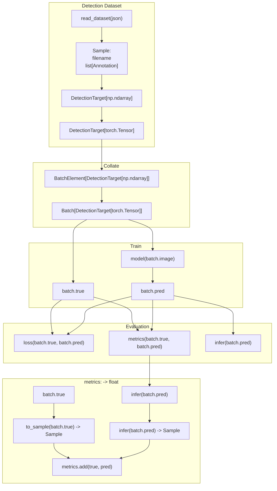

# Initial data flow diagram

This can change in the future.

```mermaid
graph TD
    subgraph Detection Dataset
        A["read_dataset(json)"] --> B["Sample:
        filename
        list[Annotation]"]
        B --> C["DetectionTarget[np.ndarray]"]
        C --> C1["DetectionTarget[torch.Tensor]"]
    end

    subgraph Collate
        C1 --> D["BatchElement[DetectionTarget[np.ndarray]]"]
        D --> E["Batch[DetectionTarget[torch.Tensor]]"]
    end

    subgraph Train
        E --> F["model(batch.image)"]
        F --> G["batch.pred"]
        E --> H["batch.true"]
    end

    subgraph Evaluation
        G --> I["loss(batch.true, batch.pred)"]
        H --> I

        G --> J_START["metrics(batch.true, batch.pred)"]
        H --> J_START

        G --> K["infer(batch.pred)"]
    end

    %% Expanded metrics internals
    subgraph "metrics: -> float"
        J1["infer(batch.pred)"]
        J2["batch.true"]
        J3["to_sample(batch.true) -> Sample"]
        J4["infer(batch.pred) -> Sample"]
        J5["metrics.add(true, pred)"]

        J1 --> J4 --> J5
        J2 --> J3 --> J5
    end

    J_START --> J1
```
