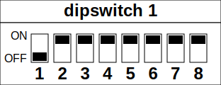

# dipswitch_svg

SVG generation for dipswitch documentation

Also available online: https://pengumc.codeberg.page/dipswitch_svg/

Example output:  


## Usage

```py
from dipswitch_svg import dipswitch
svg_text = dipswitch("dipswitch 1", range(1, 9), 0x1)
```