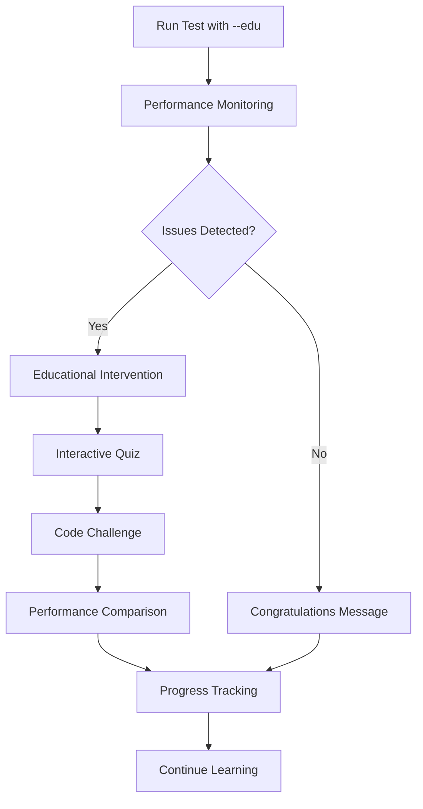

# Django Mercury Comprehensive Usage Guide
*Complete Guide to Interactive Performance Learning*

## Table of Contents
- [Quick Start](#quick-start)
- [Educational Mode Overview](#educational-mode-overview)
- [Learning Paths](#learning-paths)
- [Interactive Features](#interactive-features)
- [Code Challenges](#code-challenges)
- [Performance Visualization](#performance-visualization)
- [Video Tutorial Integration](#video-tutorial-integration)
- [Progress Tracking](#progress-tracking)
- [Advanced Usage](#advanced-usage)
- [Troubleshooting](#troubleshooting)

---

## Quick Start

### 🚀 Get Started in 3 Minutes

1. **Install Django Mercury**
   ```bash
   pip install django-mercury-performance-testing
   ```

2. **Configure Educational Mode**
   ```python
   # settings.py
   import sys
   if '--edu' in sys.argv:
       TEST_RUNNER = 'django_mercury.test_runner.EducationalTestRunner'
   ```

3. **Run Your First Educational Test**
   ```bash
   python manage.py test --edu examples.educational_examples
   ```

### 🎬 Video Tutorial: Getting Started
*Master Django Mercury basics in 10 minutes*
- **Beginner Tutorial**: https://tutorials.djangomercury.com/quickstart/getting-started
- **Installation Guide**: https://tutorials.djangomercury.com/quickstart/installation
- **First Educational Test**: https://tutorials.djangomercury.com/quickstart/first-test

---

## Educational Mode Overview

### The 80-20 Human-in-the-Loop Philosophy

Django Mercury follows a unique educational approach:
- **80% Automated**: Performance detection, analysis, and guidance
- **20% Human**: Active learning, decision-making, and skill development

### How Educational Mode Works



### 📹 Educational Philosophy Videos
- **80-20 Approach Explained**: https://tutorials.djangomercury.com/philosophy/80-20-approach
- **Learning by Doing**: https://tutorials.djangomercury.com/philosophy/hands-on-learning
- **Global Accessibility**: https://tutorials.djangomercury.com/philosophy/inclusive-design

---

## Learning Paths

### Structured Learning Journeys

Django Mercury offers guided learning paths that take you from beginner to expert:

#### **Path 1: Django Performance Fundamentals** 
*Perfect for developers new to performance optimization*

```python
# Start the fundamentals path
from django_mercury.cli.educational.learning_paths import LearningPathSystem

learning_system = LearningPathSystem()
learning_system.start_learning_path('django_performance_basics')
```

**What You'll Learn:**
- Django ORM fundamentals and query generation
- N+1 query problem recognition and fixing
- Basic select_related() and prefetch_related() usage
- Performance impact understanding

**Time Commitment:** ~90 minutes
**Prerequisites:** Basic Django knowledge

#### **Path 2: Advanced Query Optimization**
*For developers ready to master sophisticated optimization techniques*

**Concepts Covered:**
- Database indexing strategy and implementation
- Memory optimization with only(), values(), defer()
- Django caching frameworks and strategies  
- DRF serialization performance optimization

**Time Commitment:** ~140 minutes
**Prerequisites:** Completion of fundamentals path

#### **Path 3: Enterprise-Scale Performance Engineering**
*Advanced patterns for large-scale Django applications*

**Topics Include:**
- Custom Prefetch objects with conditional querysets
- Database connection optimization and pooling
- Advanced caching patterns and cache invalidation
- Production performance monitoring integration

**Time Commitment:** ~150 minutes
**Prerequisites:** Completion of advanced query optimization

#### **Path 4: Performance Architecture Mastery**
*For lead engineers and architects*

**Master-Level Content:**
- Query analysis and profiling techniques
- Scalability architecture design patterns
- Production monitoring and alerting systems
- Performance bottleneck troubleshooting

**Time Commitment:** ~225 minutes
**Prerequisites:** Substantial Django experience

### 📹 Learning Path Video Guides
- **Choosing Your Learning Path**: https://tutorials.djangomercury.com/paths/choosing-your-path
- **Path Progression Strategies**: https://tutorials.djangomercury.com/paths/progression-strategies
- **Skill Assessment Guide**: https://tutorials.djangomercury.com/paths/skill-assessment

### Viewing Available Paths

```python
# See all available learning paths
from django_mercury.cli.educational.learning_paths import LearningPathSystem

learning_system = LearningPathSystem()
learning_system.show_learning_paths(show_all=True)

# Get personalized recommendations
recommended_path = learning_system.get_recommended_path()
print(f"Recommended for you: {recommended_path.name}")
```

---

## Interactive Features

### Real-Time Educational Interventions

When Mercury detects performance issues during testing, it automatically triggers educational moments:

#### **Interactive Quizzes**

```python
class ExampleN1Test(DjangoMercuryAPITestCase):
    def test_user_profiles(self):
        users = User.objects.all()
        for user in users:
            print(user.profile.bio)  # Mercury detects N+1 here!
        
        # Mercury pauses execution and asks:
        # "Your test made 51 queries. This suggests an N+1 problem. 
        #  What's the best fix for foreign key N+1 issues?"
        # 1) Add database indexes
        # 2) Use select_related() 
        # 3) Switch to raw SQL
        # 4) Add more server memory
```

#### **Contextual Learning Content**

Mercury provides educational content based on the specific issues found:

```
🚨 PERFORMANCE ISSUE DETECTED: N+1 Queries

📚 What happened: Your code made 1 query to get users, then 50 additional 
queries to access each user's profile. This is called an "N+1 query problem."

⚠️  Why it matters: N+1 queries make your app slow. With 1000 users, this 
becomes 1001 queries instead of just 2!

✅ How to fix: Use select_related('profile') to load both users and profiles 
in a single optimized query.

💻 Example:
   # Bad: 1 + N queries
   users = User.objects.all()
   for user in users:
       print(user.profile.bio)  # Each access = 1 query
   
   # Good: 1 query total
   users = User.objects.select_related('profile').all() 
   for user in users:
       print(user.profile.bio)  # No additional queries!
```

### 📹 Interactive Feature Tutorials
- **Quiz System Overview**: https://tutorials.djangomercury.com/features/quiz-system
- **Educational Interventions**: https://tutorials.djangomercury.com/features/interventions
- **Learning Content Library**: https://tutorials.djangomercury.com/features/content-library

---

## Code Challenges

### Hands-On Performance Fixing

Mercury includes interactive code challenges where you practice fixing real performance issues:

#### **Challenge Example: Fix the N+1 Problem**

```python
from django_mercury.cli.educational.interactive_ui import InteractiveUI

ui = InteractiveUI()

# Start a code challenge
challenge_result = ui.run_code_challenge(
    challenge_name="Fix User Profile N+1",
    problem_description="This view makes 101 queries to display 100 user profiles",
    problematic_code="""
# Current problematic code
users = User.objects.all()
for user in users:
    print(f"{user.username}: {user.profile.bio}")
    """,
    expected_solution_patterns=["select_related('profile')"],
    performance_context={'query_count': 101, 'response_time': 850}
)
```

**Challenge Flow:**
1. **Problem Introduction**: See the problematic code and performance metrics
2. **Your Turn**: Write optimized code to fix the issue
3. **Solution Validation**: Mercury checks if your solution works
4. **Performance Comparison**: See before/after improvements
5. **Concept Reinforcement**: Learn why your solution works

#### **Challenge Categories**

**Beginner Challenges:**
- Fix basic N+1 queries with select_related()
- Optimize simple foreign key relationships
- Improve basic API endpoints

**Intermediate Challenges:**
- Implement complex prefetch patterns
- Add strategic database indexes  
- Optimize memory usage for large datasets
- Fix serialization performance issues

**Advanced Challenges:**
- Design custom Prefetch objects
- Implement cache stampede prevention
- Optimize connection pool settings
- Build monitoring and alerting systems

### 📹 Code Challenge Video Guides
- **Challenge System Overview**: https://tutorials.djangomercury.com/challenges/overview
- **Solving Your First Challenge**: https://tutorials.djangomercury.com/challenges/first-challenge
- **Advanced Challenge Strategies**: https://tutorials.djangomercury.com/challenges/advanced-strategies

---

## Performance Visualization

### Before/After Comparisons

Mercury provides rich visual feedback showing the impact of your optimizations:

```python
# Performance comparison example
ui = InteractiveUI()

before_metrics = {
    'query_count': 101,
    'response_time': 850,
    'memory_usage': 45,
    'score': 25,
    'grade': 'F'
}

after_metrics = {
    'query_count': 2,
    'response_time': 45,
    'memory_usage': 8,  
    'score': 95,
    'grade': 'A+'
}

ui.show_performance_comparison(
    before_metrics,
    after_metrics, 
    optimization_name="select_related() Fix"
)
```

**Visual Output:**
```
📊 Performance Impact: select_related() Fix

Metric          │     Before │      After │    Improvement
Query Count     │        101 │          2 │     ↗️ 98.0%
Response Time   │     850ms │       45ms │     ↗️ 94.7%
Memory Usage    │      45MB │        8MB │     ↗️ 82.2%
Overall Score   │   25 (F)  │    95 (A+) │     📈 +70.0

🎯 Optimization Impact Summary
• 🚀 Massive query count improvement (98%)
• ⚡ Significant response time improvement (95%)  
• ✅ Good memory usage improvement (82%)

Great work! Your select_related() fix made a real difference.
```

### Visual Performance Bars

```
📊 Visual Performance Comparison

Response Time
  Before: ████████████████████████████░░ 850ms
  After:  ██░░░░░░░░░░░░░░░░░░░░░░░░░░░░░░ 45ms

Query Count  
  Before: ████████████████████████████████ 101
  After:  █░░░░░░░░░░░░░░░░░░░░░░░░░░░░░░░░ 2

Overall Score
  Before: ███████░░░░░░░░░░░░░░░░░░░░░░░░░░ 25
  After:  ████████████████████████████████ 95
```

### Optimization Timeline

Track your learning journey with timeline visualization:

```python
ui.show_optimization_timeline([
    {
        'name': 'Initial Code',
        'metrics': {'score': 25, 'query_count': 101, 'response_time': 850}
    },
    {
        'name': 'Added select_related()',
        'metrics': {'score': 75, 'query_count': 2, 'response_time': 120}
    },
    {
        'name': 'Added Caching', 
        'metrics': {'score': 90, 'query_count': 2, 'response_time': 45}
    },
    {
        'name': 'Optimized Indexes',
        'metrics': {'score': 95, 'query_count': 1, 'response_time': 25}
    }
], title="My Optimization Journey")
```

### 📹 Visualization Feature Videos
- **Understanding Performance Metrics**: https://tutorials.djangomercury.com/visualization/understanding-metrics
- **Reading Performance Comparisons**: https://tutorials.djangomercury.com/visualization/reading-comparisons  
- **Tracking Your Progress**: https://tutorials.djangomercury.com/visualization/progress-tracking

---

## Video Tutorial Integration

### Comprehensive Video Learning System

Django Mercury integrates with a comprehensive library of video tutorials to support different learning styles:

#### **Video Integration in Educational Flow**

When Mercury detects performance issues, it can suggest relevant videos:

```
🚨 N+1 Query Problem Detected

📚 Learn more about this optimization:

📹 Recommended Videos:
• N+1 Query Problem Explained (12 min)
  https://tutorials.djangomercury.com/beginner/n-plus-one-explained
  
• select_related() Step-by-Step Guide (15 min)  
  https://tutorials.djangomercury.com/beginner/select-related-guide
  
• Advanced Foreign Key Optimization (18 min)
  https://tutorials.djangomercury.com/intermediate/advanced-foreign-keys
```

#### **Video-Supported Learning Paths**

Each concept in Mercury's learning paths includes associated video content:

```python
# Learning path with integrated videos
concept = {
    'id': 'n_plus_one_detection',
    'name': 'N+1 Query Problem Recognition',
    'videos': [
        {
            'title': 'Understanding N+1 Queries',
            'duration': '12 min',
            'url': 'https://tutorials.djangomercury.com/concepts/n-plus-one-understanding'
        },
        {
            'title': 'Real-World N+1 Examples', 
            'duration': '15 min',
            'url': 'https://tutorials.djangomercury.com/concepts/n-plus-one-examples'
        },
        {
            'title': 'N+1 Detection Tools and Techniques',
            'duration': '10 min', 
            'url': 'https://tutorials.djangomercury.com/concepts/n-plus-one-detection'
        }
    ]
}
```

### **Complete Video Tutorial Library**

#### **Beginner Level (1-2 hours total)**
- **Django ORM Fundamentals** (15 min)
  - https://tutorials.djangomercury.com/beginner/django-orm-fundamentals
- **N+1 Query Problem Explained** (12 min)
  - https://tutorials.djangomercury.com/beginner/n-plus-one-explained  
- **select_related() Tutorial** (18 min)
  - https://tutorials.djangomercury.com/beginner/select-related-tutorial
- **prefetch_related() Basics** (15 min)
  - https://tutorials.djangomercury.com/beginner/prefetch-related-basics
- **Performance Testing with Mercury** (20 min)
  - https://tutorials.djangomercury.com/beginner/mercury-testing-basics

#### **Intermediate Level (2-3 hours total)**
- **Database Indexing Strategy** (25 min)
  - https://tutorials.djangomercury.com/intermediate/database-indexing
- **Memory Optimization Techniques** (20 min)
  - https://tutorials.djangomercury.com/intermediate/memory-optimization
- **Django Caching Strategies** (30 min)
  - https://tutorials.djangomercury.com/intermediate/caching-strategies
- **DRF Serializer Optimization** (22 min)
  - https://tutorials.djangomercury.com/intermediate/serializer-optimization
- **API Performance Patterns** (25 min)
  - https://tutorials.djangomercury.com/intermediate/api-performance

#### **Advanced Level (3-4 hours total)**  
- **Custom Prefetch Objects** (28 min)
  - https://tutorials.djangomercury.com/advanced/custom-prefetch-objects
- **Database Connection Optimization** (25 min)
  - https://tutorials.djangomercury.com/advanced/connection-optimization
- **Advanced Caching Patterns** (35 min)
  - https://tutorials.djangomercury.com/advanced/advanced-caching
- **Bulk Operations and Batching** (20 min)
  - https://tutorials.djangomercury.com/advanced/bulk-operations
- **Complex Query Optimization** (30 min)
  - https://tutorials.djangomercury.com/advanced/complex-queries

#### **Expert Level (4-5 hours total)**
- **Query Analysis and Profiling** (40 min)
  - https://tutorials.djangomercury.com/expert/query-analysis
- **Scalability Architecture Design** (45 min)  
  - https://tutorials.djangomercury.com/expert/scalability-architecture
- **Production Performance Monitoring** (35 min)
  - https://tutorials.djangomercury.com/expert/production-monitoring
- **High-Load Optimization Strategies** (50 min)
  - https://tutorials.djangomercury.com/expert/high-load-strategies
- **Performance Crisis Management** (30 min)
  - https://tutorials.djangomercury.com/expert/crisis-management

### **Video-Enhanced Code Challenges**

Each code challenge includes supporting video content:

```python
# Code challenge with video support
ui.run_code_challenge(
    challenge_name="Optimize Author API Endpoint",
    problem_description="API endpoint making 500+ queries for 100 authors",
    problematic_code=problematic_author_serializer_code,
    expected_solution_patterns=["select_related", "prefetch_related"],
    performance_context={'query_count': 534, 'response_time': 2400},
    video_tutorials=[
        {
            'title': 'DRF Serializer N+1 Solutions',
            'url': 'https://tutorials.djangomercury.com/challenges/serializer-n-plus-one'
        },
        {
            'title': 'Complex Prefetch Patterns',
            'url': 'https://tutorials.djangomercury.com/challenges/complex-prefetch'
        }
    ]
)
```

### **Accessibility Features**
- **Closed Captions**: All videos include accurate captions
- **Multiple Speeds**: 0.5x to 2x playback speeds
- **Chapter Markers**: Easy navigation to specific topics
- **Transcript Downloads**: Full text available for all videos
- **Multiple Languages**: Key videos available with subtitles

---

## Progress Tracking

### Individual Progress Management

Mercury tracks your learning journey across concepts, skills, and performance improvements:

```python
# View your progress
from django_mercury.cli.educational.learning_paths import LearningPathSystem

learning_system = LearningPathSystem()
progress_summary = learning_system.get_user_progress_summary()

print(f"Concepts Mastered: {progress_summary['completed_concepts']}")
print(f"Current Skill Level: {progress_summary['current_skill_level']}")
print(f"Total Study Time: {progress_summary['total_time_spent']} minutes")
print(f"Overall Progress: {progress_summary['completion_percentage']:.0f}%")
```

#### **Progress Categories Tracked**

**Concept Mastery:**
- N+1 query optimization: ✅ Mastered
- Database indexing: 🔄 In Progress  
- Caching strategies: ⏳ Not Started
- Advanced prefetching: ⏳ Not Started

**Skill Assessments:**
- Quiz accuracy: 87% overall
- Code challenge success rate: 92%
- Performance improvement rate: 15.2x average
- Concepts requiring review: 2

**Performance Improvements Achieved:**
- Tests optimized: 23
- Average query reduction: 85%
- Average response time improvement: 78%
- Memory optimization success: 91%

### **Progress Visualization**

```
📊 Your Learning Progress

Overall Progress: ████████████░░░░░░░░ 65% Complete

Skill Breakdown:
Django ORM Basics:     ████████████████████ 100% ✅
N+1 Query Detection:   ████████████████████ 100% ✅  
select_related():      ████████████████████ 100% ✅
prefetch_related():    ███████████████████░ 95% 🔄
Database Indexing:     ██████████░░░░░░░░░░ 50% 🔄
Caching Strategies:    ████░░░░░░░░░░░░░░░░ 20% 🔄
Advanced Patterns:     ░░░░░░░░░░░░░░░░░░░░ 0% ⏳

Recent Achievements:
🏆 Performance Optimizer - Achieved 10x improvement
🎯 Quiz Master - 90%+ accuracy in intermediate concepts  
⚡ Speed Demon - Sub-50ms response times achieved
```

### **Learning Analytics**

Mercury provides insights to help optimize your learning:

```
📈 Learning Analytics

Learning Velocity: +12% improvement over last week
Strength Areas: Query optimization, basic performance concepts
Growth Areas: Caching strategies, advanced prefetching
Recommended Focus: Database indexing (3 concepts remaining)

Study Session Insights:
• Best learning time: Morning sessions (higher retention)
• Optimal session length: 25-30 minutes
• Most effective method: Code challenges (95% retention)
• Review needed: Caching concepts (60% quiz accuracy)
```

### 📹 Progress Tracking Videos
- **Understanding Your Progress**: https://tutorials.djangomercury.com/progress/understanding-progress
- **Setting Learning Goals**: https://tutorials.djangomercury.com/progress/setting-goals  
- **Tracking Performance Improvements**: https://tutorials.djangomercury.com/progress/tracking-improvements

---

## Advanced Usage

### Custom Educational Configurations

#### **Difficulty Level Customization**

```python
# Configure educational mode for your skill level
import os

# Set your difficulty level
os.environ['MERCURY_EDU_LEVEL'] = 'advanced'  # beginner/intermediate/advanced/expert

# Custom thresholds for educational triggers
DJANGO_MERCURY = {
    'EDUCATIONAL_MODE': True,
    'CUSTOM_THRESHOLDS': {
        'beginner': {
            'query_count_max': 10,
            'response_time_ms': 200,
            'memory_overhead_mb': 50
        },
        'advanced': {
            'query_count_max': 5,
            'response_time_ms': 50, 
            'memory_overhead_mb': 20
        }
    }
}
```

#### **Curriculum Integration**

```python
# Custom learning path for specific curriculum
from django_mercury.cli.educational.learning_paths import LearningPath, LearningConcept

custom_path = LearningPath(
    id="company_bootcamp_performance",
    name="Company Django Performance Bootcamp", 
    description="Performance optimization curriculum for internal training",
    target_audience="Junior to mid-level Django developers",
    concepts=[
        # Define your custom learning concepts
        LearningConcept(
            id="company_specific_n1",
            name="N+1 Problems in Our Codebase",
            description="Common N+1 patterns specific to company applications",
            practical_examples=[
                "User dashboard optimization",
                "Report generation performance", 
                "API endpoint efficiency"
            ]
        )
    ]
)
```

### **Team Learning Coordination**

While Mercury doesn't include built-in team features, you can coordinate team learning:

#### **Shared Learning Goals**

```python
# Shared performance benchmarks for team
TEAM_PERFORMANCE_GOALS = {
    'all_tests_grade_b_plus': True,       # All tests achieve B+ or better
    'n1_problems_eliminated': True,       # Zero N+1 problems in codebase
    'response_time_under_100ms': True,    # All endpoints under 100ms
    'memory_usage_optimized': True       # Memory usage under thresholds
}

class TeamPerformanceTracker(DjangoMercuryAPITestCase):
    """Track team progress toward performance goals."""
    
    @classmethod
    def setUpClass(cls):
        super().setUpClass()
        cls.set_performance_thresholds({
            'query_count_max': 5,
            'response_time_ms': 100,
            'memory_overhead_mb': 25
        })
```

#### **Knowledge Sharing Sessions**

```python
# Generate performance insights for team sharing
def generate_team_insights():
    """
    Generate insights for team retrospectives and knowledge sharing.
    Focus on common patterns, shared challenges, and collective improvements.
    """
    return {
        'common_n1_patterns': [...],
        'successful_optimizations': [...], 
        'areas_for_team_focus': [...],
        'shared_learning_resources': [...]
    }
```

### **Integration with CI/CD**

```yaml
# .github/workflows/performance-education.yml
name: Performance Education Checks

on: [pull_request]

jobs:
  performance-education:
    runs-on: ubuntu-latest
    steps:
      - uses: actions/checkout@v2
      - name: Setup Python
        uses: actions/setup-python@v2
        with:
          python-version: 3.9
      
      - name: Install dependencies
        run: |
          pip install django-mercury-performance-testing
          pip install -r requirements.txt
      
      - name: Run Performance Education Tests
        run: |
          python manage.py test --edu --verbosity=2
          # Generate educational report for PR comments
          python -c "
          from django_mercury import generate_educational_report
          report = generate_educational_report()
          print('## Performance Learning Report')
          print(report)
          " >> $GITHUB_STEP_SUMMARY
```

### 📹 Advanced Usage Videos
- **Custom Configuration Guide**: https://tutorials.djangomercury.com/advanced-usage/custom-config
- **Curriculum Integration**: https://tutorials.djangomercury.com/advanced-usage/curriculum-integration
- **CI/CD Integration**: https://tutorials.djangomercury.com/advanced-usage/cicd-integration

---

## Troubleshooting

### Common Issues and Solutions

#### **Educational Mode Not Activating**

**Symptoms:**
- Tests run normally without educational interventions
- No quizzes or interactive content appears
- Performance issues not triggering learning moments

**Solution:**
```python
# Check educational mode configuration
import os
print("Educational mode:", os.environ.get('MERCURY_EDUCATIONAL_MODE'))

# Ensure test runner is configured
print("Test runner:", settings.TEST_RUNNER if hasattr(settings, 'TEST_RUNNER') else 'Not set')

# Verify --edu flag usage
print("Command line args:", sys.argv)
```

#### **Rich Console Not Working**

**Symptoms:**
- Plain text output instead of rich formatting
- No colors or interactive elements
- Educational content appears basic

**Solutions:**
```bash
# Install rich for enhanced experience
pip install rich

# Force color output if needed
export FORCE_COLOR=1

# Check terminal compatibility
python -c "
from rich.console import Console
console = Console()
console.print('[bold red]Rich is working![/bold red]')
"
```

#### **Performance Thresholds Too Strict/Lenient**

**Symptoms:**
- Too many educational interventions (overwhelming)
- No educational interventions (thresholds too high)
- Inappropriate difficulty level

**Solutions:**
```python
# Adjust thresholds for your context
class YourTestClass(DjangoMercuryAPITestCase):
    @classmethod
    def setUpClass(cls):
        super().setUpClass()
        cls.set_performance_thresholds({
            'query_count_max': 15,        # Increase if too strict
            'response_time_ms': 250,      # Adjust for your hardware
            'memory_overhead_mb': 40,     # Adjust for your test size
        })

# Or set globally via environment
os.environ['MERCURY_EDU_LEVEL'] = 'beginner'  # More lenient thresholds
```

#### **Videos Not Loading**

**Symptoms:**
- Video tutorial links not working
- Missing video content in educational flow

**Note:** Video content uses placeholder URLs for future implementation:
- All video URLs are placeholders: `https://tutorials.djangomercury.com/*`
- Current implementation shows video placeholders to demonstrate integration
- Video content can be implemented by replacing placeholders with actual URLs

#### **Progress Not Saving**

**Symptoms:**
- Learning progress resets between sessions
- Completed concepts not remembered
- Quiz scores not persisting

**Solutions:**
```python
# Check progress file location
from pathlib import Path
progress_file = Path.home() / '.django_mercury' / 'learning_progress.json'
print(f"Progress file: {progress_file}")
print(f"Exists: {progress_file.exists()}")

# Manually save progress if needed
from django_mercury.cli.educational.learning_paths import LearningPathSystem
learning_system = LearningPathSystem()
learning_system.save_progress()
```

### 📹 Troubleshooting Video Guides
- **Common Setup Issues**: https://tutorials.djangomercury.com/troubleshooting/setup-issues
- **Configuration Problems**: https://tutorials.djangomercury.com/troubleshooting/configuration
- **Performance Issues**: https://tutorials.djangomercury.com/troubleshooting/performance-issues

---

## Best Practices

### For Individual Learners

#### **Maximizing Learning Effectiveness**
- ✅ **Start with appropriate difficulty**: Use beginner level until comfortable
- ✅ **Engage with quizzes actively**: Don't skip educational interventions  
- ✅ **Practice regularly**: Short, frequent sessions work better than marathon sessions
- ✅ **Apply concepts immediately**: Use learned techniques in your own projects
- ✅ **Track your progress**: Review learning analytics to identify patterns

#### **Building Performance Intuition**
- ✅ **Understand the "why"**: Don't just memorize solutions, understand underlying principles
- ✅ **Experiment with variations**: Try different optimization approaches
- ✅ **Measure everything**: Use Mercury's metrics to validate optimization decisions  
- ✅ **Connect to real-world scenarios**: Apply concepts to actual production problems

### For Educators

#### **Classroom Integration**
- ✅ **Start with fundamentals**: Ensure students understand Django ORM basics first
- ✅ **Use interactive features**: Leverage Mercury's quizzes and challenges for engagement
- ✅ **Encourage exploration**: Let students experiment with different optimization approaches
- ✅ **Facilitate discussion**: Use Mercury's findings as conversation starters
- ✅ **Adapt to pace**: Adjust difficulty levels based on class progress

#### **Assessment Strategies**
- ✅ **Combine metrics with understanding**: Use both Mercury scores and conceptual questions
- ✅ **Focus on improvement**: Track progress over time rather than absolute scores
- ✅ **Encourage peer learning**: Have students explain concepts to each other
- ✅ **Real-world application**: Assign projects using students' own codebases

### For Development Teams

#### **Knowledge Sharing**
- ✅ **Regular performance reviews**: Include performance optimization in code reviews
- ✅ **Share learning experiences**: Discuss interesting Mercury findings in team meetings
- ✅ **Collaborative optimization**: Work together on challenging performance problems
- ✅ **Document patterns**: Build team knowledge base of common optimization patterns

#### **Continuous Improvement**
- ✅ **Set performance standards**: Use Mercury thresholds as team quality gates
- ✅ **Monitor trends**: Track team-wide performance improvement over time
- ✅ **Celebrate successes**: Recognize significant optimization achievements
- ✅ **Learn from failures**: Discuss performance regressions and prevention strategies

---

## Conclusion

Django Mercury transforms Django performance optimization from a complex, intimidating topic into an engaging, accessible learning journey. Through its 80-20 Human-in-the-Loop approach, comprehensive educational features, and integrated video tutorial system, Mercury makes performance optimization skills achievable for developers at all levels.

The combination of automated performance detection, interactive learning interventions, hands-on code challenges, and visual progress tracking creates a uniquely effective learning environment. Whether you're a individual developer looking to improve your skills, an educator teaching web development, or a team lead working to improve your team's performance practices, Django Mercury provides the tools and guidance needed for success.

### Key Takeaways

1. **Start with the right learning path** for your skill level
2. **Engage actively** with Mercury's educational interventions  
3. **Practice regularly** with hands-on code challenges
4. **Track your progress** and celebrate improvements
5. **Apply concepts immediately** to real-world projects
6. **Share knowledge** with peers and teams
7. **Use video resources** to supplement hands-on learning

### Getting Help and Contributing

- **Documentation**: https://docs.djangomercury.com/
- **Video Tutorials**: https://tutorials.djangomercury.com/
- **Community Support**: [GitHub Discussions](https://github.com/your-repo/django-mercury/discussions)  
- **Issue Reporting**: [GitHub Issues](https://github.com/your-repo/django-mercury/issues)
- **Contributing Guide**: [Contributing.md](https://github.com/your-repo/django-mercury/blob/main/CONTRIBUTING.md)

### 📹 Final Resources
- **Complete Getting Started Playlist**: https://tutorials.djangomercury.com/playlists/complete-getting-started
- **Advanced Techniques Masterclass**: https://tutorials.djangomercury.com/playlists/advanced-masterclass
- **Educator Training Series**: https://tutorials.djangomercury.com/playlists/educator-training

Happy optimizing! 🚀⚡🎓