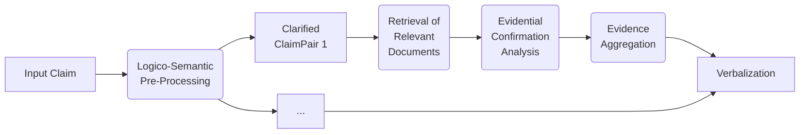
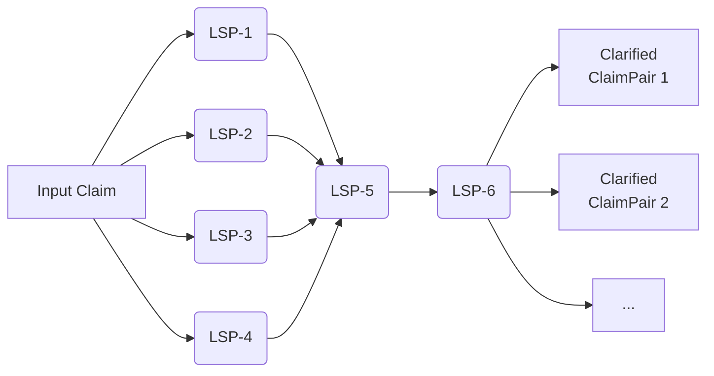

# EvidenceSeeker App Boilerplate <!-- omit in toc -->

A code template for an RAG-based LLM workflow for disambiguating claims and fact-checking them relative to a given database. :female_detective:

---

## Table of Contents <!-- omit in toc -->
- [About this repository](#about-this-repository)
- [:rocket: Getting started](#rocket-getting-started)
  - [Installment](#installment)
  - [Setting up your EvidenceSeeker](#setting-up-your-evidenceseeker)
- [:book: The EvidenceSeeker Workflow](#book-the-evidenceseeker-workflow)
- [:wrench: Used third-party tools](#wrench-used-third-party-tools)
- [:gear: License](#gear-license)

---

## About this repository

This repository is part of **[KIdeKu](https://compphil2mmae.github.io/research/kideku/)**, a current research project at **Karlsruhe Institute of Technology**.

KIdeKu is sponsored by the **Federal Ministry for Family Affairs, Senior Citizens, Woman and Youth ([BMFSFJ](https://www.bmfsfj.de/bmfsfj))**.

The base features have been implemented as part of the event **[wahl.exe](https://www.wahlexe.de/en/)** in December 2024.

[](https://www.bmfsfj.de/bmfsfj)

## :rocket: Getting started

### Installment

1. Clone repository
2. run `hatch shell` **or** `pip install -e </path/to/repo>`
3. To install all dependencies, run `pip install -r </path/to/requirements.txt>`

### Setting up your EvidenceSeeker

The workflow consists of four steps:
1. **[(Logico-semantic) Preprocessing](#1-logico-semantic-pre-processing-bookmark_tabs)**
2. **[(Evidence) Retrieval](#2-evidence-retrieval-open_file_folder)**
3. **[(Evidence) Confirmation Analysis](#3-evidential-confirmation-analysis-mag_right)**
4. **[(Evidence) Aggregation](#4-evidence-aggregation-writing_hand)**

For more information on the individual steps on a conceptual level, consider the section **[The EvidenceSeeker Workflow](#the-evidenceseeker-workflow)** in this README.

The four steps of the workflow are reflected in the folder structure of the source code in `src/evidence-seeker/`.

##### Configs <!-- omit in toc -->

The specific workflow can be modified with the use of configs.

For each of the four steps a config class is defined in the `config.py` file in the corresponding folders.

The default values of the configs defined in the `config.py` files can be modified either by passing individual arguments to the constructor when constructing a config object, e.g.:

```python
claim_preprocessing_config = ClaimPreprocessingConfig(timeout=240, language = "EN")
```

For how to use predefined configs stored as YAML files, refer to the following section.

##### Workflow execution <!-- omit in toc -->

The execution of each workflow step is implemented in the classes defined in the `base.py` file in the corresponding folders.

The execution of the workflow as a whole is implemented in `src/evidence_seeker/evidence_seeker.py`. An object of the class `EvidenceSeeker` is initialized either with a given set of config objects or the default configs:

```python
preprocessing_config = ClaimPreprocessingConfig(timeout=240)

retrieval_config = RetrievalConfig(
    index_persist_path="../TMP/APUZ/storage/index",
)

pipeline = EvidenceSeeker(preprocessing_config=preprocessing_config, retrieval_config=retrieval_config)
```

The EvidenceSeeker can also be initialized with configs stored in YAML files:

```python
pipeline = EvidenceSeeker(preprocessing_config="/path/to/preprocessing_config.yaml", retrieval_config=retrieval_config)
```

When called with a claim, the EvidenceSeeker object executes the workflow for that specific claim and returns the results as a list of dictionaries (in `src/evidence_seeker/datamodels.py`):

```python
example_input = "Climate change is the greatest threat to humanity."
results = await pipeline(example_input)
```

The keys of the `dict` objects in the returned list correspond to the attributes of the `CheckedClaim` class defined in `src/evidence_seeker/datamodels.py`.

For an in-depth example for the pipeline execution, refer to `notebooks/test_whole_pipeline_new.ipynb`.

> [!TIP]
> For more examples and insights into how the individual steps are executed, refer to the Jupyter notebooks in the folder `notebooks`.

##### Models <!-- omit in toc -->

The model to be used by a the **Preprocessing** and **Confirmation Analysis** can be specified with the `used_model_key` field in the corresponding config. The model key for the refers to a one of possibly many models defined in the `models` field of the config.

E.g.:
```python
class ClaimPreprocessingConfig(pydantic.BaseModel):
    #...
    used_model_key: str = "model_2"
    #...
    models: Dict[str, Dict[str, Any]] = pydantic.Field(
        default_factory=lambda: {
            "model_1": {
                #...
            },
            "model_2": {
                "name": "Mistral-7B-Instruct-v0.2",
                "description": "HF inference API",
                "base_url": "https://api-inference.huggingface.co/v1/",
                "model": "mistralai/Mistral-7B-Instruct-v0.2",
                "api_key_name": "HF_TOKEN_EVIDENCE_SEEKER",
                "backend_type": "openai",
                "max_tokens": 1024,
                "temperature": 0.2,
            },
            #...
        }
    )
```

The `api_key_name` field revers to the name of of an environment variable storing the API key for the model.

Currently, the config for the **Retrieval** step can only contain one possible model. Again, the `api_key_name` refers to an environment variable. The keys `embed_base_url` and `embed_model_name` contain the relevant information for the model used for the embeddings.

##### Databases <!-- omit in toc -->

Setting up the database is also done with the configs. 

The `DocumentRetriever` builds an index based on a locally stored database, using the embeddings model defined in the config.

```python
config = RetrievalConfig(
    document_input_dir="../TMP/APUZ/corpus", #Path to your local folder containing the database files
    index_persist_path="../TMP/APUZ/storage/index", #Storage path for saving index (Optional)
)
```

Alternatively, use the key `document_input_files` for a list of paths to the input files given as strings.

For a list of supported file types in the database, refer to the [LlamaIndex documentation](https://docs.llamaindex.ai/en/stable/module_guides/loading/simpledirectoryreader/).

## :book: The EvidenceSeeker Workflow

The following is an overview of the default workflow implemented by EvidenceSeeker and its individual steps:



#### 1. Logico-Semantic Pre-Processing :bookmark_tabs:  <!-- omit in toc -->

The workflow starts with a given input claim. This claim first has to be disambiguated with 'logico-semantic pre-processing'. This step results in different interpretations of the original claims, so-called 'clarified claims', and their negations.


To produce these clarified claims, the model is prompted to analyze and list (`LSP-5`) all normative (`LSP-1`), descriptive (`LSP-2`) and ascriptive (`LSP-3`) statements contained in the original claim.

The model is then prompted to negate the clarified claims (`LSP-6`), resulting in pairs of clarified claims and their negations. 

```yaml
- name: LSP-1
  description: |
    Instruct the assistant to carry out free-text analysis of normative content.
  prompt: |
    The following claim has been submitted for fact-checking.
    <claim>{claim}</claim>
    Before we proceed with retrieving evidence items, we carefully analyse the claim. Your task is to contribute to this preparatory analysis, as detailed below.
    In particular, you should  
    1. thoroughly discuss whether the claim contains or implies normative statements, such as value judgements, recommendations, or evaluations -- if so, try to identify them and render them in your own words;
    2. watch out for ambiguity and vagueness during your discussion, making alternative interpretations explicit.
- name: LSP-2
  description: |
    Instruct the assistant to carry out free-text analysis of factual content.
  prompt: |
    The following claim has been submitted for fact-checking.
    <claim>{claim}</claim>
    Before we proceed with retrieving evidence items, we carefully analyse the claim. Your task is to contribute to this preparatory analysis, as detailed below.
    In particular, you should  
    1. thoroughly discuss whether the claim contains or implies factual or descriptive statements, which can be verified or falsified by empirical observation or scientific analysis and which may include, for example, descriptive reports, historical facts, or scientific claims -- if so, try to identify them and render them in your own words;
    2. watch out for ambiguity and vagueness during your discussion, making alternative interpretations explicit.
- name: LSP-3
  description: |
    Instruct the assistant to carry out free-text analysis of ascriptions.
  prompt: |
    The following claim has been submitted for fact-checking.
    <claim>{claim}</claim>
    Before we proceed with retrieving evidence items, we carefully analyse the claim. Your task is to contribute to this preparatory analysis, as detailed below.
    In particular, you should  
    1. thoroughly discuss whether the claim contains ascriptions, that is, whether the claim ascribes a given statement to a person or organisation (e.g., as something the person has said, believes, acts on etc.) rather than plainly asserting that statement straightaway  -- if so, try to identify which statements are ascribed to whom exactly and in which ways;
    2. watch out for ambiguity and vagueness during your discussion, making alternative interpretations explicit.
- name: LSP-4
  description: |
    Instruct the assistant to carry out free-text analysis of uncertainty.
  prompt: |
    The following claim has been submitted for fact-checking.
    <claim>{claim}</claim>
    Before we proceed with retrieving evidence items, we carefully analyse the claim. Your task is to contribute to this preparatory analysis, as detailed below.
    In particular, you should  
    1. thoroughly discuss the strength of the claim, that is, whether the claim unequivocally states a proposition as true (or false), or whether it's content is more nuanced, e.g. by including modal qualifiers, such as "might", "could", "probably", "possibly", "likely", "unlikely", "certainly", "maybe", etc. -- if so, try to describe the quality and stremgth of the claim as clearly as possible;
    2. watch out for ambiguity and vagueness during your discussion, making alternative interpretations explicit.
- name: LSP-5
  description: |
    Instruct the assistant to identify the normative content, the factual assertion, and the ascriptions contained in a claim.
  prompt: |
    The following claim has been submitted for fact-checking.
    <claim>{claim}</claim>
    Building on our previous analysis, I want you to to identify the normative, the factual, and the ascriptive content of the claim. In particular, you should  
    1. List all normative statements, such as value judgements, recommendations, or evaluations, contained in the claim;
    2. List all factual or descriptive statements, which can be verified or falsified by empirical observation or scientific analysis, contained in the claim;
    3. List all ascriptions, that is, statements ascribed to a person or organisation, contained in the claim.
- name: LSP-6
  description: |
    Instruct assistant to negate the factual and ascriptive claims.
  prompt: |
    The following claim has been submitted for fact-checking.
    <claim>{claim}</claim>
    That claim contains the following factual and ascriptive statements:
    <factual>{factual}</factual>
    <ascriptive>{ascriptive}</ascriptive>
    Your task is to provide the opposite of each of these statement in clear and unequivocal language. Do so by generating a list of statements that express these negations.
```

### 2. Evidence Retrieval :open_file_folder:<!-- omit in toc -->

> [!NOTE]
> By default, **only clarified claims containing ascriptive and descriptive statements** are considered in the remaining steps.

For each clarified claim, [node sentence window/document retrieval](https://docs.llamaindex.ai/en/stable/examples/node_postprocessor/MetadataReplacementDemo/) is used to find relevant evidence items in a pre-defined database.

### 3. Evidential Confirmation Analysis :mag_right:<!-- omit in toc -->

We frame confirmation analysis as a rich textual entailment task. We assess the degree to which a single evidence item (retrieved in previous step):

1. entails the claim, and
2. entails the negation of the claim.

This gives us a degree of confirmation of the claim by the evidence item, which ranges between -1 and 1.

We do this for each evidence item retrieved and each claim.

### 4. Evidence Aggregation :writing_hand: <!-- omit in toc -->

For each clarified claim, we aggregate the results from the Evidental Confirmation Analysis

```yaml
{
    "claim_id": "claim_id",  
    "n_evidence": 823, // number of relevant evidence items found
    "degree_of_confirmation": -0.21, // average degree of confirmation of the claim by the evidence items
    "evidential_uncertainty": 0.32, // variance of degrees of confirmation
}
```

and **verbalize** these results.

## :wrench: Used third-party tools

This project relies on the following libraries, amongst others:

- **[LLamaIndex](https://docs.llamaindex.ai/en/stable/)** for the implementation of the workflow.
- **[Pydantic](https://pydantic.dev/)** for modeling the configs and checked claims.
- **[Phoenix](https://phoenix.arize.com/)** for testing the pipelines with the Jupyter Notebooks in `notebooks`.

All dependencies can furthermore be found in the `pyproject.toml` or the `requirements.txt`.

## :gear: License

The project is licensed under the [MIT License](https://opensource.org/licenses/MIT).

Copyright © 2024-2025 [DebateLab](https://debatelab.philosophie.kit.edu/index.php) at KIT.