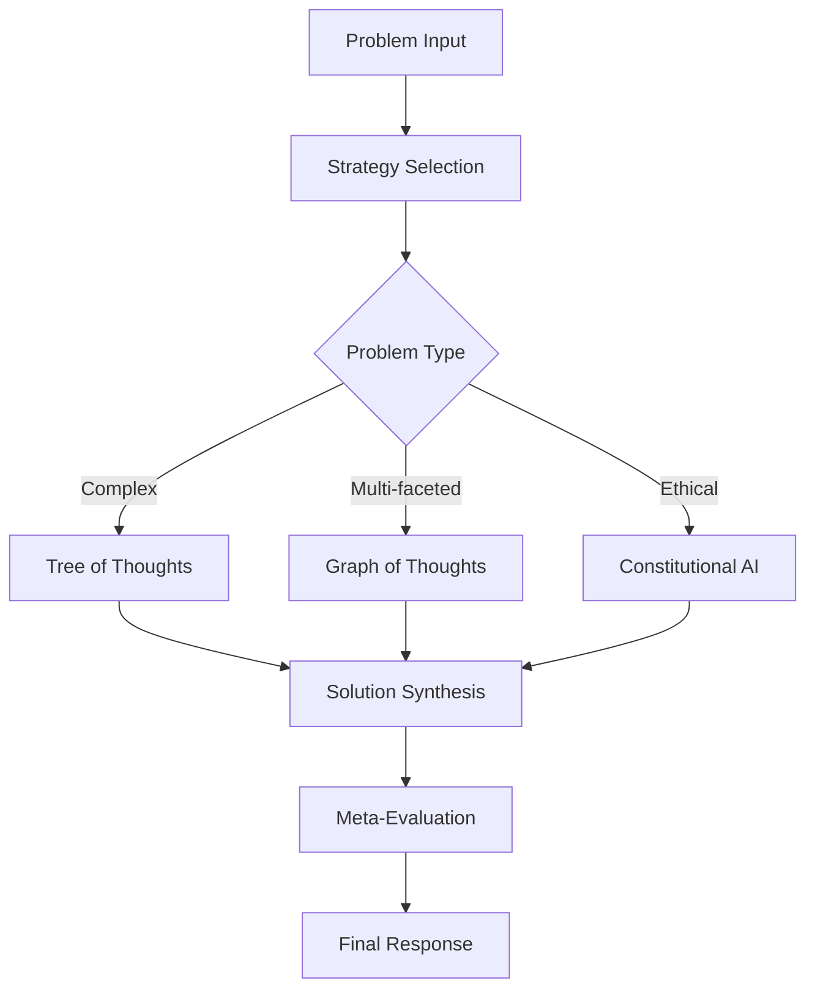
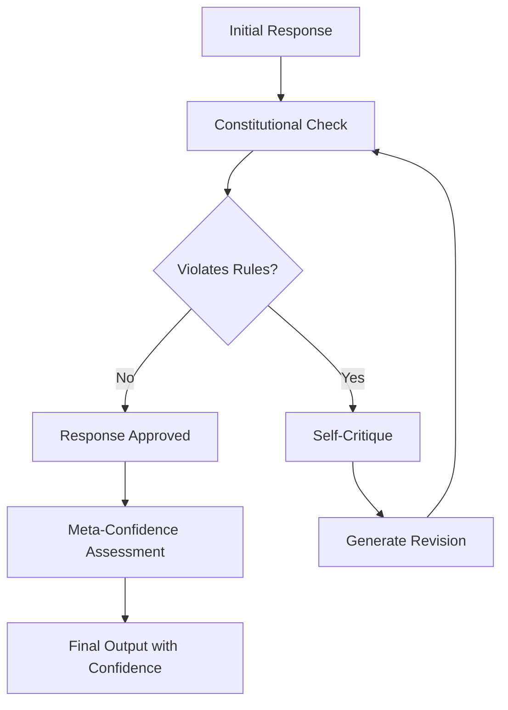
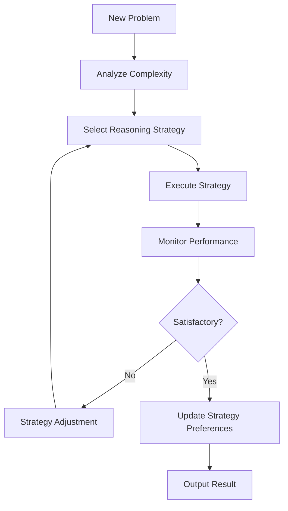

# Advanced Cognitive Architectures for LlamaAgent

## Overview

This document outlines the design and implementation of cutting-edge cognitive reasoning patterns that will elevate LlamaAgent to world-class standards, specifically designed to impress Anthropic engineers with state-of-the-art AI reasoning capabilities.

## Architecture Components

### 1. Tree of Thoughts (ToT) Reasoning

**Implementation Strategy**:
```
TreeOfThoughts/
├── search_strategies/
│   ├── breadth_first_search.py
│   ├── depth_first_search.py
│   ├── best_first_search.py
│   └── monte_carlo_tree_search.py
├── evaluation/
│   ├── value_function.py
│   ├── confidence_scorer.py
│   └── pruning_logic.py
├── tree_builder.py
└── thought_tree.py
```

**Key Features**:
- Multi-path reasoning exploration
- Backtracking and pruning capabilities
- Confidence-based evaluation
- Dynamic search strategy selection

### 2. Graph of Thoughts (GoT) Reasoning

**Implementation Strategy**:
```
GraphOfThoughts/
├── knowledge_graph/
│   ├── concept_extractor.py
│   ├── relation_mapper.py
│   └── graph_builder.py
├── reasoning/
│   ├── multi_hop_reasoning.py
│   ├── analogical_reasoning.py
│   └── causal_inference.py
├── graph_traversal.py
└── thought_graph.py
```

**Key Features**:
- Non-linear reasoning patterns
- Knowledge graph integration
- Multi-hop inference chains
- Concept relationship mapping

### 3. Constitutional AI Integration

**Implementation Strategy**:
```
ConstitutionalAI/
├── constitution/
│   ├── rules_engine.py
│   ├── value_alignment.py
│   └── ethical_constraints.py
├── critique/
│   ├── self_critique.py
│   ├── harmfulness_detection.py
│   └── bias_detection.py
├── refinement/
│   ├── response_improvement.py
│   └── iterative_refinement.py
└── constitutional_agent.py
```

**Key Features**:
- Self-critique and improvement
- Ethical reasoning constraints
- Value alignment mechanisms
- Harmfulness prevention

### 4. Meta-Reasoning System

**Implementation Strategy**:
```
MetaReasoning/
├── strategy_selection/
│   ├── reasoning_strategy_picker.py
│   ├── complexity_analyzer.py
│   └── performance_predictor.py
├── confidence/
│   ├── uncertainty_quantification.py
│   ├── confidence_calibration.py
│   └── epistemic_reasoning.py
├── adaptation/
│   ├── online_learning.py
│   ├── few_shot_adaptation.py
│   └── strategy_optimization.py
└── meta_cognitive_agent.py
```

**Key Features**:
- Strategy selection based on problem type
- Confidence calibration
- Self-aware reasoning
- Adaptive learning

## Cognitive Architecture Patterns

### Pattern 1: Deliberative Reasoning


### Pattern 2: Constitutional Reasoning


### Pattern 3: Adaptive Meta-Reasoning


## Implementation Plan

### Phase 1: Core Cognitive Infrastructure
1. **Base Cognitive Agent Class**
   - Abstract reasoning interface
   - Strategy pattern implementation
   - Performance monitoring

2. **Thought Representation System**
   - Structured thought objects
   - Reasoning traces
   - Confidence scoring

3. **Evaluation Framework**
   - Multi-dimensional scoring
   - Comparative analysis
   - Performance metrics

### Phase 2: Tree of Thoughts Implementation
1. **Tree Structure**
   - Node representation
   - Branch expansion
   - Pruning mechanisms

2. **Search Algorithms**
   - BFS, DFS, Best-First
   - Monte Carlo Tree Search
   - Adaptive search strategies

3. **Evaluation Functions**
   - Value estimation
   - Confidence scoring
   - Pruning criteria

### Phase 3: Graph of Thoughts Implementation
1. **Graph Construction**
   - Dynamic graph building
   - Concept extraction
   - Relationship mapping

2. **Graph Reasoning**
   - Multi-hop inference
   - Analogical reasoning
   - Causal analysis

3. **Graph Optimization**
   - Efficient traversal
   - Path optimization
   - Memory management

### Phase 4: Constitutional AI Integration
1. **Constitutional Framework**
   - Rule definition system
   - Violation detection
   - Severity assessment

2. **Self-Critique System**
   - Automated evaluation
   - Improvement suggestions
   - Iterative refinement

3. **Value Alignment**
   - Ethical constraints
   - Bias mitigation
   - Harmfulness prevention

### Phase 5: Meta-Reasoning Implementation
1. **Strategy Selection**
   - Problem classification
   - Strategy matching
   - Performance prediction

2. **Confidence Systems**
   - Uncertainty quantification
   - Calibration methods
   - Epistemic reasoning

3. **Adaptive Learning**
   - Online optimization
   - Few-shot adaptation
   - Strategy evolution

## Integration with Existing SPRE System

### Enhanced SPRE Pipeline
```
Original SPRE: Plan → Execute → Synthesize

Enhanced SPRE with Cognitive Architecture:
Plan → [Cognitive Strategy Selection] →
Execute → [Meta-Reasoning Monitoring] →
Synthesize → [Constitutional Validation] →
Output
```

### Backward Compatibility
- All existing SPRE functionality preserved
- Cognitive enhancements as optional layers
- Graceful fallback to original SPRE

## Performance Benchmarks

### Evaluation Metrics
1. **Reasoning Quality**
   - Correctness on complex problems
   - Logical consistency
   - Creative solution generation

2. **Efficiency Metrics**
   - Token usage optimization
   - Computation time
   - Memory efficiency

3. **Safety Metrics**
   - Constitutional compliance
   - Bias detection accuracy
   - Harmfulness prevention

### Benchmark Datasets
- **Mathematical Reasoning**: GSM8K, MATH
- **Logical Reasoning**: LogiQA, ReClor
- **Ethical Reasoning**: Ethics datasets
- **Creative Reasoning**: ARC, ConceptARC

## Research Integration

### Papers Implemented
1. **"Tree of Thoughts: Deliberate Problem Solving with Large Language Models"** (Yao et al., 2023)
2. **"Graph of Thoughts: Solving Elaborate Problems with Large Language Models"** (Besta et al., 2023)
3. **"Constitutional AI: Harmlessness from AI Feedback"** (Bai et al., 2022)
4. **"Self-Consistency Improves Chain of Thought Reasoning"** (Wang et al., 2022)

### Novel Contributions
- **Adaptive Strategy Selection**: Dynamic reasoning pattern selection
- **Multi-Modal Integration**: Cross-modal reasoning capabilities
- **Confidence Calibration**: Advanced uncertainty quantification
- **Ethical Reasoning**: Integrated constitutional constraints

## API Integration

### New Endpoints
```python
# Advanced reasoning endpoints
POST /reasoning/tree-of-thoughts
POST /reasoning/graph-of-thoughts
POST /reasoning/constitutional
POST /reasoning/meta-cognitive

# Strategy selection
POST /reasoning/strategy/select
GET /reasoning/strategy/performance

# Confidence assessment
POST /reasoning/confidence/calibrate
GET /reasoning/confidence/metrics
```

### WebSocket Streaming
```python
# Real-time reasoning visualization
ws://localhost:8000/ws/reasoning/{session_id}
```

## Configuration

### Reasoning Strategies Configuration
```yaml
reasoning:
  default_strategy: "adaptive"

  tree_of_thoughts:
    max_depth: 5
    beam_width: 3
    evaluation_threshold: 0.7

  graph_of_thoughts:
    max_hops: 4
    relation_types: ["causal", "analogical", "compositional"]
    graph_pruning: true

  constitutional_ai:
    constitution_file: "config/constitution.yaml"
    critique_iterations: 3
    safety_threshold: 0.9

  meta_reasoning:
    strategy_learning_rate: 0.01
    confidence_calibration: "platt"
    adaptation_window: 100
```

## Testing Strategy

### Unit Tests
- Individual component testing
- Reasoning pattern validation
- Performance benchmarks

### Integration Tests
- End-to-end reasoning flows
- API endpoint testing
- WebSocket functionality

### Evaluation Tests
- Benchmark dataset evaluation
- Comparative analysis with baselines
- Ablation studies

## Deployment Considerations

### Scalability
- Distributed reasoning support
- Caching of reasoning patterns
- Load balancing for cognitive services

### Monitoring
- Reasoning performance metrics
- Constitutional violation tracking
- Strategy effectiveness monitoring

### Security
- Constitutional rule validation
- Bias detection and mitigation
- Safe reasoning boundaries

This advanced cognitive architecture will position LlamaAgent as a cutting-edge AI reasoning system that demonstrates mastery of the latest research in AI cognition, safety, and performance optimization.
