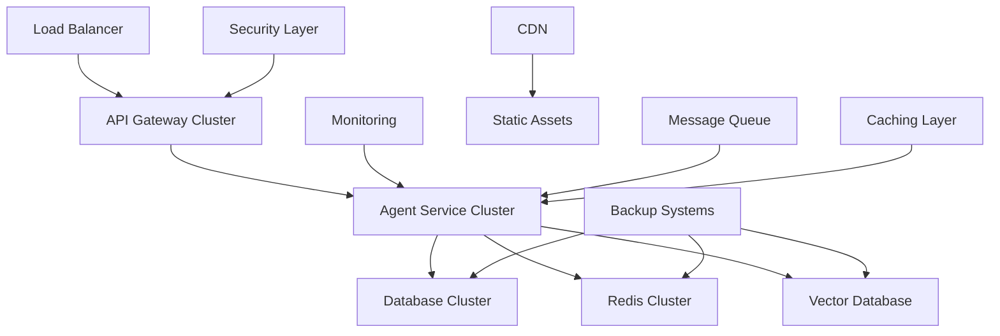
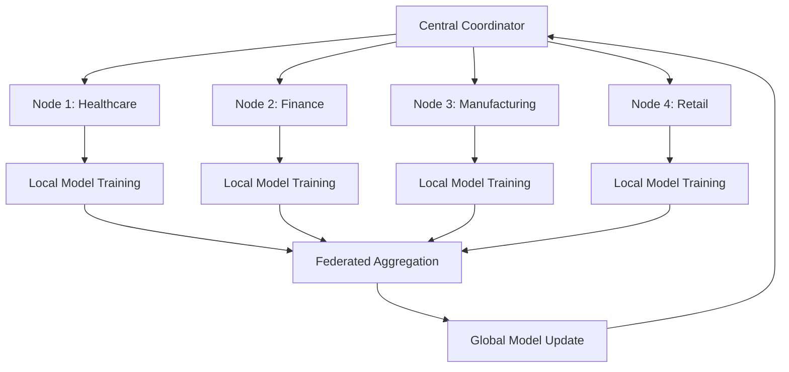
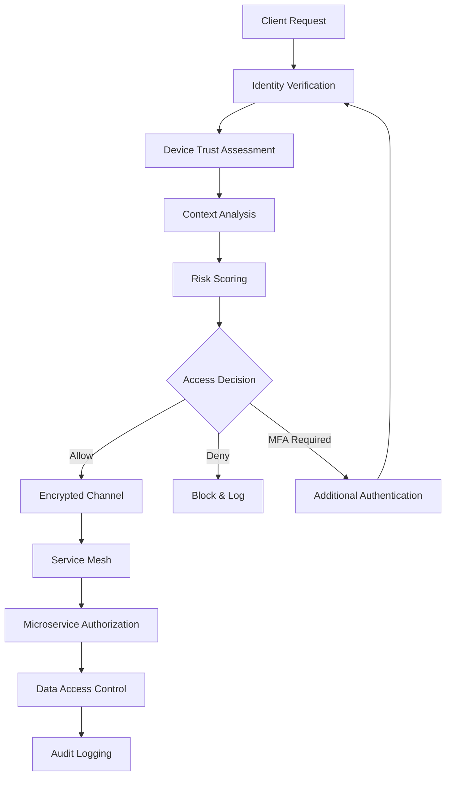

# Enterprise Production Architecture for LlamaAgent

## Overview

This document outlines the design of enterprise-grade production features including advanced security, distributed computing, federated learning, and sophisticated monitoring capabilities that position LlamaAgent as a world-class AI infrastructure platform.

## Enterprise Architecture Components

### 1. Advanced Security Framework

**Zero-Trust Security Model**:
```
Security/
├── authentication/
│   ├── multi_factor_auth.py
│   ├── oauth2_integration.py
│   ├── ldap_connector.py
│   └── saml_provider.py
├── authorization/
│   ├── rbac_engine.py
│   ├── policy_enforcement.py
│   ├── attribute_based_access.py
│   └── permission_manager.py
├── encryption/
│   ├── homomorphic_encryption.py
│   ├── differential_privacy.py
│   ├── secure_aggregation.py
│   └── key_management.py
├── audit/
│   ├── security_logging.py
│   ├── compliance_monitor.py
│   ├── threat_detection.py
│   └── forensic_tools.py
└── security_agent.py
```

**Key Security Features**:
- End-to-end encryption for all data flows
- Homomorphic encryption for privacy-preserving computation
- Differential privacy mechanisms
- Zero-knowledge proof systems
- Secure multi-party computation

### 2. Distributed Intelligence Network

**Federated Agent Architecture**:
```
DistributedIntelligence/
├── federation/
│   ├── federated_learning.py
│   ├── consensus_mechanisms.py
│   ├── knowledge_sharing.py
│   └── distributed_training.py
├── orchestration/
│   ├── cluster_manager.py
│   ├── load_balancer.py
│   ├── service_mesh.py
│   └── fault_tolerance.py
├── communication/
│   ├── secure_channels.py
│   ├── message_passing.py
│   ├── state_synchronization.py
│   └── gossip_protocol.py
├── consensus/
│   ├── raft_consensus.py
│   ├── byzantine_fault_tolerance.py
│   ├── practical_byzantine_ft.py
│   └── proof_of_stake.py
└── distributed_agent.py
```

**Key Distribution Features**:
- Federated learning across multiple nodes
- Byzantine fault-tolerant consensus
- Automatic failover and recovery
- Dynamic load balancing
- Secure knowledge aggregation

### 3. Advanced Monitoring & Observability

**Comprehensive Monitoring Stack**:
```
Monitoring/
├── metrics/
│   ├── performance_metrics.py
│   ├── business_metrics.py
│   ├── security_metrics.py
│   └── ai_safety_metrics.py
├── tracing/
│   ├── distributed_tracing.py
│   ├── reasoning_traces.py
│   ├── execution_profiling.py
│   └── dependency_tracking.py
├── alerting/
│   ├── anomaly_detection.py
│   ├── alert_manager.py
│   ├── incident_response.py
│   └── escalation_policies.py
├── dashboards/
│   ├── real_time_dashboard.py
│   ├── executive_dashboard.py
│   ├── technical_dashboard.py
│   └── compliance_dashboard.py
└── monitoring_agent.py
```

**Key Monitoring Features**:
- Real-time performance tracking
- AI model drift detection
- Security anomaly detection
- Automated incident response
- Compliance monitoring

### 4. Enterprise Integration Platform

**Enterprise Connectors**:
```
EnterpriseIntegration/
├── connectors/
│   ├── salesforce_connector.py
│   ├── slack_integration.py
│   ├── microsoft_teams.py
│   ├── jira_connector.py
│   ├── confluence_sync.py
│   └── sharepoint_adapter.py
├── data_sources/
│   ├── database_connectors.py
│   ├── api_integrations.py
│   ├── file_system_sync.py
│   └── cloud_storage.py
├── workflows/
│   ├── workflow_engine.py
│   ├── approval_processes.py
│   ├── automation_rules.py
│   └── business_logic.py
├── governance/
│   ├── data_governance.py
│   ├── model_governance.py
│   ├── compliance_framework.py
│   └── risk_management.py
└── enterprise_agent.py
```

**Key Integration Features**:
- Enterprise application connectivity
- Workflow automation
- Data governance frameworks
- Compliance management
- Risk assessment tools

## Production Architecture Patterns

### Pattern 1: High-Availability Deployment


### Pattern 2: Federated Learning Network


### Pattern 3: Zero-Trust Security Architecture


## Performance & Scalability

### Horizontal Scaling Strategy
```yaml
scaling:
  auto_scaling:
    enabled: true
    min_replicas: 3
    max_replicas: 100
    cpu_threshold: 70
    memory_threshold: 80

  load_balancing:
    algorithm: "least_connections"
    health_check_interval: 30
    failover_timeout: 10

  caching:
    distributed_cache: true
    cache_strategies: ["LRU", "LFU", "TTL"]
    cache_size: "10GB"

  database:
    read_replicas: 5
    write_replicas: 2
    connection_pooling: true
    query_optimization: true
```

### Resource Optimization
```yaml
resources:
  cpu_optimization:
    vectorization: true
    parallel_processing: true
    async_operations: true

  memory_optimization:
    model_quantization: true
    gradient_checkpointing: true
    memory_mapping: true

  gpu_optimization:
    model_parallelism: true
    tensor_parallelism: true
    pipeline_parallelism: true
```

## Security Implementation

### Encryption Standards
```yaml
encryption:
  at_rest:
    algorithm: "AES-256-GCM"
    key_rotation: "30d"

  in_transit:
    protocol: "TLS 1.3"
    certificate_management: "automated"

  in_computation:
    homomorphic_encryption: true
    secure_multiparty: true
    differential_privacy: true
    epsilon: 1.0
```

### Access Control
```yaml
access_control:
  authentication:
    multi_factor: true
    biometric_support: true
    token_expiry: "1h"

  authorization:
    model: "RBAC + ABAC"
    fine_grained_permissions: true
    policy_engine: "OPA"

  audit:
    comprehensive_logging: true
    real_time_monitoring: true
    compliance_reports: true
```

## Compliance & Governance

### Regulatory Compliance
```yaml
compliance:
  frameworks:
    - "SOC2 Type II"
    - "ISO 27001"
    - "GDPR"
    - "HIPAA"
    - "PCI DSS"

  data_governance:
    data_classification: true
    retention_policies: true
    right_to_erasure: true

  model_governance:
    model_versioning: true
    explainability: true
    bias_detection: true
    performance_monitoring: true
```

### Risk Management
```yaml
risk_management:
  threat_modeling:
    automated_assessment: true
    continuous_monitoring: true
    risk_scoring: true

  incident_response:
    automated_response: true
    escalation_procedures: true
    forensic_capabilities: true

  business_continuity:
    disaster_recovery: true
    backup_strategies: true
    failover_mechanisms: true
```

## Deployment Infrastructure

### Kubernetes Configuration
```yaml
apiVersion: v1
kind: Namespace
metadata:
  name: llamaagent-production

---
apiVersion: apps/v1
kind: Deployment
metadata:
  name: llamaagent-api
spec:
  replicas: 10
  selector:
    matchLabels:
      app: llamaagent-api
  template:
    spec:
      containers:
      - name: api
        image: llamaagent:latest
        resources:
          requests:
            cpu: 2
            memory: 4Gi
          limits:
            cpu: 4
            memory: 8Gi
        env:
        - name: ENVIRONMENT
          value: "production"
        - name: LOG_LEVEL
          value: "INFO"
```

### Terraform Infrastructure
```hcl
# AWS EKS Cluster for LlamaAgent
resource "aws_eks_cluster" "llamaagent" {
  name     = "llamaagent-production"
  role_arn = aws_iam_role.cluster.arn
  version  = "1.27"

  vpc_config {
    subnet_ids              = var.subnet_ids
    endpoint_private_access = true
    endpoint_public_access  = true
  }

  depends_on = [
    aws_iam_role_policy_attachment.cluster_policy,
  ]
}

# RDS for persistent storage
resource "aws_db_instance" "llamaagent_db" {
  identifier = "llamaagent-production"
  engine     = "postgres"
  engine_version = "15.3"
  instance_class = "db.r6g.xlarge"
  allocated_storage = 1000

  multi_az               = true
  backup_retention_period = 30
  backup_window          = "03:00-04:00"
  maintenance_window     = "sun:04:00-sun:05:00"
}
```

This enterprise production architecture ensures LlamaAgent can scale to handle millions of requests, maintain security compliance, and provide enterprise-grade reliability and observability.
