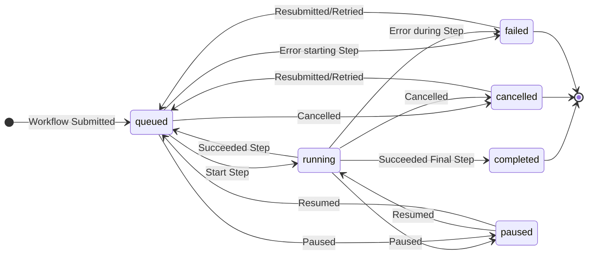

# MADSci Workcell Manager

The MADSci Workcell Manager handles the operation of a **Workcell**, a collection of **Nodes**, **Locations**, and **Resources** that are scheduled together to perform **Workflows**. A lab may consist of multiple Workcells, with each Workcell able to execute workflows independently.


## Installation

The MADSci workcell manager is available via [the Python Package Index](https://pypi.org/project/madsci.workcell_manager/), and can be installed via:

```bash
pip install madsci.workcell_manager
```

This python package is also included as part of the [madsci Docker image](https://github.com/orgs/AD-SDL/packages/container/package/madsci). You can see an example docker setup in [this example compose file](./workcell_manager.compose.yaml).

Note that you will also need a MongoDB database and a Redis database (both included in the example compose file)

## Usage

### Workcell Manager

To create and run a new MADSci Workcell Manager, do the following in your MADSci lab directory:

- If you're not using docker compose, provision and configure a MongoDB instance.
- If you're using docker compose, define your workcell manager, redis, and mongodb services based on the [example compose file](./workcell_manager.compose.yaml).


```bash
# Create a Workcell Definition
madsci workcell create
# Start the databases and Workcell Server
docker compose up
# OR
python -m madsci.workcell_manager.workcell_server
```

You should see a REST server started on the configured host and port. Navigate in your browser to the URL you configured (default: `http://localhost:8005/`) to see if it's working.

You can see up-to-date documentation on the endpoints provided by your workcell manager, and try them out, via the OpenAPI docs served by your manager at the server's `/docs` page.

### Workcell Client

You can use MADSci's `WorkcellClient` in your python code to submit workflows, query their status and progress, manage a workflow's lifecycle, get information about and update the workcell state, and more.

```python
from madsci.client.workcell_client import WorkcellClient
from madsci.common.types.workflow_types import WorkflowDefinition
from madsci.common.types.step_types import StepDefinition

workcell_client = WorkcellClient(
  workcell_server_url="http://localhost:8005"
)
wf_def = WorkflowDefinition(
  name="Test Workflow",
  parameters=[
    {"name": "test_param", "default": 0}
  ],
  steps=[
    StepDefinition(
      name="Test Step 0",
      node="liquidhandler_1", # Must exist in workcell nodes
      action="test_action",
      args={
        "test_arg": "${test_param}" # This parameter will be substituted at submission time
      },
      files={
        "test_file_arg": "path/to/file/argument"
      },
      locations={
        "test_location": "liquidhandler_deck_1" # Must exist in workcell locations
      }
    )
  ]
)

result = workcell_client.submit_workflow(workflow=wf_def, parameters={"test_param": 10})
# Alternatively, specify the workflow as a path
result = workcell_client.submit_workflow(workflow="path/to/test.workflow.yaml")

# You can also not await the workflow results, and query later
result = workcell_client.submit_workflow(workflow=wf_def, await_completion=False)
time.sleep(10)
result = workcell_client.query_workflow(result.workflow_id)
```

## Defining a Workcell

You can create a new `WorkcellDefinition` file (typically a `.workcell.yaml`) using the command `madsci workcell create`

### Nodes

Nodes are required to execute the action required by each step in a Workflow. Each Node typically corresponds to a physical device (robot, instrument, sensor, etc.) in your laboratory.

In the workcell definition files `nodes` section, you can specify each node avaiable in the workcell as a mapping of node alias to the node's URL. When specifying the node to execute a step on in a Workflow, you should use the node alias defined here, rather than the node name according to the node itself.

### Locations

You can define important locations in your workcell, optionally linking them to container resources, using the `locations` list. This top-level element of the `WorkcellDefinition` allows you to provide a list of `LocationDefinition` objects, which have the following important properties:

- A `location_name` and `location_id` to idenitfy the location
- A `lookup` dictionary, which maps node names to representations of the location relevant to that node.
- Optionally, a `resource_id` or `resource_definition` for the container resource that you want the location to be attached to.

## Defining Workflows

MADSci Workcell Managers accept `WorkflowDefinition`s, which define a sequence of steps to be run on a Workcell. Each step represents an Action to be taken by a Node.

Workflows can either be directly created as python objects, or defined as YAML files (typically with the `.workflow.yaml` extension) which are then read, validated, and submitted by the workcell client.

### Steps

The `steps` list allows you to specify a sequence of `StepDefinition`s, which are evaluated by the Workcell Manager's Scheduler and executed when able.

A step has the following important properties:

- `name`: the human-readable name of the step
- `description`: optional, a longer/more-detailed description of the step
- `node`: the name of the node used to perform this step. This must match the name of a node in the workcell definition (so if the node's name and the alias used by the workcell differ, use the workcell's version)
- `action`: the name of the action to be performed (must match an action provided by the node)
- `args`: a dictionary of argument names and values to pass to the node when executing the action
- `files`: a dictionary of file argument names and paths to upload to the node when executing the action
- `locations`: any locations to be passed to the node as arguments. Note that this will send _just the representation relevant to that node_, so the workcell's `LocationDefinition` must include a lookup value matching the node name.
- `conditions`: a list of user-specified conditions that must be met before this step can be run.
- `data_labels`: allows you to attach unique labels to datapoints returned as part of the action results.

### Parameters

You can, optionally, specify `WorkflowParameter`s in the `parameters` field of a workflow. These consist of a `name` and, optionally, a `default` value. When submitting a workflow, you can specify values for these parameters to be used in the workflow.

You can use a workflow parameter's value in a workflow definition with the following syntax:

- `${parameter_name}`
- `$parameter_name`

If a parameter has no default value and a value is not provided when the workflow is submitted, an exception is thrown.

## Workflow Lifecycle

The below state diagrams illustrates the evolution of a Workflow's status over the course of it's life, from submission to reaching a terminal state.


