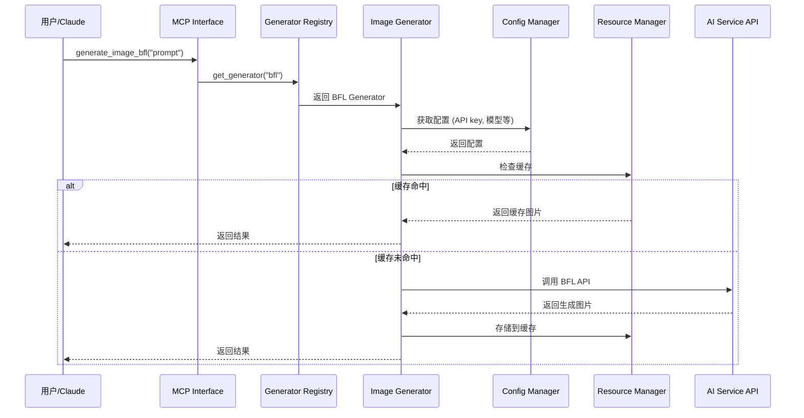
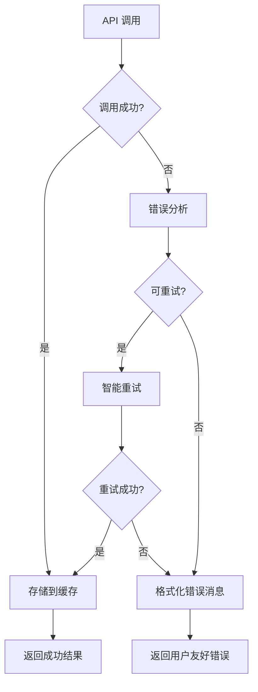

# MCP ImageUtils 架构概览

## 🏗️ 整体架构

Phase 2 完成后，MCP ImageUtils 从单一 BFL 支持升级为企业级多模型 AI 图片生成平台。

### 架构层次

```
┌─────────────────────────────────────────────────────────────┐
│                    MCP Interface Layer                      │
│                   (Claude/AI 调用接口)                      │
└─────────────────────────────────────────────────────────────┘
                              │
┌─────────────────────────────────────────────────────────────┐
│                  Generator Registry                         │
│              (生成器注册和管理中心)                          │
└─────────────────────────────────────────────────────────────┘
                              │
┌─────────────────────────────────────────────────────────────┐
│                 Image Generators                            │
│    ┌─────────────┐  ┌─────────────┐  ┌─────────────┐       │
│    │ BFL FLUX    │  │ OpenAI      │  │ Stability   │       │
│    │ Generator   │  │ DALL-E      │  │ AI          │  ...  │
│    └─────────────┘  └─────────────┘  └─────────────┘       │
└─────────────────────────────────────────────────────────────┘
                              │
┌─────────────────────────────────────────────────────────────┐
│                   Common Services                           │
│  ┌─────────────┐ ┌─────────────┐ ┌─────────────┐           │
│  │ Config      │ │ Error       │ │ Resource    │           │
│  │ Management  │ │ Handling    │ │ Management  │           │
│  └─────────────┘ └─────────────┘ └─────────────┘           │
│  ┌─────────────┐ ┌─────────────┐                           │
│  │ Retry       │ │ Rate        │                           │
│  │ Mechanism   │ │ Limiting    │                           │
│  └─────────────┘ └─────────────┘                           │
└─────────────────────────────────────────────────────────────┘
```

## 🔄 新的工作流程

### 1. 用户请求流程



### 2. 错误处理流程



## 🎯 核心组件

### 1. Generator Registry (生成器注册表)
- **作用**: 统一管理所有 AI 图片生成器
- **功能**: 注册、发现、启用/禁用生成器
- **优势**: 插件化架构，轻松添加新模型

### 2. Image Generator (图片生成器基类)
- **作用**: 标准化所有生成器的接口
- **功能**: 生成图片、配置管理、错误处理
- **优势**: 统一的开发和使用体验

### 3. Config Management (配置管理)
- **作用**: 统一的配置管理系统
- **功能**: 多源配置、验证、诊断
- **优势**: 灵活配置，友好的错误提示

### 4. Error Handling (错误处理)
- **作用**: 智能的错误处理和用户体验
- **功能**: 错误分类、国际化消息、重试机制
- **优势**: 用户友好，自动恢复

### 5. Resource Management (资源管理)
- **作用**: 高效的图片缓存和存储
- **功能**: 多级缓存、智能清理、统计监控
- **优势**: 高性能，节省成本

## 🚀 主要优势

### 1. 可扩展性
- **添加新模型**: 只需继承 `ImageGenerator` 基类
- **插件化架构**: 每个生成器独立开发和维护
- **配置驱动**: 通过配置文件控制功能

### 2. 用户体验
- **统一接口**: 所有模型使用相同的调用方式
- **智能缓存**: 相同请求直接返回缓存结果
- **友好错误**: 中英文错误消息和解决建议

### 3. 企业级特性
- **配置管理**: 支持环境变量、配置文件、命令行
- **错误处理**: 完整的错误分类和处理策略
- **监控统计**: 详细的使用统计和性能监控
- **资源优化**: 自动缓存管理和清理

### 4. 开发友好
- **标准化**: 统一的开发模式和接口
- **测试完善**: 40+ 个测试确保稳定性
- **文档齐全**: 完整的 API 文档和示例
- **调试工具**: CLI 工具支持配置诊断

## 📈 性能提升

### 缓存效果
- **首次请求**: 正常 API 调用时间
- **重复请求**: 毫秒级缓存响应
- **存储优化**: 智能清理，节省磁盘空间

### 错误恢复
- **网络错误**: 自动重试，指数退避
- **速率限制**: 智能等待，避免浪费
- **配置错误**: 详细提示，快速修复

## 🔮 未来扩展

### 即将支持的模型
- **OpenAI DALL-E 3**: 高质量图片生成
- **Stability AI**: 开源 Stable Diffusion
- **Midjourney**: 艺术风格图片生成
- **Google Imagen**: Google 的图片生成模型

### 高级功能
- **批量生成**: 同时生成多张图片
- **风格转换**: 图片风格迁移
- **图片编辑**: 基于 AI 的图片编辑
- **模型组合**: 多个模型协同工作

## 📊 架构对比

| 特性 | Phase 1 (单一 BFL) | Phase 2 (多模型框架) |
|------|-------------------|---------------------|
| 支持模型 | 仅 BFL FLUX | 任意 AI 模型 |
| 配置管理 | 环境变量 | 多源配置 + 验证 |
| 错误处理 | 基础错误 | 智能错误 + 国际化 |
| 缓存系统 | 无 | 多级缓存 |
| 扩展性 | 困难 | 插件化 |
| 用户体验 | 基础 | 企业级 |
| 开发效率 | 低 | 高 |
| 维护成本 | 高 | 低 |

这个新架构为 MCP ImageUtils 奠定了坚实的基础，使其能够成为一个真正的企业级 AI 图片生成平台。
