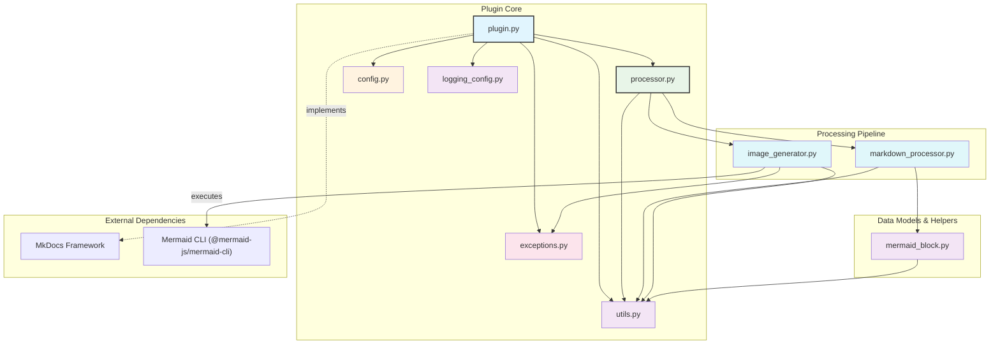
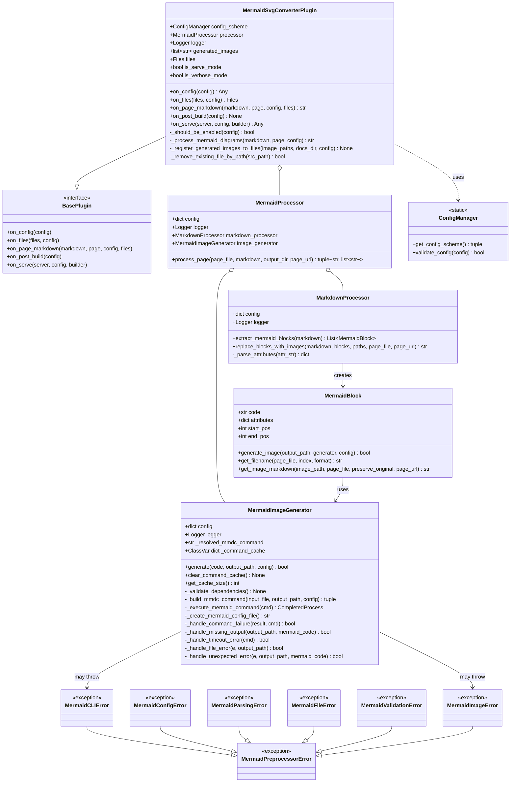
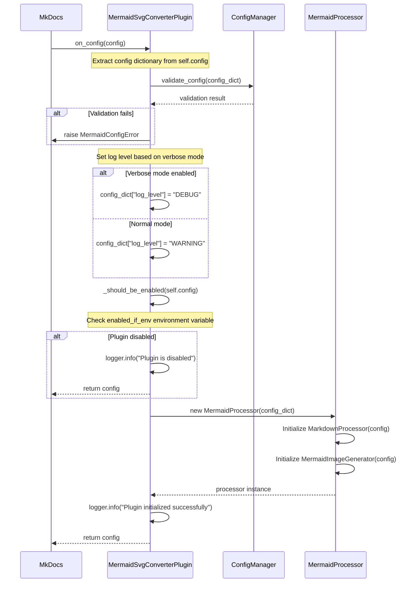
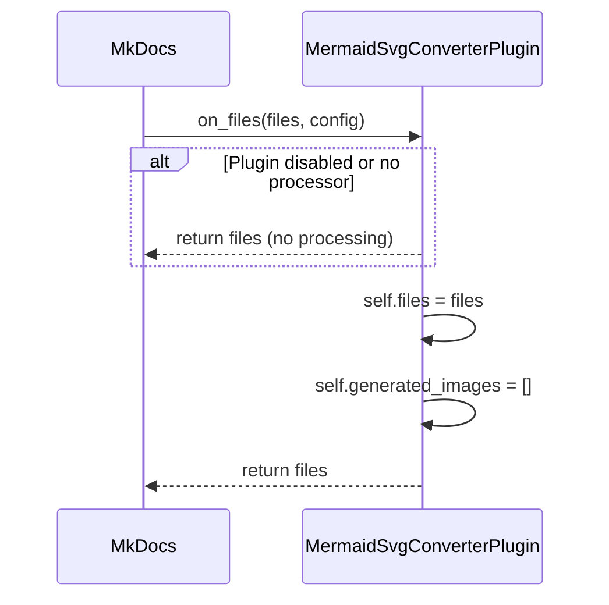
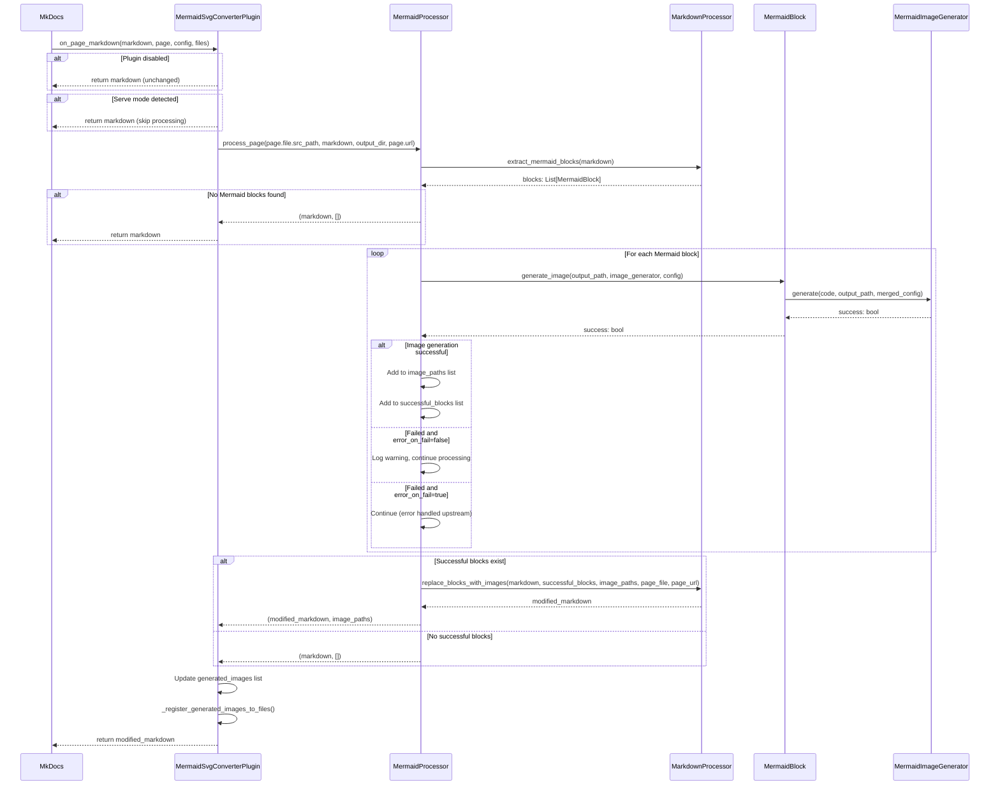
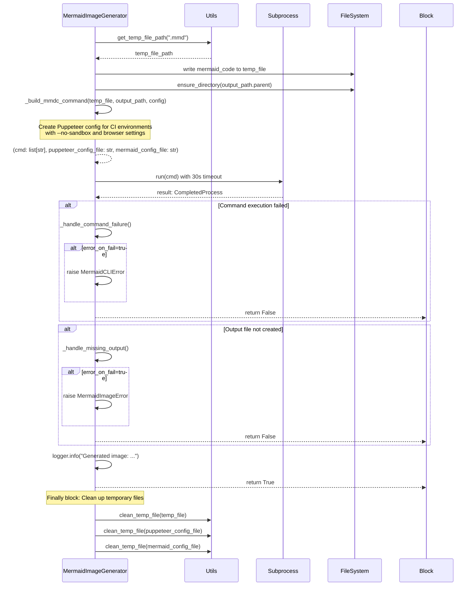
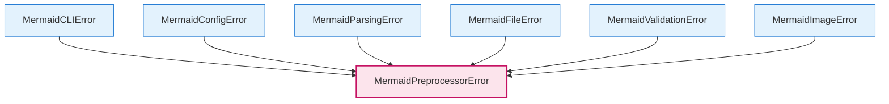

# Architecture Documentation

## Overview

The MkDocs Mermaid to Image Plugin is a comprehensive solution that converts Mermaid diagrams to static SVG images during the MkDocs build process. This plugin enables PDF output generation and offline viewing of documentation containing Mermaid diagrams by leveraging the Mermaid CLI (`@mermaid-js/mermaid-cli`) to transform code blocks into static images.

## Project Structure

```
mkdocs-mermaid-to-svg/
└── src/
    └── mkdocs_mermaid_to_svg/
        ├── __init__.py             # Package initialization and version information
        ├── _version.py             # Version management
        ├── plugin.py               # Main MkDocs plugin class (MermaidSvgConverterPlugin)
        ├── processor.py            # Page processing orchestrator (MermaidProcessor)
        ├── markdown_processor.py   # Markdown parsing and transformation (MarkdownProcessor)
        ├── image_generator.py      # Image generation via Mermaid CLI (MermaidImageGenerator)
        ├── mermaid_block.py        # Mermaid block representation (MermaidBlock)
        ├── config.py               # Configuration schema and validation (ConfigManager)
        ├── types.py                # Type definitions and TypedDict classes
        ├── exceptions.py           # Custom exception hierarchy
        ├── logging_config.py       # Structured logging configuration
        └── utils.py                # Utility functions and helpers
```

## Component Dependencies



## Class Architecture



## Processing Flow

### 1. Plugin Initialization (`on_config`)



### 2. File Registration (`on_files`)



### 3. Page Processing (`on_page_markdown`)



### 4. Image Generation (`MermaidImageGenerator.generate`)



## Configuration Management

The plugin configuration is managed through `mkdocs.yml` and validated using the `ConfigManager` class.

### Configuration Schema

```python
# Available configuration options in mkdocs.yml
plugins:
  - mkdocs-mermaid-to-svg:
      enabled_if_env: "ENABLE_MERMAID"        # Environment variable for conditional activation
      output_dir: "assets/images"             # Directory for generated images
      mermaid_config: {...}                   # Mermaid configuration object or file path
      theme: "default"                        # Mermaid theme: default, dark, forest, neutral
      css_file: "path/to/custom.css"          # Optional CSS file for styling
      puppeteer_config: "path/to/config.json" # Optional Puppeteer configuration
      temp_dir: "/tmp"                        # Temporary directory for processing
      preserve_original: false                # Keep original Mermaid blocks alongside images
      error_on_fail: false                    # Stop build on image generation failure
      log_level: "INFO"                       # Logging level
      cleanup_generated_images: false         # Clean up generated images after build
```

### Validation Logic

The `ConfigManager.validate_config()` method ensures:
- File paths (CSS, Puppeteer config) exist when specified
- Configuration consistency across all options

## Environment-Specific Behavior

### Mode Detection

The plugin automatically detects the execution environment:

```python
# src/mkdocs_mermaid_to_svg/plugin.py
class MermaidSvgConverterPlugin(BasePlugin):
    def __init__(self) -> None:
        self.is_serve_mode: bool = "serve" in sys.argv
        self.is_verbose_mode: bool = "--verbose" in sys.argv or "-v" in sys.argv
```

### Conditional Activation

Plugin activation can be controlled via environment variables:

```python
def _should_be_enabled(self, config: dict[str, Any]) -> bool:
    enabled_if_env = config.get("enabled_if_env")

    if enabled_if_env is not None:
        # Check if environment variable exists and has non-empty value
        env_value = os.environ.get(enabled_if_env)
        return env_value is not None and env_value.strip() != ""

    # Default: always enabled if no conditional environment variable set
    return True
```

### Logging Strategy

Log levels are dynamically adjusted based on verbose mode:

```python
# Adjust log level based on verbose mode
config_dict["log_level"] = "DEBUG" if self.is_verbose_mode else "WARNING"
```

## File Management Strategy

### Generated Image Registration

Generated images are dynamically registered with MkDocs' file system to ensure proper copying to the site directory:

```python
def _register_generated_images_to_files(self, image_paths: list[str], docs_dir: Path, config: Any) -> None:
    from mkdocs.structure.files import File

    for image_path in image_paths:
        image_file_path = Path(image_path)
        if image_file_path.exists():
            rel_path = image_file_path.relative_to(docs_dir)
            # Normalize path for cross-platform compatibility
            rel_path_str = str(rel_path).replace("\\", "/")

            # Remove existing file to avoid duplicates
            self._remove_existing_file_by_path(rel_path_str)

            # Create and register new File object
            file_obj = File(rel_path_str, str(docs_dir), str(config["site_dir"]), ...)
            self.files.append(file_obj)
```

### Image Placement Strategy

- **Development Mode**: Images are generated in `docs_dir/output_dir` for immediate viewing
- **Build Mode**: MkDocs automatically copies registered images to the site directory
- **Cleanup**: Optional automatic cleanup after build completion via `cleanup_generated_images`

## Error Handling Architecture

### Exception Hierarchy



### Error Handling Strategy

1. **Configuration Errors**: Detected during `on_config` and immediately stop the build process
2. **CLI Execution Errors**: Handled based on `error_on_fail` configuration:
   - `true`: Stop build and raise exception
   - `false`: Log error and continue (skip failed diagrams)
3. **File System Errors**: Comprehensive handling with detailed error context and suggestions
4. **Validation Errors**: Input validation with specific error messages and remediation guidance

### Error Context and Logging

All custom exceptions include contextual information for debugging:

```python
class MermaidCLIError(MermaidPreprocessorError):
    def __init__(self, message: str, command: str = None, return_code: int = None, stderr: str = None):
        super().__init__(message, command=command, return_code=return_code, stderr=stderr)
```

This comprehensive error handling ensures robust operation across different environments and provides clear guidance for troubleshooting issues.

## Performance Optimizations

### Command Caching

The `MermaidImageGenerator` implements class-level command caching to avoid repeated CLI detection:

```python
class MermaidImageGenerator:
    _command_cache: ClassVar[dict[str, str]] = {}

    def _validate_dependencies(self) -> None:
        # Check cache first before trying to resolve mmdc command
        if primary_command in self._command_cache:
            self._resolved_mmdc_command = self._command_cache[primary_command]
            return
```

### Batch Processing

The plugin processes all Mermaid blocks in a page as a batch operation, minimizing I/O overhead and maintaining consistency across diagrams within the same document.

### Temporary File Management

Efficient temporary file handling with automatic cleanup ensures minimal disk usage and prevents resource leaks during the build process.
