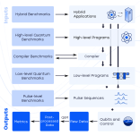

Open QBench
=====================

Open QBench is an open-source software framework for defining and executing benchmarks across the quantum-classical stack. It offers support for benchmarks on the:

- hybrid level (quantum-classical workflows)
- high level (quantum algorithms)
- low level (compiled quantum programs)

The framework is supports gate-based quantum computers, photonic systems (boson samplers), and quantum annealers.

Beyond the framework, this package also includes a suite of pre-implemented, high-level quantum application benchmarks. These are specifically crafted to evaluate the performance and fidelity of results on diverse physical quantum devices.

.. _installation:
Installation
============

Using uv (Recommended)
----------------------

First, create and activate a virtual environment:

.. code-block:: shell

   uv venv

To install the core dependencies of the package, run:

.. code-block:: shell

   uv sync

Optional dependencies (Extras)
^^^^^^^^^^^^^^^^^^^^^^^^^^^^^^

We provide a number of optional dependencies (referred to as "extras") for executing specific benchmarks or for enabling support for various quantum hardware providers.

Available extras include:

- Benchmarks: `VQE`, `QSVM`
- Providers: `IBM`, `AQT`, `ORCA`

To install specific optional dependencies, use the `--extra` flag. You can specify multiple extras in a single command. For example, to run the VQE benchmark on an IBM Quantum machine, you would run:

.. code-block:: shell

   uv sync --extra VQE --extra IBM

You can combine any of the available extras as needed.

.. note::
   To install the `ORCA` extra, you'll first need to add your SSH key to the ORCA Computing SDK website at https://sdk.orcacomputing.com/.

Using pip
^^^^^^^^^
The package can also be installed with pip.
To install the core dependencies run:

.. code-block:: shell

   pip install .

To install with specific optional dependencies (e.g., `VQE` and `IBM`):

.. code-block:: shell

   pip install ".[VQE,IBM]"

Usage
-----

How to run a benchmark
^^^^^^^^^^^^^^^^^^^^^^

This example shows how to execute a simple application benchmark using a Grover circuit on simulated IBM Quantum hardware (check :ref:`installation` to see how to enable IBM support).

First define samplers used for collecting distributions.

.. code-block:: python

   from qiskit_aer.primitives import SamplerV2 as AerSampler
   from qiskit_ibm_runtime import Sampler
   from qiskit_ibm_runtime.fake_provider import FakeGeneva

   ideal_sampler = AerSampler(default_shots=1000)
   backend_sampler = Sampler(FakeGeneva())

Then use Open QBench to generate a quantum circuit and create your benchmark by defining input and a function used to calculate fidelity.

.. code-block:: python

   from open_qbench import ApplicationBenchmark
   from open_qbench.apps import grover
   from open_qbench.core import BenchmarkInput
   from open_qbench.fidelities import normalized_fidelity

   qc = grover.grover_nq(3, 6)
   backend = backend_sampler.backend()
   benchmark_input = BenchmarkInput(qc, backend)

   ab = ApplicationBenchmark(
      backend_sampler,
      ideal_sampler,
      benchmark_input,
      name="Grover_benchmark",
      accuracy_measure=normalized_fidelity,
   )

   ab.run()
   print(ab.result)

Contents
--------

.. toctree::
   :maxdepth: 1

   examples

   API Reference <API/open_qbench>
