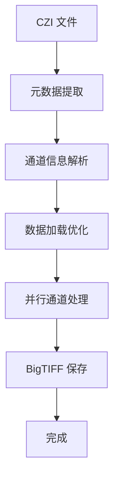

# CZI Parser - 高性能 Zeiss CZI 文件解析器


## 📖 项目概述

一个专为 Zeiss Axio Scan7 显微镜产生的 CZI 文件设计的高性能解析器。该工具能够快速提取和处理超大尺寸的显微镜图像数据，支持多通道图像的并行处理。

### ✨ 主要功能

- **🔍 XML 元数据提取**：完整提取 CZI 文件的 XML 元数据并保存
- **📊 通道信息解析**：自动识别和分析各通道属性（名称、激活状态等）
- **🖼️ 融合图数据读取**：智能处理 RGB 和灰度图像数据
- **⚡ 并行图像处理**：多线程并行处理，大幅提升处理速度
- **💾 BigTIFF 支持**：自动处理超大图像文件（>2GB）
- **🎨 智能归一化**：min-max 归一化至 8-bit，保持图像质量

### 🚀 性能优势

| 指标 | 原版本 | 优化版本 | 提升倍数 |
|------|--------|----------|----------|
| 总处理时间 | 899.25秒 (15分钟) | 67.60秒 (1.1分钟) | **13.3x** |
| 数据加载 | 281.55秒 | 27.94秒 | **10.1x** |
| 图像保存 | 617.70秒 | 30.03秒 | **20.6x** |

> 测试环境：49008×46496 像素，8通道，~51GB 原始数据

## 📦 安装

```bash
python -m pip install parse-czi
```

## 🛠️ 安装要求

### 系统要求
- Python 3.7+
- 充足的内存空间（推荐 16GB+）
- 高速存储设备（推荐 SSD）

### 依赖库安装

```bash
# 核心依赖
pip install aicsimageio czifile tifffile numpy

# 性能优化依赖（可选）
pip install numba psutil

# 或者一次性安装
pip install aicsimageio czifile tifffile numpy numba psutil
```

### 依赖说明

| 库名 | 用途 | 必需性 |
|------|------|--------|
| `aicsimageio` | CZI 文件读取和元数据提取 | 必需 |
| `czifile` | 备用 CZI 读取方案 | 必需 |
| `tifffile` | BigTIFF/OME-TIFF 图像保存 | 必需 |
| `numpy` | 数值计算和数组处理 | 必需 |
| `numba` | JIT 编译加速（可选） | 可选 |
| `psutil` | 系统资源监控（可选） | 可选 |

## 📖 使用指南

### 基本用法

```bash
python parse-czi-zenlite-ultrafast <czi_file> <output_dir>
```

### 高级选项

```bash
# 指定工作线程数（推荐 4-8 个）
python parse-czi-zenlite-ultrafast input.czi output/ --max-workers 8

# 完整示例
python parse-czi-zenlite-ultrafast \
    /path/to/sample.czi \
    /path/to/output/ \
    --max-workers 8
```

### 参数说明

| 参数 | 类型 | 说明 | 默认值 |
|------|------|------|--------|
| `czi_file` | 必需 | 输入的 CZI 文件路径 | - |
| `output_dir` | 必需 | 输出目录路径 | - |
| `--max-workers` | 可选 | 最大工作线程数 | 8 |

### 输出文件

处理完成后，在输出目录中会生成：

```
output_dir/
├── metadata.xml          # CZI 文件的完整 XML 元数据
├── channel_0.ome.tif     # 第一个通道图像
├── channel_1.ome.tif     # 第二个通道图像
└── ...                   # 其他通道图像
```

## 🏗️ 核心架构

### 处理流程



### 关键技术

1. **智能数据加载**
   - 优先使用 `czifile` 进行快速读取
   - `AICSImageIO` 作为备选方案
   - 自动处理各种维度格式

2. **并行处理架构**
   - 线程池并行处理多个通道
   - 智能负载均衡
   - 内存使用优化

3. **大文件处理**
   - 自动检测文件大小
   - 超过 2GB 自动使用 BigTIFF
   - 分块存储提高效率

## 🔧 高级配置

### 性能调优

```python
# 在代码中可调整的参数
MAX_WORKERS = 8           # 最大工作线程数
MEMORY_THRESHOLD = 0.8    # 内存使用阈值
CHUNK_SIZE = 1024 * 1024  # 处理块大小
```

### 错误处理

程序包含完善的错误处理机制：

- **格式错误**：自动重试 BigTIFF 格式
- **内存不足**：自动垃圾回收
- **IO 错误**：详细错误日志输出

## 📊 性能监控

### 实时日志

程序运行时会输出详细的处理信息：

```
2025-07-24 11:15:39 [INFO] 系统: CPU=48核, 工作线程=8
2025-07-24 11:15:39 [INFO] 数据加载: 27.94秒
2025-07-24 11:15:39 [INFO] 通道处理: 30.03秒
2025-07-24 11:15:39 [INFO] 总耗时: 67.60秒
2025-07-24 11:15:39 [INFO] 成功处理: 8/8 个通道
```

### 文件大小监控

每个保存的通道都会显示文件大小：

```
[INFO] 已保存通道 0 (DAPI), 文件大小: 1247.3MB
[INFO] 已保存通道 1 (FITC), 文件大小: 2156.8MB
```

## 🐛 故障排除

### 常见问题

**Q: 程序运行缓慢或卡住**
A: 检查以下因素：
- 磁盘 I/O 性能（推荐使用 SSD）
- 可用内存大小
- 工作线程数设置（推荐 4-8 个）

**Q: 保存失败 "'I' format requires..." 错误**
A: 这是大文件格式问题，程序会自动重试 BigTIFF 格式

**Q: 部分通道图像全黑**
A: 检查原始 CZI 文件中该通道是否包含有效数据

**Q: 内存不足错误**
A: 尝试以下解决方案：
- 减少工作线程数 (`--max-workers 4`)
- 确保有足够的可用内存
- 关闭其他占用内存的程序

### 调试模式

如需详细调试信息，可修改日志级别：

```python
logging.basicConfig(level=logging.DEBUG)
```

## 🤝 贡献指南

欢迎提交 Issue 和 Pull Request！

### 开发环境设置

```bash
git clone <repository-url>
cd czi-parser
pip install -r requirements.txt
```

### 测试

```bash
python -m pytest tests/
```

## 📄 许可证

本项目采用 MIT 许可证。详见 [LICENSE](LICENSE) 文件。

## 📧 联系方式

如有问题或建议，请联系：
- 邮箱: [argluolu@gmail.com]
- GitHub Issues: [项目链接]/issues

## 🙏 致谢

感谢以下开源项目的支持：
- [AICSImageIO](https://github.com/AllenCellModeling/aicsimageio)
- [czifile](https://github.com/czi-file/czifile)
- [tifffile](https://github.com/cgohlke/tifffile)

---

⭐ 如果这个项目对您有帮助，请给我们一个 Star！