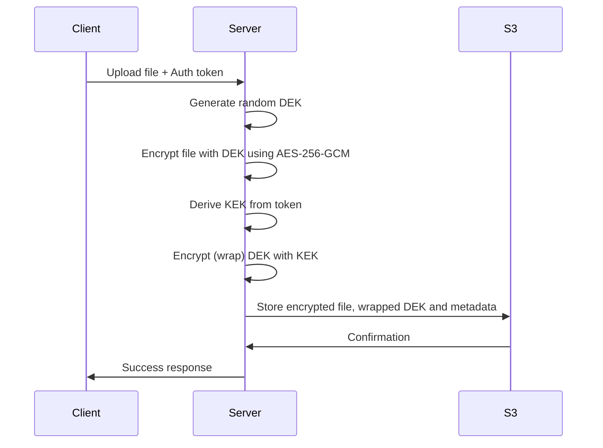
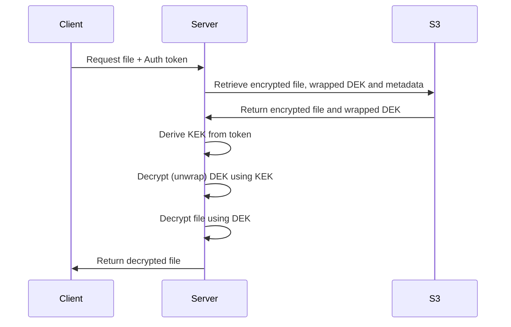
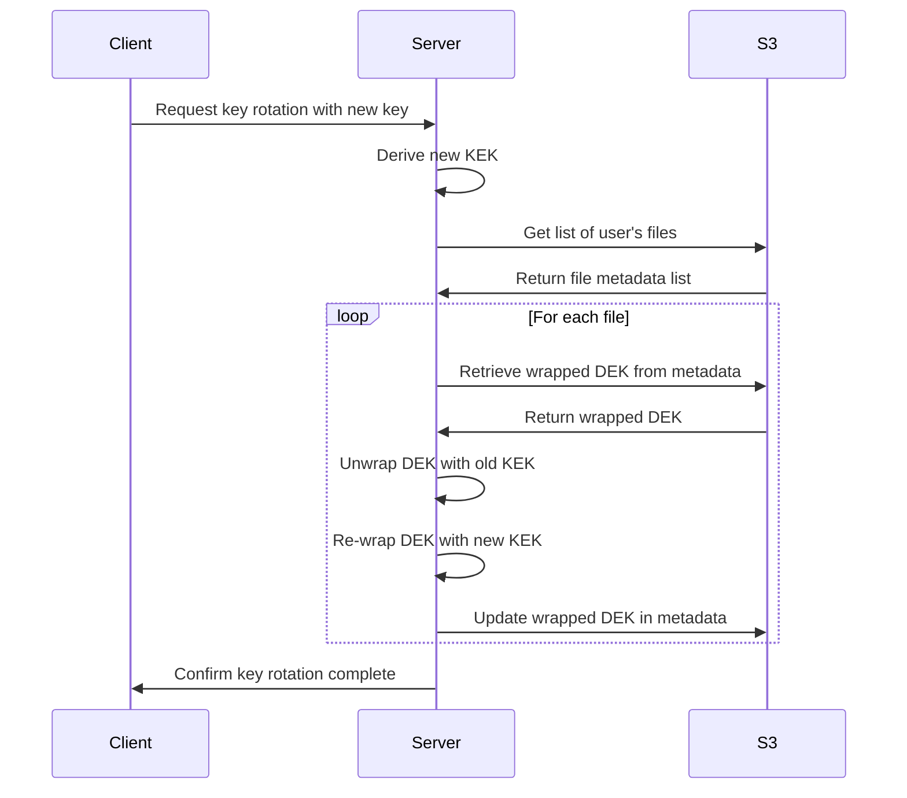

# Secure File Storage in Percolate

This document outlines the design and implementation approach for end-to-end encryption of user files in Percolate, starting with S3 storage and expanding to other storage mechanisms.

## Overview

Percolate is transitioning to a secure-by-default model for all user data, with a focus on:

1. End-to-end encryption of all user files stored in S3
2. Encryption of transcribed audio chunks
3. Secure access to encrypted data for processing
4. User-controlled encryption keys

## Goals

- **Zero-knowledge storage**: Percolate cannot read user data without the user's encryption key
- **Seamless integration**: Minimal changes required to existing client code
- **Key management flexibility**: Support for both system-managed and user-provided keys
- **Compliance**: Meet regulatory requirements (GDPR, HIPAA, etc.)
- **Performance**: Minimize impact on system performance

## Implementation Phases

### Phase 1: Bearer Token-Based Encryption

In the initial phase, we will use the user's bearer token as the encryption key for files stored in S3.

1. **S3 Service Enhancements**:
   - Add encryption/decryption layer to the `S3Service` class
   - Use AES-256-GCM for encryption with authenticated encryption
   - Implement per-file data encryption keys wrapped by keys derived from bearer tokens
   - Implement transparent encryption on upload and decryption on download

2. **Metadata Handling**:
   - Store encryption metadata (IV, wrapped DEK) in S3 object metadata
   - Add version identifier for future encryption scheme upgrades

3. **Audit Logging**:
   - Log encryption events (without sensitive data)
   - Track access to encrypted files

### Phase 2: User-Provided Keys

In the second phase, users will be able to provide their own encryption keys.

1. **Key Management**:
   - Support for user-provided key encryption keys (KEKs)
   - Key rotation capabilities without re-encrypting all files
   - Key recovery mechanisms (optional)

2. **Client Integration**:
   - API endpoints for key management
   - Client-side guidance for secure key storage

### Phase 3: Advanced Encryption Features

In the final phase, we will implement advanced encryption features.

1. **Secure Processing of Encrypted Data**:
   - Secure compute environments for processing encrypted data
   - API for secure embedding generation from encrypted data

2. **Multi-party Encryption**:
   - Sharing encrypted data between users
   - Group-based encryption keys

## Technical Design

### Encryption Approach: Per-file Data Keys with Key Wrapping

✅ **Solution: Use per-file data keys + key wrapping**

We will implement a two-tier encryption approach:

1. **Data Encryption Key (DEK)**:
   - Each file is encrypted with a unique, randomly generated DEK
   - The DEK is specific to a single file or chunk
   - High-quality cryptographic random numbers are used to generate DEKs

2. **Key Encryption Key (KEK)**:
   - The user's main key (initially derived from bearer token, later user-provided)
   - Used to encrypt (wrap) the DEK, not the file content directly
   - Enables key rotation without re-encrypting all files

This approach provides several advantages:
- Better security (unique key per file reduces attack surface)
- Efficiency (faster key rotation)
- Supports granular access control
- Separation of authentication from encryption

### Encryption Process

1. **File Upload**:
   - Client uploads file
   - Server generates a random Data Encryption Key (DEK)
   - File is encrypted using DEK with AES-256-GCM
   - Server derives Key Encryption Key (KEK) from bearer token or user-provided key
   - DEK is encrypted (wrapped) using KEK
   - Encrypted file, wrapped DEK, and metadata are stored in S3

2. **File Download**:
   - Client requests file with authentication
   - Server retrieves encrypted file, wrapped DEK, and metadata from S3
   - Server derives KEK from bearer token or user-provided key
   - Server unwraps (decrypts) the DEK using KEK
   - File is decrypted using the unwrapped DEK
   - Decrypted file is returned to client

### Key Rotation Process

One of the major benefits of the key wrapping approach is simplified key rotation:

1. **User Key Rotation**:
   - User provides a new master key or bearer token changes
   - Server derives new KEK
   - For each file:
     - Retrieve wrapped DEK
     - Unwrap DEK using old KEK
     - Re-wrap DEK using new KEK
     - Update metadata with newly wrapped DEK
   - File content remains unchanged, saving bandwidth and processing time

### Data Processing with Encrypted Files

Specific handling is required for processes that need to work with encrypted data:

1. **Transcription Pipeline**:
   - Service needs temporary access to decrypted audio for processing
   - Unwraps DEK using the KEK derived from bearer token
   - Decryption happens in memory using the DEK
   - Transcription results are re-encrypted with a new DEK and wrapped with the same KEK

2. **Embedding Generation**:
   - A secure compute service will handle:
     - Unwrapping the DEK using the KEK
     - Decrypting content using the DEK
     - Generating embeddings
     - Re-encrypting or securely discarding the content
   - Triggered by secure events, not direct API access

## Implementation Details

### S3Service Enhancement

The current `S3Service` class will be enhanced with:

1. **New Encryption Methods**:
   - `generate_data_key()`: Generates a random DEK
   - `wrap_key(dek, kek)`: Encrypts a DEK using a KEK
   - `unwrap_key(wrapped_dek, kek)`: Decrypts a wrapped DEK using a KEK
   - `encrypt_data(data, dek)`: Encrypts data using a DEK
   - `decrypt_data(encrypted_data, metadata, dek)`: Decrypts data using a DEK

2. **Enhanced Upload/Download Methods**:
   - Update `upload_file_to_uri` to use DEK for encryption and KEK for wrapping
   - Update `download_file_from_uri` to unwrap DEK and decrypt files

3. **Encryption Metadata**:
   - Store wrapped DEK and encryption parameters in S3 object metadata
   - Include format version to support future encryption scheme updates

### Key Derivation

For bearer token-based encryption:

1. Use PBKDF2 to derive a KEK from the bearer token
2. Store a unique salt per user in the database
3. Use a high iteration count to prevent brute force attacks

For user-provided keys:

1. Accept user-provided KEKs directly
2. Option to store backup KEKs (wrapped with recovery keys) for recovery (optional)

## Security Considerations

1. **Key Security**:
   - KEKs must be protected; they are the root of trust
   - DEKs are only temporarily in memory during encryption/decryption
   - No storage of unwrapped DEKs or KEKs in logs or databases
   - Memory management to avoid key leakage

2. **Metadata Protection**:
   - Encryption metadata must be protected from unauthorized access
   - File names and paths may leak information even if content is encrypted

3. **Key Rotation**:
   - Automated process for re-wrapping DEKs with new KEKs
   - Monitoring for files that might be using outdated keys

## Integration with Embeddings

The most challenging aspect is generating embeddings from encrypted content:

1. **Decryption for Processing**:
   - Create a secure processing pipeline that:
     - Unwraps the DEK using the KEK
     - Decrypts data using the DEK
     - Generates embeddings
     - Securely discards the DEK and raw content
   - This requires a secure compute environment with appropriate controls

2. **Embedding Security**:
   - Embeddings themselves may leak information about the original content
   - Consider approaches to secure or obfuscate embeddings

## Rollout Plan

1. **Phase 1** (Q3 2025):
   - Implement per-file DEK with KEK wrapping
   - Update S3Service with encryption capabilities
   - Add encryption to audio processing pipeline

2. **Phase 2** (Q4 2025):
   - Add user-provided KEK support
   - Develop key management APIs
   - Implement key rotation functionality
   - Client-side integration guide

3. **Phase 3** (Q1 2026):
   - Implement secure embedding generation
   - Add multi-party encryption support

## Testing and Validation

1. **Security Testing**:
   - Third-party security audit of DEK/KEK implementation
   - Penetration testing of encryption implementation
   - Key recovery testing

2. **Performance Testing**:
   - Measure impact on upload/download speeds
   - Benchmark encryption/decryption operations
   - Test key rotation with large numbers of files

3. **Integration Testing**:
   - Verify all existing features work with encrypted storage
   - Test key rotation scenarios
   - Validate error handling and recovery

## Compliance Requirements

The encryption implementation will be designed to meet:

1. GDPR data protection requirements
2. HIPAA compliance for medical data
3. SOC 2 requirements for data security
4. Industry best practices for encryption

## References

- [NIST Recommendations for Encryption](https://csrc.nist.gov/publications/detail/sp/800-38d/final) (AES-GCM)
- [Key Derivation Functions](https://en.wikipedia.org/wiki/PBKDF2)
- [AWS S3 Client-Side Encryption](https://docs.aws.amazon.com/AmazonS3/latest/userguide/UsingClientSideEncryption.html)
- [NIST Key Wrapping](https://csrc.nist.gov/publications/detail/sp/800-38f/final)