# python-proto-importer

[](https://crates.io/crates/python-proto-importer)
[](https://pypi.org/project/python-proto-importer/)
[](https://pepy.tech/projects/python-proto-importer)
[](https://github.com/K-dash/python-proto-importer/actions)
[](https://codecov.io/gh/K-dash/python-proto-importer)

A Rust-powered CLI that brings production-grade reliability to Python gRPC/Protobuf code generation. Generate, validate, and maintain protobuf-based Python code with confidence.

**日本語版:** [日本語ドキュメント](doc/README.ja.md)

## Why python-proto-importer?

### Solve the Absolute Import Problem

**The Core Problem:** Standard `protoc` generates Python files with absolute imports (e.g., `import foo.bar_pb2`), which breaks when you move generated code to different locations in your project. This forces you to place generated files in specific locations, limiting your project structure flexibility.

**Our Solution:** Automatically converts all imports to relative imports based on your `pyproject.toml` configuration. This means you can place generated code **anywhere** in your project structure and it will work correctly. While other tools exist to address this problem, our integrated approach ensures it works seamlessly with the rest of the validation pipeline.

### Built-in Quality Assurance

Unlike standard protoc workflows, this tool **validates generated code before it reaches your project**. When mypy-protobuf or complex proto definitions produce incorrect stubs, you'll know immediately—not when your CI fails.

**The Problem:** Standard protoc/mypy-protobuf can generate broken `.pyi` files that crash your type checker with cryptic errors.

**Our Solution:** Every generation run includes automatic type validation, ensuring the generated code is correct *before* you use it.

### Clear Error Boundaries

**Generation-time errors vs. Usage-time errors**—know the difference instantly.

- ✅ Tool succeeds = Generated code is valid
- ❌ Tool fails = Problem in generation process (not your code!)
- 📊 Your type checker fails later = Issue in how you're using the generated code

### Optimal Validation Environment

Your project's mypy/pyright settings might not be ideal for validating generated protobuf code. This tool maintains its own optimized type-checking configuration specifically tuned for protobuf validation, ensuring consistent quality regardless of your project settings.

### Blazing Fast Performance

Built with **Rust** for maximum performance. File operations, import rewriting, and validation run at native speed, making it ideal for large codebases and CI/CD pipelines where every second counts.

## Quick Start

### Installation

```bash
# Via pip (recommended)
pip install python-proto-importer

# Via cargo
cargo install python-proto-importer
```

### Basic Setup

1. Create a `pyproject.toml` configuration:

```toml
[tool.python_proto_importer]
inputs = ["proto/**/*.proto"]  # Your proto files
out = "generated"              # Output directory
```

2. Generate Python code:

```bash
proto-importer build
```

That's it! Your generated code is now validated and ready to use.

## Core Features

### Smart Import Management
- **Automatic relative imports**: Generated code uses relative imports, making it portable across different project structures
- **Intelligent rewriting**: Only touches protobuf imports, preserving external dependencies like `google.protobuf`

### Package Structure Control
- **Automatic `__init__.py` generation**: No more missing init files breaking imports
- **Namespace package support**: Full PEP 420 compatibility when needed

### Comprehensive Verification
- **Import validation**: Every generated module is test-imported
- **Type checking**: Optional mypy/pyright validation with optimal settings
- **Pre-flight checks**: `proto-importer doctor` diagnoses your environment

### Production-Ready Workflow
- **Single command**: Generate, postprocess, and validate in one step
- **Declarative configuration**: All settings in `pyproject.toml`
- **CI/CD friendly**: Designed for automation

## Commands

### `proto-importer build`
Generate Python code from proto files with full validation pipeline.

```bash
proto-importer build                  # Standard build
proto-importer build --no-verify      # Skip verification
proto-importer build --pyproject custom.toml  # Custom config
```

### `proto-importer doctor`
Diagnose your environment and check dependencies.

```bash
proto-importer doctor
```

Output shows:
- Python environment (python/uv)
- Required dependencies (grpcio-tools)
- Optional tools (mypy-protobuf, mypy, pyright)
- Helpful hints for missing components

### `proto-importer check`
Run verification only (no generation).

```bash
proto-importer check
```

### `proto-importer clean`
Remove generated output directory.

```bash
proto-importer clean --yes
```

## ⚙️ Configuration

All configuration lives in `pyproject.toml` under `[tool.python_proto_importer]`.

### Essential Options

| Option | Type | Default | Description |
|--------|------|---------|-------------|
| `inputs` | array | `[]` | Glob patterns for proto files to compile |
| `out` | string | `"generated/python"` | Output directory for generated files |
| `include` | array | `["."]` | Proto import paths (protoc's `--proto_path`) |
| `python_exe` | string | `"python3"` | Python executable (`"python3"`, `"python"`, `"uv"`) |

### Type Stub Generation

| Option | Type | Default | Description |
|--------|------|---------|-------------|
| `mypy` | boolean | `false` | Generate `.pyi` stubs via mypy-protobuf |
| `mypy_grpc` | boolean | `false` | Generate gRPC stubs (`_grpc.pyi`) |

### Post-processing Options

Configure under `[tool.python_proto_importer.postprocess]`:

| Option | Type | Default | Description |
|--------|------|---------|-------------|
| `relative_imports` | boolean | `true` | Convert to relative imports |
| `create_package` | boolean | `true` | Create `__init__.py` files |
| `exclude_google` | boolean | `true` | Don't rewrite `google.protobuf` imports |
| `pyright_header` | boolean | `false` | Add Pyright suppression headers |

### Verification Options

Configure under `[tool.python_proto_importer.verify]`:

```toml
[tool.python_proto_importer.verify]
mypy_cmd = ["mypy", "--strict", "generated"]
pyright_cmd = ["pyright", "generated/**/*.pyi"]
```

## Configuration Examples

### Minimal Setup

```toml
[tool.python_proto_importer]
inputs = ["proto/**/*.proto"]
out = "generated"
```

### Production Setup with Type Checking

```toml
[tool.python_proto_importer]
backend = "protoc"
python_exe = "uv"  # or ".venv/bin/python"
include = ["proto"]
inputs = ["proto/**/*.proto"]
out = "src/generated"
mypy = true
mypy_grpc = true

[tool.python_proto_importer.postprocess]
relative_imports = true
create_package = true
exclude_google = true

[tool.python_proto_importer.verify]
# Focus on .pyi files to avoid noise from generated .py files
pyright_cmd = ["uv", "run", "pyright", "src/generated/**/*.pyi"]
mypy_cmd = ["uv", "run", "mypy", "--strict", "src/generated"]
```

### Namespace Packages (PEP 420)

```toml
[tool.python_proto_importer]
inputs = ["proto/**/*.proto"]
out = "generated"

[tool.python_proto_importer.postprocess]
create_package = false  # No __init__.py files
```

## Understanding `include` vs `inputs`

This is crucial for correct configuration:

### `include` - Search Paths
Where protoc looks for `.proto` files and their dependencies.

### `inputs` - Files to Compile
Which `.proto` files to actually compile (glob patterns).

### Example Structure

```
project/
├── pyproject.toml           # Configuration file (the reference point)
├── api/
│   └── service.proto        # Your service (compile this)
├── third_party/
│   └── google/
│       └── api/
│           └── annotations.proto  # Dependency (don't compile)
└── generated/               # Output here
```

### Correct Configuration

```toml
[tool.python_proto_importer]
include = [".", "third_party"]  # Can see all protos
inputs = ["api/**/*.proto"]      # Only compile your protos
out = "generated"
```

**Key Point:** Dependencies need to be in `include` (so protoc can find them) but NOT in `inputs` (you don't want to regenerate them).

## Advanced Usage

### Using with uv

[uv](https://github.com/astral-sh/uv) is a fast Python package manager:

```toml
[tool.python_proto_importer]
python_exe = "uv"

[tool.python_proto_importer.verify]
mypy_cmd = ["uv", "run", "mypy", "--strict", "generated"]
pyright_cmd = ["uv", "run", "pyright", "generated"]
```

### CI/CD Integration

#### GitHub Actions

```yaml
- name: Setup
  run: |
    pip install python-proto-importer grpcio-tools mypy-protobuf

- name: Generate Proto
  run: proto-importer build

- name: Run Tests
  run: pytest tests/
```

#### Pre-commit Hook

```yaml
repos:
  - repo: local
    hooks:
      - id: proto-build
        name: Build Proto Files
        entry: proto-importer build
        language: system
        files: \.proto$
```

## Troubleshooting

### Import Errors After Generation

1. Check package structure:
   ```bash
   proto-importer check
   ```

2. Verify `include` paths cover all dependencies

3. Ensure `PYTHONPATH` includes the parent of your output directory

### Type Checker Warnings

For generated `.py` files with dynamic attributes, focus type checking on `.pyi` files:

```toml
[tool.python_proto_importer.verify]
pyright_cmd = ["pyright", "generated/**/*.pyi"]  # Only check stubs
```

### "Shadowing" Errors

When using multiple `include` paths with same-named files:
- Use more specific `inputs` patterns
- Restructure proto files to avoid naming conflicts

## How It Works

The tool follows a comprehensive pipeline to ensure reliable code generation:

```mermaid
graph TD
    A["proto-importer build"] --> B["📝 Load pyproject.toml"]
    B --> C["🔍 Discover .proto files"]
    C --> D["⚙️ Execute protoc"]
    D --> E["📦 Generate Python files"]
    E --> F{{"Post-processing"}}
    
    F --> G["📍 Convert absolute → relative imports"]
    F --> H["📁 Create __init__.py files"]
    F --> I["🔧 Add type suppressions"]
    
    G --> J{{"✅ Verification"}}
    H --> J
    I --> J
    
    J --> K["🧪 Import dry-run test"]
    J --> L["🔍 Type checker validation"]
    
    K --> M["Success!"]
    L --> M
    
    style A fill:#e1f5fe
    style M fill:#e8f5e8
    style F fill:#fff3e0
    style J fill:#fce4ec
```



### Import Transformation Example


### Key Steps:

1. **Generation**: Runs `protoc` with your configuration
2. **Post-processing**: 
   - Converts absolute imports to relative
   - Creates `__init__.py` files
   - Adds type checker suppressions if configured
3. **Verification**:
   - Attempts to import every generated module
   - Runs configured type checkers
   - Reports clear, actionable errors

## 🚧 Current Limitations

- **v0.1**: Only `protoc` backend (buf support planned for v0.2)
- Import rewriting covers common patterns (`_pb2.py`, `_pb2_grpc.py`, `.pyi` files)
- Import validation only checks `.py` files (`.pyi` validated via type checkers)

## Contributing

We welcome contributions! See [CONTRIBUTING.md](CONTRIBUTING.md) for development setup.

### Quick Development Setup

```bash
# Install development dependencies
cargo install cargo-make

# Run full validation
makers all  # Runs format, lint, build, test

# Or individually
makers format
makers lint
makers test
```

## 📜 License

Apache-2.0. See [LICENSE](LICENSE) for details.
