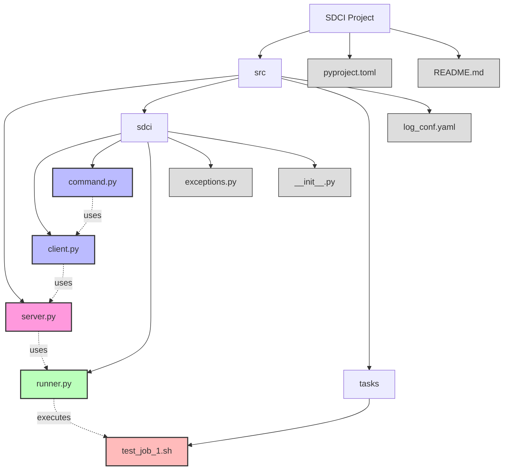

# 🚀 SDCI - Sistema de Deploy Continuo Integrado

SDCI (Sistema de Deploy Continuo Integrado - Integrated Continuous Deployment System) is a lightweight continuous deployment system consisting of a server and client tool. It allows you to run predefined tasks remotely through a simple command-line interface.

**⚠️ NOTE: This project is currently in ALPHA. A better documentation will be provided soon.**

## ✨ Features

- Server component built with FastAPI
- Command-line client tool for easy task execution
- Token-based authentication
- Real-time task output streaming
- Task status monitoring


## 📥 Installation

### Requirements

- Python 3.13 or higher

### Installing the client

```bash
pip install sdci
```

## 📖 Usage

### Starting the server

Run the server component:

```bash
python -m src.server
```

By default, the server runs on `0.0.0.0:8842`.

### Using the client

The client tool can be used to trigger tasks on the server:

```bash
sdci-cli run --token YOUR_TOKEN SERVER_URL TASK_NAME [PARAMETERS...]
```

Example:

```bash
sdci-cli run --token HAPPY123 http://localhost:8842 job_1 param1 param2 param3
```

### Parameters

- `--token`: Authentication token (required)
- `SERVER_URL`: URL of the SDCI server (required)
- `TASK_NAME`: Name of the task to run (required)
- `PARAMETERS`: Optional parameters to pass to the task

## 🖥️ Server

The SDCI server component is currently in development. The goal is to create a Docker image that will be used as a sidecard in production environments, making it easily deployable alongside your main applications.

### Docker Deployment

A Docker image will be provided that allows you to run the SDCI server with minimal configuration. This image is designed to work as a sidecard container in your production environment.

## 📁 Project Structure

- `src/server.py`: FastAPI server implementation
- `src/sdci/client.py`: Client implementation for communicating with the server
- `src/sdci/command.py`: CLI interface using Click
- `src/tasks/`: Directory containing task definitions as basic shell scripts.

### Project Structure Diagram



The diagram above shows the structure of the SDCI project:

1. **Server Component** (`server.py`): The FastAPI server that handles task execution requests
2. **Client Components** (`client.py`, `command.py`): Handle communication with the server and provide CLI interface
3. **Runner Component** (`runner.py`): Manages the execution of shell script tasks
4. **Tasks** (`test_job_1.sh`): Shell scripts that define the actual tasks to be executed

## 👤 Author

- Jonhnatha Trigueiro <joepreludian@gmail.com>
