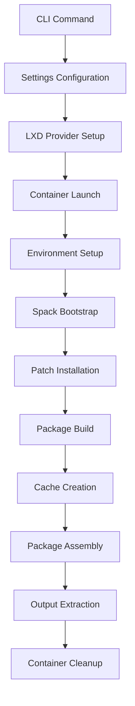
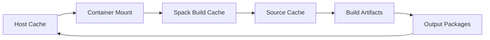

# Slurm Factory Architecture

This document provides a comprehensive overview of slurm-factory's architecture, design principles, and implementation details.

## Overview

slurm-factory is a Python CLI tool that automates the building of optimized Slurm workload manager packages using LXD containers and the Spack package manager. The architecture is designed for reproducibility, scalability, and ease of deployment across heterogeneous HPC environments.

## Core Architecture

```
┌─────────────────────────────────────────────────────────────┐
│                     slurm-factory CLI                      │
├─────────────────────────────────────────────────────────────┤
│  Main App   │  Builder    │  Config     │  Constants      │
│  (main.py)  │  (builder.py)│ (config.py) │ (constants.py)  │
├─────────────────────────────────────────────────────────────┤
│             LXD Container Management Layer                  │
│                  (craft-providers)                          │
├─────────────────────────────────────────────────────────────┤
│        Spack Package Manager   │   Environment Setup       │
│                                │   & Cache Management       │
├─────────────────────────────────────────────────────────────┤
│                 Target Deployment Environment              │
└─────────────────────────────────────────────────────────────┘
```

## Module Architecture

### 1. Main Application (`main.py`)

The entry point for the CLI application built with Typer.

**Core Components:**
- **CLI Interface**: Command-line argument parsing and routing
- **Global Options**: Project name, verbose logging configuration
- **Context Management**: Shared state across command invocations

**Available Commands:**
```python
slurm-factory build [OPTIONS]    # Build Slurm packages
slurm-factory --help            # Show help information
```

**Command Flow:**
```
CLI Input → Argument Parsing → Context Setup → Builder Invocation
```

### 2. Builder Engine (`builder.py`)

The core orchestration engine that manages the entire build process.

**Key Classes:**
- **SlurmVersion**: Enum for supported Slurm versions
- **build()**: Main build function that orchestrates the process

**Build Pipeline:**
```python
1. Environment Setup
   ├── Settings Configuration
   ├── Cache Directory Creation
   └── LXD Provider Initialization

2. Container Management
   ├── Base Instance Creation/Reuse
   ├── Build Instance Launch
   └── Cloud-init Setup

3. Container Preparation
   ├── Cache Directory Mounting
   ├── Patch File Installation
   ├── Spack Bootstrap
   └── Repository Setup

4. Slurm Build Process
   ├── Spack Environment Creation
   ├── Package Compilation
   ├── Dependency Resolution
   └── Build Cache Creation

5. Package Creation
   ├── Software Package Assembly
   ├── Module File Generation
   └── Output Extraction

6. Cleanup
   ├── Container Removal
   └── Resource Cleanup
```

### 3. Configuration System (`config.py`)

Manages application settings and cache directory structure.

**Settings Class:**
```python
@dataclass
class Settings:
    project_name: str           # LXD project name
    
    @property
    def home_cache_dir(self) -> Path:      # ~/.slurm-factory/
    
    @property 
    def builds_dir(self) -> Path:          # ~/.slurm-factory/builds/
    
    @property
    def spack_buildcache_dir(self) -> Path: # ~/.slurm-factory/spack-buildcache/
    
    @property
    def spack_sourcecache_dir(self) -> Path: # ~/.slurm-factory/spack-sourcecache/
```

**Directory Structure:**
```
~/.slurm-factory/
├── builds/                 # Built packages output
├── spack-buildcache/       # Spack binary cache  
└── spack-sourcecache/      # Spack source cache
```

### 4. Constants and Configuration (`constants.py`)

Defines all build constants, paths, and script templates.

**Supported Slurm Versions:**
```python
SLURM_VERSIONS = {
    "25.05": "25-05-1-1",
    "24.11": "24-11-6-1", 
    "23.11": "23-11-11-1",
    "23.02": "23-02-7-1",
}
```

**Container Paths:**
```python
CONTAINER_CACHE_DIR = "/opt/slurm-factory-cache"
CONTAINER_PATCHES_DIR = "/srv/global-patches"
CONTAINER_SPACK_PROJECT_DIR = "/root/spack-project"
CONTAINER_SLURM_DIR = "/srv/slurm"
CONTAINER_BUILD_OUTPUT_DIR = "/opt/slurm-factory-cache/builds"
```

**Script Templates:**
- Cache setup scripts
- Patch installation scripts
- Spack environment setup
- Build and package creation scripts

### 5. Spack Configuration (`spack_yaml.py`)

Handles Spack environment configuration and YAML generation.

**Key Functions:**
- **generate_yaml_string()**: Creates Spack environment YAML
- Package specification and variant management
- Compiler configuration
- Build optimization settings

## Container Architecture

### LXD Integration

slurm-factory uses the `craft-providers` library for LXD container management.

**Container Lifecycle:**
```
Base Image (ubuntu:24.04) → Base Instance Creation → 
Build Instance Launch → Setup & Build → Package Extraction → Cleanup
```

**Base Instance Strategy:**
- Reusable base instances with common dependencies
- 90-day expiry for automatic cleanup
- Cached Spack installations for faster builds

**Build Instance Isolation:**
- Unique instances per build to prevent conflicts
- Automatic cleanup after successful builds
- Resource limits and security constraints

### Container Environment

**Image Configuration:**
- **Base Image**: Ubuntu 24.04 LTS
- **Remote**: ubuntu (official images)
- **Architecture**: x86_64 (primary), ARM64 (experimental)

**Mounted Directories:**
```
Host                          Container
~/.slurm-factory/             → /opt/slurm-factory-cache/
```

**Container Setup Process:**
1. Cloud-init configuration and boot
2. Package manager updates
3. Development tools installation
4. Spack bootstrap and setup
5. Cache directory configuration
6. Patch file installation

## Build Process Architecture

### Phase 1: Environment Preparation

**Cache Setup:**
```bash
# Create cache directories with proper permissions
mkdir -p /opt/slurm-factory-cache/{spack-buildcache,spack-sourcecache,builds}
chmod -R 755 /opt/slurm-factory-cache/
```

**Patch Installation:**
```bash
# Install Slurm package patches
mkdir -p /srv/global-patches/
# Copy slurm_prefix.patch and package.py
```

### Phase 2: Spack Bootstrap

**Spack Installation:**
```bash
# Clone and configure Spack
git clone -b v1.0.0 https://github.com/spack/spack.git /opt/spack
source /opt/spack/share/spack/setup-env.sh
```

**Environment Setup:**
```yaml
# spack.yaml configuration
spack:
  specs:
  - slurm@{version} ^openmpi ^pmix
  concretizer:
    unify: true
  config:
    build_stage: /tmp/spack-stage
```

### Phase 3: Slurm Compilation

**Build Process:**
```bash
# Create Spack environment
spack env create slurm-{version}
spack env activate slurm-{version}

# Install dependencies and Slurm
spack install slurm@{version}

# Create build cache
spack buildcache create --unsigned slurm
```

**Optimization Features:**
- Architecture-specific optimizations
- Parallel compilation
- Dependency caching
- Build cache reuse

### Phase 4: Package Creation

**Software Package:**
```bash
# Create software tarball
spack location -i slurm | tar -czf slurm-{version}-software.tar.gz
```

**Module Files:**
```bash
# Generate Environment Modules
spack module tcl refresh
tar -czf slurm-{version}-modules.tar.gz modules/
```

## Data Flow Architecture

### Build Data Flow



### Cache Data Flow



## Storage Architecture

### Host Storage Layout

```
~/.slurm-factory/
├── builds/                     # Final build outputs
│   ├── 25.05/
│   │   ├── slurm-25.05-software.tar.gz
│   │   └── slurm-25.05-modules.tar.gz
│   └── 24.11/
├── spack-buildcache/           # Binary package cache
│   ├── build_cache/
│   └── _pgp/
└── spack-sourcecache/          # Source code cache
    ├── archive/
    └── git/
```

### Container Storage Layout

```
Container Filesystem:
├── /opt/spack/                 # Spack installation
├── /opt/slurm-factory-cache/   # Mounted host cache
├── /srv/global-patches/        # Patch files
├── /root/spack-project/        # Build environment
├── /srv/slurm/                 # Slurm installation
└── /srv/build-output/          # Package staging
```

## Performance Architecture

### Build Optimization

**Parallel Processing:**
- Multi-core compilation via Spack
- Parallel dependency builds
- Container resource allocation
- I/O optimization with NVMe

**Caching Strategy:**
- **Source Cache**: Downloaded source archives
- **Build Cache**: Compiled binary packages
- **Container Cache**: Reusable base instances
- **Incremental Builds**: Dependency reuse

### Resource Management

**Memory Optimization:**
- Container memory limits
- Spack memory usage controls
- Garbage collection strategies
- Build staging optimization

**Storage Optimization:**
- Compressed package formats
- Cache size management
- Automatic cleanup policies
- Efficient file transfer

## Security Architecture

### Container Security

**Isolation Boundaries:**
- Process isolation via LXD
- Filesystem namespace isolation
- Network namespace isolation
- User namespace mapping

**Security Controls:**
- Resource limits and quotas
- AppArmor/SELinux profiles
- Capability restrictions
- Read-only system mounts

### Build Security

**Source Verification:**
- Checksum validation for downloads
- Trusted package repositories
- Reproducible build environments
- Build artifact integrity

**Access Control:**
- User-specific cache directories
- Container process ownership
- Secure temporary directories
- Permission management

## Scalability Architecture

### Horizontal Scaling

**Multi-Host Deployment:**
- Distributed LXD clusters
- Shared storage backends
- Build farm coordination
- Load balancing strategies

**Parallel Builds:**
- Concurrent build instances
- Resource pool management
- Build queue management
- Result aggregation

### Vertical Scaling

**Resource Scaling:**
- Dynamic CPU allocation
- Memory scaling policies
- Storage expansion
- Network bandwidth management

## Integration Architecture

### CI/CD Integration

**Pipeline Integration:**
```yaml
# GitHub Actions example
- name: Build Slurm Package
  run: |
    uv run slurm-factory build --slurm-version 25.05
    # Upload artifacts
```

**Automation Points:**
- Triggered builds on version updates
- Automated testing and validation
- Package deployment automation
- Notification and monitoring

### Deployment Integration

**Package Deployment:**
```bash
# Extract to target system
tar -xzf slurm-25.05-software.tar.gz -C /opt/
tar -xzf slurm-25.05-modules.tar.gz -C /usr/share/modules/

# Configure environment
module load slurm/25.05
```

**System Integration:**
- Module system compatibility
- Shared filesystem deployment
- Configuration management
- Service orchestration

## Error Handling Architecture

### Build Error Recovery

**Error Categories:**
- Container launch failures
- Network connectivity issues
- Compilation errors
- Resource exhaustion

**Recovery Strategies:**
- Automatic retry with exponential backoff
- Container recreation for recoverable errors
- Partial build state recovery
- Graceful degradation modes

### Monitoring and Logging

**Logging Strategy:**
- Structured logging with timestamps
- Multiple log levels (DEBUG, INFO, WARN, ERROR)
- Component-specific loggers
- Build process tracing

**Error Reporting:**
- Detailed error messages with context
- Build failure analysis
- Performance metrics collection
- Debug information capture

This architecture enables slurm-factory to provide reliable, scalable, and maintainable HPC software deployments while maintaining flexibility for diverse deployment scenarios.
