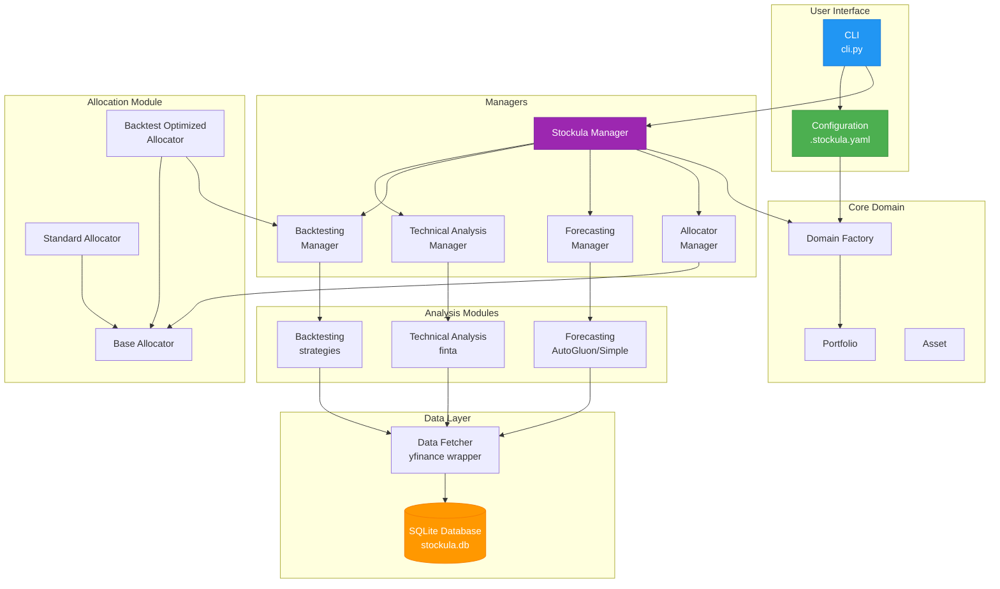
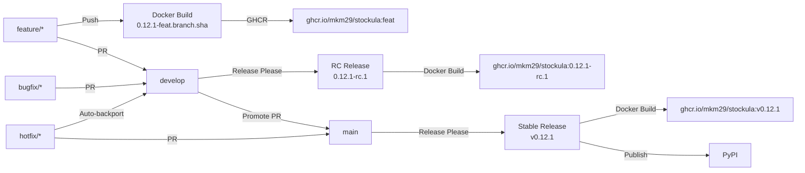

# Stockula

[](https://www.python.org/downloads/)
[](https://opensource.org/licenses/MIT)
[](https://codecov.io/gh/mkm29/stockula)

Stockula is a comprehensive Python trading platform that provides tools for technical analysis, backtesting, data
fetching, and price forecasting. Built with modern Python practices, it integrates popular financial libraries to offer
a complete solution for quantitative trading strategy development.

- [Stockula](#stockula)
  - [✨ Features](#-features)
  - [🚀 Quick Start](#-quick-start)
    - [Installation](#installation)
    - [Basic Usage](#basic-usage)
    - [Configuration Example](#configuration-example)
    - [Backtest-Optimized Allocation](#backtest-optimized-allocation)
    - [Forecast Evaluation](#forecast-evaluation)
  - [📚 Documentation](#-documentation)
    - [🏁 Getting Started](#-getting-started)
    - [📖 User Guide](#-user-guide)
    - [🔧 API Reference](#-api-reference)
    - [🛠️ Development](#%EF%B8%8F-development)
    - [🔍 Help](#-help)
  - [🏗️ Architecture](#%EF%B8%8F-architecture)
  - [📋 Requirements](#-requirements)
    - [Key Dependencies](#key-dependencies)
  - [🎨 Rich CLI Examples](#-rich-cli-examples)
    - [Progress Tracking](#progress-tracking)
    - [Results Tables](#results-tables)
    - [Ticker-Level Backtest Results](#ticker-level-backtest-results)
    - [Strategy Summaries](#strategy-summaries)
  - [🚀 CI/CD](#-cicd)
    - [Continuous Integration](#continuous-integration)
    - [Commit Guidelines](#commit-guidelines)
  - [🔗 Links](#-links)
  - [📝 License](#-license)
  - [🤝 Contributing](#-contributing)
    - [Development Setup](#development-setup)

## ✨ Features

- **📊 Technical Analysis**: 40+ indicators (SMA, EMA, RSI, MACD, Bollinger Bands, etc.)
- **🔄 Backtesting**: Test trading strategies with realistic broker costs and commission structures
- **📈 Data Fetching**: Real-time and historical market data via yfinance with intelligent SQLite caching
- **🔮 Price Forecasting**: Automated time series forecasting with multiple backends:
  - **AutoGluon TimeSeries**: Automated ML for accurate predictions (Python < 3.13)
  - **AutoGluon**: Modern AutoML with deep learning models (DeepAR, Temporal Fusion Transformer)
  - **Chronos** (GPU): Zero-shot forecasting with pretrained transformer models
  - **GluonTS** (GPU): Advanced probabilistic models for uncertainty quantification
  - Future prediction mode: Forecast N days from today
  - Historical evaluation mode: Train/test split with accuracy metrics (RMSE, MAE, MASE)
  - **GPU Acceleration**: Full CUDA support via PyTorch 2.8.0 base images
- **🎨 Rich CLI Interface**: Beautiful progress bars, tables, and colored output
- **🗄️ Database Caching**: Automatic SQLite caching for offline analysis and fast data access
- **🚀 Modern Python**: Built with uv for fast package management and Pydantic for configuration

## 🚀 Quick Start

### Installation

#### Method 1: Docker (Recommended for GPU Support)

```bash
# Standard CPU version
docker pull ghcr.io/mkm29/stockula:latest
docker run ghcr.io/mkm29/stockula:latest -m stockula --help

# GPU-accelerated version (PyTorch 2.8.0 with CUDA 12.9)
docker pull ghcr.io/mkm29/stockula-gpu:latest
docker run --gpus all ghcr.io/mkm29/stockula-gpu:latest -m stockula --help

# Run with mounted config file
docker run -v $(pwd)/.stockula.yaml:/app/.stockula.yaml ghcr.io/mkm29/stockula:latest \
    -m stockula --ticker AAPL --mode forecast
```

**GPU Docker Features:**

- Based on PyTorch 2.8.0 official images for optimal compatibility
- Python 3.11 pre-installed
- Includes Chronos (zero-shot forecasting) and GluonTS (probabilistic models)
- Full AutoGluon TimeSeries support with GPU acceleration
- Non-root user `stockula` (UID 1000) for security

#### Method 2: Local Installation with uv

1. **Install uv** (if not already installed):

   ```bash
   curl -LsSf https://astral.sh/uv/install.sh | sh
   ```

1. **Clone and install**:

   ```bash
   git clone https://github.com/mkm29/stockula.git
   cd stockula
   uv sync
   ```

1. **For GPU support** (optional):

   ```bash
   # Install GPU extras (requires CUDA 11.8+ and compatible drivers)
   uv pip install -r requirements-gpu.txt --extra-index-url https://download.pytorch.org/whl/cu118
   ```

### Basic Usage

```bash
# Analyze a single stock
uv run python -m stockula --ticker AAPL

# Run with configuration file
cp examples/config.simple.yaml .stockula.yaml
uv run python -m stockula

# Run specific analysis modes
uv run python -m stockula --ticker GOOGL --mode ta        # Technical analysis
uv run python -m stockula --ticker MSFT --mode backtest  # Backtesting (results sorted by return, highest first)
uv run python -m stockula --ticker NVDA --mode forecast  # Forecasting with AutoGluon or fallback

# Show help
uv run python -m stockula --help
```

### Configuration Example

```yaml
data:
  start_date: "2023-01-01"
  end_date: null

portfolio:
  initial_capital: 100000
  allocation_method: equal_weight
  tickers:
    - symbol: AAPL
      quantity: 10
    - symbol: GOOGL
      quantity: 5

backtest:
  initial_cash: 10000.0
  broker_config:
    name: "robinhood"  # Zero commission + TAF
  strategies:
    - name: smacross
      parameters:
        fast_period: 10
        slow_period: 20
```

### Using Chronos (Zero-Shot Forecasting)

Chronos provides zero-shot probabilistic forecasts using pretrained transformer models. Enable it via config:

```yaml
# examples/config/forecast_chronos.yaml
data:
  start_date: "2023-01-01"

portfolio:
  allocation_method: equal_weight
  tickers:
    - symbol: AAPL
      quantity: 1

forecast:
  forecast_length: 7
  prediction_interval: 0.9
  # Select Chronos explicitly
  models: "zero_shot"           # or ["Chronos"]
  # Optional: choose a specific pretrained Chronos model
  # models: ["Chronos", "amazon/chronos-bolt-small"]
```

Run with:

```bash
uv run python -m stockula --config examples/config/forecast_chronos.yaml --ticker AAPL --mode forecast
# or
uv run python examples/forecast_chronos.py --ticker AAPL
```

Notes:

- When AutoGluon is available (Python 3.11/3.12), Stockula uses Chronos via AutoGluon to enable covariates and
  ensembling; otherwise it falls back to standalone Chronos.
- GPU strongly recommended. The GPU Docker image already includes `chronos-forecasting` and `gluonts[torch]==0.16.2`.
- If you set `forecast.models` to `"zero_shot"` or include `"Chronos"`, Chronos is selected automatically.

### Backtest-Optimized Allocation

Stockula includes an advanced allocation strategy that uses historical backtesting to optimize portfolio allocation:

```yaml
# .stockula.yaml for backtest-optimized allocation
portfolio:
  initial_capital: 100000
  allocation_method: backtest_optimized
  tickers:
    - symbol: AAPL
      category: TECH
      quantity: 0  # Placeholder - will be calculated
    - symbol: SPY
      category: INDEX
      quantity: 0  # Placeholder - will be calculated
    - symbol: GLD
      category: COMMODITY
      quantity: 0  # Placeholder - will be calculated
    - symbol: NVDA
      category: MOMENTUM
      quantity: 0  # Placeholder - will be calculated

# Configure backtest optimization
backtest_optimization:
  train_start_date: "2023-01-01"
  train_end_date: "2023-12-31"
  test_start_date: "2024-01-01"
  test_end_date: "2024-06-30"
  ranking_metric: "Return [%]"    # Default, can also use "Sharpe Ratio", etc.
  min_allocation_pct: 2.0
  max_allocation_pct: 25.0
  initial_allocation_pct: 2.0
```

The BacktestOptimizedAllocator will:

1. Test 11 different trading strategies on each asset using training data
1. Select the best-performing strategy for each asset
1. Evaluate performance on test data
1. Allocate capital based on test performance (higher return = larger allocation by default)

#### Forecast-Aware Optimization (NEW!)

You can now enhance allocation decisions by incorporating price forecasts:

```yaml
backtest_optimization:
  # ... existing configuration ...

  # Enable forecast integration
  use_forecast: true         # Enable forecast-aware optimization
  forecast_weight: 0.3       # 30% weight to forecast, 70% to historical
  forecast_length: 30        # Predict 30 days ahead
  forecast_backend: null     # Auto-select best backend (chronos/autogluon/simple)
```

When enabled, the allocator will:

1. Run historical backtesting as usual
1. Generate price forecasts for each asset
1. Combine historical performance with predicted returns using weighted scoring
1. Allocate capital based on the combined score

This creates a more forward-looking allocation that balances proven historical performance with predicted future
potential.

See the [Allocation Strategies](https://github.com/mkm29/stockula/blob/main/docs/user-guide/allocation-strategies.md)
documentation for more details.

> **Note**: Currently, the `backtest_optimized` allocation method requires placeholder quantities in the config. Full
> CLI integration is planned for a future release.

### Forecast Evaluation

When running forecasts in evaluation mode (with train/test split), Stockula provides accuracy metrics:

```bash
               Portfolio Value
┏━━━━━━━━━━━━━━━━━┳━━━━━━━━━━━━┳━━━━━━━━━━━━┓
┃ Metric          ┃ Date       ┃ Value      ┃
┡━━━━━━━━━━━━━━━━━╇━━━━━━━━━━━━╇━━━━━━━━━━━━┩
│ Observed Value  │ 2025-04-01 │ $20,000.00 │
│ Predicted Value │ 2025-04-30 │ $20,201.99 │
│ Accuracy        │ 2025-04-30 │ 92.4190%   │
└─────────────────┴────────────┴────────────┘
```

**How Accuracy is Calculated:**

Portfolio accuracy uses **MASE (Mean Absolute Scaled Error)**, a scale-independent metric that compares model
performance to a naive forecast:

- **MASE < 1.0**: Model beats naive forecast (good performance)
- **MASE = 1.0**: Model equals naive forecast
- **MASE > 1.0**: Model worse than naive forecast

For example:

- If a stock's MASE is 0.8, the model is 20% better than a naive forecast
- The portfolio MASE is the average of all individual stock MASE values

This provides an intuitive measure where:

- 100% = Perfect prediction
- 90%+ = Excellent forecast
- 80-90% = Good forecast
- \<80% = Consider improving model or data

## 📚 Documentation

For comprehensive documentation, visit our
[**MkDocs Documentation Site**](https://github.com/mkm29/stockula/blob/main/docs/):

### 🏁 Getting Started

- [**Installation Guide**](https://github.com/mkm29/stockula/blob/main/docs/getting-started/installation.md) - Detailed
  setup instructions
- [**Quick Start**](https://github.com/mkm29/stockula/blob/main/docs/getting-started/quick-start.md) - Common workflows
  and examples
- [**Configuration**](https://github.com/mkm29/stockula/blob/main/docs/getting-started/configuration.md) - Complete
  configuration reference

### 📖 User Guide

- [**Architecture Overview**](https://github.com/mkm29/stockula/blob/main/docs/user-guide/architecture.md) - System
  design and data flow
- [**Data Fetching**](https://github.com/mkm29/stockula/blob/main/docs/user-guide/data-fetching.md) - Market data and
  caching system
- [**Technical Analysis**](https://github.com/mkm29/stockula/blob/main/docs/user-guide/technical-analysis.md) - 40+
  indicators and usage
- [**Backtesting**](https://github.com/mkm29/stockula/blob/main/docs/user-guide/backtesting.md) - Strategy testing with
  realistic costs
- [**Allocation Strategies**](https://github.com/mkm29/stockula/blob/main/docs/user-guide/allocation-strategies.md) -
  Portfolio allocation methods including backtest optimization
- [**Forecasting**](https://github.com/mkm29/stockula/blob/main/docs/user-guide/forecasting.md) - Time series prediction
  with AutoGluon
- [**Forecasting Models**](https://github.com/mkm29/stockula/blob/main/docs/FORECASTING_MODELS.md) - Fast & full
  financial model details
- [**Rich CLI Features**](https://github.com/mkm29/stockula/blob/main/docs/user-guide/rich-cli.md) - Enhanced
  command-line interface

### 🔧 API Reference

- [**Strategies API**](https://github.com/mkm29/stockula/blob/main/docs/api/strategies.md) - Built-in and custom trading
  strategies
- [**Broker Configuration**](https://github.com/mkm29/stockula/blob/main/docs/api) - *TODO* Commission structures and
  fee models
- [**Data Models**](https://github.com/mkm29/stockula/blob/main/docs/api/) - *TODO* Pydantic models and validation
- [**Database API**](https://github.com/mkm29/stockula/blob/main/docs/api/) - *TODO* SQLite operations and CLI

### 🛠️ Development

- [**Testing**](https://github.com/mkm29/stockula/blob/main/docs/development/testing.md) - Comprehensive testing guide,
  strategy, and coverage
- [**CI/CD**](https://github.com/mkm29/stockula/blob/main/docs/development/ci-cd.md) - Continuous integration and
  deployment with GitHub Actions

### 🔍 Help

- [**Troubleshooting**](https://github.com/mkm29/stockula/blob/main/docs/troubleshooting.md) - Common issues and
  solutions

## 🏗️ Architecture



## 📋 Requirements

- **Python**: 3.11 or higher (3.11 recommended for GPU support)
- **Operating System**: macOS, Linux, or Windows
- **Memory**: 8GB RAM recommended (16GB+ for GPU operations)
- **Storage**: 100MB free space
- **GPU** (optional): NVIDIA GPU with CUDA 11.8+ for acceleration

### Key Dependencies

- **pandas**: Data manipulation and analysis
- **yfinance**: Yahoo Finance data fetching
- **finta**: Financial technical analysis indicators
- **backtesting**: Strategy backtesting framework
- **autogluon-timeseries**: Advanced time series forecasting (optional, Python < 3.13)
- **scikit-learn**: Simple fallback forecasting for Python 3.13+
- **autogluon** (optional): Advanced AutoML forecasting with deep learning
- **chronos-forecasting** (GPU): Zero-shot time series forecasting with transformer models
- **gluonts** (GPU): Probabilistic time series modeling (DeepAR, Temporal Fusion Transformer)
- **rich**: Enhanced CLI formatting with progress bars and tables
- **pydantic**: Data validation and settings management

## 🎨 Rich CLI Examples

### Progress Tracking

```bash
⠋ Backtesting SMACROSS on AAPL... ━━━━━━━━━━━━━━━━━━━━━━━━━━━━ 85% 0:00:02
```

### Results Tables

```bash
                           Portfolio Composition
┏━━━━━━━━┳━━━━━━━━━━━━━┳━━━━━━━━━━┳━━━━━━━━━━━━━━┳━━━━━━━━━━━━┳━━━━━━━━━━━┓
┃ Ticker ┃ Category    ┃ Quantity ┃ Allocation % ┃      Value ┃ Status    ┃
┡━━━━━━━━╇━━━━━━━━━━━━━╇━━━━━━━━━━╇━━━━━━━━━━━━━━╇━━━━━━━━━━━━╇━━━━━━━━━━━┩
│ SPY    │ INDEX       │     1.00 │         0.7% │    $637.10 │ Hold Only │
│ VOO    │ INDEX       │     1.00 │         0.6% │    $585.58 │ Hold Only │
│ DFUSX  │ INDEX       │     1.00 │         0.0% │     $42.40 │ Hold Only │
│ FSKAX  │ INDEX       │     1.00 │         0.2% │    $175.65 │ Hold Only │
│ FSMDX  │ INDEX       │   199.00 │         7.8% │  $7,279.42 │ Hold Only │
│ FXAIX  │ INDEX       │     1.00 │         0.2% │    $221.98 │ Hold Only │
│ NVDA   │ MOMENTUM    │     1.00 │         0.2% │    $173.50 │ Tradeable │
│ AMD    │ MOMENTUM    │     1.00 │         0.2% │    $166.47 │ Tradeable │
│ TSM    │ MOMENTUM    │     1.00 │         0.3% │    $245.60 │ Tradeable │
│ AAPL   │ MOMENTUM    │     1.00 │         0.2% │    $213.88 │ Tradeable │
│ MSFT   │ MOMENTUM    │     1.00 │         0.5% │    $513.71 │ Tradeable │
│ GOOGL  │ MOMENTUM    │     1.00 │         0.2% │    $193.18 │ Tradeable │
│ AMZN   │ MOMENTUM    │     1.00 │         0.2% │    $231.44 │ Tradeable │
│ META   │ MOMENTUM    │     1.00 │         0.8% │    $712.68 │ Tradeable │
│ TSLA   │ MOMENTUM    │     1.00 │         0.3% │    $316.06 │ Tradeable │
│ PLTR   │ MOMENTUM    │   469.00 │        79.7% │ $74,477.20 │ Tradeable │
│ LIDR   │ SPECULATIVE │  1631.00 │         7.7% │  $7,233.48 │ Tradeable │
│ OPEN   │ SPECULATIVE │     1.00 │         0.0% │      $2.54 │ Tradeable │
│ SOFI   │ SPECULATIVE │     1.00 │         0.0% │     $21.20 │ Tradeable │
│ IONQ   │ SPECULATIVE │     1.00 │         0.0% │     $43.17 │ Tradeable │
└────────┴─────────────┴──────────┴──────────────┴────────────┴───────────┘
```

### Ticker-Level Backtest Results

```bash
                             Ticker-Level Backtest Results
┏━━━━━━━━┳━━━━━━━━━━━━━━━━┳━━━━━━━━━━┳━━━━━━━━━━━━━━┳━━━━━━━━━━━━━━┳━━━━━━━━┳━━━━━━━━━━┓
┃ Ticker ┃ Strategy       ┃   Return ┃ Sharpe Ratio ┃ Max Drawdown ┃ Trades ┃ Win Rate ┃
┡━━━━━━━━╇━━━━━━━━━━━━━━━━╇━━━━━━━━━━╇━━━━━━━━━━━━━━╇━━━━━━━━━━━━━━╇━━━━━━━━╇━━━━━━━━━━┩
│ NVDA   │ VIDYA          │  +27.67% │         1.50 │       -3.43% │      0 │      N/A │
│ NVDA   │ SMACROSS       │  +44.60% │         0.64 │      -38.09% │      9 │    44.4% │
│ NVDA   │ DOUBLEEMACROSS │  +27.67% │         1.50 │       -3.43% │      0 │      N/A │
│ NVDA   │ VAMA           │  +41.34% │         0.59 │      -42.46% │      9 │    33.3% │
│ NVDA   │ ER             │  +60.37% │         1.20 │      -14.22% │     10 │    40.0% │
| ...    │ ...            │      ... │         ...  │         ...  │    ... │      ... │
└────────┴────────────────┴──────────┴──────────────┴──────────────┴────────┴──────────┘
```

### Strategy Summaries

Strategy summaries are displayed in descending order by "Return During Period" (highest returns first):

```bash
╭─────────────────────────────────────────────────── STRATEGY: DOUBLEEMACROSS ────────────────────────────────────────────────────╮
│                                                                                                                                 │
│  Parameters: Default                                                                                                            │
│  Broker: robinhood (zero-commission)                                                                                            │
│                                                                                                                                 │
│  Portfolio Value at Start Date: $19,997.94                                                                                      │
│  Portfolio Value at End (Backtest): $30,261.55                                                                                  │
│                                                                                                                                 │
│  Strategy Performance:                                                                                                          │
│    Average Return: +51.32%                                                                                                      │
│    Winning Stocks: 12                                                                                                           │
│    Losing Stocks: 2                                                                                                             │
│    Total Trades: 22                                                                                                             │
│                                                                                                                                 │
│  Return During Period: $10,263.61 (+51.32%)                                                                                     │
│                                                                                                                                 │
│  Detailed report saved to: results/reports/strategy_report_doubleemacross_20250727_221642.json                                  │
│                                                                                                                                 │
╰─────────────────────────────────────────────────────────────────────────────────────────────────────────────────────────────────╯
```

## 🚀 CI/CD

### Continuous Integration

Stockula uses GitHub Actions for automated testing and deployment:

- **Testing** (`test.yml`): Runs on all pull requests and pushes to main

  - **Linting**: Code style checks with `ruff`
  - **Unit Tests**: Fast, isolated tests with coverage reporting
  - **Integration Tests**: Currently disabled, will test with SQLite database

- **Release Management** (`release-please.yml`): Automated versioning and releases

  - Monitors commits using [Conventional Commits](https://www.conventionalcommits.org/)
  - Creates release PRs automatically
  - Publishes to PyPI on release

- **Docker Builds** (`docker-build.yml`): Multi-platform container images

  - Triggers on version tags (`v*`)
  - Builds for `linux/amd64` and `linux/arm64/v8`
  - Publishes to GitHub Container Registry

### Commit Guidelines

This project uses [Conventional Commits](https://www.conventionalcommits.org/):

- `feat:` New features
- `fix:` Bug fixes
- `chore:` Maintenance tasks
- `docs:` Documentation updates
- `test:` Test additions or changes

## 🔗 Links

- **📖 Full Documentation**: [docs/](docs/)
- **🐛 Issue Tracker**: [GitHub Issues](https://github.com/mkm29/stockula/issues)
- **💡 Feature Requests**: [GitHub Discussions](https://github.com/mkm29/stockula/discussions)

## 📝 License

MIT License - see [LICENSE](LICENSE) file for details.

## 🔄 Git Flow & Release Process

We follow a Git Flow branching strategy with automated releases via
[Release Please](https://github.com/googleapis/release-please).

### Branching Strategy



- **`develop`** - Integration branch for active development
- **`main`** - Production-ready releases only
- **Feature branches** (`feature/*`) - New features
- **Bugfix branches** (`bugfix/*`) - Bug fixes
- **Hotfix branches** (`hotfix/*`) - Critical production fixes

### Release Types

| Type              | Branch     | Git Tag      | Docker Tag                  | Example                                              |
| ----------------- | ---------- | ------------ | --------------------------- | ---------------------------------------------------- |
| Feature Branch    | feature/\* | None         | `X.Y.Z-feat.<branch>.<sha>` | `ghcr.io/mkm29/stockula:0.12.1-feat.new-api.a1b2c3d` |
| Release Candidate | develop    | `0.Y.Z-rc.N` | `0.Y.Z-rc.N`                | `ghcr.io/mkm29/stockula:0.12.1-rc.1`                 |
| Stable Release    | main       | `vX.Y.Z`     | `vX.Y.Z`                    | `ghcr.io/mkm29/stockula:v0.12.1`                     |

### Docker Images

Automated builds are triggered on releases and feature branch pushes:

| Image                        | Description                | Latest Feature | Latest RC | Latest Stable |
| ---------------------------- | -------------------------- | -------------- | --------- | ------------- |
| `ghcr.io/mkm29/stockula`     | CLI with development tools | `:feat`        | `:rc`     | `:latest`     |
| `ghcr.io/mkm29/stockula-gpu` | GPU-accelerated CLI (CUDA) | N/A            | `:rc`     | `:latest`     |

```bash
# Pull latest stable
docker pull ghcr.io/mkm29/stockula:latest

# Pull latest RC for testing
docker pull ghcr.io/mkm29/stockula:rc

# Pull latest feature branch build
docker pull ghcr.io/mkm29/stockula:feat

# Pull specific versions (tags match Git tags for releases)
docker pull ghcr.io/mkm29/stockula:v0.12.1      # Stable release
docker pull ghcr.io/mkm29/stockula:0.12.1-rc.1  # Release candidate

# Pull specific feature branch build
docker pull ghcr.io/mkm29/stockula:0.12.1-feat.new-api.a1b2c3d

# Run GPU-accelerated version (requires NVIDIA Docker runtime)
docker run --gpus all ghcr.io/mkm29/stockula-gpu:latest

# Check GPU availability
docker run --gpus all ghcr.io/mkm29/stockula-gpu:latest bash -c "/home/stockula/gpu_info.sh"
```

## 🤝 Contributing

Contributions are welcome! Please see our [Contributing Guide](docs/CONTRIBUTING.md) for development setup and
guidelines.

### Development Setup

1. **Install pre-commit hooks**:

   ```bash
   uv run pre-commit install
   ```

1. **Run tests and linting**:

   ```bash
   # Run tests
   uv run pytest

   # Run linting (checks src, tests, and utils directories)
   uv run lint

   # Or run individual commands
   uv run ruff check src tests utils
   uv run ruff format --check src tests utils

   # Fix linting issues automatically
   uv run lint --fix
   ```

1. **Utility commands**:

   ```bash
   # Check Python compatibility
   uv run check-python

   # Verify GPU packages
   uv run verify-gpu

   # Validate Docker configuration
   uv run validate-docker
   uv run verify-build

   # Format YAML files
   uv run format-yaml
   ```

   See [Utility Commands Documentation](docs/development/utility-commands.md) for all available commands.

1. **Manual pre-commit run**:

   ```bash
   uv run pre-commit run --all-files
   ```

This project uses:

- [Conventional Commits](https://www.conventionalcommits.org/) for commit messages
- [Release Please](https://github.com/googleapis/release-please) for automated releases
- [pre-commit](https://pre-commit.com/) for code quality checks

______________________________________________________________________

> **📚 For detailed documentation, examples, and API references, visit [our comprehensive documentation site](docs/).**
