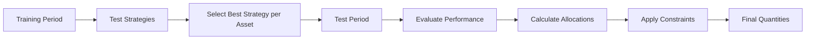

# Allocation Strategies

Stockula provides various allocation strategies to help you determine how much capital to allocate to each asset in your
portfolio. These strategies range from simple equal-weight approaches to sophisticated backtest-optimized methods.

## Overview

Allocation strategies determine:

- **Capital Distribution**: How initial capital is divided among assets
- **Position Sizing**: How many shares of each asset to purchase
- **Risk Management**: How to limit exposure to individual positions
- **Performance Optimization**: How to use historical data to inform allocation decisions

## Available Allocation Methods

### Equal Weight Allocation

The simplest allocation strategy that distributes capital equally among all assets.

**Configuration:**

```yaml
portfolio:
  initial_capital: 100000
  allocation_method: equal_weight
  tickers:
    - symbol: AAPL
    - symbol: GOOGL
    - symbol: MSFT
    - symbol: NVDA
```

**Result:** Each asset receives $25,000 (25% of $100,000)

### Market Cap Weighted

Allocates capital proportionally based on market capitalization.

**Configuration:**

```yaml
portfolio:
  initial_capital: 100000
  allocation_method: market_cap
  tickers:
    - symbol: AAPL
      market_cap: 3000.0  # In billions
    - symbol: GOOGL
      market_cap: 2000.0
    - symbol: MSFT
      market_cap: 2800.0
```

### Custom Allocation

Specify exact amounts or percentages for each asset.

**Configuration:**

```yaml
portfolio:
  initial_capital: 100000
  allocation_method: custom
  tickers:
    - symbol: AAPL
      allocation_amount: 30000    # $30k
    - symbol: GOOGL
      allocation_pct: 25.0        # 25%
    - symbol: MSFT
      allocation_amount: 20000    # $20k
    - symbol: NVDA               # Remaining capital
```

### Dynamic Allocation

Calculates quantities based on allocation targets and current prices.

**Configuration:**

```yaml
portfolio:
  initial_capital: 100000
  allocation_method: dynamic
  dynamic_allocation: true
  allow_fractional_shares: true
  capital_utilization_target: 0.95  # Use 95% of capital
  max_position_size: 25.0           # Max 25% per position
```

### Auto Allocation

Automatically allocates based on asset categories and rules.

**Configuration:**

```yaml
portfolio:
  initial_capital: 100000
  allocation_method: auto
  buckets:
    - name: core_holdings
      allocation_amount: 60000
      tickers: [SPY, QQQ]
    - name: growth_stocks
      allocation_amount: 40000
      tickers: [NVDA, TSLA]
```

## Backtest-Optimized Allocation

The `BacktestOptimizedAllocator` is an advanced allocation strategy that uses historical backtesting to determine
optimal capital allocation. This strategy:

1. Tests multiple trading strategies on each asset using training data
1. Selects the best-performing strategy for each asset
1. Evaluates performance on test data
1. Allocates capital based on test performance metrics

### How It Works



### Configuration

```yaml
# Basic configuration
portfolio:
  initial_capital: 100000
  allocation_method: backtest_optimized
  tickers:
    - symbol: AAPL
      category: TECH
    - symbol: GOOGL
      category: TECH
    - symbol: SPY
      category: INDEX
    - symbol: GLD
      category: COMMODITY

# Backtest optimization settings
backtest_optimization:
  # Data split periods
  train_start_date: "2023-01-01"
  train_end_date: "2023-12-31"
  test_start_date: "2024-01-01"
  test_end_date: "2024-06-30"

  # Optimization parameters
  ranking_metric: "Return [%]"    # Metric to optimize (default)
  min_allocation_pct: 2.0         # Minimum 2% allocation
  max_allocation_pct: 25.0        # Maximum 25% allocation
  initial_allocation_pct: 2.0     # Starting allocation for training
```

### Available Strategies

The BacktestOptimizedAllocator tests the following strategies on each asset:

1. **SMACrossStrategy** - Simple Moving Average Crossover
1. **RSIStrategy** - Relative Strength Index
1. **MACDStrategy** - Moving Average Convergence Divergence
1. **DoubleEMACrossStrategy** - Double Exponential Moving Average
1. **VIDYAStrategy** - Variable Index Dynamic Average
1. **KAMAStrategy** - Kaufman's Adaptive Moving Average
1. **FRAMAStrategy** - Fractal Adaptive Moving Average
1. **TripleEMACrossStrategy** - Triple Exponential Moving Average
1. **TRIMACrossStrategy** - Triangular Moving Average Crossover
1. **VAMAStrategy** - Volume Adjusted Moving Average
1. **KaufmanEfficiencyStrategy** - Kaufman Efficiency Ratio

### Performance Metrics

The allocator can optimize based on various metrics:

- **Return [%]** (default) - Total return percentage
- **Sharpe Ratio** - Risk-adjusted returns
- **Sortino Ratio** - Downside risk-adjusted returns
- **Calmar Ratio** - Return over maximum drawdown
- **Win Rate [%]** - Percentage of profitable trades

### Example Usage

The `backtest_optimized` allocation method is fully integrated into the CLI and follows a two-step workflow:

#### Command Line Usage

```bash
# Step 1: Run optimization to determine optimal quantities
uv run python -m stockula --config .stockula.yaml --mode optimize-allocation \
    --save-optimized-config optimized-portfolio.yaml

# Step 2: Run backtest with the optimized configuration
uv run python -m stockula --config optimized-portfolio.yaml --mode backtest
```

#### Configuration Example

When using `backtest_optimized` allocation, you don't need to specify quantities or allocation percentages:

```yaml
portfolio:
  name: "Backtest Optimized Portfolio"
  initial_capital: 100000
  allocation_method: backtest_optimized
  allow_fractional_shares: true

  tickers:
    # No quantity or allocation fields needed - they will be calculated
    - symbol: AAPL
      category: TECH
    - symbol: GOOGL
      category: TECH
    - symbol: SPY
      category: INDEX
```

#### Programmatic Usage

```python
from stockula.allocation import BacktestOptimizedAllocator
from stockula.config import load_config
from stockula.data.fetcher import DataFetcher

# Load configuration
config = load_config(".stockula.yaml")

# Create allocator
allocator = BacktestOptimizedAllocator(
    fetcher=DataFetcher(),
    logging_manager=logging_manager
)

# Calculate optimized quantities
quantities = allocator.calculate_backtest_optimized_quantities(
    config=config,
    tickers_to_add=config.portfolio.tickers,
    train_start_date="2023-01-01",
    train_end_date="2023-12-31",
    test_start_date="2024-01-01",
    test_end_date="2024-06-30"
)

# Display results
for symbol, quantity in quantities.items():
    print(f"{symbol}: {quantity:.2f} shares")
```

### Example Output

```
=================================================================================
BACKTEST OPTIMIZATION SUMMARY
=================================================================================
AAPL     | Strategy: RSIStrategy              | Return [%]: 15.2000 | Allocation: 35.00% | Quantity:   233.33
GOOGL    | Strategy: DoubleEMACrossStrategy   | Return [%]: 12.5000 | Allocation: 28.75% | Quantity:    10.27
SPY      | Strategy: SMACrossStrategy         | Return [%]:  9.8000 | Allocation: 22.50% | Quantity:    50.00
GLD      | Strategy: VIDYAStrategy            | Return [%]:  6.5000 | Allocation: 13.75% | Quantity:    75.00
=================================================================================
```

### Allocation Calculation Process

1. **Performance Weighting**: Assets with higher returns (or selected metric) receive larger allocations
1. **Constraint Application**:
   - Minimum allocation: 2% per asset (configurable)
   - Maximum allocation: 25% per asset (configurable)
1. **Normalization**: Allocations are adjusted to sum to 100%
1. **Quantity Calculation**: Based on latest prices and allocation percentages

### Best Practices

1. **Data Requirements**:

   - Use at least 1 year of training data
   - Test period should be at least 3-6 months
   - Ensure sufficient data for all strategies to work

1. **Parameter Selection**:

   - Choose appropriate min/max allocation constraints
   - Select ranking metric based on your risk tolerance
   - Consider transaction costs in backtesting

1. **Regular Rebalancing**:

   - Re-run optimization periodically (quarterly/monthly)
   - Monitor strategy performance degradation
   - Adjust constraints based on market conditions

## Integration with Portfolio Management

### AllocatorManager Overview

Stockula uses an `AllocatorManager` to coordinate between different allocation strategies. This manager provides a
unified interface for all allocation methods and automatically selects the appropriate allocator based on the configured
allocation method.

### Using AllocatorManager in Practice

```python
from stockula.container import create_container

# Create container with configuration
container = create_container(".stockula.yaml")

# Get the allocator manager (handles all allocation strategies)
allocator_manager = container.allocator_manager()

# Calculate quantities using the configured allocation method
quantities = allocator_manager.calculate_quantities(
    config=config,
    tickers=config.portfolio.tickers
)
```

### Direct Access to Specific Allocators

While the AllocatorManager handles allocation method selection automatically, you can also access specific allocators
directly when needed:

```python
# Get specific allocation methods
allocator_manager = container.allocator_manager()

# Access standard allocator for basic methods
standard_allocator = allocator_manager.standard_allocator

# Access backtest allocator for optimization
backtest_allocator = allocator_manager.backtest_allocator

# Or use the manager's convenience methods
quantities = allocator_manager.calculate_equal_weight_quantities(config, tickers)
quantities = allocator_manager.calculate_market_cap_quantities(config, tickers)
quantities = allocator_manager.calculate_dynamic_quantities(config, tickers)
quantities = allocator_manager.calculate_auto_allocation_quantities(config, tickers)
quantities = allocator_manager.calculate_backtest_optimized_quantities(config, tickers)
```

### Allocation Validation

```python
# Validate allocations
portfolio = container.domain_factory().create_portfolio()
validation = portfolio.validate_allocations()

print(f"Total Allocated: ${validation['total_allocated']:,.2f}")
print(f"Unallocated: ${validation['unallocated']:,.2f}")
print(f"Valid: {validation['valid']}")

# Check individual allocations
for symbol, amount in validation['allocations'].items():
    percentage = portfolio.get_asset_percentage(symbol)
    print(f"{symbol}: ${amount:,.2f} ({percentage:.1f}%)")
```

## Custom Allocator Development

### Creating a Custom Allocator

```python
from stockula.allocation import BaseAllocator

class MomentumAllocator(BaseAllocator):
    """Allocate based on momentum metrics."""

    def calculate_quantities(
        self,
        config: StockulaConfig,
        tickers: list[TickerConfig]
    ) -> dict[str, float]:
        """Calculate quantities based on momentum."""
        # Calculate momentum for each ticker
        momentum_scores = {}
        for ticker in tickers:
            data = self.fetcher.get_stock_data(
                ticker.symbol,
                start_date="2024-01-01"
            )
            # Simple momentum: 3-month return
            momentum = (data['Close'][-1] / data['Close'][-63] - 1) * 100
            momentum_scores[ticker.symbol] = max(0, momentum)

        # Convert to allocations
        total_score = sum(momentum_scores.values())
        allocations = {
            symbol: score / total_score * 100
            for symbol, score in momentum_scores.items()
        }

        # Apply constraints and calculate quantities
        return self._convert_to_quantities(config, allocations)
```

### Registering Custom Allocators

```python
# In container.py
from stockula.allocation import MomentumAllocator

custom_allocator = providers.ThreadSafeSingleton(
    MomentumAllocator,
    fetcher=data_fetcher,
    logging_manager=logging_manager
)
```

## Performance Considerations

### Computational Complexity

| Strategy           | Complexity   | Time Required |
| ------------------ | ------------ | ------------- |
| Equal Weight       | O(n)         | Instant       |
| Market Cap         | O(n)         | Instant       |
| Custom             | O(n)         | Instant       |
| Backtest Optimized | O(n × s × d) | Minutes       |

Where:

- n = number of assets
- s = number of strategies
- d = days of historical data

### Optimization Tips

1. **Cache Strategy Results**: Store best strategies for reuse
1. **Parallel Processing**: Run backtests concurrently
1. **Reduce Data Points**: Use appropriate data intervals
1. **Pre-filter Strategies**: Skip strategies inappropriate for asset types

## Risk Management

### Position Limits

```yaml
portfolio:
  # Global limits
  max_position_size: 25.0      # Max 25% in any position
  min_position_size: 1.0       # Min 1% position

  # Sector limits
  sector_limits:
    TECH: 40.0                 # Max 40% in tech
    FINANCE: 30.0              # Max 30% in finance
```

### Volatility-Based Sizing

```python
# Adjust allocation based on volatility
def volatility_adjusted_allocation(returns, target_vol=0.15):
    """Scale allocation inversely to volatility."""
    actual_vol = returns.std() * np.sqrt(252)
    return target_vol / actual_vol
```

## Conclusion

Stockula's allocation strategies provide flexibility from simple equal-weight approaches to sophisticated
backtest-optimized methods. The BacktestOptimizedAllocator represents the most advanced approach, using historical
performance data to inform forward-looking allocation decisions. Choose the strategy that best fits your investment
goals and risk tolerance.
