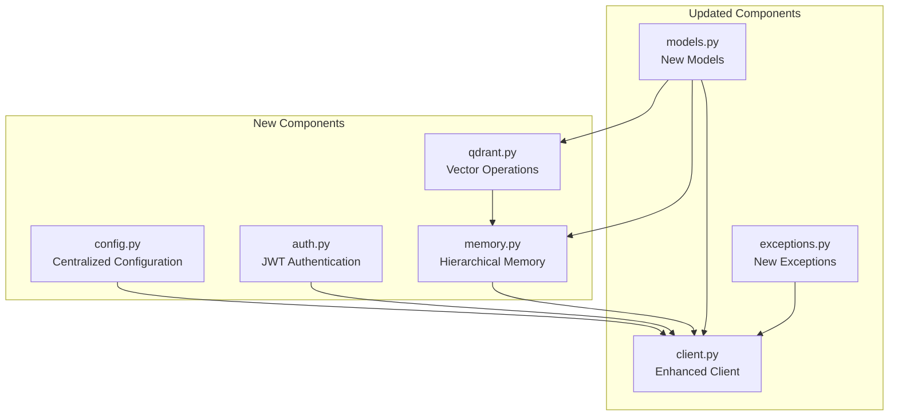

# Symbiont SDK Python - Update Implementation Plan

## Overview

This document outlines the implementation plan for updating the `symbiont-sdk-python` repository to incorporate new features identified in the analysis of both the `symbiont` and `symbiont-sdk-python` repositories. The updates include new HTTP API server endpoints, a hierarchical memory system, Qdrant integration, centralized configuration management, enhanced JWT authentication, and improved vault integration.

## Architecture Diagram



## 1. New Files to Create

### 1.1 `symbiont/config.py` - Centralized Configuration Management

**Purpose**: Provide centralized configuration management with environment variable support, configuration validation, and multiple backend support.

**Key Features**:
- Environment-based configuration loading
- Configuration validation using Pydantic
- Support for file-based, environment variable, and vault-backed configurations
- Configuration caching and hot-reloading capabilities
- Integration with existing client initialization

**Core Classes**:
- `ConfigManager`: Main configuration management class
- `ConfigSource`: Enum for configuration sources (env, file, vault, etc.)
- `DatabaseConfig`: Database connection configurations
- `AuthConfig`: Authentication-related configurations
- `VectorConfig`: Vector database configurations
- `LoggingConfig`: Logging configurations

### 1.2 `symbiont/auth.py` - Enhanced Authentication System

**Purpose**: Implement comprehensive authentication system supporting JWT tokens, API keys, and multiple authentication backends.

**Key Features**:
- JWT token validation and generation
- Multi-factor authentication support
- Token refresh mechanisms
- Role-based access control (RBAC)
- Integration with external identity providers
- Secure token storage and retrieval

**Core Classes**:
- `AuthManager`: Main authentication manager
- `JWTHandler`: JWT-specific operations
- `TokenValidator`: Token validation logic
- `AuthProvider`: Interface for authentication providers
- `RoleManager`: Role and permission management

### 1.3 `symbiont/memory.py` - Hierarchical Memory System

**Purpose**: Implement a hierarchical memory system for agent context management, conversation history, and knowledge retrieval.

**Key Features**:
- Multi-level memory hierarchy (short-term, long-term, episodic)
- Conversation context management
- Memory consolidation and pruning
- Integration with vector databases
- Memory persistence and retrieval
- Context-aware memory search

**Core Classes**:
- `MemoryManager`: Main memory management system
- `MemoryLevel`: Enum for memory hierarchy levels
- `MemoryNode`: Individual memory items
- `ConversationContext`: Conversation-specific memory
- `MemoryStore`: Abstract storage interface
- `MemoryQuery`: Memory search and retrieval

### 1.4 `symbiont/qdrant.py` - Qdrant Integration

**Purpose**: Provide specialized integration with Qdrant vector database for high-performance vector operations and semantic search.

**Key Features**:
- Qdrant client wrapper with connection pooling
- Collection management and indexing
- Batch vector operations
- Semantic search and similarity matching
- Vector embedding management
- Integration with memory system

**Core Classes**:
- `QdrantClient`: Enhanced Qdrant client wrapper
- `CollectionManager`: Collection lifecycle management
- `VectorOperations`: Vector CRUD operations
- `SearchEngine`: Semantic search implementation
- `EmbeddingManager`: Embedding generation and management

## 2. Modifications to Existing Files

### 2.1 `symbiont/client.py` - Enhanced Client

#### New Methods to Add:

**Configuration Management**:
- `configure_client(config: ClientConfig) -> Dict[str, Any]`
- `get_configuration() -> ClientConfig`
- `reload_configuration() -> Dict[str, Any]`

**Enhanced Authentication**:
- `authenticate_jwt(token: str) -> AuthResponse`
- `refresh_token() -> TokenRefreshResponse`
- `validate_permissions(action: str, resource: str) -> bool`
- `get_user_roles() -> List[str]`

**Memory System**:
- `store_memory(memory_request: MemoryStoreRequest) -> MemoryResponse`
- `retrieve_memory(memory_query: MemoryQuery) -> MemoryResponse`
- `search_memory(search_request: MemorySearchRequest) -> MemorySearchResponse`
- `consolidate_memory(agent_id: str) -> ConsolidationResponse`
- `get_conversation_context(conversation_id: str) -> ConversationContext`

**Qdrant Integration**:
- `create_vector_collection(collection_request: CollectionCreateRequest) -> CollectionResponse`
- `delete_vector_collection(collection_name: str) -> Dict[str, Any]`
- `upsert_vectors(upsert_request: VectorUpsertRequest) -> UpsertResponse`
- `search_vectors(search_request: VectorSearchRequest) -> VectorSearchResponse`
- `get_collection_info(collection_name: str) -> CollectionInfo`

**HTTP Server Endpoints**:
- `create_http_endpoint(endpoint_request: HttpEndpointCreateRequest) -> HttpEndpointResponse`
- `list_http_endpoints() -> List[HttpEndpointInfo]`
- `update_http_endpoint(endpoint_request: HttpEndpointUpdateRequest) -> HttpEndpointResponse`
- `delete_http_endpoint(endpoint_id: str) -> Dict[str, Any]`

#### Methods to Modify:

**Enhanced `__init__` method**:
- Add support for configuration file loading
- Initialize memory and authentication managers
- Support for multiple authentication methods

**Enhanced `_request` method**:
- Add JWT token handling
- Implement token refresh logic
- Add request rate limiting
- Enhanced error handling for new exception types

### 2.2 `symbiont/models.py` - New Pydantic Models

#### Configuration Models:
```python
class ClientConfig(BaseModel)
class DatabaseConfig(BaseModel) 
class AuthConfig(BaseModel)
class VectorConfig(BaseModel)
class LoggingConfig(BaseModel)
```

#### Authentication Models:
```python
class JWTToken(BaseModel)
class AuthResponse(BaseModel)
class TokenRefreshRequest(BaseModel)
class TokenRefreshResponse(BaseModel)
class UserPermissions(BaseModel)
class RoleDefinition(BaseModel)
```

#### Memory System Models:
```python
class MemoryNode(BaseModel)
class MemoryStoreRequest(BaseModel)
class MemoryResponse(BaseModel)
class MemoryQuery(BaseModel)
class MemorySearchRequest(BaseModel)
class MemorySearchResponse(BaseModel)
class ConversationContext(BaseModel)
class ConsolidationResponse(BaseModel)
```

#### Qdrant Integration Models:
```python
class CollectionCreateRequest(BaseModel)
class CollectionResponse(BaseModel)
class CollectionInfo(BaseModel)
class VectorUpsertRequest(BaseModel)
class UpsertResponse(BaseModel)
class VectorPoint(BaseModel)
class EmbeddingRequest(BaseModel)
class EmbeddingResponse(BaseModel)
```

#### HTTP Endpoint Models:
```python
class HttpEndpointCreateRequest(BaseModel)
class HttpEndpointUpdateRequest(BaseModel)
class HttpEndpointResponse(BaseModel)
class HttpEndpointInfo(BaseModel)
class EndpointMetrics(BaseModel)
```

#### Enhanced Existing Models:
- Add JWT fields to authentication models
- Extend `SystemMetrics` with memory and vector database metrics
- Add memory-related fields to `AgentStatusResponse`

### 2.3 `symbiont/exceptions.py` - New Exception Classes

#### New Exception Classes:
```python
class ConfigurationError(SymbiontError)
class AuthenticationExpiredError(AuthenticationError)
class TokenRefreshError(AuthenticationError)
class PermissionDeniedError(SymbiontError)
class MemoryError(SymbiontError)
class MemoryStorageError(MemoryError)
class MemoryRetrievalError(MemoryError)
class VectorDatabaseError(SymbiontError)
class QdrantConnectionError(VectorDatabaseError)
class CollectionNotFoundError(VectorDatabaseError)
class EmbeddingError(SymbiontError)
```

#### Enhanced Existing Exceptions:
- Add more specific error codes to `APIError`
- Enhanced error context for debugging

### 2.4 Dependency Updates

#### `requirements.txt` - New Dependencies:
```
requests>=2.31.0
pydantic>=2.0.0
python-dotenv>=1.0.0
pyjwt>=2.8.0
cryptography>=41.0.0
qdrant-client>=1.7.0
redis>=5.0.0
psycopg2-binary>=2.9.0
sqlalchemy>=2.0.0
alembic>=1.12.0
tenacity>=8.2.0
structlog>=23.2.0
```

#### `pyproject.toml` - Updated Dependencies:
```toml
dependencies = [
    "requests>=2.31.0",
    "pydantic>=2.0.0",
    "python-dotenv>=1.0.0",
    "pyjwt>=2.8.0",
    "cryptography>=41.0.0",
    "qdrant-client>=1.7.0",
    "redis>=5.0.0",
    "psycopg2-binary>=2.9.0",
    "sqlalchemy>=2.0.0",
    "alembic>=1.12.0",
    "tenacity>=8.2.0",
    "structlog>=23.2.0",
]

[project.optional-dependencies]
dev = [
    "pytest>=7.0.0",
    "pytest-cov>=4.0.0",
    "pytest-asyncio>=0.21.0",
    "ruff>=0.1.0",
    "bandit>=1.7.0",
    "httpx>=0.25.0",
    "faker>=20.0.0",
]
```

## 3. Implementation Steps

### Phase 1: Foundation Setup (Week 1)

#### Step 1.1: Configuration Management
1. Create `symbiont/config.py` with basic configuration classes
2. Implement `ConfigManager` with environment variable support
3. Add configuration models to `models.py`
4. Update client initialization to use configuration system
5. Add configuration-related exceptions to `exceptions.py`

#### Step 1.2: Enhanced Authentication
1. Create `symbiont/auth.py` with JWT support
2. Add JWT dependencies to requirements
3. Implement `JWTHandler` and `TokenValidator` classes
4. Add authentication models to `models.py`
5. Add authentication exceptions to `exceptions.py`

#### Step 1.3: Update Client Authentication
1. Modify `Client.__init__` to support JWT authentication
2. Update `_request` method with JWT token handling
3. Add token refresh logic
4. Implement permission validation methods

### Phase 2: Memory System Implementation (Week 2)

#### Step 2.1: Memory System Foundation
1. Create `symbiont/memory.py` with core memory classes
2. Implement `MemoryManager` and `MemoryNode` classes
3. Add memory-related models to `models.py`
4. Add memory exceptions to `exceptions.py`

#### Step 2.2: Memory Storage Integration
1. Implement Redis-based memory storage
2. Add SQLAlchemy for persistent memory storage
3. Create database migration scripts
4. Implement memory consolidation algorithms

#### Step 2.3: Client Memory Integration
1. Add memory methods to `Client` class
2. Implement conversation context management
3. Add memory search and retrieval capabilities
4. Integration testing for memory system

### Phase 3: Qdrant Integration (Week 3)

#### Step 3.1: Qdrant Client Setup
1. Create `symbiont/qdrant.py` with Qdrant wrapper
2. Add Qdrant client dependencies
3. Implement `QdrantClient` and `CollectionManager`
4. Add Qdrant-specific models to `models.py`

#### Step 3.2: Vector Operations
1. Implement vector CRUD operations
2. Add semantic search capabilities
3. Implement embedding management
4. Add batch operation support

#### Step 3.3: Memory-Qdrant Integration
1. Integrate Qdrant with memory system
2. Implement vector-based memory search
3. Add embedding generation for memory nodes
4. Performance optimization for vector operations

### Phase 4: HTTP Endpoint Enhancement (Week 4)

#### Step 4.1: New HTTP Endpoints
1. Add HTTP endpoint management models
2. Implement endpoint creation and management methods
3. Add endpoint monitoring and metrics
4. Enhanced error handling for HTTP operations

#### Step 4.2: Integration and Testing
1. Comprehensive integration testing
2. Performance benchmarking
3. Documentation updates
4. Security audit and vulnerability assessment

### Phase 5: Finalization and Documentation (Week 5)

#### Step 5.1: Code Quality and Testing
1. Complete unit test coverage for all new components
2. Integration tests for end-to-end workflows
3. Performance testing and optimization
4. Security testing and hardening

#### Step 5.2: Documentation and Examples
1. Update README.md with new features
2. Create comprehensive API documentation
3. Add example code and tutorials
4. Migration guide for existing users

## 4. Testing Strategy

### Unit Tests:
- Configuration management functionality
- Authentication and JWT handling
- Memory system operations
- Qdrant integration
- New client methods

### Integration Tests:
- End-to-end authentication flows
- Memory system with multiple storage backends
- Qdrant vector operations with real data
- Complete client workflow testing

### Performance Tests:
- Memory system performance under load
- Vector search performance benchmarks
- Authentication overhead measurements
- Concurrent request handling

## 5. Migration Considerations

### Backward Compatibility:
- Maintain existing API methods unchanged
- Add deprecation warnings for methods being replaced
- Provide migration utilities for configuration

### Configuration Migration:
- Automatic migration from environment variables to config files
- Support for both old and new authentication methods
- Graceful fallback for missing configurations

## 6. Security Considerations

### Authentication Security:
- Secure JWT token storage and handling
- Token expiration and refresh mechanisms
- Protection against token replay attacks

### Memory Security:
- Encryption for sensitive memory data
- Access control for memory operations
- Audit logging for memory access

### Vector Database Security:
- Secure Qdrant connections
- Data encryption in transit and at rest
- Access control for vector operations

## 7. Monitoring and Observability

### Metrics:
- Authentication success/failure rates
- Memory system performance metrics
- Vector operation latencies
- HTTP endpoint response times

### Logging:
- Structured logging with structured log formats
- Request/response logging for debugging
- Security event logging
- Performance monitoring

## 8. Deployment Considerations

### Environment Variables:
- Clear documentation for all configuration options
- Environment-specific configuration templates
- Validation for required configurations

### Dependencies:
- Clear dependency versioning
- Optional dependencies for specific features
- Compatibility matrix for different Python versions

This implementation plan provides a comprehensive roadmap for updating the symbiont-sdk-python repository with the identified new features while maintaining backward compatibility and ensuring robust, secure, and performant operation.