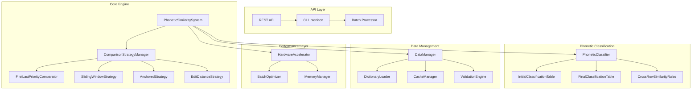
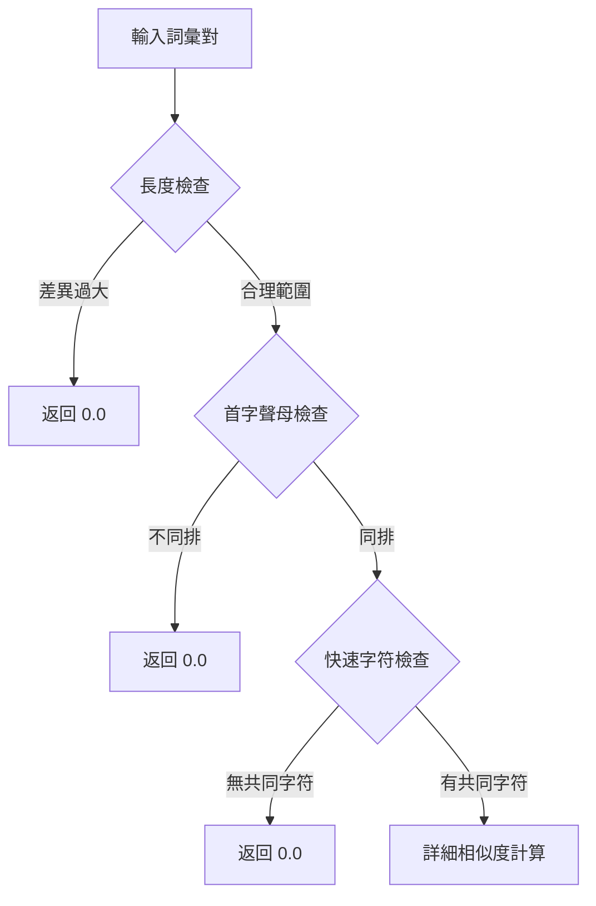

# TWGY_V3 進階中文語音相似度系統設計文檔

## 概述

本設計文檔詳細描述了 TWGY_V3 系統的架構設計和算法實現方案，基於需求文檔中定義的功能需求，實現一個高性能、高準確率的中文語音相似度比對系統。

## 系統架構

### 整體架構圖



## 核心組件設計

### 1. PhoneticSimilaritySystem (主系統類)

**職責：**
- 統一的相似度計算入口
- 策略選擇和調度
- 性能監控和緩存管理

**關鍵方法：**
```python
class PhoneticSimilaritySystem:
    def calculate_similarity(self, word1: str, word2: str) -> float
    def batch_calculate_similarity(self, word_pairs: List[Tuple[str, str]]) -> List[float]
    def find_similar_words(self, target_word: str, candidates: List[str]) -> List[Dict]
    def get_strategy_for_words(self, word1: str, word2: str) -> ComparisonStrategy
```

### 2. ComparisonStrategyManager (策略管理器)

**職責：**
- 根據詞彙特徵選擇最適合的比對策略
- 管理多種比對策略的生命週期

**策略選擇邏輯：**
```python
def select_strategy(self, word1: str, word2: str) -> ComparisonStrategy:
    length_diff = abs(len(word1) - len(word2))
    
    if length_diff == 0:
        return DirectComparisonStrategy()
    elif length_diff == 1:
        return SlidingWindowStrategy()
    elif 2 <= length_diff <= 3:
        return AnchoredStrategy()
    else:
        return EditDistanceStrategy()
```

### 3. FirstLastPriorityComparator (首尾字優先比對器)

**設計原理：**
基於中文詞彙的語言學特性，首字和尾字通常承載更多語義信息，因此優先比對這些位置。

**算法流程：**
1. **快速篩選階段：** 檢查首字聲母是否在同一語音學分組
2. **詳細計算階段：** 計算首字、尾字、中間字的相似度
3. **加權融合階段：** 根據權重融合各部分相似度
4. **語音學獎勵階段：** 應用語音學規則的獎勵機制

**權重配置：**
```python
WEIGHTS = {
    'first_char': 0.4,    # 首字權重
    'last_char': 0.4,     # 尾字權重
    'middle_chars': 0.2   # 中間字權重
}
```

### 4. PhoneticClassifier (語音學分類器)

**設計目標：**
建立科學的語音學分類體系，替代經驗性的閾值判斷。

**分類表格結構：**

#### 聲母分類表格
```yaml
initial_classification:
  row_1_bilabial:
    phonemes: [b, p, m]
    pinyin: [b, p, m]
    similarity_within_row: 0.8
    
  row_2_labiodental:
    phonemes: [f]
    pinyin: [f]
    similarity_within_row: 0.7
    
  row_3_dental:
    phonemes: [d, t, n, l]
    pinyin: [d, t, n, l]
    similarity_within_row: 0.8
```

#### 韻母分類表格
```yaml
final_classification:
  group_1_single_vowels:
    phonemes: [a, o, e, i, u, ü]
    similarity_within_group: 0.6
    
  group_2_compound_vowels:
    phonemes: [ai, ei, ao, ou]
    similarity_within_group: 0.7
```

#### 跨排相似度規則
```yaml
cross_row_similarities:
  - rows: [row_3_dental, row_4_alveolar]
    similarity: 0.6
    description: "舌尖音相似性"
    pairs: [[d, zh], [t, ch], [n, n], [l, r]]
```

### 5. 異長度比對策略

#### SlidingWindowStrategy (滑動窗口策略)
**適用場景：** 長度差異為 1 的詞彙對
**算法描述：**
```python
def calculate_similarity(self, word1: str, word2: str) -> float:
    shorter, longer = (word1, word2) if len(word1) < len(word2) else (word2, word1)
    
    max_similarity = 0.0
    for i in range(len(longer) - len(shorter) + 1):
        window = longer[i:i+len(shorter)]
        similarity = self.compare_aligned_words(shorter, window)
        max_similarity = max(max_similarity, similarity)
    
    return max_similarity * LENGTH_PENALTY_FACTOR
```

#### AnchoredStrategy (首尾錨定策略)
**適用場景：** 長度差異為 2-3 的詞彙對
**算法描述：**
```python
def calculate_similarity(self, word1: str, word2: str) -> float:
    # 錨定首字和尾字
    first_sim = self.classifier.calculate_char_similarity(word1[0], word2[0])
    last_sim = self.classifier.calculate_char_similarity(word1[-1], word2[-1])
    
    # 計算中間部分的最佳對齊
    middle1 = word1[1:-1]
    middle2 = word2[1:-1]
    middle_sim = self.calculate_middle_alignment(middle1, middle2)
    
    return (first_sim * 0.3 + last_sim * 0.3 + middle_sim * 0.4)
```

#### EditDistanceStrategy (語音編輯距離策略)
**適用場景：** 長度差異超過 3 的詞彙對
**算法描述：**
基於動態規劃的編輯距離算法，但使用語音相似度替代簡單的字符匹配。

## 性能優化設計

### 1. 多層級篩選機制



### 2. 緩存策略

**三級緩存設計：**
1. **L1 緩存：** 最近計算結果 (LRU, 1000 項)
2. **L2 緩存：** 字符級相似度 (10000 項)
3. **L3 緩存：** 語音學分類結果 (持久化)

### 3. 硬體加速支援

**加速策略：**
- **CPU 優化：** 向量化計算、多線程處理
- **GPU 加速：** CUDA/MPS 支援批量計算
- **記憶體優化：** 預分配緩衝區、零拷貝操作

## 資料管理設計

### 1. 資料載入器 (DataLoader)

**支援的資料格式：**
- 萌典 JSON 格式
- CKIP 詞典格式
- 自定義 CSV/YAML 格式

**載入流程：**
```python
class DataManager:
    def load_dictionary(self, source: str, format: str) -> Dict
    def validate_data(self, data: Dict) -> ValidationResult
    def build_indices(self, data: Dict) -> IndexStructure
    def export_processed_data(self, data: Dict, format: str) -> None
```

### 2. 驗證引擎 (ValidationEngine)

**驗證項目：**
- 資料格式完整性
- 拼音/注音正確性
- 字符編碼一致性
- 重複項目檢測

## API 設計

### REST API 端點

```yaml
endpoints:
  /api/v1/similarity:
    method: POST
    description: 計算兩個詞彙的相似度
    request:
      word1: string
      word2: string
      mode: string (optional)
    response:
      similarity: float
      strategy_used: string
      computation_time: float
  
  /api/v1/batch_similarity:
    method: POST
    description: 批量計算相似度
    request:
      word_pairs: array
      mode: string (optional)
    response:
      results: array
      total_time: float
      average_time: float
  
  /api/v1/find_similar:
    method: POST
    description: 尋找相似詞彙
    request:
      target_word: string
      candidates: array (optional)
      top_k: integer (optional)
      threshold: float (optional)
    response:
      similar_words: array
      search_time: float
```

### CLI 介面設計

```bash
# 基本相似度計算
twgy-v3 similarity "知道" "資道"

# 批量處理
twgy-v3 batch-similarity --input pairs.txt --output results.json

# 尋找相似詞
twgy-v3 find-similar "知道" --dictionary dict.txt --top-k 10

# 性能測試
twgy-v3 benchmark --test-set test_pairs.txt --iterations 1000

# 資料管理
twgy-v3 data load --source moedict.json --format moedict
twgy-v3 data validate --input dict.txt
twgy-v3 data export --output processed_dict.yaml --format yaml
```

## 測試策略

### 1. 單元測試

**測試覆蓋範圍：**
- 每個比對策略的正確性
- 語音學分類器的準確性
- 緩存機制的有效性
- 錯誤處理的完整性

### 2. 整合測試

**測試場景：**
- 端到端的相似度計算流程
- 大規模資料載入和處理
- API 介面的功能完整性
- 多線程並發處理

### 3. 性能測試

**測試指標：**
- 單次計算延遲 (< 10ms)
- 批量處理吞吐量 (> 100,000 對/秒)
- 記憶體使用效率 (< 2GB)
- 緩存命中率 (> 80%)

### 4. 準確率測試

**測試資料集：**
- 標準語音相似度測試集
- ASR 錯誤修正測試集
- 台灣國語變異測試集
- 跨領域詞彙測試集

## 部署架構

### Docker 容器化

```dockerfile
FROM python:3.9-slim

WORKDIR /app
COPY requirements.txt .
RUN pip install -r requirements.txt

COPY src/ ./src/
COPY data/ ./data/
COPY config/ ./config/

EXPOSE 8000
CMD ["python", "-m", "src.api.server"]
```

### 微服務架構

```yaml
services:
  twgy-api:
    image: twgy-v3:latest
    ports:
      - "8000:8000"
    environment:
      - CACHE_SIZE=10000
      - ENABLE_GPU=true
    
  twgy-worker:
    image: twgy-v3:latest
    command: ["python", "-m", "src.worker"]
    environment:
      - WORKER_THREADS=4
    
  redis-cache:
    image: redis:alpine
    ports:
      - "6379:6379"
```

## 監控和日誌

### 性能監控

**監控指標：**
- 請求響應時間分佈
- 系統資源使用率
- 緩存命中率統計
- 錯誤率和異常統計

### 日誌設計

**日誌級別：**
- DEBUG: 詳細的計算過程
- INFO: 系統狀態和統計
- WARNING: 性能警告和建議
- ERROR: 錯誤和異常處理

## 擴展性考慮

### 水平擴展

**擴展策略：**
- 無狀態服務設計
- 分散式緩存支援
- 負載均衡配置
- 資料庫分片支援

### 功能擴展

**預留介面：**
- 自定義相似度算法
- 新語言支援框架
- 機器學習模型整合
- 實時學習機制

## 風險緩解

### 技術風險

**風險項目：**
1. 語音學分類準確性 → 建立專家驗證機制
2. 大規模性能表現 → 分階段性能測試
3. 記憶體使用優化 → 記憶體分析和優化

### 業務風險

**風險項目：**
1. 準確率不達標 → 多重驗證和調優
2. 整合困難 → 標準化 API 設計
3. 維護複雜度 → 完整文檔和測試

## 成功標準

### 功能完整性
- [ ] 所有需求功能實現
- [ ] API 介面完整可用
- [ ] CLI 工具功能齊全
- [ ] 資料管理功能完善

### 性能指標
- [ ] 單次計算 < 10ms
- [ ] 批量處理 > 100,000 對/秒
- [ ] 記憶體使用 < 2GB
- [ ] 準確率 > 95%

### 品質保證
- [ ] 單元測試覆蓋率 > 90%
- [ ] 整合測試通過率 100%
- [ ] 性能測試達標
- [ ] 文檔完整性檢查通過

這個設計文檔為 TWGY_V3 系統的完整實現提供了詳細的技術方案和架構指導。